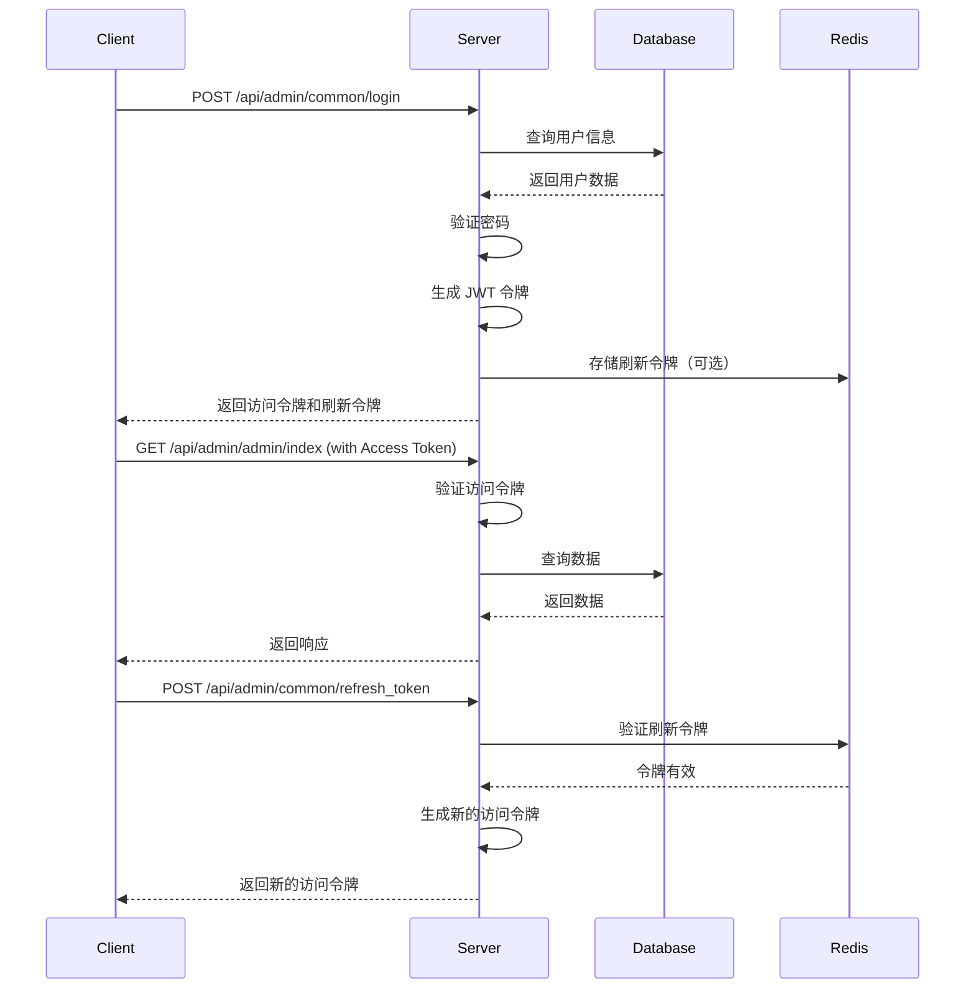

# 认证接口

本文档详细介绍了认证相关的 API 接口。

## 认证概述

Py Small Admin 使用 JWT（JSON Web Token）进行无状态认证。

### 认证流程



## 令牌类型

### 访问令牌（Access Token）

- **用途**：访问受保护的 API 接口
- **有效期**：30 分钟（可配置）
- **存储位置**：内存（前端）或 LocalStorage
- **刷新**：无法刷新，过期后需要使用刷新令牌

### 刷新令牌（Refresh Token）

- **用途**：刷新访问令牌
- **有效期**：7 天（可配置）
- **存储位置**：LocalStorage 或 Cookie
- **刷新**：可以刷新，延长登录时间

## 接口列表

### 1. 生成验证码

生成图形验证码，用于登录验证。

**请求**：

```http
POST /api/admin/common/generate_captcha
```

**参数**：无

**响应**：

```json
{
  "code": 200,
  "message": "success",
  "data": {
    "captcha_id": "captcha_1234567890",
    "image": "data:image/png;base64,iVBORw0KGgoAAAANSUhEUgAA..."
  }
}
```

**字段说明**：

| 字段 | 类型 | 说明 |
|------|------|------|
| captcha_id | string | 验证码 ID |
| image | string | Base64 编码的验证码图片 |

**错误响应**：

```json
{
  "code": 500,
  "message": "生成验证码失败",
  "data": null
}
```

---

### 2. 用户登录

使用用户名、密码和验证码登录系统。

**请求**：

```http
POST /api/admin/common/login
Content-Type: application/json
```

**请求体**：

```json
{
  "username": "admin",
  "password": "admin123",
  "captcha": "1234",
  "captcha_id": "captcha_1234567890"
}
```

**参数说明**：

| 参数 | 类型 | 必填 | 说明 |
|------|------|------|------|
| username | string | 是 | 用户名 |
| password | string | 是 | 密码 |
| captcha | string | 是 | 验证码 |
| captcha_id | string | 是 | 验证码 ID |

**成功响应**：

```json
{
  "code": 200,
  "message": "登录成功",
  "data": {
    "access_token": "eyJhbGciOiJIUzI1NiIsInR5cCI6IkpXVCJ9...",
    "refresh_token": "eyJhbGciOiJIUzI1NiIsInR5cCI6IkpXVCJ9...",
    "token_type": "Bearer",
    "expires_in": 1800,
    "admin": {
      "id": 1,
      "name": "超级管理员",
      "username": "admin",
      "group_id": 1,
      "group_name": "超级管理员组",
      "rules": [1, 2, 3, 4, 5],
      "avatar": "https://example.com/avatar.jpg"
    }
  }
}
```

**字段说明**：

| 字段 | 类型 | 说明 |
|------|------|------|
| access_token | string | 访问令牌 |
| refresh_token | string | 刷新令牌 |
| token_type | string | 令牌类型，固定为 "Bearer" |
| expires_in | number | 访问令牌过期时间（秒） |
| admin | object | 管理员信息 |
| admin.id | number | 管理员 ID |
| admin.name | string | 管理员姓名 |
| admin.username | string | 用户名 |
| admin.group_id | number | 角色组 ID |
| admin.group_name | string | 角色组名称 |
| admin.rules | array | 菜单规则 ID 列表 |
| admin.avatar | string | 头像 URL |

**错误响应**：

```json
{
  "code": 400,
  "message": "用户名或密码错误",
  "data": null
}
```

```json
{
  "code": 400,
  "message": "验证码错误",
  "data": null
}
```

```json
{
  "code": 403,
  "message": "账号已被禁用",
  "data": null
}
```

---

### 3. 刷新令牌

使用刷新令牌获取新的访问令牌。

**请求**：

```http
POST /api/admin/common/refresh_token
Content-Type: application/json
```

**请求体**：

```json
{
  "refresh_token": "eyJhbGciOiJIUzI1NiIsInR5cCI6IkpXVCJ9..."
}
```

**参数说明**：

| 参数 | 类型 | 必填 | 说明 |
|------|------|------|------|
| refresh_token | string | 是 | 刷新令牌 |

**成功响应**：

```json
{
  "code": 200,
  "message": "刷新成功",
  "data": {
    "access_token": "eyJhbGciOiJIUzI1NiIsInR5cCI6IkpXVCJ9...",
    "token_type": "Bearer",
    "expires_in": 1800
  }
}
```

**错误响应**：

```json
{
  "code": 401,
  "message": "刷新令牌无效或已过期",
  "data": null
}
```

```json
{
  "code": 401,
  "message": "刷新令牌已撤销",
  "data": null
}
```

---

### 4. 用户登出

退出登录，撤销当前令牌。

**请求**：

```http
POST /api/admin/common/logout
Authorization: Bearer <access_token>
Content-Type: application/json
```

**请求头**：

| 参数 | 类型 | 必填 | 说明 |
|------|------|------|------|
| Authorization | string | 是 | 访问令牌，格式：`Bearer <token>` |

**请求体**：

```json
{
  "refresh_token": "eyJhbGciOiJIUzI1NiIsInR5cCI6IkpXVCJ9..."
}
```

**成功响应**：

```json
{
  "code": 200,
  "message": "登出成功",
  "data": null
}
```

**错误响应**：

```json
{
  "code": 401,
  "message": "未认证",
  "data": null
}
```

---

## 令牌使用

### 在请求头中添加令牌

访问受保护的 API 接口时，需要在请求头中添加访问令牌：

```http
GET /api/admin/admin/index
Authorization: Bearer <access_token>
```

### 使用 curl

```bash
curl -X GET http://localhost:8000/api/admin/admin/index \
  -H "Authorization: Bearer <access_token>"
```

### 使用 JavaScript (Fetch)

```javascript
fetch('http://localhost:8000/api/admin/admin/index', {
  headers: {
    'Authorization': `Bearer ${accessToken}`
  }
})
.then(response => response.json())
.then(data => console.log(data));
```

### 使用 JavaScript (Axios)

```javascript
import axios from 'axios';

axios.get('http://localhost:8000/api/admin/admin/index', {
  headers: {
    'Authorization': `Bearer ${accessToken}`
  }
})
.then(response => console.log(response.data));
```

### 使用 TypeScript

```typescript
import { request } from '@/utils/request';

request('/admin/admin/index', {
  method: 'GET',
  headers: {
    'Authorization': `Bearer ${accessToken}`
  }
})
.then(data => console.log(data));
```

## 令牌刷新机制

### 前端自动刷新

使用 Axios 拦截器自动刷新令牌：

```typescript
import axios from 'axios';

const api = axios.create({
  baseURL: 'http://localhost:8000/api'
});

// 请求拦截器：自动添加令牌
api.interceptors.request.use(config => {
  const token = localStorage.getItem('access_token');
  if (token) {
    config.headers.Authorization = `Bearer ${token}`;
  }
  return config;
});

// 响应拦截器：自动刷新令牌
api.interceptors.response.use(
  response => response,
  async error => {
    const originalRequest = error.config;
    
    // 401 错误且未重试过
    if (error.response?.status === 401 && !originalRequest._retry) {
      originalRequest._retry = true;
      
      try {
        // 获取刷新令牌
        const refreshToken = localStorage.getItem('refresh_token');
        
        // 刷新令牌
        const response = await axios.post('/common/refresh_token', {
          refresh_token: refreshToken
        });
        
        // 保存新令牌
        const newAccessToken = response.data.data.access_token;
        localStorage.setItem('access_token', newAccessToken);
        
        // 重试原始请求
        originalRequest.headers.Authorization = `Bearer ${newAccessToken}`;
        return api(originalRequest);
      } catch (refreshError) {
        // 刷新失败，清除令牌并跳转登录页
        localStorage.removeItem('access_token');
        localStorage.removeItem('refresh_token');
        window.location.href = '/login';
        return Promise.reject(refreshError);
      }
    }
    
    return Promise.reject(error);
  }
);

export default api;
```

## 令牌安全

### 存储安全

**推荐**：
- 访问令牌：存储在内存或 SessionStorage
- 刷新令牌：存储在 HttpOnly Cookie

**不推荐**：
- 不要将令牌存储在 URL 中
- 不要在控制台输出令牌

### 传输安全

- 必须使用 HTTPS 传输令牌
- 不要在非加密的连接中使用令牌

### 验证安全

- 服务端必须验证令牌签名
- 服务端必须验证令牌过期时间
- 服务端必须验证令牌签发者和受众

## 配置说明

### 后端配置

在 `.env` 文件中配置 JWT：

```bash
# JWT 密钥（必须修改）
JWT_SECRET_KEY=your-very-strong-secret-key-at-least-32-characters-long

# JWT 算法
JWT_ALGORITHM=HS256

# 访问令牌过期时间（分钟）
JWT_ACCESS_TOKEN_EXPIRE_MINUTES=30

# 刷新令牌过期时间（天）
JWT_REFRESH_TOKEN_EXPIRE_DAYS=7

# JWT 签发者
JWT_ISSUER=fast-api-admin

# JWT 受众
JWT_AUDIENCE=fast-client-admin

# 是否启用黑名单
JWT_ENABLE_BLACKLIST=true

# 黑名单前缀
JWT_BLACKLIST_PREFIX=jwt:blacklist:admin:
```

### 前端配置

在 `.env.development` 或 `.env.production` 中配置：

```bash
# API 地址
UMI_APP_API_BASE_URL=http://localhost:8000/api

# API Key
UMI_APP_API_KEY=your-admin-api-key

# 环境类型
UMI_APP_ENV=dev
```

## 错误码

| 错误码 | 说明 |
|--------|------|
| 200 | 成功 |
| 400 | 请求参数错误（用户名密码错误、验证码错误等） |
| 401 | 未认证（令牌无效、令牌过期等） |
| 403 | 禁止访问（账号被禁用等） |
| 500 | 服务器错误 |

## 最佳实践

### 1. 自动刷新令牌

使用 Axios 拦截器自动刷新令牌，避免频繁登录。

### 2. 令牌过期处理

- 访问令牌过期时自动刷新
- 刷新令牌过期时跳转登录页
- 显示友好的错误提示

### 3. 安全存储

- 不要将令牌存储在 LocalStorage（除非必要）
- 使用 HttpOnly Cookie 存储刷新令牌
- 页面关闭时清除令牌

### 4. 错误处理

- 正确处理 401 错误
- 显示用户友好的错误信息
- 提供重新登录的入口

### 5. 性能优化

- 缓存令牌，避免频繁请求
- 使用拦截器统一处理令牌
- 减少不必要的令牌刷新

## 示例代码

### 完整的认证流程示例

```typescript
// 1. 获取验证码
const captchaResponse = await fetch('/api/admin/common/generate_captcha', {
  method: 'POST'
});
const { data: { captcha_id, image } } = await captchaResponse.json();

// 显示验证码
document.getElementById('captcha-image').src = image;

// 2. 用户登录
const loginResponse = await fetch('/api/admin/common/login', {
  method: 'POST',
  headers: {
    'Content-Type': 'application/json'
  },
  body: JSON.stringify({
    username: 'admin',
    password: 'admin123',
    captcha: '1234',
    captcha_id: captcha_id
  })
});

const { data: { access_token, refresh_token, admin } } = await loginResponse.json();

// 3. 保存令牌
localStorage.setItem('access_token', access_token);
localStorage.setItem('refresh_token', refresh_token);

// 4. 使用令牌访问受保护的接口
const adminListResponse = await fetch('/api/admin/admin/index', {
  headers: {
    'Authorization': `Bearer ${access_token}`
  }
});

const adminListData = await adminListResponse.json();
console.log(adminListData);

// 5. 刷新令牌（如果访问令牌过期）
if (adminListData.code === 401) {
  const refreshResponse = await fetch('/api/admin/common/refresh_token', {
    method: 'POST',
    headers: {
      'Content-Type': 'application/json'
    },
    body: JSON.stringify({
      refresh_token: refresh_token
    })
  });

  const { data: { access_token: newAccessToken } } = await refreshResponse.json();

  // 保存新令牌
  localStorage.setItem('access_token', newAccessToken);

  // 重试原始请求
  const retryResponse = await fetch('/api/admin/admin/index', {
    headers: {
      'Authorization': `Bearer ${newAccessToken}`
    }
  });

  const retryData = await retryResponse.json();
  console.log(retryData);
}

// 6. 用户登出
await fetch('/api/admin/common/logout', {
  method: 'POST',
  headers: {
    'Authorization': `Bearer ${access_token}`,
    'Content-Type': 'application/json'
  },
  body: JSON.stringify({
    refresh_token: refresh_token
  })
});

// 清除令牌
localStorage.removeItem('access_token');
localStorage.removeItem('refresh_token');
```