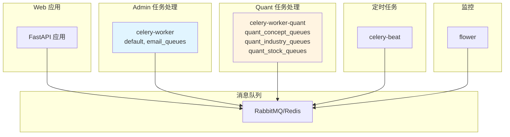

# Celery 配置指南

本文档介绍如何配置和管理 Celery 异步任务队列。

## Celery 架构

### 分组 Worker 架构

项目采用分组 Worker 架构，将不同业务模块的任务分配到独立的 Worker 中处理。



### Worker 说明

| Worker | 监听队列 | 处理任务 |
|--------|----------|----------|
| celery-worker | default, email_queues | 邮件发送、报表生成等 Admin 模块任务 |
| celery-worker-quant | quant_concept_queues, quant_industry_queues, quant_stock_queues | 概念同步、行业同步、股票K线同步等量化任务 |

### 架构优势

- **业务隔离**：Admin 和 Quant 任务独立处理，互不影响
- **独立扩展**：可根据负载独立扩展各业务 Worker
- **故障隔离**：单个 Worker 故障不影响其他业务
- **资源优化**：高负载业务可分配更多资源

## 配置文件

### Celery 配置

在 `Modules/common/libs/celery/celery_service.py` 中配置：

```python
from celery import Celery

celery = Celery(
    'py_small_admin',
    broker=CELERY_BROKER_URL,
    backend=CELERY_RESULT_BACKEND,
    include=[
        'Modules.admin.tasks.default_tasks',
        'Modules.quant.tasks.quant_tasks',
    ]
)

# 配置选项
celery.conf.update(
    task_serializer='json',
    accept_content=['json'],
    result_serializer='json',
    timezone='Asia/Shanghai',
    enable_utc=True,
    task_track_started=True,
    task_time_limit=30 * 60,  # 30 分钟
    task_soft_time_limit=25 * 60,  # 25 分钟
    worker_prefetch_multiplier=4,
    worker_max_tasks_per_child=1000,
)
```

### 环境变量配置

在 `.env` 文件中添加：

```bash
# Celery Broker
CELERY_BROKER_URL=redis://localhost:6379/1

# Celery Result Backend
CELERY_RESULT_BACKEND=redis://localhost:6379/2

# Celery 配置
CELERY_TASK_SERIALIZER=json
CELERY_RESULT_SERIALIZER=json
CELERY_TIMEZONE=Asia/Shanghai
CELERY_ENABLE_UTC=true
```

## Systemd 服务配置

### Celery Worker 服务

创建 `/etc/systemd/system/py-small-admin-celery.service`：

```ini
[Unit]
Description=Celery Worker for Py Small Admin
After=network.target redis.service rabbitmq.service

[Service]
Type=forking
User=www-data
Group=www-data
WorkingDirectory=/opt/py-small-admin/server
Environment="PATH=/opt/py-small-admin/server/venv/bin"
EnvironmentFile=/opt/py-small-admin/server/.env

ExecStart=/opt/py-small-admin/server/venv/bin/celery -A Modules.common.libs.celery.celery_service.celery multi start worker \
    -c 4 \
    --loglevel=info \
    --logfile=/opt/py-small-admin/server/logs/celery-worker.log

ExecStop=/opt/py-small-admin/server/venv/bin/celery -A Modules.common.libs.celery.celery_service.celery multi stopwait worker

Restart=always
RestartSec=10

[Install]
WantedBy=multi-user.target
```

### Celery Beat 服务

创建 `/etc/systemd/system/py-small-admin-celerybeat.service`：

```ini
[Unit]
Description=Celery Beat for Py Small Admin
After=network.target redis.service rabbitmq.service

[Service]
Type=simple
User=www-data
Group=www-data
WorkingDirectory=/opt/py-small-admin/server
Environment="PATH=/opt/py-small-admin/server/venv/bin"
EnvironmentFile=/opt/py-small-admin/server/.env

ExecStart=/opt/py-small-admin/server/venv/bin/celery -A Modules.common.libs.celery.celery_service.celery beat \
    --loglevel=info \
    --logfile=/opt/py-small-admin/server/logs/celery-beat.log \
    --scheduler=/opt/py-small-admin/server/logs/celerybeat-schedule

Restart=always
RestartSec=10

[Install]
WantedBy=multi-user.target
```

### Flower 监控服务

创建 `/etc/systemd/system/py-small-admin-flower.service`：

```ini
[Unit]
Description=Flower for Py Small Admin
After=network.target redis.service rabbitmq.service

[Service]
Type=simple
User=www-data
Group=www-data
WorkingDirectory=/opt/py-small-admin/server
Environment="PATH=/opt/py-small-admin/server/venv/bin"
EnvironmentFile=/opt/py-small-admin/server/.env

ExecStart=/opt/py-small-admin/server/venv/bin/celery -A Modules.common.libs.celery.celery_service.celery flower \
    --port=5555 \
    --broker=redis://localhost:6379/1 \
    --basic_auth=admin:your_flower_password

Restart=always
RestartSec=10

[Install]
WantedBy=multi-user.target
```

## 启动和管理

### 启动服务

```bash
# 重新加载 systemd
sudo systemctl daemon-reload

# 启动 Celery Worker
sudo systemctl start py-small-admin-celery

# 启动 Celery Beat
sudo systemctl start py-small-admin-celerybeat

# 启动 Flower（可选）
sudo systemctl start py-small-admin-flower

# 开机自启
sudo systemctl enable py-small-admin-celery
sudo systemctl enable py-small-admin-celerybeat
sudo systemctl enable py-small-admin-flower
```

### 查看状态

```bash
# 查看 Celery Worker 状态
sudo systemctl status py-small-admin-celery

# 查看 Celery Beat 状态
sudo systemctl status py-small-admin-celerybeat

# 查看 Flower 状态
sudo systemctl status py-small-admin-flower

# 查看进程
ps aux | grep celery
```

### 重启服务

```bash
# 重启 Worker
sudo systemctl restart py-small-admin-celery

# 重启 Beat
sudo systemctl restart py-small-admin-celerybeat

# 重启 Flower
sudo systemctl restart py-small-admin-flower
```

## 创建任务

### 定义任务

在 `Modules/admin/tasks/default_tasks.py` 中定义任务：

```python
from Modules.common.libs.celery.celery_service import celery
import time

@celery.task(name="Modules.admin.tasks.default_tasks.send_email")
def send_email(to: str, subject: str, body: str):
    """发送邮件任务"""
    time.sleep(5)  # 模拟耗时操作
    # 发送邮件逻辑
    return {"status": "success", "to": to}

@celery.task(name="Modules.admin.tasks.default_tasks.generate_report")
def generate_report(user_id: int):
    """生成报表任务"""
    # 生成报表逻辑
    return {"user_id": user_id, "report_url": "/uploads/report.pdf"}
```

### 调用任务

#### 同步调用

```python
from Modules.admin.tasks.default_tasks import send_email

# 同步执行（会阻塞）
result = send_email.delay("user@example.com", "测试", "邮件内容")
print(result.get())
```

#### 异步调用

```python
# 异步执行（不阻塞）
result = send_email.apply_async(args=["user@example.com", "测试", "邮件内容"])

# 获取任务 ID
task_id = result.id

# 检查任务状态
from Modules.common.libs.celery.celery_service import celery
task = celery.AsyncResult(task_id)
print(task.state)  # PENDING, STARTED, SUCCESS, FAILURE
```

## 定时任务

### 配置 Beat 调度器

在 `Modules/common/libs/celery/beat_schedule.py` 中配置：

```python
from celery.schedules import crontab

beat_schedule = {
    # 每天凌晨 2 点执行数据库备份
    'database-daily-backup': {
        'task': 'Modules.common.tasks.backup.database_backup',
        'schedule': crontab(hour=2, minute=0),
    },

    # 每小时清理过期日志
    'cleanup-expired-logs': {
        'task': 'Modules.common.tasks.cleanup.logs',
        'schedule': crontab(minute=0),
    },

    # 每 5 分钟同步股票数据
    'sync-stock-data': {
        'task': 'Modules.quant.tasks.quant_tasks.sync_stock_kline',
        'schedule': crontab(minute='*/5'),
    },
}
```

### 添加任务

```python
from celery.schedules import crontab

# 添加新任务
beat_schedule['new-task'] = {
    'task': 'path.to.your.task',
    'schedule': crontab(minute=30),  # 每小时第 30 分钟
}
```

## 监控和日志

### 访问 Flower

Flower 是一个用于监控 Celery 的 Web 工具。

访问地址：http://your-server:5555

功能：
- 查看任务执行状态
- 查看 Worker 状态
- 查看任务执行时间
- 查看任务参数和结果
- 重试失败的任务

### 查看日志

```bash
# Worker 日志
sudo journalctl -u py-small-admin-celery -f

# Beat 日志
sudo journalctl -u py-small-admin-celerybeat -f

# 应用日志
tail -f /opt/py-small-admin/server/logs/celery-worker.log
tail -f /opt/py-small-admin/server/logs/celery-beat.log
```

### 任务监控

```python
from Modules.common.libs.celery.celery_service import celery

# 获取活动 Worker
inspect = celery.control.inspect()
print(inspect.active())

# 获取已注册任务
print(inspect.registered())

# 获取预定任务
print(inspect.scheduled())
```

## 常见问题

### 1. Worker 无响应

```bash
# 检查 Worker 进程
ps aux | grep celery

# 检查日志
sudo journalctl -u py-small-admin-celelry -n 50

# 重启 Worker
sudo systemctl restart py-small-admin-celery
```

### 2. 任务执行失败

```bash
# 查看 Flower 中的错误信息
# 或查看 Worker 日志
tail -f /opt/py-small-admin/server/logs/celery-worker.log
```

### 3. 定时任务不执行

```bash
# 检查 Beat 状态
sudo systemctl status py-small-admin-celerybeat

# 查看 Beat 日志
tail -f /opt/py-small-admin/server/logs/celery-beat.log
```

## 性能优化

### 1. 调整 Worker 并发

```ini
# 在 systemd 服务中增加并发数
ExecStart=... multi start worker -c 8 ...
```

### 2. 使用任务优先级

```python
@celery.task(bind=True, priority=9)
def high_priority_task():
    pass

@celery.task(bind=True, priority=1)
def low_priority_task():
    pass
```

### 3. 任务结果过期

```python
celery.conf.update(
    result_expires=3600,  # 结果 1 小时后过期
)
```

### 4. 连接池优化

```python
celery.conf.update(
    broker_pool_limit=10,
    broker_connection_retry=True,
    broker_connection_retry_on_startup=True,
)
```
