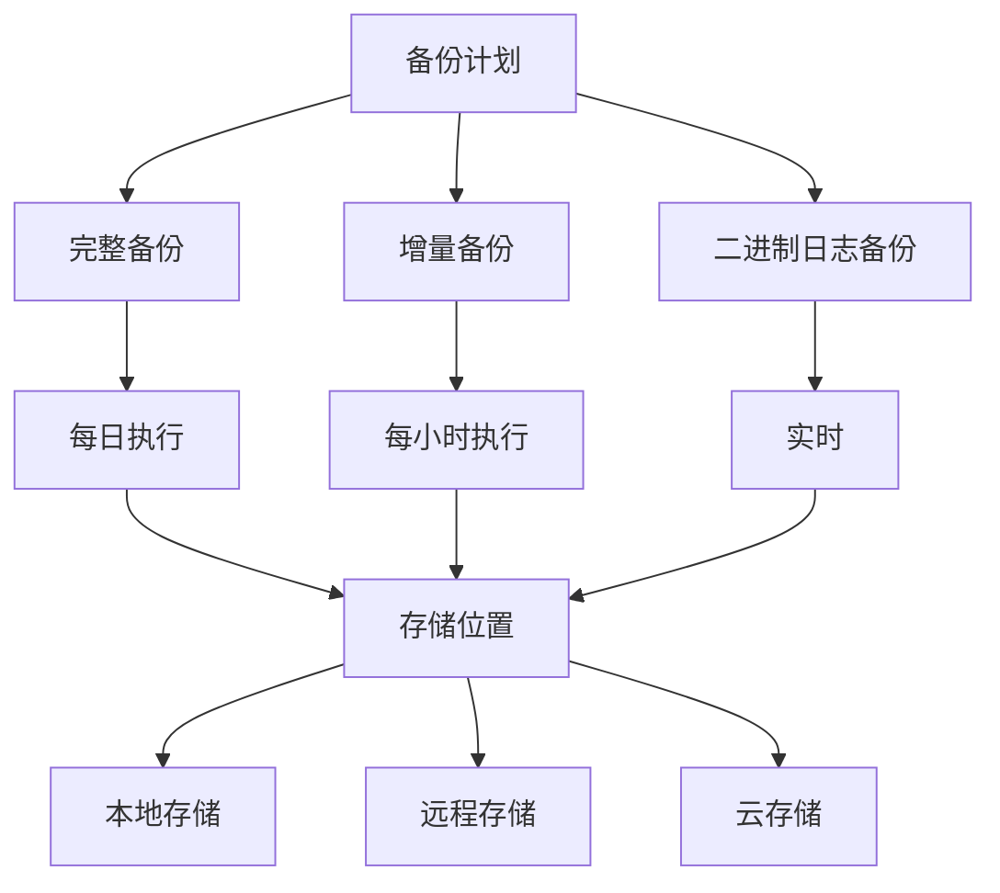

# 数据库备份指南

本文档介绍 Py Small Admin 的数据库备份和恢复策略。

## 备份策略概览



## MySQL 备份

### 1. mysqldump 备份

#### 完整备份

```bash
# 备份整个数据库
mysqldump -u root -p \
    --single-transaction \
    --routines \
    --triggers \
    --events \
    --quick \
    --lock-tables=false \
    py_small_admin > backup_$(date +%Y%m%d_%H%M%S).sql

# 压缩备份
mysqldump -u root -p \
    --single-transaction \
    --routines \
    --triggers \
    --events \
    py_small_admin | gzip > backup_$(date +%Y%m%d_%H%M%S).sql.gz
```

#### 仅备份数据（不含结构）

```bash
mysqldump -u root -p \
    --no-create-info \
    --single-transaction \
    py_small_admin > data_only_$(date +%Y%m%d).sql
```

#### 仅备份结构（不含数据）

```bash
mysqldump -u root -p \
    --no-data \
    py_small_admin > schema_only_$(date +%Y%m%d).sql
```

#### 备份特定表

```bash
# 备份单个表
mysqldump -u root -p py_small_admin admin_user > admin_user_backup.sql

# 备份多个表
mysqldump -u root -p py_small_admin \
    admin_user \
    admin_role \
    admin_group > tables_backup.sql
```

### 2. MySQL Enterprise Backup

```bash
# 热备份
mysqlbackup --user=root --password \
    --backup-dir=/backups \
    --with-timestamp \
    backup

# 增量备份
mysqlbackup --user=root --password \
    --backup-dir=/backups \
    --incremental \
    --start-lsn=LSN_NUMBER \
    backup
```

### 3. Percona XtraBackup

```bash
# 安装
sudo apt install percona-xtrabackup-80

# 完整备份
xtrabackup --backup --target-dir=/backups/full/

# 增量备份
xtrabackup --backup --target-dir=/backups/inc1 \
    --incremental-basedir=/backups/full/

# 准备备份
xtrabackup --prepare --target-dir=/backups/full/
```

## 自动化备份脚本

### 完整备份脚本

创建 `/opt/scripts/mysql-backup.sh`：

```bash
#!/bin/bash

# 配置
BACKUP_DIR="/opt/backups/mysql"
MYSQL_USER="root"
MYSQL_PASSWORD="your_password"
DATABASE="py_small_admin"
RETENTION_DAYS=30

# 创建备份目录
mkdir -p "$BACKUP_DIR"

# 备份文件名
DATE=$(date +%Y%m%d_%H%M%S)
BACKUP_FILE="$BACKUP_DIR/${DATABASE}_backup_${DATE}.sql.gz"

# 执行备份
echo "开始备份数据库: $DATABASE"
mysqldump -u "$MYSQL_USER" -p"$MYSQL_PASSWORD" \
    --single-transaction \
    --routines \
    --triggers \
    --events \
    --quick \
    "$DATABASE" | gzip > "$BACKUP_FILE"

# 检查备份是否成功
if [ $? -eq 0 ]; then
    echo "备份成功: $BACKUP_FILE"

    # 计算文件大小
    SIZE=$(du -h "$BACKUP_FILE" | cut -f1)
    echo "备份大小: $SIZE"
else
    echo "备份失败!" | mail -s "MySQL 备份失败" admin@example.com
    exit 1
fi

# 删除旧备份
echo "清理 $RETENTION_DAYS 天前的旧备份..."
find "$BACKUP_DIR" -name "${DATABASE}_backup_*.sql.gz" \
    -mtime +$RETENTION_DAYS -delete

# 显示当前备份列表
echo "当前备份文件:"
ls -lh "$BACKUP_DIR"
```

### 定时备份配置

```bash
# 添加执行权限
chmod +x /opt/scripts/mysql-backup.sh

# 添加到 crontab
crontab -e
```

```
# 每天凌晨 2 点执行完整备份
0 2 * * * /opt/scripts/mysql-backup.sh >> /var/log/mysql-backup.log 2>&1

# 每周日 3 点执行完整备份（保留更久）
0 3 * * 0 /opt/scripts/mysql-backup-weekly.sh >> /var/log/mysql-backup-weekly.log 2>&1

# 每小时执行增量备份
0 * * * * /opt/scripts/mysql-backup-incremental.sh >> /var/log/mysql-backup-incremental.log 2>&1
```

## Docker 环境备份

### 备份 Docker 容器中的 MySQL

```bash
# 方法 1: 使用 docker exec
docker-compose exec -T mysql mysqldump -u root -p"$MYSQL_ROOT_PASSWORD" \
    --single-transaction \
    --routines \
    --triggers \
    py_small_admin > backup_$(date +%Y%m%d).sql

# 方法 2: 进入容器执行
docker-compose exec mysql bash
mysqldump -u root -p py_small_admin > /tmp/backup.sql
exit
docker cp py-small-admin-mysql:/tmp/backup.sql ./backup.sql

# 压缩备份
docker-compose exec -T mysql mysqldump -u root -p"$MYSQL_ROOT_PASSWORD" \
    --single-transaction py_small_admin | gzip > backup_$(date +%Y%m%d).sql.gz
```

### Docker 卷备份

```bash
# 备份 MySQL 数据卷
docker run --rm \
    --volumes-from py-small-admin-mysql \
    -v $(pwd):/backup \
    ubuntu tar czf /backup/mysql-volume-$(date +%Y%m%d).tar.gz /var/lib/mysql

# 备份所有相关卷
docker run --rm \
    --volumes-from py-small-admin-mysql \
    --volumes-from py-small-admin-redis \
    -v $(pwd):/backup \
    ubuntu tar czf /backup/all-volumes-$(date +%Y%m%d).tar.gz \
        /var/lib/mysql \
        /data
```

## 数据恢复

### 从 SQL 文件恢复

```bash
# 解压（如果需要）
gunzip backup_20240101.sql.gz

# 恢复数据库
mysql -u root -p py_small_admin < backup_20240101.sql

# 或使用管道
cat backup_20240101.sql | mysql -u root -p py_small_admin

# 从压缩文件直接恢复
gunzip < backup_20240101.sql.gz | mysql -u root -p py_small_admin
```

### 恢复到新数据库

```bash
# 创建新数据库
mysql -u root -p -e "CREATE DATABASE py_small_admin_new;"

# 恢复到新数据库
mysql -u root -p py_small_admin_new < backup_20240101.sql
```

### Docker 环境恢复

```bash
# 恢复到容器
docker-compose exec -T mysql mysql -u root -p"$MYSQL_ROOT_PASSWORD" \
    py_small_admin < backup_20240101.sql

# 从压缩文件恢复
gunzip < backup_20240101.sql.gz | \
    docker-compose exec -T mysql mysql -u root -p"$MYSQL_ROOT_PASSWORD" py_small_admin
```

### 从卷备份恢复

```bash
# 停止容器
docker-compose down

# 删除现有卷
docker volume rm py-small-admin-mysql-data

# 创建新卷
docker volume create py-small-admin-mysql-data

# 恢复数据
docker run --rm \
    -v py-small-admin-mysql-data:/data \
    -v $(pwd):/backup \
    ubuntu tar xzf /backup/mysql-volume-20240101.tar.gz -C /data --strip-components=1

# 重启容器
docker-compose up -d
```

## 远程备份

### 备份到远程服务器

```bash
# 使用 rsync 同步
rsync -avz --progress \
    /opt/backups/mysql/ \
    user@remote-server:/remote/backups/mysql/

# 使用 scp 传输
scp backup_20240101.sql.gz user@remote-server:/remote/backups/

# 自动化脚本
#!/bin/bash
rsync -avz --delete \
    -e "ssh -i /path/to/key" \
    /opt/backups/mysql/ \
    user@remote-server:/remote/backups/mysql/

# 发送通知
if [ $? -eq 0 ]; then
    echo "备份同步成功" | mail -s "备份同步" admin@example.com
fi
```

### 备份到云存储

#### AWS S3

```bash
# 安装 AWS CLI
pip install awscli

# 配置
aws configure

# 上传到 S3
aws s3 cp /opt/backups/mysql/backup.sql.gz \
    s3://my-backup-bucket/mysql/

# 同步整个目录
aws s3 sync /opt/backups/mysql/ \
    s3://my-backup-bucket/mysql/ \
    --delete

# 设置生命周期策略
aws s3api put-bucket-lifecycle-configuration \
    --bucket my-backup-bucket \
    --lifecycle-configuration file://lifecycle.json
```

`lifecycle.json`:
```json
{
  "Rules": [
    {
      "Id": "mysql-backup-rule",
      "Status": "Enabled",
      "Prefix": "mysql/",
      "Expiration": {
        "Days": 90
      }
    }
  ]
}
```

#### 阿里云 OSS

```bash
# 安装 OSS 客户端
wget http://gosspublic.alicdn.com/ossutil/1.7.7/ossutil64
chmod +x ossutil64
./ossutil64 config

# 上传备份
./ossutil64 cp /opt/backups/mysql/backup.sql.gz \
    oss://my-bucket/mysql/

# 同步目录
./ossutil64 sync /opt/backups/mysql/ \
    oss://my-bucket/mysql/ \
    --delete
```

## 备份验证

### 验证备份完整性

```bash
#!/bin/bash

# 检查备份文件
check_backup() {
    local backup_file=$1

    # 检查文件是否存在
    if [ ! -f "$backup_file" ]; then
        echo "错误: 备份文件不存在: $backup_file"
        return 1
    fi

    # 检查文件大小
    local size=$(stat -f%z "$backup_file" 2>/dev/null || stat -c%s "$backup_file")
    if [ "$size" -lt 1000 ]; then
        echo "警告: 备份文件太小: $backup_file ($size bytes)"
        return 1
    fi

    # 验证压缩文件
    if [[ $backup_file == *.gz ]]; then
        if ! gzip -t "$backup_file" 2>/dev/null; then
            echo "错误: 备份文件损坏: $backup_file"
            return 1
        fi
    fi

    echo "验证通过: $backup_file"
    return 0
}

# 检查所有备份
for file in /opt/backups/mysql/*.sql.gz; do
    check_backup "$file"
done
```

### 测试恢复

```bash
#!/bin/bash

# 创建测试数据库
mysql -u root -p -e "CREATE DATABASE IF NOT EXISTS test_restore;"

# 恢复最新备份
LATEST_BACKUP=$(ls -t /opt/backups/mysql/*.sql.gz | head -1)
echo "测试恢复: $LATEST_BACKUP"

gunzip < "$LATEST_BACKUP" | \
    mysql -u root -p test_restore

if [ $? -eq 0 ]; then
    echo "恢复测试成功"

    # 验证表
    TABLES=$(mysql -u root -p test_restore -e "SHOW TABLES;" | wc -l)
    echo "恢复的表数量: $TABLES"

    # 清理测试数据库
    mysql -u root -p -e "DROP DATABASE test_restore;"
else
    echo "恢复测试失败!"
    exit 1
fi
```

## 监控和告警

### 备份监控脚本

```bash
#!/bin/bash

# 检查备份是否存在
check_latest_backup() {
    BACKUP_DIR="/opt/backups/mysql"
    MAX_AGE=26  # 26 小时

    # 查找最新备份
    LATEST=$(ls -t "$BACKUP_DIR"/*.sql.gz 2>/dev/null | head -1)

    if [ -z "$LATEST" ]; then
        echo "错误: 没有找到备份文件!"
        return 1
    fi

    # 检查备份年龄
    AGE=$(( $(date +%s) - $(stat -c %Y "$LATEST") ))
    HOURS=$(( AGE / 3600 ))

    if [ $HOURS -gt $MAX_AGE ]; then
        echo "警告: 最新备份已过时 ($HOURS 小时前)"
        return 1
    fi

    echo "备份状态正常: $LATEST ($HOURS 小时前)"
    return 0
}

# 发送告警
if ! check_latest_backup; then
    echo "发送告警邮件..."
    # mail -s "MySQL 备份告警" admin@example.com
fi
```

## 最佳实践

1. **3-2-1 备份原则**
   - 保留 3 份副本
   - 使用 2 种不同介质
   - 1 份异地备份

2. **备份频率**
   - 完整备份：每天一次
   - 增量备份：每小时一次
   - 二进制日志：实时

3. **备份保留**
   - 日备份保留 7 天
   - 周备份保留 4 周
   - 月备份保留 12 个月

4. **加密敏感数据**
   ```bash
   # 加密备份
   mysqldump ... | gpg --encrypt --recipient admin@example.com > backup.sql.gpg
   ```

5. **文档化恢复流程**
   - 保持详细的恢复文档
   - 定期进行恢复演练
   - 记录恢复时间点目标（RTO）和恢复点目标（RPO）
