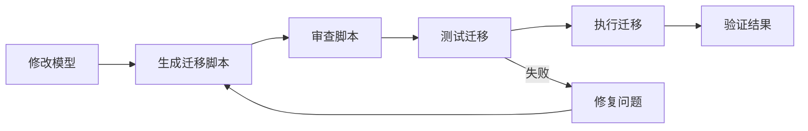

# 数据库迁移指南

本文档介绍 Py Small Admin 的数据库迁移流程和最佳实践。

## Alembic 迁移工具

Py Small Admin 使用 Alembic 进行数据库迁移管理。

### 迁移工作流程



## 基础操作

### 1. 初始化 Alembic

```bash
# 安装 Alembic
pip install alembic

# 初始化（通常项目已初始化）
alembic init alembic
```

### 2. 生成迁移脚本

```bash
# 自动生成迁移脚本
alembic revision --autogenerate -m "描述迁移内容"

# 指定输出路径
alembic revisions -m "添加用户表"

# 查看迁移历史
alembic history

# 查看当前版本
alembic current
```

### 3. 执行迁移

```bash
# 升级到最新版本
alembic upgrade head

# 升级到指定版本
alembic upgrade +1
alembic upgrade ae1027a6acf

# 降级一个版本
alembic downgrade -1

# 降级到指定版本
alembic downgrade base

# 查看迁移状态
alembic show head
```

### 4. 查看迁移 SQL

```bash
# 查看升级 SQL（不执行）
alembic upgrade head --sql

# 输出到文件
alembic upgrade head --sql > migration.sql
```

## 创建迁移

### 添加表

```python
# alembic/versions/001_add_user_table.py

from alembic import op
import sqlalchemy as sa
from sqlalchemy.dialects import mysql

revision = '001'
down_revision = None
branch_labels = None
depends_on = None


def upgrade() -> None:
    op.create_table(
        'admin_user',
        sa.Column('id', sa.Integer(), autoincrement=True, nullable=False),
        sa.Column('username', sa.String(length=50), nullable=False),
        sa.Column('email', sa.String(length=100), nullable=False),
        sa.Column('hashed_password', sa.String(length=200), nullable=False),
        sa.Column('is_active', sa.Boolean(), default=True, nullable=False),
        sa.Column('created_at', sa.DateTime(), server_default=sa.text('NOW()'), nullable=True),
        sa.Column('updated_at', sa.DateTime(), server_default=sa.text('NOW()'), onupdate=sa.text('NOW()'), nullable=True),
        sa.PrimaryKeyConstraint('id'),
        sa.UniqueConstraint('username'),
        sa.UniqueConstraint('email'),
        comment='用户表'
    )

    # 创建索引
    op.create_index('ix_admin_user_email', 'admin_user', ['email'])
    op.create_index('ix_admin_user_username', 'admin_user', ['username'])


def downgrade() -> None:
    op.drop_index('ix_admin_user_username', table_name='admin_user')
    op.drop_index('ix_admin_user_email', table_name='admin_user')
    op.drop_table('admin_user')
```

### 添加列

```python
# alembic/versions/002_add_user_avatar.py

revision = '002'
down_revision = '001'


def upgrade() -> None:
    op.add_column(
        'admin_user',
        sa.Column('avatar', sa.String(length=255), nullable=True, comment='用户头像')
    )


def downgrade() -> None:
    op.drop_column('admin_user', 'avatar')
```

### 修改列

```python
# alembic/versions/003_modify_username_length.py

revision = '003'
down_revision = '002'


def upgrade() -> None:
    # MySQL 方式
    op.alter_column(
        'admin_user',
        'username',
        type_=sa.String(length=100),
        existing_type=sa.String(length=50)
    )


def downgrade() -> None:
    op.alter_column(
        'admin_user',
        'username',
        type_=sa.String(length=50),
        existing_type=sa.String(length=100)
    )
```

### 添加外键

```python
# alembic/versions/004_add_foreign_key.py

revision = '004'
down_revision = '003'


def upgrade() -> None:
    op.create_foreign_key(
        'fk_user_role_role_id',
        'admin_user',
        'admin_role',
        ['role_id'],
        ['id'],
        ondelete='CASCADE'
    )


def downgrade() -> None:
    op.drop_constraint('fk_user_role_role_id', 'admin_user', type_='foreignkey')
```

### 添加索引

```python
# alembic/versions/005_add_indexes.py

revision = '005'
down_revision = '004'


def upgrade() -> None:
    # 普通索引
    op.create_index('ix_user_created_at', 'admin_user', ['created_at'])

    # 复合索引
    op.create_index('ix_user_role_status', 'admin_user', ['role_id', 'is_active'])

    # 唯一索引
    op.create_index('ix_user_email_unique', 'admin_user', ['email'], unique=True)


def downgrade() -> None:
    op.drop_index('ix_user_email_unique', table_name='admin_user')
    op.drop_index('ix_user_role_status', table_name='admin_user')
    op.drop_index('ix_user_created_at', table_name='admin_user')
```

### 数据迁移

```python
# alembic/versions/006_migrate_data.py

from alembic import op
import sqlalchemy as sa
from sqlalchemy.sql import table, column

revision = '006'
down_revision = '005'


def upgrade() -> None:
    # 添加新列
    op.add_column('admin_user', sa.Column('full_name', sa.String(100)))

    # 迁移数据
    from sqlalchemy.orm import Session
    session = Session(op.get_bind())

    # 使用原始 SQL
    op.execute("""
        UPDATE admin_user
        SET full_name = CONCAT(first_name, ' ', last_name)
        WHERE full_name IS NULL
    """)

    # 或使用 SQLAlchemy Core
    user_table = table('admin_user',
        column('id', sa.Integer),
        column('username', sa.String),
        column('full_name', sa.String)
    )
    op.execute(
        user_table.update()
        .where(user_table.c.full_name.is_(None))
        .values(full_name=user_table.c.username)
    )


def downgrade() -> None:
    op.drop_column('admin_user', 'full_name')
```

## 高级迁移

### 批量操作

```python
from alembic import op
import sqlalchemy as sa

revision = '007'
down_revision = '006'


def upgrade() -> None:
    # 使用批量操作提高性能
    with op.batch_alter_table('admin_user', recreate='auto') as batch_op:
        batch_op.add_column(sa.Column('new_field', sa.String(50), nullable=True))
        batch_op.alter_column('username', type_=sa.String(100))
        batch_op.create_index('ix_username', 'username')


def downgrade() -> None:
    with op.batch_alter_table('admin_user', recreate='auto') as batch_op:
        batch_op.drop_index('ix_username')
        batch_op.alter_column('username', type_=sa.String(50))
        batch_op.drop_column('new_field')
```

### 条件迁移

```python
from alembic import op
import sqlalchemy as sa
from sqlalchemy import inspect

revision = '008'
down_revision = '007'


def upgrade() -> None:
    bind = op.get_bind()
    inspector = inspect(bind)

    # 检查列是否存在
    columns = [col['name'] for col in inspector.get_columns('admin_user')]

    if 'new_column' not in columns:
        op.add_column('admin_user', sa.Column('new_column', sa.String(50)))


def downgrade() -> None:
    bind = op.get_bind()
    inspector = inspect(bind)

    columns = [col['name'] for col in inspector.get_columns('admin_user')]

    if 'new_column' in columns:
        op.drop_column('admin_user', 'new_column')
```

### 分阶段迁移

```python
# 第一步：添加新列（可为空）
# 009_add_new_column_part1.py

revision = '009'
down_revision = '008'


def upgrade() -> None:
    op.add_column('admin_user', sa.Column('new_status', sa.Integer(), nullable=True))


def downgrade() -> None:
    op.drop_column('admin_user', 'new_status')


# 第二步：迁移数据
# 010_add_new_column_part2.py

revision = '010'
down_revision = '009'


def upgrade() -> None:
    op.execute("""
        UPDATE admin_user
        SET new_status = CASE
            WHEN is_active = 1 THEN 1
            ELSE 0
        END
    """)


def downgrade() -> None:
    pass


# 第三步：设置非空约束
# 011_add_new_column_part3.py

revision = '011'
down_revision = '010'


def upgrade() -> None:
    op.alter_column('admin_user', 'new_status', nullable=False)


def downgrade() -> None:
    op.alter_column('admin_user', 'new_status', nullable=True)
```

## 迁移最佳实践

### 1. 迁移命名规范

```bash
# 格式：{数字}_{动词}_{对象}.py

# 好的命名
20240101_01_create_user_table.py
20240101_02_add_email_index.py
20240101_03_migrate_user_data.py

# 避免的命名
change.py
fix.py
update.py
```

### 2. 编写可逆迁移

```python
from alembic import op
import sqlalchemy as sa

revision = '012'
down_revision = '011'


def upgrade() -> None:
    # 总是提供 downgrade
    op.create_table(
        'new_table',
        sa.Column('id', sa.Integer(), primary_key=True),
        sa.Column('name', sa.String(50))
    )


def downgrade() -> None:
    # 确保可以完全回滚
    op.drop_table('new_table')
```

### 3. 使用事务

```python
from alembic import op

revision = '013'
down_revision = '012'


def upgrade() -> None:
    # 迁移在事务中执行
    with op.get_bind().begin():
        op.create_table('test_table', sa.Column('id', sa.Integer()))
        op.execute("INSERT INTO test_table VALUES (1)")


def downgrade() -> None:
    op.drop_table('test_table')
```

### 4. 数据验证

```python
from alembic import op
import sqlalchemy as sa

revision = '014'
down_revision = '013'


def upgrade() -> None:
    # 添加列
    op.add_column('admin_user', sa.Column('status_code', sa.Integer()))

    # 填充默认值
    op.execute("UPDATE admin_user SET status_code = 1 WHERE status_code IS NULL")

    # 验证数据
    result = op.execute("SELECT COUNT(*) FROM admin_user WHERE status_code IS NULL")
    count = result.scalar()

    if count > 0:
        raise Exception(f"迁移失败：仍有 {count} 条记录的 status_code 为空")

    # 设置非空
    op.alter_column('admin_user', 'status_code', nullable=False)


def downgrade() -> None:
    op.drop_column('admin_user', 'status_code')
```

## 生产环境迁移

### 1. 迁移前检查清单

```bash
#!/bin/bash

echo "=== 迁移前检查 ==="

# 1. 备份数据库
echo "1. 备份数据库..."
mysqldump -u root -p py_small_admin > pre_migration_backup.sql

# 2. 检查迁移脚本
echo "2. 检查迁移脚本..."
alembic check

# 3. 查看待执行的迁移
echo "3. 查看待执行迁移..."
alembic history

# 4. 显示当前版本
echo "4. 当前版本..."
alembic current

# 5. 测试迁移（在测试环境）
echo "5. 在测试环境测试..."
# 部署到测试环境并执行迁移

read -p "检查完成，是否继续？(y/n) " -n 1 -r
echo
if [[ $REPLY =~ ^[Yy]$ ]]; then
    echo "开始迁移..."
fi
```

### 2. 执行迁移

```bash
# 方式 1：直接升级
alembic upgrade head

# 方式 2：逐个版本升级（更安全）
alembic upgrade +1
# 验证
# 继续下一个
alembic upgrade +1

# 方式 3：指定版本
alembic upgrade <revision_id>

# 查看迁移进度
alembic current
```

### 3. 迁移后验证

```bash
#!/bin/bash

echo "=== 迁移后验证 ==="

# 1. 检查表结构
echo "1. 验证表结构..."
mysql -u root -p -e "DESCRIBE admin_user;" py_small_admin

# 2. 检查数据完整性
echo "2. 验证数据..."
mysql -u root -p -e "SELECT COUNT(*) FROM admin_user;" py_small_admin

# 3. 运行应用测试
echo "3. 运行测试..."
pytest tests/

# 4. 检查应用日志
echo "4. 检查日志..."
tail -f /var/log/py-small-admin/app.log
```

### 4. 回滚计划

```bash
# 如果迁移失败，回滚
alembic downgrade -1

# 恢复备份
mysql -u root -p py_small_admin < pre_migration_backup.sql

# 重启应用
sudo systemctl restart py-small-admin
```

## 性能优化

### 1. 大表迁移

```python
from alembic import op
import sqlalchemy as sa

revision = '015'
down_revision = '014'
BATCH_SIZE = 1000


def upgrade() -> None:
    # 添加新列
    op.add_column('large_table', sa.Column('new_column', sa.String(50)))

    # 分批更新数据
    connection = op.get_bind()

    offset = 0
    while True:
        result = connection.execute(
            f"SELECT id FROM large_table ORDER BY id LIMIT {BATCH_SIZE} OFFSET {offset}"
        )
        rows = result.fetchall()

        if not rows:
            break

        ids = [row[0] for row in rows]
        connection.execute(
            f"UPDATE large_table SET new_column = 'value' WHERE id IN ({','.join(map(str, ids))})"
        )

        offset += BATCH_SIZE
        print(f"已处理 {offset} 条记录")


def downgrade() -> None:
    op.drop_column('large_table', 'new_column')
```

### 2. 使用 pt-online-schema-change

```bash
# 对于大表，使用 Percona Toolkit 在线修改表结构
pt-online-schema-change \
    --alter "ADD COLUMN new_column INT" \
    --user=root \
    --password \
    D=py_small_admin,t=admin_user \
    --execute
```

## 故障排查

### 1. 迁移冲突

```bash
# 查看迁移历史
alembic history

# 查看当前版本
alembic current

# 如果分支，需要合并
alembic merge -m "合并迁移" <revision1> <revision2>
```

### 2. 迁移失败

```bash
# 查看错误
alembic upgrade head

# 如果失败，标记为已完成（谨慎使用）
alembic stamp head

# 或回退
alembic downgrade -1
```

### 3. 数据库锁定

```bash
# 检查锁表
SHOW PROCESSLIST;

# 杀死长时间运行的查询
KILL <process_id>;
```

## 常见问题

### Q: 如何处理已存在的迁移？

```bash
# 标记当前数据库版本
alembic stamp <revision_id>

# 或标记到最新
alembic stamp head
```

### Q: 如何跳过某些迁移？

```python
# 手动修改 down_revision
# 或创建新迁移跳过
revision = '016'
down_revision = '014'  # 跳过 015
```

### Q: 如何在迁移中使用模型？

```python
# 在迁移中导入模型（注意：可能不是最新版本）
from Modules.admin.models import User

def upgrade() -> None:
    connection = op.get_bind()
    session = Session(bind=connection)

    users = session.query(User).all()
    for user in users:
        user.new_field = calculate_value(user)
    session.commit()
```

## 最佳实践总结

1. **小步快跑**：每个迁移只做一件事
2. **可逆性**：始终提供 downgrade
3. **测试先行**：在测试环境验证
4. **备份数据**：迁移前总是备份
5. **文档记录**：在迁移脚本中添加注释
6. **代码审查**：迁移脚本需要审查
7. **监控执行**：监控生产环境迁移过程
8. **回滚准备**：准备好回滚方案
