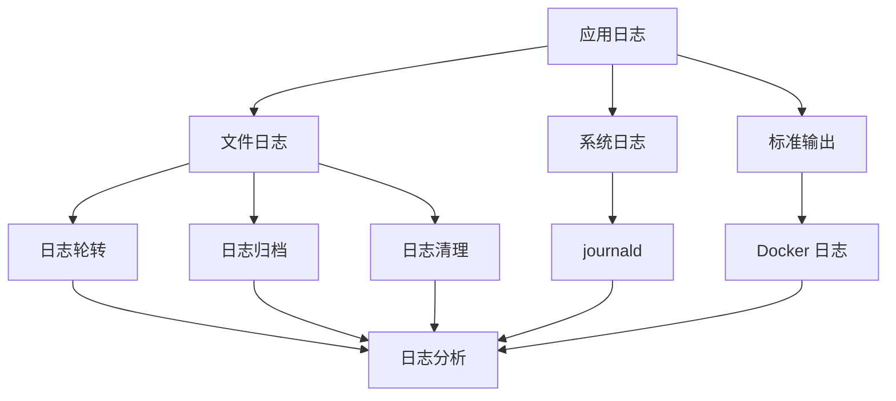

# 日志管理指南

本文档介绍 Py Small Admin 的日志配置、管理和分析方法。

## 日志架构



## Python 日志配置

### 1. 基础配置

在 `Modules/common/config/logger.py` 中配置：

```python
import logging
import sys
from pathlib import Path
from logging.handlers import RotatingFileHandler, TimedRotatingFileHandler

# 日志目录
LOG_DIR = Path(__file__).parent.parent.parent.parent / "logs"
LOG_DIR.mkdir(exist_ok=True)

# 日志格式
LOG_FORMAT = '%(asctime)s - %(name)s - %(levelname)s - %(message)s'
DETAILED_FORMAT = '%(asctime)s - %(name)s - %(levelname)s - %(filename)s:%(lineno)d - %(message)s'
DATE_FORMAT = '%Y-%m-%d %H:%M:%S'

def setup_logger(name: str = 'py_small_admin', level: str = 'INFO'):
    """配置日志"""
    logger = logging.getLogger(name)
    logger.setLevel(getattr(logging, level.upper()))

    # 清除已有的处理器
    logger.handlers.clear()

    # 控制台处理器
    console_handler = logging.StreamHandler(sys.stdout)
    console_handler.setLevel(logging.INFO)
    console_formatter = logging.Formatter(LOG_FORMAT, DATE_FORMAT)
    console_handler.setFormatter(console_formatter)
    logger.addHandler(console_handler)

    # 文件处理器 - INFO
    info_handler = RotatingFileHandler(
        LOG_DIR / 'app.log',
        maxBytes=10 * 1024 * 1024,  # 10MB
        backupCount=10,
        encoding='utf-8'
    )
    info_handler.setLevel(logging.INFO)
    info_formatter = logging.Formatter(DETAILED_FORMAT, DATE_FORMAT)
    info_handler.setFormatter(info_formatter)
    logger.addHandler(info_handler)

    # 文件处理器 - ERROR
    error_handler = RotatingFileHandler(
        LOG_DIR / 'error.log',
        maxBytes=10 * 1024 * 1024,
        backupCount=10,
        encoding='utf-8'
    )
    error_handler.setLevel(logging.ERROR)
    error_formatter = logging.Formatter(DETAILED_FORMAT, DATE_FORMAT)
    error_handler.setFormatter(error_formatter)
    logger.addHandler(error_handler)

    # 文件处理器 - 按时间轮转
    time_handler = TimedRotatingFileHandler(
        LOG_DIR / 'app-daily.log',
        when='midnight',
        interval=1,
        backupCount=30,
        encoding='utf-8'
    )
    time_handler.setLevel(logging.DEBUG)
    time_handler.suffix = '%Y%m%d'
    time_handler.setFormatter(info_formatter)
    logger.addHandler(time_handler)

    return logger

# 创建全局日志
logger = setup_logger()
```

### 2. FastAPI 日志集成

```python
from fastapi import Request
import logging

logger = logging.getLogger('py_small_admin')

@app.middleware("http")
async def log_requests(request: Request, call_next):
    """记录请求日志"""
    logger.info(f"{request.method} {request.url.path}")

    response = await call_next(request)

    logger.info(
        f"{request.method} {request.url.path} - "
        f"Status: {response.status_code}"
    )

    return response
```

### 3. 结构化日志

```python
import json
import logging
from datetime import datetime

class JSONFormatter(logging.Formatter):
    """JSON 格式化器"""

    def format(self, record):
        log_data = {
            'timestamp': datetime.utcnow().isoformat(),
            'level': record.levelname,
            'logger': record.name,
            'message': record.getMessage(),
            'module': record.module,
            'function': record.funcName,
            'line': record.lineno,
        }

        # 添加异常信息
        if record.exc_info:
            log_data['exception'] = self.formatException(record.exc_info)

        # 添加额外字段
        if hasattr(record, 'extra'):
            log_data.update(record.extra)

        return json.dumps(log_data, ensure_ascii=False)

# 使用 JSON 格式化器
json_handler = logging.FileHandler('logs/app.json')
json_handler.setFormatter(JSONFormatter())
logger.addHandler(json_handler)
```

## 日志轮转

### 1. Logrotate 配置

创建 `/etc/logrotate.d/py-small-admin`：

```
/opt/py-small-admin/server/logs/*.log {
    daily
    rotate 30
    compress
    delaycompress
    notifempty
    create 0640 www-data www-data
    sharedscripts
    postrotate
        systemctl reload py-small-admin > /dev/null 2>&1 || true
        systemctl reload py-small-admin-celery > /dev/null 2>&1 || true
    endscript
}

/opt/py-small-admin/server/logs/*.json {
    daily
    rotate 14
    compress
    delaycompress
    notifempty
    create 0640 www-data www-data
    sharedscripts
    postrotate
        systemctl reload py-small-admin > /dev/null 2>&1 || true
    endscript
}
```

### 2. 测试配置

```bash
# 测试 logrotate 配置
sudo logrotate -d /etc/logrotate.d/py-small-admin

# 强制执行轮转
sudo logrotate -f /etc/logrotate.d/py-small-admin
```

## Docker 日志

### 1. 配置日志驱动

在 `docker-compose.yml` 中配置：

```yaml
services:
  fastapi:
    logging:
      driver: "json-file"
      options:
        max-size: "10m"
        max-file: "3"
        labels: "service,environment"
        tag: "{{.Name}}/{{.ID}}"

  celery-worker:
    logging:
      driver: "json-file"
      options:
        max-size: "10m"
        max-file: "3"
```

### 2. 使用 Syslog

```yaml
services:
  fastapi:
    logging:
      driver: "syslog"
      options:
        syslog-address: "tcp://192.168.0.42:514"
        tag: "py-small-admin"
```

### 3. 使用 Journald

```yaml
services:
  fastapi:
    logging:
      driver: "journald"
      options:
        labels: "service"
```

查看日志：

```bash
# 查看所有日志
journalctl -u docker

# 过滤服务
journalctl -u docker | grep py-small-admin

# 实时跟踪
journalctl -u docker -f
```

## Systemd 日志

### 1. 配置 StandardOutput

在 systemd 服务文件中：

```ini
[Service]
# 输出到 journald
StandardOutput=journal
StandardError=journal

# 同时输出到文件
StandardOutput=append:/opt/py-small-admin/server/logs/app.log
StandardError=append:/opt/py-small-admin/server/logs/error.log

# 设置日志级别
SyslogIdentifier=py-small-admin
```

### 2. 查看 Journal 日志

```bash
# 查看所有日志
sudo journalctl -u py-small-admin

# 实时跟踪
sudo journalctl -u py-small-admin -f

# 最近 100 行
sudo journalctl -u py-small-admin -n 100

# 时间范围
sudo journalctl -u py-small-admin --since "2024-01-01" --until "2024-01-02"

# 只看错误
sudo journalctl -u py-small-admin -p err

# 持续跟踪并过滤
sudo journalctl -u py-small-admin -f | grep ERROR
```

### 3. Journal 持久化

```bash
# 创建日志目录
sudo mkdir -p /var/log/journal

# 设置权限
sudo systemd-tmpfiles --create --prefix /var/log/journal

# 重启 journald
sudo systemctl restart systemd-journald
```

## 日志分析

### 1. 使用 grep

```bash
# 查找错误日志
grep -i error logs/app.log

# 查找特定时间范围
awk '/2024-01-01 10:00/,/2024-01-01 11:00/' logs/app.log

# 统计错误数量
grep -c ERROR logs/app.log

# 查找慢请求
grep "duration" logs/app.log | awk -F'duration=' '{print $2}' | sort -n | tail -10
```

### 2. 使用 awk

```bash
# 统计日志级别
awk '{print $3}' logs/app.log | sort | uniq -c

# 查找平均响应时间
awk '/duration/ {sum+=$NF; count++} END {print sum/count}' logs/app.log

# 提取特定字段
awk -F'"' '{print $2, $6, $8}' logs/app.log
```

### 3. 使用 sed

```bash
# 替换敏感信息
sed 's/password=[^&]*/password=***/g' logs/app.log

# 删除重复行
sed '$!N; /^\(.*\)\n\1$/!P; D' logs/app.log

# 提取时间范围
sed -n '/2024-01-01 10:00/,/2024-01-01 11:00/p' logs/app.log
```

### 4. 使用 Logstash

创建 `logstash.conf`：

```conf
input {
    file {
        path => "/opt/py-small-admin/server/logs/*.log"
        start_position => "beginning"
        type => "py-small-admin"
    }
}

filter {
    if [type] == "py-small-admin" {
        grok {
            match => {
                "message" => "%{TIMESTAMP_ISO8601:timestamp} - %{DATA:logger} - %{LOGLEVEL:level} - %{GREEDYDATA:message}"
            }
        }

        date {
            match => ["timestamp", "ISO8601"]
        }
    }
}

output {
    elasticsearch {
        hosts => ["localhost:9200"]
        index => "py-small-admin-%{+YYYY.MM.dd}"
    }

    stdout {
        codec => rubydebug
    }
}
```

## 日志监控

### 1. 使用 Filebeat

创建 `filebeat.yml`：

```yaml
filebeat.inputs:
  - type: log
    enabled: true
    paths:
      - /opt/py-small-admin/server/logs/*.log
    fields:
      service: py-small-admin
      environment: production
    multiline:
      pattern: '^\d{4}-\d{2}-\d{2}'
      negate: true
      match: after

output.elasticsearch:
  hosts: ["localhost:9200"]
  indices:
    - index: "py-small-admin-%{+yyyy.MM.dd}"

setup.kibana:
  host: "localhost:5601"
```

### 2. 错误告警

```python
# log_alert.py
import re
import smtplib
from email.mime.text import MIMEText
from datetime import datetime, timedelta

def check_errors(log_file, threshold=100):
    """检查错误数量"""
    one_hour_ago = datetime.now() - timedelta(hours=1)

    with open(log_file) as f:
        error_count = 0
        for line in f:
            if 'ERROR' in line:
                # 解析时间
                match = re.search(r'(\d{4}-\d{2}-\d{2} \d{2}:\d{2}:\d{2})', line)
                if match:
                    log_time = datetime.strptime(match.group(1), '%Y-%m-%d %H:%M:%S')
                    if log_time > one_hour_ago:
                        error_count += 1

    if error_count > threshold:
        send_alert(f"错误告警: 过去一小时有 {error_count} 个错误")

def send_alert(message):
    """发送告警邮件"""
    msg = MIMEText(message)
    msg['Subject'] = 'Py Small Admin 日志告警'
    msg['From'] = 'alert@example.com'
    msg['To'] = 'admin@example.com'

    with smtplib.SMTP('smtp.example.com', 587) as server:
        server.starttls()
        server.login('alert@example.com', 'password')
        server.send_message(msg)
```

添加到 crontab：

```
*/5 * * * * /usr/bin/python3 /opt/scripts/log_alert.py
```

## 日志最佳实践

### 1. 日志级别使用

```python
# DEBUG: 详细信息，主要用于诊断
logger.debug("Database query: %s", query)

# INFO: 确认程序按预期运行
logger.info("User %s logged in successfully", user_id)

# WARNING: 警告信息，但程序仍可运行
logger.warning("Cache miss for key: %s", cache_key)

# ERROR: 严重错误，程序无法执行某些功能
logger.error("Failed to send email: %s", error, exc_info=True)

# CRITICAL: 严重错误，程序可能无法继续运行
logger.critical("Database connection lost!")
```

### 2. 敏感信息脱敏

```python
import re

def sanitize_log(message: str) -> str:
    """脱敏日志"""
    # 隐藏密码
    message = re.sub(r'password=[^&\s]+', 'password=***', message)

    # 隐藏 token
    message = re.sub(r'token=[^&\s]+', 'token=***', message)

    # 隐藏身份证号
    message = re.sub(r'\d{15}[\dXx]', '***', message)

    # 隐藏手机号
    message = re.sub(r'1\d{2}\*{4}\d{4}', '***', message)

    return message

logger.info(sanitize_log("User login with password=secret123 and token=abc123"))
# 输出: User login with password=*** and token=***
```

### 3. 性能日志

```python
import time
from functools import wraps

def log_performance(func):
    """记录函数执行时间"""
    @wraps(func)
    def wrapper(*args, **kwargs):
        start_time = time.time()
        result = func(*args, **kwargs)
        duration = time.time() - start_time

        logger.info(
            "Function %s executed in %.2f seconds",
            func.__name__,
            duration
        )

        return result
    return wrapper

@log_performance
def process_data():
    # 处理数据
    pass
```

### 4. 请求追踪

```python
import uuid
from fastapi import Request

@app.middleware("http")
async def request_tracing(request: Request, call_next):
    """添加请求追踪 ID"""
    request_id = str(uuid.uuid4())
    request.state.request_id = request_id

    # 在日志中包含 request_id
    logger.info(
        "Request %s: %s %s",
        request_id,
        request.method,
        request.url.path
    )

    response = await call_next(request)
    response.headers["X-Request-ID"] = request_id

    return response
```

## 日志分析工具

### 1. 使用 GoAccess

```bash
# 分析访问日志
goaccess logs/app.log -o report.html

# 实时分析
goaccess logs/app.log -o report.html --real-time-html
```

### 2. 使用 ELK Stack

- **Elasticsearch**: 存储和搜索日志
- **Logstash**: 处理和转换日志
- **Kibana**: 可视化和分析

### 3. 使用 Grafana Loki

```yaml
# promtail-config.yml
server:
  http_listen_port: 9080

positions:
  filename: /tmp/positions.yaml

clients:
  - url: http://localhost:3100/loki/api/v1/push

scrape_configs:
  - job_name: py-small-admin
    static_configs:
      - targets:
          - localhost
        labels:
          job: py-small-admin
          __path__: /opt/py-small-admin/server/logs/*.log
```

## 故障排查

### 1. 日志文件过大

```bash
# 检查日志大小
du -sh logs/*

# 压缩旧日志
find logs/ -name "*.log" -mtime +7 -exec gzip {} \;

# 清理旧日志
find logs/ -name "*.log.gz" -mtime +30 -delete
```

### 2. 磁盘空间不足

```bash
# 检查磁盘使用
df -h

# 查找大文件
find logs/ -type f -size +100M

# 清空日志（谨慎使用）
> logs/app.log
```

### 3. 日志丢失

检查配置：
- 确认日志目录权限
- 检查磁盘空间
- 验证日志轮转配置
- 查看 systemd 配置

## 最佳实践总结

1. **分级记录**：使用适当的日志级别
2. **结构化**：使用结构化格式便于分析
3. **轮转**：配置日志轮转避免文件过大
4. **脱敏**：不记录敏感信息
5. **监控**：设置日志监控和告警
6. **备份**：定期归档重要日志
7. **清理**：自动清理过期日志
8. **标准化**：统一日志格式和命名
