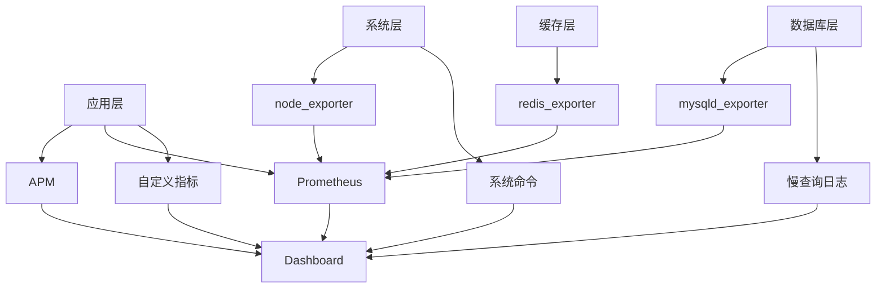

# 性能监控指南

本文档介绍 Py Small Admin 的性能监控和优化方法。

## 监控架构



## 应用性能监控

### 1. 使用 Prometheus + Grafana

#### 安装 Prometheus

```bash
# 下载 Prometheus
wget https://github.com/prometheus/prometheus/releases/download/v2.45.0/prometheus-2.45.0.linux-amd64.tar.gz
tar xvfz prometheus-2.45.0.linux-amd64.tar.gz
cd prometheus-2.45.0.linux-amd64

# 配置 Prometheus
cat > prometheus.yml <<EOF
global:
  scrape_interval: 15s
  evaluation_interval: 15s

scrape_configs:
  - job_name: 'py-small-admin'
    static_configs:
      - targets: ['localhost:8000']
    metrics_path: '/metrics'

  - job_name: 'node'
    static_configs:
      - targets: ['localhost:9100']

  - job_name: 'mysql'
    static_configs:
      - targets: ['localhost:9104']

  - job_name: 'redis'
    static_configs:
      - targets: ['localhost:9121']
EOF

# 启动 Prometheus
./prometheus --config.file=prometheus.yml
```

#### 配置 Systemd 服务

```ini
# /etc/systemd/system/prometheus.service
[Unit]
Description=Prometheus
After=network.target

[Service]
Type=simple
User=prometheus
ExecStart=/usr/local/bin/prometheus \
    --config.file=/etc/prometheus/prometheus.yml \
    --storage.tsdb.path=/var/lib/prometheus \
    --web.console.templates=/etc/prometheus/consoles \
    --web.console.libraries=/etc/prometheus/console_libraries

Restart=always

[Install]
WantedBy=multi-user.target
```

### 2. 集成 Prometheus 到 FastAPI

```python
# Modules/common/metrics.py
from prometheus_client import Counter, Histogram, Gauge, generate_latest, CONTENT_TYPE_LATEST
from fastapi import Response
from starlette.middleware.base import BaseHTTPMiddleware
import time

# 请求计数
request_count = Counter(
    'http_requests_total',
    'Total HTTP requests',
    ['method', 'endpoint', 'status']
)

# 请求延迟
request_duration = Histogram(
    'http_request_duration_seconds',
    'HTTP request duration',
    ['method', 'endpoint']
)

# 活跃连接
active_connections = Gauge(
    'active_connections',
    'Active connections'
)

# Celery 任务指标
task_count = Counter(
    'celery_tasks_total',
    'Total Celery tasks',
    ['task_name', 'status']
)

task_duration = Histogram(
    'celery_task_duration_seconds',
    'Celery task duration',
    ['task_name']
)

# 自定义中间件
class PrometheusMiddleware(BaseHTTPMiddleware):
    async def dispatch(self, request, call_next):
        # 记录开始时间
        start_time = time.time()
        active_connections.inc()

        # 处理请求
        response = await call_next(request)

        # 记录指标
        duration = time.time() - start_time
        request_count.labels(
            method=request.method,
            endpoint=request.url.path,
            status=response.status_code
        ).inc()
        request_duration.labels(
            method=request.method,
            endpoint=request.url.path
        ).observe(duration)
        active_connections.dec()

        return response

# 在 main.py 中添加
from Modules.common.metrics import PrometheusMiddleware

app.add_middleware(PrometheusMiddleware)

@app.get("/metrics")
async def metrics():
    return Response(generate_latest(), media_type=CONTENT_TYPE_LATEST)
```

### 3. Celery 任务监控

```python
# Modules/common/libs/celery/celery_service.py
from Modules.common.metrics import task_count, task_duration
from celery import Celery
import time

celery = Celery('py_small_admin')

@celery.task(bind=True)
def monitored_task(self, *args, **kwargs):
    """带监控的任务"""
    task_name = self.name
    start_time = time.time()

    try:
        result = execute_task(*args, **kwargs)
        task_count.labels(task_name=task_name, status='success').inc()
        return result
    except Exception as e:
        task_count.labels(task_name=task_name, status='failure').inc()
        raise
    finally:
        duration = time.time() - start_time
        task_duration.labels(task_name=task_name).observe(duration)
```

## 系统监控

### 1. 安装 node_exporter

```bash
# 下载
wget https://github.com/prometheus/node_exporter/releases/download/v1.6.1/node_exporter-1.6.1.linux-amd64.tar.gz
tar xvfz node_exporter-1.6.1.linux-amd64.tar.gz
cd node_exporter-1.6.1.linux-amd64

# 创建用户
sudo useradd --no-create-home --shell /bin/false node_exporter

# 移动文件
sudo cp node_exporter /usr/local/bin/
sudo chown node_exporter:node_exporter /usr/local/bin/node_exporter

# 创建服务
sudo cat > /etc/systemd/system/node_exporter.service <<EOF
[Unit]
Description=Node Exporter

[Service]
User=node_exporter
ExecStart=/usr/local/bin/node_exporter

[Install]
WantedBy=multi-user.target
EOF

# 启动
sudo systemctl daemon-reload
sudo systemctl start node_exporter
sudo systemctl enable node_exporter
```

### 2. 监控关键指标

```bash
# CPU 使用率
rate(node_cpu_seconds_total{mode!="idle"}[5m])

# 内存使用率
1 - (node_memory_MemAvailable_bytes / node_memory_MemTotal_bytes)

# 磁盘使用率
1 - (node_filesystem_avail_bytes{fstype!="tmpfs"} / node_filesystem_size_bytes)

# 网络流量
rate(node_network_receive_bytes_total[5m])
rate(node_network_transmit_bytes_total[5m])

# 磁盘 I/O
rate(node_disk_io_time_seconds_total[5m])
```

## 数据库监控

### 1. MySQL Exporter

```bash
# 下载
wget https://github.com/prometheus/mysqld_exporter/releases/download/v0.15.0/mysqld_exporter-0.15.0.linux-amd64.tar.gz
tar xvfz mysqld_exporter-0.15.0.linux-amd64.tar.gz

# 创建监控用户
mysql -u root -p <<EOF
CREATE USER 'exporter'@'localhost' IDENTIFIED BY 'password';
GRANT PROCESS, REPLICATION CLIENT, SELECT ON *.* TO 'exporter'@'localhost';
FLUSH PRIVILEGES;
EOF

# 创建 .my.cnf
cat > /etc/.mysqld_exporter.cnf <<EOF
[client]
user=exporter
password=password
EOF

chmod 600 /etc/.mysqld_exporter.cnf

# 启动
./mysqld_exporter --config.my-cnf=/etc/.mysqld_exporter.cnf
```

### 2. MySQL 关键指标

```bash
# QPS (Queries Per Second)
rate(mysql_global_status_questions[5m])

# 慢查询
rate(mysql_global_status_slow_queries[5m])

# 连接数
mysql_global_status_threads_connected / mysql_global_variables_max_connections

# InnoDB 缓冲池命中率
rate(mysql_global_status_innodb_buffer_pool_read_requests[5m]) /
(rate(mysql_global_status_innodb_buffer_pool_read_requests[5m]) + rate(mysql_global_status_innodb_buffer_pool_reads[5m]))
```

### 3. 慢查询分析

```bash
# 启用慢查询日志
mysql -u root -p -e "SET GLOBAL slow_query_log = 'ON';"
mysql -u root -p -e "SET GLOBAL long_query_time = 2;"

# 分析慢查询
pt-query-digest /var/log/mysql/slow-query.log

# 使用 mysqldumpslow
mysqldumpslow -s t -t 10 /var/log/mysql/slow-query.log
```

## Redis 监控

### 1. Redis Exporter

```bash
# 下载
wget https://github.com/oliver006/redis_exporter/releases/download/v1.52.0/redis_exporter-v1.52.0.linux-amd64.tar.gz
tar xvfz redis_exporter-v1.52.0.linux-amd64.tar.gz

# 启动
./redis_exporter --redis.addr=redis://localhost:6379
```

### 2. Redis 关键指标

```bash
# 内存使用率
redis_memory_used_bytes / redis_memory_max_bytes

# 命中率
rate(redis_keyspace_hits_total[5m]) / (rate(redis_keyspace_hits_total[5m]) + rate(redis_keyspace_misses_total[5m]))

# 连接数
redis_connected_clients

# 阻塞操作
redis_blocked_clients
```

## Grafana Dashboard

### 1. 安装 Grafana

```bash
# 添加仓库
sudo apt-get install -y software-properties-common
sudo add-apt-repository "deb https://packages.grafana.com/oss/deb stable main"

# 安装
sudo apt-get update
sudo apt-get install grafana

# 启动
sudo systemctl start grafana-server
sudo systemctl enable grafana-server
```

### 2. 配置数据源

在 Grafana UI 中添加 Prometheus 数据源：
- URL: http://localhost:9090
- Access: Server (default)

### 3. 创建 Dashboard

关键面板：
- 请求速率和延迟
- 错误率
- CPU/内存使用率
- 数据库连接和查询性能
- Redis 缓存命中率
- Celery 任务统计

### 4. 导入现有 Dashboard

```bash
# FastAPI Dashboard ID: 14361
# MySQL Dashboard ID: 7362
# Redis Dashboard ID: 11835
# Node Exporter Dashboard ID: 1860
```

## 告警配置

### 1. Prometheus 告警规则

创建 `/etc/prometheus/alerts.yml`：

```yaml
groups:
  - name: py_small_admin
    interval: 30s
    rules:
      # 高错误率
      - alert: HighErrorRate
        expr: rate(http_requests_total{status=~"5.."}[5m]) > 0.05
        for: 5m
        labels:
          severity: critical
        annotations:
          summary: "High error rate detected"
          description: "Error rate is {{ $value }} errors/sec"

      # 高延迟
      - alert: HighLatency
        expr: histogram_quantile(0.95, http_request_duration_seconds) > 1
        for: 5m
        labels:
          severity: warning
        annotations:
          summary: "High latency detected"
          description: "P95 latency is {{ $value }} seconds"

      # 高内存使用
      - alert: HighMemoryUsage
        expr: (1 - node_memory_MemAvailable_bytes / node_memory_MemTotal_bytes) > 0.9
        for: 5m
        labels:
          severity: warning
        annotations:
          summary: "High memory usage"
          description: "Memory usage is {{ $value | humanizePercentage }}"

      # 磁盘空间不足
      - alert: DiskSpaceLow
        expr: (1 - node_filesystem_avail_bytes / node_filesystem_size_bytes) > 0.85
        for: 10m
        labels:
          severity: warning
        annotations:
          summary: "Disk space low"
          description: "Disk usage is {{ $value | humanizePercentage }} on {{ $labels.device }}"

      # 数据库连接数过高
      - alert: DatabaseConnectionsHigh
        expr: mysql_global_status_threads_connected / mysql_global_variables_max_connections > 0.8
        for: 5m
        labels:
          severity: warning
        annotations:
          summary: "Database connections high"
          description: "Database connection usage is {{ $value | humanizePercentage }}"

      # Celery 任务失败率高
      - alert: CeleryTaskFailureRate
        expr: rate(celery_tasks_total{status="failure"}[5m]) / rate(celery_tasks_total[5m]) > 0.1
        for: 10m
        labels:
          severity: warning
        annotations:
          summary: "Celery task failure rate high"
          description: "Task failure rate is {{ $value | humanizePercentage }}"
```

### 2. 配置 Alertmanager

```yaml
# /etc/prometheus/alertmanager.yml
global:
  resolve_timeout: 5m

# 邮件配置
smtp_smarthost: 'smtp.example.com:587'
smtp_from: 'alertmanager@example.com'
smtp_auth_username: 'alertmanager@example.com'
smtp_auth_password: 'password'

# 路由配置
route:
  group_by: ['alertname', 'cluster', 'service']
  group_wait: 10s
  group_interval: 10s
  repeat_interval: 12h
  receiver: 'default'

  routes:
    - match:
        severity: critical
      receiver: 'critical'

    - match:
        severity: warning
      receiver: 'warning'

# 接收器配置
receivers:
  - name: 'default'
    email_configs:
      - to: 'team@example.com'

  - name: 'critical'
    email_configs:
      - to: 'oncall@example.com'
    webhook_configs:
      - url: 'http://webhook-service/alert'
    # 钉钉
    # wechat_configs:
    #   - corp_id: 'xxx'
    #     agent_id: 'xxx'
    #     api_secret: 'xxx'
    #     to_user: '@all'

  - name: 'warning'
    email_configs:
      - to: 'team@example.com'
```

### 3. 启动 Alertmanager

```bash
# 下载
wget https://github.com/prometheus/alertmanager/releases/download/v0.26.0/alertmanager-0.26.0.linux-amd64.tar.gz
tar xvfz alertmanager-0.26.0.linux-amd64.tar.gz
cd alertmanager-0.26.0.linux-amd64

# 启动
./alertmanager --config.file=alertmanager.yml
```

## 性能优化

### 1. 数据库优化

```python
# 使用连接池
from sqlalchemy.pool import QueuePool

engine = create_engine(
    DATABASE_URL,
    poolclass=QueuePool,
    pool_size=20,
    max_overflow=40,
    pool_pre_ping=True,
    pool_recycle=3600
)

# 批量操作
def bulk_insert_users(users):
    with Session(engine) as session:
        session.bulk_insert_mappings(User, users)
        session.commit()

# 使用索引
class User(Base):
    __tablename__ = 'admin_user'

    email = Column(String, index=True)
    username = Column(String, index=True)
    created_at = Column(DateTime, index=True)
```

### 2. 缓存优化

```python
from functools import lru_cache
import redis

redis_client = redis.Redis(host='localhost', port=6379, db=0)

# 缓存装饰器
def cache_result(ttl=300):
    def decorator(func):
        @wraps(func)
        def wrapper(*args, **kwargs):
            # 生成缓存键
            key = f"{func.__name__}:{args}:{kwargs}"

            # 尝试从缓存获取
            cached = redis_client.get(key)
            if cached:
                return json.loads(cached)

            # 执行函数
            result = func(*args, **kwargs)

            # 存储到缓存
            redis_client.setex(key, ttl, json.dumps(result))

            return result
        return wrapper
    return decorator

@cache_result(ttl=600)
def get_user_config(user_id):
    return fetch_config_from_db(user_id)
```

### 3. 异步处理

```python
import asyncio
from concurrent.futures import ThreadPoolExecutor

executor = ThreadPoolExecutor(max_workers=10)

async def fetch_data_async(urls):
    loop = asyncio.get_event_loop()
    tasks = []

    for url in urls:
        task = loop.run_in_executor(executor, fetch_data, url)
        tasks.append(task)

    results = await asyncio.gather(*tasks)
    return results

def fetch_data(url):
    # 同步函数
    response = requests.get(url)
    return response.json()
```

## 性能测试

### 1. 使用 Locust

```python
# locustfile.py
from locust import HttpUser, task, between

class AdminUser(HttpUser):
    wait_time = between(1, 3)

    def on_start(self):
        # 登录
        response = self.client.post("/api/admin/auth/login", json={
            "username": "admin",
            "password": "password"
        })
        self.token = response.json()["access_token"]

    @task(3)
    def view_dashboard(self):
        self.client.get("/api/admin/dashboard/stats", headers={
            "Authorization": f"Bearer {self.token}"
        })

    @task(1)
    def view_users(self):
        self.client.get("/api/admin/user/list", headers={
            "Authorization": f"Bearer {self.token}"
        })
```

运行测试：

```bash
locust -f locustfile.py --host=http://localhost:8000
```

### 2. 使用 Apache Bench

```bash
# 基础测试
ab -n 1000 -c 10 http://localhost:8000/api/health

# 带 Token 测试
ab -n 1000 -c 10 -H "Authorization: Bearer YOUR_TOKEN" \
   http://localhost:8000/api/admin/dashboard/stats
```

## 监控最佳实践

1. **设置合理阈值**：基于历史数据设置告警阈值
2. **分层监控**：应用层、系统层、数据库层
3. **可视化**：使用 Grafana 创建直观的 Dashboard
4. **告警聚合**：避免告警风暴
5. **定期审查**：定期检查和优化监控配置
6. **容量规划**：基于监控数据进行容量规划
7. **性能基准**：建立性能基线，便于对比

## 常见问题

### Q: Prometheus 存储空间不足？

```bash
# 查看数据保留时间
prometheus tsdb list

# 修改保留时间（重启生效）
--storage.tsdb.retention.time=30d

# 清理旧数据
prometheus tsdb delete --max-time=2024-01-01
```

### Q: 告警没有收到？

检查：
1. Alertmanager 是否运行
2. 告警规则是否正确
3. 路由配置是否正确
4. 邮件/ webhook 是否可达

### Q: Grafana 面板无数据？

检查：
1. 数据源连接状态
2. Prometheus 指标名称
3. 时间范围设置
4. 查询语法是否正确
