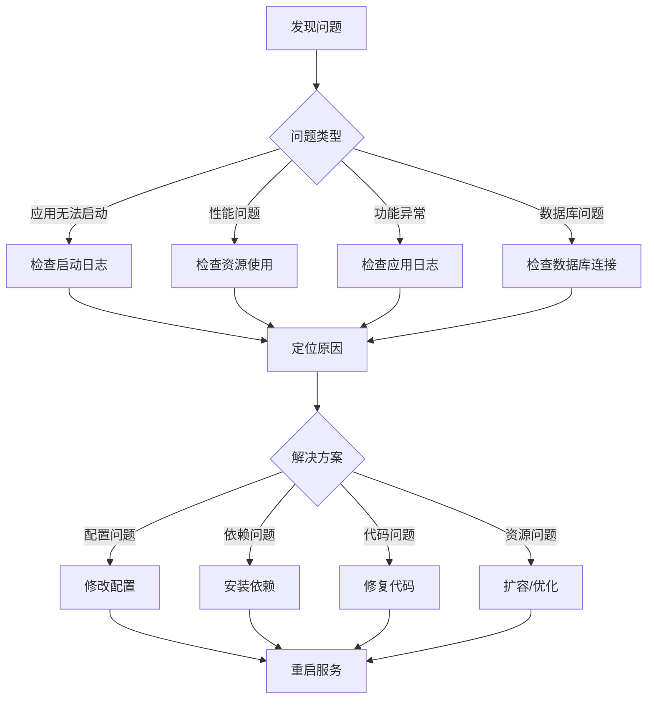

# 故障排查指南

本文档提供 Py Small Admin 常见问题的诊断和解决方法。

## 故障排查流程



## 应用启动问题

### 1. 端口被占用

**症状**：启动失败，日志显示 "Address already in use"

```bash
# 检查端口占用
sudo netstat -tulpn | grep :8000
sudo ss -tulpn | grep :8000
sudo lsof -i :8000

# 查找占用进程
sudo fuser 8000/tcp

# 终止进程
sudo kill -9 <PID>

# 或修改配置使用其他端口
```

### 2. 权限问题

**症状**：无法写入日志、无法上传文件

```bash
# 检查文件权限
ls -la /opt/py-small-admin/server/
ls -la /opt/py-small-admin/server/logs/
ls -la /opt/py-small-admin/server/uploads/

# 修改所有者
sudo chown -R www-data:www-data /opt/py-small-admin/server/

# 修改权限
sudo chmod -R 755 /opt/py-small-admin/server/
sudo chmod -R 775 /opt/py-small-admin/server/uploads/
sudo chmod -R 775 /opt/py-small-admin/server/logs/
```

### 3. 依赖缺失

**症状**：ImportError 或 ModuleNotFoundError

```bash
# 检查 Python 环境
which python3
python3 --version

# 激活虚拟环境
source /opt/py-small-admin/server/venv/bin/activate

# 检查已安装包
pip list

# 重新安装依赖
pip install --upgrade pip
pip install -r requirements.txt

# 验证关键依赖
python3 -c "import fastapi; print(fastapi.__version__)"
python3 -c "import sqlalchemy; print(sqlalchemy.__version__)"
python3 -c "import redis; print(redis.__version__)"
```

### 4. 配置文件错误

**症状**：启动失败，日志显示配置相关错误

```bash
# 检查环境变量文件
cat .env | grep -v '^#' | grep -v '^$'

# 验证配置语法
python3 -c "import os; from dotenv import load_dotenv; load_dotenv(); print(os.getenv('APP_DEBUG'))"

# 检查必需配置
echo "Database: $DB_DEFAULT"
echo "Redis: $REDIS_DEFAULT"
echo "API Key: $APP_ADMIN_X_API_KEY"

# 测试数据库连接
python3 <<EOF
from sqlalchemy import create_engine
engine = create_engine("$DB_DEFAULT")
conn = engine.connect()
print("Database connection successful")
conn.close()
EOF
```

## 性能问题

### 1. 响应慢

**诊断步骤**：

```bash
# 检查 CPU 使用
top -p $(pgrep -f "py-small-admin")
htop

# 检查内存使用
free -h
ps aux | grep python3 | awk '{print $6}' | awk '{sum+=$1} END {print sum/1024 " MB"}'

# 检查数据库连接
mysql -u root -p -e "SHOW PROCESSLIST;"

# 检查慢查询
mysql -u root -p -e "SELECT * FROM mysql.slow_log ORDER BY query_time DESC LIMIT 10;"

# 检查 Redis 连接
redis-cli INFO stats
redis-cli INFO clients
```

**解决方案**：

```python
# 1. 启用数据库连接池
engine = create_engine(
    DATABASE_URL,
    pool_size=20,
    max_overflow=40,
    pool_pre_ping=True
)

# 2. 启用 Redis 缓存
import redis
redis_client = redis.Redis(connection_pool=redis.ConnectionPool(
    host='localhost',
    port=6379,
    max_connections=50
))

# 3. 优化查询
# 使用索引
# 避免 N+1 查询
# 使用 select_related/prefetch_loaded
```

### 2. 内存泄漏

**诊断**：

```bash
# 监控内存使用
watch -n 1 'ps aux | grep python3 | awk "{sum+=\$6} END {print sum/1024}"'

# 使用 memory_profiler
pip install memory_profiler
python3 -m memory_profiler your_script.py

# 使用 tracemalloc
python3 -c "
import tracemalloc
tracemalloc.start()
# ... your code ...
snapshot = tracemalloc.take_snapshot()
top_stats = snapshot.statistics('lineno')
for stat in top_stats[:10]:
    print(stat)
"
```

### 3. CPU 高负载

**诊断**：

```bash
# 生成 CPU profile
python3 -m cProfile -o profile.stats your_script.py

# 分析 profile
python3 -c "
import pstats
p = pstats.Stats('profile.stats')
p.sort_stats('cumulative')
p.print_stats(20)
"

# 使用 py-spy
pip install py-spy
sudo py-spy top --pid $(pgrep -f "py-small-admin")
sudo py-spy record --pid $(pgrep -f "py-small-admin") -o profile.svg --duration 30
```

## 数据库问题

### 1. 连接失败

**诊断**：

```bash
# 测试连接
mysql -u py_admin -p -h localhost py_small_admin

# 检查 MySQL 状态
sudo systemctl status mysql

# 检查错误日志
sudo tail -f /var/log/mysql/error.log

# 检查连接数
mysql -u root -p -e "SHOW STATUS LIKE 'Threads_connected';"
mysql -u root -p -e "SHOW VARIABLES LIKE 'max_connections';"
```

**解决方案**：

```bash
# 增加连接数
mysql -u root -p -e "SET GLOBAL max_connections = 500;"

# 修改配置文件
sudo vim /etc/mysql/mysql.conf.d/mysqld.cnf
# 添加: max_connections = 500

# 重启 MySQL
sudo systemctl restart mysql
```

### 2. 查询慢

**诊断**：

```bash
# 启用慢查询日志
mysql -u root -p -e "
SET GLOBAL slow_query_log = 'ON';
SET GLOBAL long_query_time = 2;
SET GLOBAL log_queries_not_using_indexes = 'ON';
"

# 分析慢查询
mysqldumpslow -s t -t 10 /var/log/mysql/slow-query.log

# 使用 EXPLAIN
mysql -u py_admin -p py_small_admin -e "EXPLAIN SELECT * FROM admin_user WHERE username = 'admin';"
```

**解决方案**：

```sql
-- 添加索引
CREATE INDEX idx_username ON admin_user(username);

-- 优化查询
-- 只选择需要的列
-- 使用 LIMIT
-- 避免 SELECT *
```

### 3. 锁表

**诊断**：

```bash
# 查看锁
mysql -u root -p -e "SHOW OPEN TABLES WHERE In_use > 0;"

# 查看事务
mysql -u root -p -e "SELECT * FROM information_schema.INNODB_TRX;"

# 查看锁等待
mysql -u root -p -e "SELECT * FROM information_schema.INNODB_LOCKS;"

# 查看锁等待来源
mysql -u root -p -e "SELECT * FROM information_schema.INNODB_LOCK_WAITS;"
```

**解决方案**：

```bash
# 终止长时间运行的事务
mysql -u root -p -e "KILL <trx_mysql_thread_id>;"

# 减少事务时间
-- 避免在事务中进行耗时操作
-- 尽早提交事务
```

## Redis 问题

### 1. 连接失败

**诊断**：

```bash
# 测试连接
redis-cli ping

# 检查 Redis 状态
sudo systemctl status redis

# 检查配置
redis-cli CONFIG GET bind
redis-cli CONFIG GET port

# 查看日志
sudo tail -f /var/log/redis/redis-server.log
```

**解决方案**：

```bash
# 启动 Redis
sudo systemctl start redis

# 修改绑定地址
sudo vim /etc/redis/redis.conf
# 修改: bind 0.0.0.0

# 设置密码
sudo vim /etc/redis/redis.conf
# 修改: requirepass yourpassword
```

### 2. 内存不足

**诊断**：

```bash
# 查看内存使用
redis-cli INFO memory

# 查看最大内存
redis-cli CONFIG GET maxmemory

# 查看策略
redis-cli CONFIG GET maxmemory-policy
```

**解决方案**：

```bash
# 设置最大内存
redis-cli CONFIG SET maxmemory 1gb

# 设置淘汰策略
redis-cli CONFIG SET maxmemory-policy allkeys-lru

# 在配置文件中持久化
sudo vim /etc/redis/redis.conf
# maxmemory 1gb
# maxmemory-policy allkeys-lru
```

### 3. 连接数过多

**诊断**：

```bash
# 查看客户端连接
redis-cli CLIENT LIST

# 查看连接数
redis-cli INFO clients
```

**解决方案**：

```bash
# 设置最大连接数
redis-cli CONFIG SET maxclients 10000

# 在配置文件中持久化
sudo vim /etc/redis/redis.conf
# maxclients 10000
```

## Celery 问题

### 1. Worker 不启动

**诊断**：

```bash
# 查看 Celery 日志
sudo journalctl -u py-small-admin-celery -n 50

# 检查 broker 连接
redis-cli -a yourpassword PING

# 手动启动测试
celery -A Modules.common.libs.celery.celery_service.celery worker --loglevel=info
```

**解决方案**：

```bash
# 检查环境变量
cat .env | grep CELERY_BROKER_URL

# 修复 broker URL
# 确保 redis://localhost:6379/1 格式正确

# 重启服务
sudo systemctl restart py-small-admin-celery
```

### 2. 任务不执行

**诊断**：

```bash
# 检查队列
redis-cli -a yourpassword LLEN celery

# 检查 worker 状态
celery -A Modules.common.libs.celery.celery_service.celery inspect active

# 检查注册任务
celery -A Modules.common.libs.celery.celery_service.celery inspect registered
```

**解决方案**：

```python
# 确保任务注册
@celery.task(name='modules.admin.tasks.send_email')
def send_email(to, subject, body):
    pass

# 检查任务路由配置
# 确保任务发送到正确的队列
result = send_email.apply_async(args=['user@example.com', 'Test', 'Body'])
```

### 3. 任务卡住

**诊断**：

```bash
# 查看活动任务
celery -A Modules.common.libs.celery.celery_service.celery inspect active

# 查看 Flower
# 访问 http://localhost:5555
```

**解决方案**：

```python
# 设置任务超时
@celery.task(bind=True, time_limit=300)
def long_running_task(self):
    pass

# 终止卡住的任务
from Modules.common.libs.celery.celery_service import celery
app.control.revoke(task_id, terminate=True)
```

## Nginx 问题

### 1. 502 Bad Gateway

**诊断**：

```bash
# 检查后端服务
sudo systemctl status py-small-admin

# 检查端口监听
sudo netstat -tulpn | grep :8000

# 查看 Nginx 错误日志
sudo tail -f /var/log/nginx/error.log
```

**解决方案**：

```bash
# 启动后端服务
sudo systemctl start py-small-admin

# 检查 upstream 配置
sudo vim /etc/nginx/sites-available/py-small-admin
# 确保 upstream 地址正确
```

### 2. 504 Gateway Timeout

**诊断**：

```bash
# 查看超时配置
sudo grep timeout /etc/nginx/sites-available/py-small-admin
```

**解决方案**：

```nginx
# 增加 proxy 超时时间
location /api {
    proxy_pass http://fastapi_backend;
    proxy_connect_timeout 300s;
    proxy_send_timeout 300s;
    proxy_read_timeout 300s;
}
```

### 3. 静态文件 404

**诊断**：

```bash
# 检查文件路径
ls -la /opt/py-small-admin/admin-web/dist/

# 检查 Nginx 配置
sudo grep root /etc/nginx/sites-available/py-small-admin

# 检查权限
namei -l /opt/py-small-admin/admin-web/dist/index.html
```

**解决方案**：

```bash
# 修正路径
sudo vim /etc/nginx/sites-available/py-small-admin
# 确保 root 指向正确路径

# 修正权限
sudo chmod -R 755 /opt/py-small-admin/admin-web/dist/
sudo chown -R www-data:www-data /opt/py-small-admin/admin-web/dist/
```

## Docker 问题

### 1. 容器无法启动

**诊断**：

```bash
# 查看容器日志
docker-compose logs fastapi
docker logs py-small-admin-fastapi

# 查看容器状态
docker-compose ps
docker inspect py-small-admin-fastapi
```

**解决方案**：

```bash
# 重新构建
docker-compose build --no-cache fastapi

# 删除旧容器
docker-compose down
docker-compose up -d
```

### 2. 容器无法访问外部服务

**诊断**：

```bash
# 测试网络连接
docker-compose exec fastapi ping mysql
docker-compose exec fastapi ping redis

# 查看网络配置
docker network ls
docker network inspect py-small-admin_default
```

**解决方案**：

```yaml
# 确保在同一网络
services:
  fastapi:
    networks:
      - backend

  mysql:
    networks:
      - backend

networks:
  backend:
    driver: bridge
```

### 3. 镜像构建失败

**诊断**：

```bash
# 查看构建日志
docker-compose build --no-cache

# 清理缓存
docker system prune -a
```

**解决方案**：

```dockerfile
# 优化 Dockerfile
FROM python:3.11-slim

WORKDIR /app

# 先复制依赖文件，利用缓存
COPY requirements.txt .
RUN pip install --no-cache-dir -r requirements.txt

# 再复制应用代码
COPY . .
```

## 日志分析

### 1. 查看日志

```bash
# 应用日志
sudo journalctl -u py-small-admin -f
tail -f /opt/py-small-admin/server/logs/app.log

# Celery 日志
sudo journalctl -u py-small-admin-celery -f
tail -f /opt/py-small-admin/server/logs/celery-worker.log

# Nginx 日志
sudo tail -f /var/log/nginx/access.log
sudo tail -f /var/log/nginx/error.log

# MySQL 日志
sudo tail -f /var/log/mysql/error.log

# Redis 日志
sudo tail -f /var/log/redis/redis-server.log
```

### 2. 搜索错误

```bash
# 搜索错误日志
grep -i error /opt/py-small-admin/server/logs/app.log
grep -i exception /opt/py-small-admin/server/logs/app.log

# 搜索特定时间范围
awk '/2024-01-01 10:00/,/2024-01-01 11:00/' /opt/py-small-admin/server/logs/app.log

# 统计错误类型
grep ERROR /opt/py-small-admin/server/logs/app.log | awk '{print $5}' | sort | uniq -c
```

## 常用调试工具

### 1. Python 调试

```python
# 使用 pdb
import pdb; pdb.set_trace()

# 使用 ipdb（更友好）
pip install ipdb
import ipdb; ipdb.set_trace()

# 在 FastAPI 中
@app.get("/debug")
async def debug_endpoint():
    import ipdb; ipdb.set_trace()
    return {"message": "debug"}
```

### 2. SQL 调试

```python
# 打印 SQL
import logging
logging.basicConfig()
logging.getLogger('sqlalchemy.engine').setLevel(logging.INFO)

# 使用 echo
engine = create_engine(DATABASE_URL, echo=True)
```

### 3. 请求调试

```python
# 添加请求日志中间件
@app.middleware("http")
async def debug_request(request: Request, call_next):
    print(f"Request: {request.method} {request.url}")
    print(f"Headers: {request.headers}")
    print(f"Body: {await request.body()}")
    response = await call_next(request)
    print(f"Response: {response.status_code}")
    return response
```

## 紧急恢复

### 1. 数据库恢复

```bash
# 从备份恢复
mysql -u root -p py_small_admin < backup.sql

# 或使用 docker
docker-compose exec -T mysql mysql -u root -p py_small_admin < backup.sql
```

### 2. 回滚代码

```bash
# 查看提交历史
git log --oneline

# 回滚到指定版本
git reset --hard <commit_hash>

# 或回滚到上一个版本
git reset --hard HEAD~1

# 重新部署
sudo systemctl restart py-small-admin
```

### 3. 切换到备用服务器

```bash
# 更新 DNS
# 或修改 Nginx upstream

sudo vim /etc/nginx/sites-available/py-small-admin
# 修改 upstream 地址指向备用服务器

sudo systemctl reload nginx
```

## 预防措施

1. **监控告警**：配置完善的监控和告警系统
2. **日志记录**：记录详细的日志便于排查
3. **备份策略**：定期备份数据库和配置
4. **高可用**：配置主从、集群等高可用方案
5. **文档记录**：记录常见问题和解决方案
6. **演练**：定期进行故障演练
