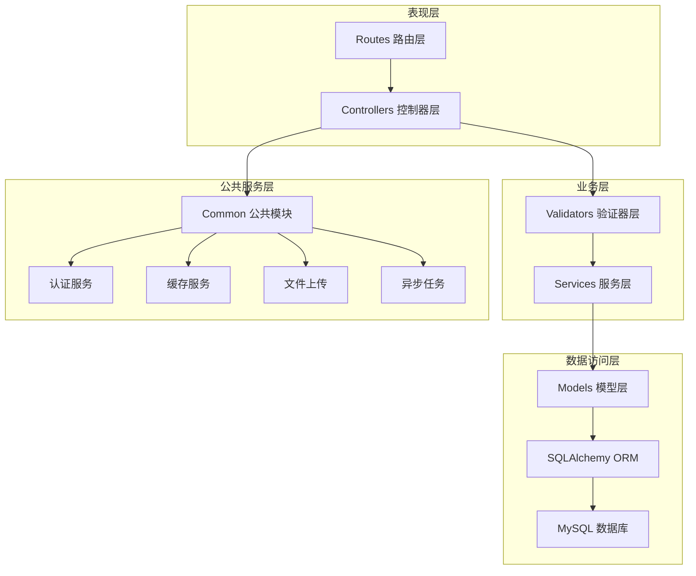
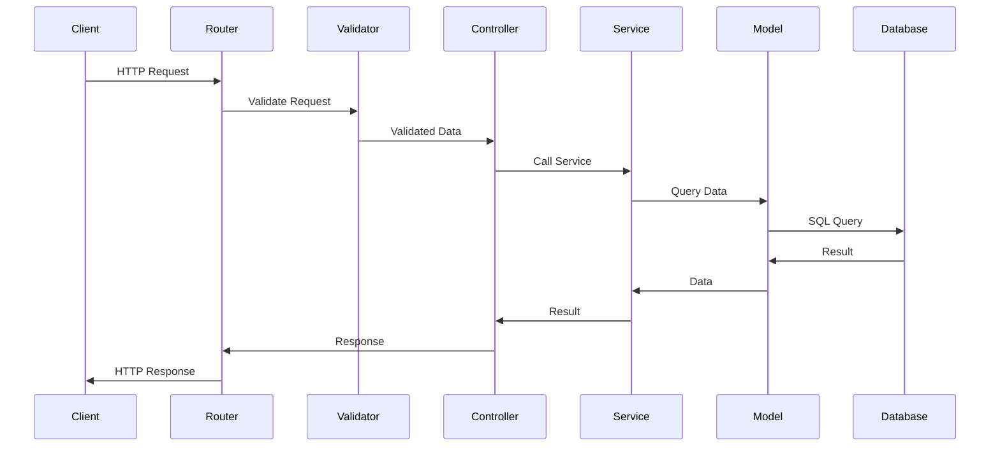
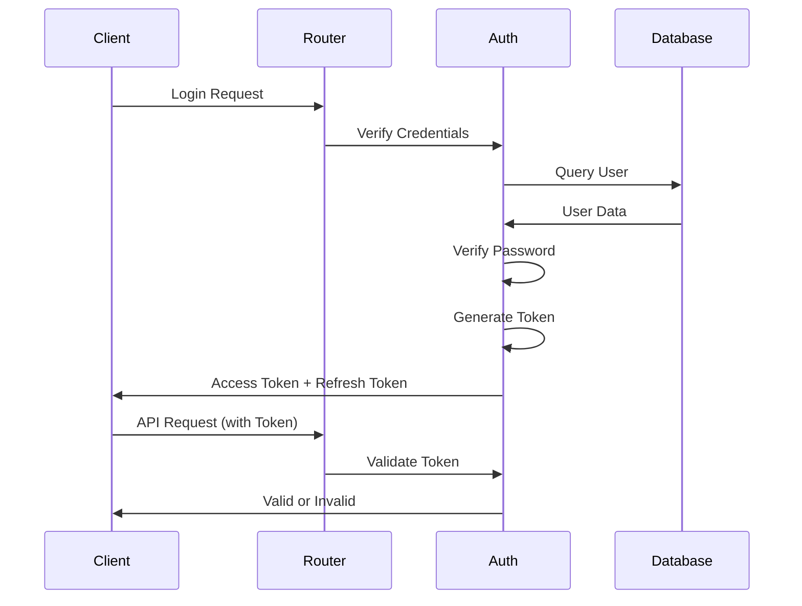

# 后端架构设计

本文档详细介绍了 Py Small Admin 后端系统的架构设计。

## 整体架构

### 分层架构

Py Small Admin 采用经典的分层架构：



### 各层职责

#### 1. Routes 路由层

**职责**：
- 定义 API 路由
- 组织控制器
- 配置中间件
- 处理请求分发

**示例**：
```python
from fastapi import APIRouter
from Modules.admin.controllers.admin_controller import admin_controller

router = APIRouter(prefix="/admin", tags=["管理员"])

router.include_router(admin_controller.router, prefix="/admin", tags=["管理员"])
```

#### 2. Controllers 控制器层

**职责**：
- 处理 HTTP 请求
- 参数验证
- 调用服务层
- 返回响应

**示例**：
```python
from fastapi import Depends, HTTPException
from Modules.admin.services.admin_service import admin_service
from Modules.admin.validators.admin_validator import AdminCreateValidator

async def create_admin(
    data: AdminCreateValidator,
    admin_id: int = Depends(get_current_admin_id)
):
    return await admin_service.create_admin(data)
```

#### 3. Validators 验证器层

**职责**：
- 请求参数验证
- 数据格式检查
- 业务规则验证
- 响应数据格式化

**示例**：
```python
from pydantic import BaseModel, Field
from typing import Optional

class AdminCreateValidator(BaseModel):
    name: str = Field(..., min_length=1, max_length=50)
    username: str = Field(..., min_length=3, max_length=20)
    password: str = Field(..., min_length=6, max_length=20)
    group_id: Optional[int] = None
```

#### 4. Services 服务层

**职责**：
- 业务逻辑处理
- 数据库操作
- 缓存管理
- 事务管理

**示例**：
```python
from sqlmodel import Session
from Modules.common.libs.database.sql import get_session
from Modules.admin.models.admin_admin import AdminAdmin

async def create_admin(data: AdminCreateValidator):
    with Session(get_session()) as session:
        admin = AdminAdmin(**data.dict())
        session.add(admin)
        session.commit()
        session.refresh(admin)
        return admin
```

#### 5. Models 模型层

**职责**：
- 定义数据表结构
- 定义字段类型和约束
- 定义表关系
- 自动生成迁移

**示例**：
```python
from sqlmodel import SQLModel, Field, Relationship
from typing import Optional, TYPE_CHECKING

if TYPE_CHECKING:
    from Modules.admin.models.admin_group import AdminGroup

class AdminAdmin(SQLModel, table=True):
    __tablename__ = "fa_admin_admins"

    id: Optional[int] = Field(default=None, primary_key=True)
    name: str = Field(max_length=50)
    username: str = Field(max_length=20, unique=True)
    password: str = Field(max_length=255)
    group_id: Optional[int] = Field(default=None, foreign_key="fa_admin_groups.id")

    group: Optional["AdminGroup"] = Relationship(back_populates="admins")
```

## 模块化设计

### 模块划分

```
server/Modules/
├── admin/          # Admin 管理模块
│   ├── controllers/
│   ├── models/
│   ├── routes/
│   ├── services/
│   ├── validators/
│   ├── migrations/
│   ├── seeds/
│   ├── tasks/
│   └── queues/
├── quant/          # Quant 量化模块
│   └── ...
└── common/         # 公共模块
    ├── libs/
    └── services/
```

### 模块职责

#### Admin 模块

- 用户认证与授权
- 管理员管理
- 角色管理
- 菜单管理
- 系统配置
- 文件上传

#### Quant 模块

- 股票数据管理
- 行业数据管理
- 概念数据管理
- K线数据管理
- 数据同步

#### Common 公共模块

- 配置管理
- 数据库管理
- 认证服务
- 缓存服务
- 文件上传
- 异步任务
- 日志系统
- 异常处理

## 核心组件

### 1. 配置管理

使用 Pydantic Settings 实现类型安全的配置管理：

```python
from pydantic_settings import BaseSettings

class Config(BaseSettings):
    app_name: str = "Py Small Admin"
    app_debug: bool = True
    app_port: int = 8000

    class Config:
        env_prefix = "APP_"
        env_file = ".env"
```

### 2. 数据库管理

使用 SQLModel + SQLAlchemy 实现数据库操作：

```python
from sqlalchemy import create_engine
from sqlmodel import Session, SQLModel

engine = create_engine(DATABASE_URL)

def get_session():
    with Session(engine) as session:
        yield session
```

### 3. 认证授权

使用 JWT 实现无状态认证：

```python
from fastapi import Depends, HTTPException
from fastapi.security import HTTPBearer, HTTPAuthorizationCredentials

security = HTTPBearer()

async def get_current_admin(
    credentials: HTTPAuthorizationCredentials = Depends(security)
):
    token = credentials.credentials
    payload = decode_jwt(token)
    return payload
```

### 4. 缓存管理

使用 Redis 实现缓存：

```python
from redis import Redis

redis = Redis.from_url(REDIS_URL)

async def cache_get(key: str):
    return await redis.get(key)

async def cache_set(key: str, value: str, ttl: int = 3600):
    await redis.setex(key, ttl, value)
```

### 5. 异步任务

使用 Celery 实现异步任务：

```python
from celery import Celery

celery = Celery('tasks', broker=CELERY_BROKER_URL)

@celery.task
def send_email(to: str, subject: str, body: str):
    # 发送邮件逻辑
    pass
```

## 设计原则

### 1. 单一职责原则

每个模块、每个类只负责一个功能。

### 2. 依赖倒置原则

高层模块不依赖低层模块，都依赖于抽象。

### 3. 开放封闭原则

对扩展开放，对修改封闭。

### 4. 接口隔离原则

不应该依赖不需要的接口。

### 5. 迪米特法则

最少知识原则，降低耦合度。

## 数据流

### 请求流程



### 认证流程



## 扩展性设计

### 1. 中间件机制

```python
from fastapi import Request

@app.middleware("http")
async def logging_middleware(request: Request, call_next):
    logger.info(f"Request: {request.method} {request.url}")
    response = await call_next(request)
    return response
```

### 2. 插件机制

通过依赖注入实现插件化：

```python
from fastapi import Depends

def get_upload_service():
    # 根据配置返回不同的存储服务
    storage_type = Config.get("upload.storage_type")
    if storage_type == "local":
        return LocalStorage()
    elif storage_type == "aliyun_oss":
        return AliyunOSS()
```

### 3. 事件机制

```python
from fastapi import FastAPI

@app.on_event("startup")
async def startup_event():
    # 应用启动时执行
    pass

@app.on_event("shutdown")
async def shutdown_event():
    # 应用关闭时执行
    pass
```

## 性能优化

### 1. 异步编程

全异步 I/O，提高并发性能：

```python
import asyncio

async def fetch_data():
    return await async_fetch()
```

### 2. 连接池

数据库和 Redis 使用连接池：

```python
engine = create_engine(
    DATABASE_URL,
    pool_size=10,
    max_overflow=20
)
```

### 3. 缓存策略

热点数据缓存，减少数据库查询：

```python
@lru_cache(maxsize=100)
def get_config(key: str):
    return db.query(Config).filter_by(key=key).first()
```

### 4. 分页查询

大数据量使用分页：

```python
async def get_users(page: int = 1, size: int = 10):
    offset = (page - 1) * size
    return db.query(User).offset(offset).limit(size).all()
```

## 安全设计

### 1. 认证安全

- JWT 双令牌机制
- 密码 Bcrypt 加密
- 登录限流

### 2. 数据安全

- SQL 注入防护（ORM 自动）
- XSS 防护
- CSRF 防护
- 数据加密

### 3. API 安全

- API Key 验证
- 权限控制
- 请求限流
- HTTPS 强制

## 监控与日志

### 日志系统

使用 Loguru 实现结构化日志：

```python
from loguru import logger

logger.add("logs/app_{time}.log", rotation="500 MB")

logger.info("Info message")
logger.error("Error message")
```

### 监控

- Celery 任务监控（Flower）
- 性能监控（APM）
- 错误追踪（Sentry）

## 总结

Py Small Admin 的后端架构设计遵循现代 Web 应用的最佳实践，具有良好的可扩展性、可维护性和性能表现。
