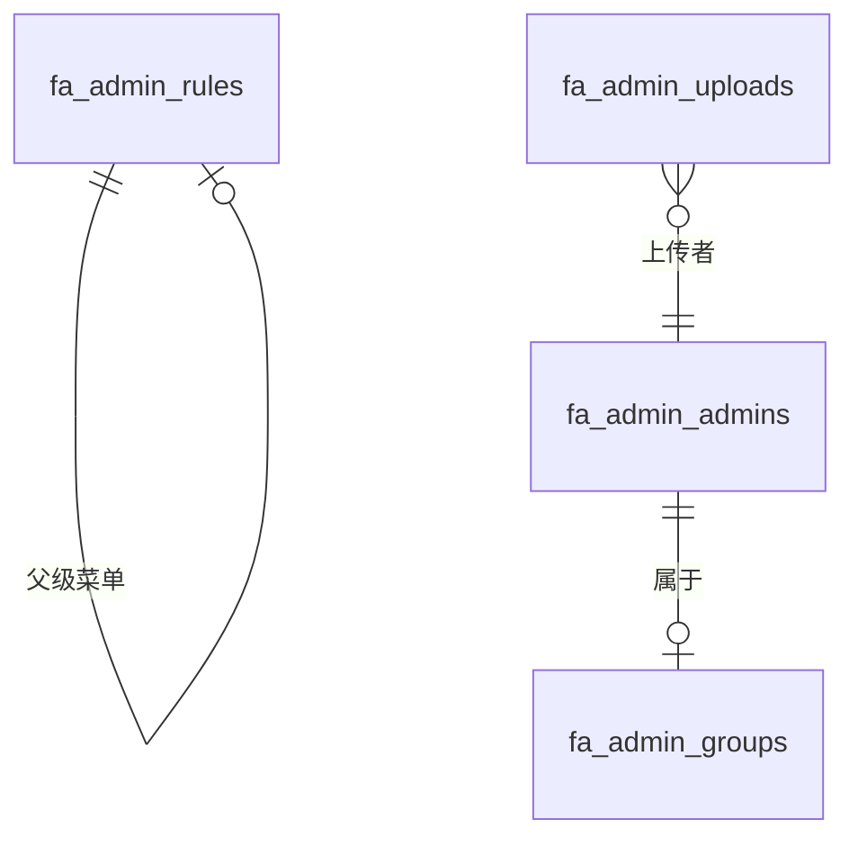

# Admin 模块表结构

本文档详细介绍了 Admin 模块的数据库表结构。

## 表概览

Admin 模块包含 5 张数据表：

| 表名 | 说明 | 关键字段 |
|------|------|----------|
| `fa_admin_admins` | 管理员表 | id, username, password, group_id |
| `fa_admin_groups` | 角色组表 | id, name, rules, status |
| `fa_admin_rules` | 菜单规则表 | id, path, type, pid, status |
| `fa_admin_sys_configs` | 系统配置表 | config_key, config_value, group_code |
| `fa_admin_uploads` | 文件上传表 | original_name, file_path, storage_type |

## fa_admin_admins - 管理员表

存储系统管理员信息。

### 表结构

| 字段名 | 类型 | 允许 NULL | 默认值 | 说明 |
|--------|------|----------|--------|------|
| id | INT | NO | AUTO_INCREMENT | 主键 ID |
| name | VARCHAR(100) | NO | '' | 管理员姓名 |
| phone | VARCHAR(20) | YES | NULL | 手机号 |
| username | VARCHAR(50) | NO | - | 账号（唯一） |
| password | VARCHAR(255) | NO | - | 密码（加密存储） |
| status | TINYINT | NO | 1 | 状态（0=禁用，1=启用） |
| group_id | INT | YES | NULL | 所属角色组 ID |
| created_at | TIMESTAMP | NO | CURRENT_TIMESTAMP | 创建时间 |
| updated_at | TIMESTAMP | NO | CURRENT_TIMESTAMP | 更新时间 |
| deleted_at | TIMESTAMP | YES | NULL | 软删除时间 |

### 索引

| 索引名 | 字段 | 类型 |
|--------|------|------|
| PRIMARY | id | PRIMARY |
| idx_admin_admins_username | username | UNIQUE |

### 外键

| 外键名 | 本字段 | 关联表 | 关联字段 |
|--------|--------|--------|----------|
| fk_admin_admins_group_id | group_id | fa_admin_groups | id |

### 状态说明

| 值 | 说明 |
|----|------|
| 0 | 禁用 |
| 1 | 启用 |

## fa_admin_groups - 角色组表

存储角色配置和权限规则。

### 表结构

| 字段名 | 类型 | 允许 NULL | 默认值 | 说明 |
|--------|------|----------|--------|------|
| id | INT | NO | AUTO_INCREMENT | 主键 ID |
| name | VARCHAR(100) | NO | - | 角色名称（唯一） |
| content | VARCHAR(255) | YES | NULL | 角色描述 |
| status | TINYINT | NO | 1 | 状态（0=禁用，1=启用） |
| rules | TEXT | YES | NULL | 菜单规则（用 | 分隔） |
| created_at | TIMESTAMP | NO | CURRENT_TIMESTAMP | 创建时间 |
| updated_at | TIMESTAMP | NO | CURRENT_TIMESTAMP | 更新时间 |
| deleted_at | TIMESTAMP | YES | NULL | 软删除时间 |

### 索引

| 索引名 | 字段 | 类型 |
|--------|------|------|
| PRIMARY | id | PRIMARY |
| idx_admin_groups_name | name | UNIQUE |

### 字段说明

**rules 字段**：存储菜单规则的 ID，用 `|` 分隔。

示例：`1,2,3,4,5`

## fa_admin_rules - 菜单规则表

存储系统菜单和权限规则。

### 表结构

| 字段名 | 类型 | 允许 NULL | 默认值 | 说明 |
|--------|------|----------|--------|------|
| id | INT | NO | AUTO_INCREMENT | 主键 ID |
| path | VARCHAR(255) | YES | NULL | 路由路径 |
| component | VARCHAR(255) | YES | NULL | 组件路径 |
| redirect | VARCHAR(255) | YES | NULL | 重定向路径 |
| name | VARCHAR(50) | NO | - | 菜单名称 |
| type | TINYINT | NO | 1 | 菜单类型 |
| status | TINYINT | NO | 1 | 侧边栏显示状态 |
| level | INT | NO | 0 | 级别 |
| icon | VARCHAR(50) | YES | NULL | 图标 |
| pid | INT | NO | 0 | 父级 ID |
| sort | INT | NO | 0 | 排序 |
| target | VARCHAR(20) | NO | '_self' | 链接打开方式 |
| created_at | TIMESTAMP | NO | CURRENT_TIMESTAMP | 创建时间 |
| updated_at | TIMESTAMP | NO | CURRENT_TIMESTAMP | 更新时间 |
| deleted_at | TIMESTAMP | YES | NULL | 软删除时间 |

### 索引

| 索引名 | 字段 | 类型 |
|--------|------|------|
| PRIMARY | id | PRIMARY |
| idx_admin_rules_pid | pid | INDEX |

### 字段说明

**type 字段**：菜单类型。

| 值 | 说明 |
|----|------|
| 1 | 模块 |
| 2 | 目录 |
| 3 | 菜单 |

**status 字段**：侧边栏显示状态。

| 值 | 说明 |
|----|------|
| 0 | 隐藏 |
| 1 | 显示 |

**level 字段**：菜单级别，从 0 开始计数。

**target 字段**：链接打开方式。

| 值 | 说明 |
|----|------|
| _self | 当前窗口打开 |
| _blank | 新窗口打开 |

## fa_admin_sys_configs - 系统配置表

存储系统配置参数。

### 表结构

| 字段名 | 类型 | 允许 NULL | 默认值 | 说明 |
|--------|------|----------|--------|------|
| id | INT | NO | AUTO_INCREMENT | 主键 ID |
| config_key | VARCHAR(100) | NO | - | 配置键（唯一） |
| config_value | TEXT | YES | NULL | 配置值 |
| value_type | VARCHAR(20) | NO | 'string' | 值类型 |
| description | VARCHAR(255) | YES | NULL | 配置说明 |
| group_code | VARCHAR(50) | NO | 'basic' | 配置分组 |
| created_at | TIMESTAMP | NO | CURRENT_TIMESTAMP | 创建时间 |
| updated_at | TIMESTAMP | NO | CURRENT_TIMESTAMP | 更新时间 |
| deleted_at | TIMESTAMP | YES | NULL | 软删除时间 |

### 索引

| 索引名 | 字段 | 类型 |
|--------|------|------|
| PRIMARY | id | PRIMARY |
| idx_admin_sys_configs_config_key | config_key | UNIQUE |

### 字段说明

**value_type 字段**：值类型。

| 值 | 说明 |
|----|------|
| string | 字符串 |
| int | 整数 |
| bool | 布尔值 |
| json | JSON 格式 |

**group_code 字段**：配置分组。

| 值 | 说明 |
|----|------|
| basic | 基础配置 |
| email | 邮件配置 |
| upload | 上传配置 |

## fa_admin_uploads - 文件上传表

存储上传文件的信息。

### 表结构

| 字段名 | 类型 | 允许 NULL | 默认值 | 说明 |
|--------|------|----------|--------|------|
| id | INT | NO | AUTO_INCREMENT | 主键 ID |
| original_name | VARCHAR(255) | NO | - | 原始文件名 |
| filename | VARCHAR(255) | NO | - | 存储文件名 |
| file_path | VARCHAR(500) | NO | - | 文件存储路径 |
| file_size | BIGINT | NO | 0 | 文件大小（字节） |
| mime_type | VARCHAR(100) | NO | - | MIME 类型 |
| file_ext | VARCHAR(20) | NO | - | 文件扩展名 |
| file_hash | VARCHAR(64) | NO | - | 文件哈希值（SHA256） |
| storage_type | VARCHAR(20) | NO | 'local' | 存储类型 |
| file_type | VARCHAR(20) | NO | - | 文件分类 |
| admin_id | INT | YES | NULL | 上传者 ID |
| width | INT | YES | NULL | 图片宽度（像素） |
| height | INT | YES | NULL | 图片高度（像素） |
| duration | INT | YES | NULL | 音视频时长（秒） |
| thumbnail_filename | VARCHAR(255) | YES | NULL | 缩略图文件名 |
| thumbnail_path | VARCHAR(500) | YES | NULL | 缩略图路径 |
| extra_info | JSON | YES | NULL | 扩展信息（JSON） |
| created_at | TIMESTAMP | NO | CURRENT_TIMESTAMP | 创建时间 |

### 索引

| 索引名 | 字段 | 类型 |
|--------|------|------|
| PRIMARY | id | PRIMARY |
| idx_admin_uploads_file_hash | file_hash | INDEX |
| idx_admin_uploads_admin_id | admin_id | INDEX |
| idx_admin_uploads_created_at | created_at | INDEX |

### 外键

| 外键名 | 本字段 | 关联表 | 关联字段 |
|--------|--------|--------|----------|
| fk_admin_uploads_admin_id | admin_id | fa_admin_admins | id |

### 字段说明

**storage_type 字段**：存储类型。

| 值 | 说明 |
|----|------|
| local | 本地存储 |
| aliyun_oss | 阿里云 OSS |
| tencent_oss | 腾讯云 COS |
| qiniu_oss | 七牛云 Kodo |

**file_type 字段**：文件分类。

| 值 | 说明 |
|----|------|
| image | 图片 |
| document | 文档 |
| video | 视频 |
| audio | 音频 |
| other | 其他 |

## 表关系图



## SQL 创建脚本

```sql
-- 创建管理员表
CREATE TABLE `fa_admin_admins` (
  `id` int unsigned NOT NULL AUTO_INCREMENT COMMENT '主键 ID',
  `name` varchar(100) NOT NULL DEFAULT '' COMMENT '管理员姓名',
  `phone` varchar(20) DEFAULT NULL COMMENT '手机号',
  `username` varchar(50) NOT NULL COMMENT '账号',
  `password` varchar(255) NOT NULL COMMENT '密码',
  `status` tinyint NOT NULL DEFAULT '1' COMMENT '状态',
  `group_id` int unsigned DEFAULT NULL COMMENT '所属角色组 ID',
  `created_at` timestamp NOT NULL DEFAULT CURRENT_TIMESTAMP COMMENT '创建时间',
  `updated_at` timestamp NOT NULL DEFAULT CURRENT_TIMESTAMP ON UPDATE CURRENT_TIMESTAMP COMMENT '更新时间',
  `deleted_at` timestamp NULL DEFAULT NULL COMMENT '软删除时间',
  PRIMARY KEY (`id`),
  UNIQUE KEY `idx_admin_admins_username` (`username`),
  KEY `fk_admin_admins_group_id` (`group_id`),
  CONSTRAINT `fk_admin_admins_group_id` FOREIGN KEY (`group_id`) REFERENCES `fa_admin_groups` (`id`)
) ENGINE=InnoDB DEFAULT CHARSET=utf8mb4 COLLATE=utf8mb4_unicode_ci COMMENT='管理员表';

-- 创建角色组表
CREATE TABLE `fa_admin_groups` (
  `id` int unsigned NOT NULL AUTO_INCREMENT COMMENT '主键 ID',
  `name` varchar(100) NOT NULL COMMENT '角色名称',
  `content` varchar(255) DEFAULT NULL COMMENT '角色描述',
  `status` tinyint NOT NULL DEFAULT '1' COMMENT '状态',
  `rules` text COMMENT '菜单规则',
  `created_at` timestamp NOT NULL DEFAULT CURRENT_TIMESTAMP COMMENT '创建时间',
  `updated_at` timestamp NOT NULL DEFAULT CURRENT_TIMESTAMP ON UPDATE CURRENT_TIMESTAMP COMMENT '更新时间',
  `deleted_at` timestamp NULL DEFAULT NULL COMMENT '软删除时间',
  PRIMARY KEY (`id`),
  UNIQUE KEY `idx_admin_groups_name` (`name`)
) ENGINE=InnoDB DEFAULT CHARSET=utf8mb4 COLLATE=utf8mb4_unicode_ci COMMENT='角色组表';

-- 创建菜单规则表
CREATE TABLE `fa_admin_rules` (
  `id` int unsigned NOT NULL AUTO_INCREMENT COMMENT '主键 ID',
  `path` varchar(255) DEFAULT NULL COMMENT '路由路径',
  `component` varchar(255) DEFAULT NULL COMMENT '组件路径',
  `redirect` varchar(255) DEFAULT NULL COMMENT '重定向路径',
  `name` varchar(50) NOT NULL COMMENT '菜单名称',
  `type` tinyint NOT NULL DEFAULT '1' COMMENT '菜单类型',
  `status` tinyint NOT NULL DEFAULT '1' COMMENT '侧边栏显示状态',
  `level` int NOT NULL DEFAULT '0' COMMENT '级别',
  `icon` varchar(50) DEFAULT NULL COMMENT '图标',
  `pid` int unsigned NOT NULL DEFAULT '0' COMMENT '父级 ID',
  `sort` int NOT NULL DEFAULT '0' COMMENT '排序',
  `target` varchar(20) NOT NULL DEFAULT '_self' COMMENT '链接打开方式',
  `created_at` timestamp NOT NULL DEFAULT CURRENT_TIMESTAMP COMMENT '创建时间',
  `updated_at` timestamp NOT NULL DEFAULT CURRENT_TIMESTAMP ON UPDATE CURRENT_TIMESTAMP COMMENT '更新时间',
  `deleted_at` timestamp NULL DEFAULT NULL COMMENT '软删除时间',
  PRIMARY KEY (`id`),
  KEY `idx_admin_rules_pid` (`pid`)
) ENGINE=InnoDB DEFAULT CHARSET=utf8mb4 COLLATE=utf8mb4_unicode_ci COMMENT='菜单规则表';
```