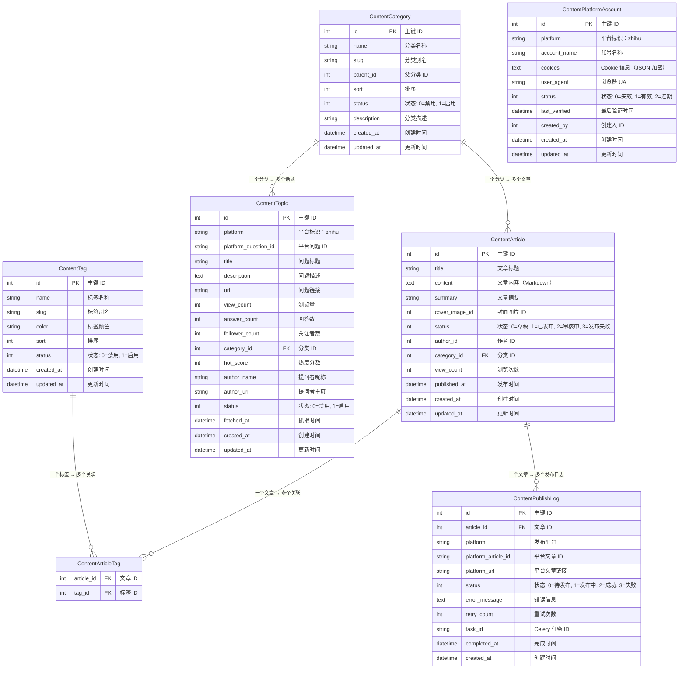

# Content 数据模型

本文档详细介绍 Content 模块的所有数据模型，包括字段说明、关系映射和索引设计。

## 目录

- [概述](#概述)
- [ER 图](#er-图)
- [数据模型](#数据模型)
  - [ContentArticle（文章）](#contentarticle文章)
  - [ContentCategory（分类）](#contentcategory分类)
  - [ContentTag（标签）](#contenttag标签)
  - [ContentTopic（话题）](#contenttopic话题)
  - [ContentPlatformAccount（平台账号）](#contentplatformaccount平台账号)
  - [ContentPublishLog（发布日志）](#contentpublishlog发布日志)
  - [ContentArticleTag（文章-标签关联）](#contentarticletag文章-标签关联)
- [关系映射](#关系映射)
- [索引设计](#索引设计)
- [数据字典](#数据字典)

## 概述

Content 模块包含以下数据模型：

| 模型                   | 表名                      | 说明            |
| ---------------------- | ------------------------- | --------------- |
| ContentArticle         | content_articles          | 文章表          |
| ContentCategory        | content_categories        | 文章分类表      |
| ContentTag             | content_tags              | 文章标签表      |
| ContentTopic           | content_topics            | 话题/问题表     |
| ContentPlatformAccount | content_platform_accounts | 平台账号表      |
| ContentPublishLog      | content_publish_logs      | 文章发布日志表  |
| ContentArticleTag      | content_article_tags      | 文章-标签关联表 |

## ER 图



## 数据模型

### ContentArticle（文章）

**表名**：`content_articles`

**说明**：存储文章信息，包括标题、内容、分类、标签等。

#### 字段说明

| 字段名         | 类型         | 必填 | 默认值 | 说明                                         |
| -------------- | ------------ | ---- | ------ | -------------------------------------------- |
| id             | INT UNSIGNED | 是   | AUTO   | 主键 ID                                      |
| title          | VARCHAR(200) | 是   | ""     | 文章标题                                     |
| content        | TEXT         | 是   | ""     | 文章内容（Markdown 格式）                    |
| summary        | VARCHAR(500) | 否   | NULL   | 文章摘要                                     |
| cover_image_id | INT UNSIGNED | 否   | NULL   | 封面图片 ID                                  |
| status         | SMALLINT     | 是   | 0      | 状态：0=草稿, 1=已发布, 2=审核中, 3=发布失败 |
| author_id      | INT UNSIGNED | 是   | 0      | 作者 ID                                      |
| category_id    | INT UNSIGNED | 否   | NULL   | 分类 ID（外键）                              |
| view_count     | INT UNSIGNED | 是   | 0      | 浏览次数                                     |
| published_at   | DATETIME     | 否   | NULL   | 发布时间                                     |
| created_at     | DATETIME     | 是   | NOW()  | 创建时间                                     |
| updated_at     | DATETIME     | 否   | NULL   | 更新时间                                     |

#### 索引

| 索引名              | 字段                | 类型    | 说明                   |
| ------------------- | ------------------- | ------- | ---------------------- |
| PRIMARY             | id                  | PRIMARY | 主键索引               |
| idx_author_status   | author_id, status   | INDEX   | 作者和状态组合索引     |
| idx_category_status | category_id, status | INDEX   | 分类和状态组合索引     |
| idx_status_created  | status, created_at  | INDEX   | 状态和创建时间组合索引 |
| idx_created_at      | created_at          | INDEX   | 创建时间索引           |
| idx_updated_at      | updated_at          | INDEX   | 更新时间索引           |

#### 关系

| 关系         | 类型   | 目标模型          | 说明                   |
| ------------ | ------ | ----------------- | ---------------------- |
| category     | 多对一 | ContentCategory   | 文章属于一个分类       |
| tags         | 多对多 | ContentTag        | 文章可以有多个标签     |
| publish_logs | 一对多 | ContentPublishLog | 文章可以有多个发布日志 |

#### 示例数据

```json
{
  "id": 1,
  "title": "如何使用 Py Small Admin",
  "content": "# Py Small Admin 使用指南\n\n本文介绍如何使用 Py Small Admin...",
  "summary": "Py Small Admin 使用指南",
  "cover_image_id": 100,
  "status": 1,
  "author_id": 1,
  "category_id": 1,
  "view_count": 1000,
  "published_at": "2024-01-01 10:00:00",
  "created_at": "2024-01-01 09:00:00",
  "updated_at": "2024-01-01 10:00:00"
}
```

### ContentCategory（分类）

**表名**：`content_categories`

**说明**：存储文章分类信息，支持多级分类。

#### 字段说明

| 字段名      | 类型         | 必填 | 默认值 | 说明                        |
| ----------- | ------------ | ---- | ------ | --------------------------- |
| id          | INT UNSIGNED | 是   | AUTO   | 主键 ID                     |
| name        | VARCHAR(50)  | 是   | ""     | 分类名称                    |
| slug        | VARCHAR(50)  | 是   | ""     | 分类别名（唯一）            |
| parent_id   | INT UNSIGNED | 是   | 0      | 父分类 ID（0 表示顶级分类） |
| sort        | INT UNSIGNED | 是   | 0      | 排序（数字越小越靠前）      |
| status      | SMALLINT     | 是   | 1      | 状态：0=禁用, 1=启用        |
| description | VARCHAR(200) | 否   | NULL   | 分类描述                    |
| created_at  | DATETIME     | 是   | NOW()  | 创建时间                    |
| updated_at  | DATETIME     | 否   | NULL   | 更新时间                    |

#### 索引

| 索引名         | 字段       | 类型    | 说明             |
| -------------- | ---------- | ------- | ---------------- |
| PRIMARY        | id         | PRIMARY | 主键索引         |
| uk_slug        | slug       | UNIQUE  | 分类别名唯一索引 |
| idx_parent_id  | parent_id  | INDEX   | 父分类 ID 索引   |
| idx_status     | status     | INDEX   | 状态索引         |
| idx_created_at | created_at | INDEX   | 创建时间索引     |
| idx_updated_at | updated_at | INDEX   | 更新时间索引     |

#### 关系

| 关系     | 类型   | 目标模型       | 说明                   |
| -------- | ------ | -------------- | ---------------------- |
| articles | 一对多 | ContentArticle | 一个分类可以有多个文章 |
| topics   | 一对多 | ContentTopic   | 一个分类可以有多个话题 |

#### 示例数据

```json
{
  "id": 1,
  "name": "技术教程",
  "slug": "tech-tutorial",
  "parent_id": 0,
  "sort": 1,
  "status": 1,
  "description": "技术教程分类",
  "created_at": "2024-01-01 00:00:00",
  "updated_at": "2024-01-01 00:00:00"
}
```

### ContentTag（标签）

**表名**：`content_tags`

**说明**：存储文章标签信息，用于文章分类和检索。

#### 字段说明

| 字段名     | 类型         | 必填 | 默认值 | 说明                    |
| ---------- | ------------ | ---- | ------ | ----------------------- |
| id         | INT UNSIGNED | 是   | AUTO   | 主键 ID                 |
| name       | VARCHAR(30)  | 是   | ""     | 标签名称（唯一）        |
| slug       | VARCHAR(30)  | 是   | ""     | 标签别名（唯一）        |
| color      | VARCHAR(7)   | 否   | NULL   | 标签颜色（如：#ff0000） |
| sort       | INT UNSIGNED | 是   | 0      | 排序（数字越小越靠前）  |
| status     | SMALLINT     | 是   | 1      | 状态：0=禁用, 1=启用    |
| created_at | DATETIME     | 是   | NOW()  | 创建时间                |
| updated_at | DATETIME     | 否   | NULL   | 更新时间                |

#### 索引

| 索引名         | 字段       | 类型    | 说明             |
| -------------- | ---------- | ------- | ---------------- |
| PRIMARY        | id         | PRIMARY | 主键索引         |
| uk_name        | name       | UNIQUE  | 标签名称唯一索引 |
| uk_slug        | slug       | UNIQUE  | 标签别名唯一索引 |
| idx_status     | status     | INDEX   | 状态索引         |
| idx_created_at | created_at | INDEX   | 创建时间索引     |
| idx_updated_at | updated_at | INDEX   | 更新时间索引     |

#### 关系

| 关系     | 类型   | 目标模型       | 说明                     |
| -------- | ------ | -------------- | ------------------------ |
| articles | 多对多 | ContentArticle | 一个标签可以关联多个文章 |

#### 示例数据

```json
{
  "id": 1,
  "name": "Python",
  "slug": "python",
  "color": "#306998",
  "sort": 1,
  "status": 1,
  "created_at": "2024-01-01 00:00:00",
  "updated_at": "2024-01-01 00:00:00"
}
```

### ContentTopic（话题）

**表名**：`content_topics`

**说明**：存储从第三方平台（如知乎）抓取的话题/问题信息。

#### 字段说明

| 字段名               | 类型         | 必填 | 默认值 | 说明                 |
| -------------------- | ------------ | ---- | ------ | -------------------- |
| id                   | INT UNSIGNED | 是   | AUTO   | 主键 ID              |
| platform             | VARCHAR(20)  | 是   | ""     | 平台标识：zhihu      |
| platform_question_id | VARCHAR(50)  | 是   | ""     | 平台问题 ID          |
| title                | VARCHAR(500) | 是   | ""     | 问题标题             |
| description          | TEXT         | 否   | NULL   | 问题描述             |
| url                  | VARCHAR(500) | 否   | NULL   | 问题链接             |
| view_count           | INT UNSIGNED | 是   | 0      | 浏览量               |
| answer_count         | INT UNSIGNED | 是   | 0      | 回答数               |
| follower_count       | INT UNSIGNED | 是   | 0      | 关注者数             |
| category_id          | INT UNSIGNED | 否   | NULL   | 分类 ID（外键）      |
| hot_score            | INT UNSIGNED | 否   | NULL   | 热度分数             |
| author_name          | VARCHAR(100) | 否   | NULL   | 提问者昵称           |
| author_url           | VARCHAR(200) | 否   | NULL   | 提问者主页           |
| status               | SMALLINT     | 是   | 1      | 状态：0=禁用, 1=启用 |
| fetched_at           | DATETIME     | 是   | NOW()  | 抓取时间             |
| created_at           | DATETIME     | 是   | NOW()  | 创建时间             |
| updated_at           | DATETIME     | 否   | NULL   | 更新时间             |

#### 索引

| 索引名           | 字段         | 类型    | 说明         |
| ---------------- | ------------ | ------- | ------------ |
| PRIMARY          | id           | PRIMARY | 主键索引     |
| idx_platform     | platform     | INDEX   | 平台标识索引 |
| idx_view_count   | view_count   | INDEX   | 浏览量索引   |
| idx_answer_count | answer_count | INDEX   | 回答数索引   |
| idx_category_id  | category_id  | INDEX   | 分类 ID 索引 |
| idx_hot_score    | hot_score    | INDEX   | 热度分数索引 |
| idx_status       | status       | INDEX   | 状态索引     |
| idx_fetched_at   | fetched_at   | INDEX   | 抓取时间索引 |

#### 关系

| 关系     | 类型   | 目标模型        | 说明             |
| -------- | ------ | --------------- | ---------------- |
| category | 多对一 | ContentCategory | 话题属于一个分类 |

#### 示例数据

```json
{
  "id": 1,
  "platform": "zhihu",
  "platform_question_id": "123456789",
  "title": "如何学习 Python？",
  "description": "我想学习 Python，有什么好的学习资源推荐吗？",
  "url": "https://www.zhihu.com/question/123456789",
  "view_count": 10000,
  "answer_count": 100,
  "follower_count": 500,
  "category_id": 1,
  "hot_score": 8000,
  "author_name": "张三",
  "author_url": "https://www.zhihu.com/people/zhangsan",
  "status": 1,
  "fetched_at": "2024-01-01 10:00:00",
  "created_at": "2024-01-01 10:00:00",
  "updated_at": "2024-01-01 10:00:00"
}
```

### ContentPlatformAccount（平台账号）

**表名**：`content_platform_accounts`

**说明**：存储第三方平台账号信息，包括 Cookie 和验证状态。

#### 字段说明

| 字段名        | 类型         | 必填 | 默认值 | 说明                             |
| ------------- | ------------ | ---- | ------ | -------------------------------- |
| id            | INT UNSIGNED | 是   | AUTO   | 主键 ID                          |
| platform      | VARCHAR(20)  | 是   | ""     | 平台标识：zhihu                  |
| account_name  | VARCHAR(50)  | 是   | ""     | 账号名称                         |
| cookies       | TEXT         | 是   | ""     | Cookie 信息（JSON 格式加密存储） |
| user_agent    | VARCHAR(500) | 否   | NULL   | 浏览器 UA                        |
| status        | SMALLINT     | 是   | 1      | 状态：0=失效, 1=有效, 2=过期     |
| last_verified | DATETIME     | 否   | NULL   | 最后验证时间                     |
| created_by    | INT UNSIGNED | 是   | 0      | 创建人 ID                        |
| created_at    | DATETIME     | 是   | NOW()  | 创建时间                         |
| updated_at    | DATETIME     | 否   | NULL   | 更新时间                         |

#### 索引

| 索引名         | 字段       | 类型    | 说明         |
| -------------- | ---------- | ------- | ------------ |
| PRIMARY        | id         | PRIMARY | 主键索引     |
| idx_platform   | platform   | INDEX   | 平台标识索引 |
| idx_status     | status     | INDEX   | 状态索引     |
| idx_created_at | created_at | INDEX   | 创建时间索引 |
| idx_updated_at | updated_at | INDEX   | 更新时间索引 |

#### 关系

无直接关系，通过文章发布日志间接关联。

#### 示例数据

```json
{
  "id": 1,
  "platform": "zhihu",
  "account_name": "我的知乎账号",
  "cookies": "[{\"name\":\"sessionid\",\"value\":\"xxx\",\"domain\":\".zhihu.com\"}]",
  "user_agent": "Mozilla/5.0 (Windows NT 10.0; Win64; x64) AppleWebKit/537.36",
  "status": 1,
  "last_verified": "2024-01-01 10:00:00",
  "created_by": 1,
  "created_at": "2024-01-01 09:00:00",
  "updated_at": "2024-01-01 10:00:00"
}
```

### ContentPublishLog（发布日志）

**表名**：`content_publish_logs`

**说明**：存储文章发布日志，记录发布状态和错误信息。

#### 字段说明

| 字段名              | 类型         | 必填 | 默认值 | 说明                                     |
| ------------------- | ------------ | ---- | ------ | ---------------------------------------- |
| id                  | INT UNSIGNED | 是   | AUTO   | 主键 ID                                  |
| article_id          | INT UNSIGNED | 是   | 0      | 文章 ID（外键，CASCADE 删除）            |
| platform            | VARCHAR(20)  | 是   | ""     | 发布平台                                 |
| platform_article_id | VARCHAR(50)  | 否   | NULL   | 平台文章 ID                              |
| platform_url        | VARCHAR(200) | 否   | NULL   | 平台文章链接                             |
| status              | SMALLINT     | 是   | 0      | 状态：0=待发布, 1=发布中, 2=成功, 3=失败 |
| error_message       | TEXT         | 否   | NULL   | 错误信息                                 |
| retry_count         | INT UNSIGNED | 是   | 0      | 重试次数                                 |
| task_id             | VARCHAR(50)  | 否   | NULL   | Celery 任务 ID                           |
| completed_at        | DATETIME     | 否   | NULL   | 完成时间                                 |
| created_at          | DATETIME     | 是   | NOW()  | 创建时间                                 |

#### 索引

| 索引名               | 字段                 | 类型    | 说明               |
| -------------------- | -------------------- | ------- | ------------------ |
| PRIMARY              | id                   | PRIMARY | 主键索引           |
| idx_article_platform | article_id, platform | INDEX   | 文章和平台组合索引 |
| idx_platform_status  | platform, status     | INDEX   | 平台和状态组合索引 |
| idx_status           | status               | INDEX   | 状态索引           |
| idx_created_at       | created_at           | INDEX   | 创建时间索引       |

#### 关系

| 关系    | 类型   | 目标模型       | 说明                 |
| ------- | ------ | -------------- | -------------------- |
| article | 多对一 | ContentArticle | 发布日志属于一篇文章 |

#### 示例数据

```json
{
  "id": 1,
  "article_id": 1,
  "platform": "zhihu",
  "platform_article_id": "987654321",
  "platform_url": "https://www.zhihu.com/article/987654321",
  "status": 2,
  "error_message": null,
  "retry_count": 0,
  "task_id": "a1b2c3d4-e5f6-7890-abcd-ef1234567890",
  "completed_at": "2024-01-01 10:05:00",
  "created_at": "2024-01-01 10:00:00"
}
```

### ContentArticleTag（文章-标签关联）

**表名**：`content_article_tags`

**说明**：文章和标签的多对多关联表。

#### 字段说明

| 字段名     | 类型         | 必填 | 默认值 | 说明                          |
| ---------- | ------------ | ---- | ------ | ----------------------------- |
| article_id | INT UNSIGNED | 是   | -      | 文章 ID（外键，CASCADE 删除） |
| tag_id     | INT UNSIGNED | 是   | -      | 标签 ID（外键，CASCADE 删除） |

#### 索引

| 索引名         | 字段               | 类型    | 说明         |
| -------------- | ------------------ | ------- | ------------ |
| PRIMARY        | article_id, tag_id | PRIMARY | 联合主键     |
| idx_article_id | article_id         | INDEX   | 文章 ID 索引 |
| idx_tag_id     | tag_id             | INDEX   | 标签 ID 索引 |

#### 关系

| 关系    | 类型   | 目标模型       | 说明     |
| ------- | ------ | -------------- | -------- |
| article | 多对一 | ContentArticle | 关联文章 |
| tag     | 多对一 | ContentTag     | 关联标签 |

#### 示例数据

```json
{
  "article_id": 1,
  "tag_id": 1
}
```

## 关系映射

### 一对多关系

| 源模型          | 目标模型          | 外键        | 说明                       |
| --------------- | ----------------- | ----------- | -------------------------- |
| ContentCategory | ContentArticle    | category_id | 一个分类可以有多个文章     |
| ContentCategory | ContentTopic      | category_id | 一个分类可以有多个话题     |
| ContentArticle  | ContentPublishLog | article_id  | 一篇文章可以有多个发布日志 |

### 多对多关系

| 源模型         | 目标模型   | 关联表            | 说明                   |
| -------------- | ---------- | ----------------- | ---------------------- |
| ContentArticle | ContentTag | ContentArticleTag | 文章和标签是多对多关系 |

### 多对一关系

| 源模型            | 目标模型        | 外键        | 说明                 |
| ----------------- | --------------- | ----------- | -------------------- |
| ContentArticle    | ContentCategory | category_id | 文章属于一个分类     |
| ContentTopic      | ContentCategory | category_id | 话题属于一个分类     |
| ContentPublishLog | ContentArticle  | article_id  | 发布日志属于一篇文章 |

## 索引设计

### 索引策略

#### 主键索引

所有表都使用自增主键 `id` 作为主键索引。

#### 唯一索引

| 表名               | 字段 | 说明         |
| ------------------ | ---- | ------------ |
| content_categories | slug | 分类别名唯一 |
| content_tags       | name | 标签名称唯一 |
| content_tags       | slug | 标签别名唯一 |

#### 普通索引

| 表名                      | 字段                 | 说明                 |
| ------------------------- | -------------------- | -------------------- |
| content_articles          | author_id, status    | 按作者和状态查询     |
| content_articles          | category_id, status  | 按分类和状态查询     |
| content_articles          | status, created_at   | 按状态和创建时间查询 |
| content_categories        | parent_id            | 按父分类查询子分类   |
| content_categories        | status               | 按状态查询           |
| content_tags              | status               | 按状态查询           |
| content_topics            | platform             | 按平台查询           |
| content_topics            | view_count           | 按浏览量排序         |
| content_topics            | answer_count         | 按回答数排序         |
| content_topics            | category_id          | 按分类查询           |
| content_topics            | hot_score            | 按热度排序           |
| content_platform_accounts | platform             | 按平台查询           |
| content_platform_accounts | status               | 按状态查询           |
| content_publish_logs      | article_id, platform | 按文章和平台查询     |
| content_publish_logs      | platform, status     | 按平台和状态查询     |

### 索引优化建议

1. **复合索引**：对于经常一起查询的字段，使用复合索引
2. **覆盖索引**：对于只读查询，使用覆盖索引减少回表
3. **索引选择性**：选择选择性高的字段建立索引
4. **索引维护**：定期分析索引使用情况，删除无用索引

## 数据字典

### 状态枚举

#### 文章状态（ContentArticle.status）

| 值  | 说明     |
| --- | -------- |
| 0   | 草稿     |
| 1   | 已发布   |
| 2   | 审核中   |
| 3   | 发布失败 |

#### 分类/标签状态（ContentCategory.status, ContentTag.status）

| 值  | 说明 |
| --- | ---- |
| 0   | 禁用 |
| 1   | 启用 |

#### 话题状态（ContentTopic.status）

| 值  | 说明 |
| --- | ---- |
| 0   | 禁用 |
| 1   | 启用 |

#### 平台账号状态（ContentPlatformAccount.status）

| 值  | 说明 |
| --- | ---- |
| 0   | 失效 |
| 1   | 有效 |
| 2   | 过期 |

#### 发布日志状态（ContentPublishLog.status）

| 值  | 说明   |
| --- | ------ |
| 0   | 待发布 |
| 1   | 发布中 |
| 2   | 成功   |
| 3   | 失败   |

### 平台标识

| 标识         | 平台 |
| ------------ | ---- |
| zhihu        | 知乎 |
| juejin       | 掘金 |
| csdn         | CSDN |
| segmentfault | 思否 |

## 数据库操作示例

### 创建文章

```python
from Modules.content.models.content_article import ContentArticle

# 创建文章
article = ContentArticle(
    title="如何使用 Py Small Admin",
    content="# Py Small Admin 使用指南\n\n本文介绍如何使用 Py Small Admin...",
    summary="Py Small Admin 使用指南",
    status=1,
    author_id=1,
    category_id=1,
)
session.add(article)
session.commit()
```

### 添加标签

```python
from Modules.content.models.content_tag import ContentTag
from Modules.content.models.content_article_tag import ContentArticleTag

# 创建标签
tag = ContentTag(
    name="Python",
    slug="python",
    color="#306998",
)
session.add(tag)
session.commit()

# 关联文章和标签
article_tag = ContentArticleTag(
    article_id=article.id,
    tag_id=tag.id,
)
session.add(article_tag)
session.commit()
```

### 查询文章

```python
# 查询已发布的文章
articles = session.query(ContentArticle).filter(ContentArticle.status == 1).all()

# 查询特定分类的文章
articles = session.query(ContentArticle).filter(
    ContentArticle.category_id == 1,
    ContentArticle.status == 1,
).all()

# 查询带标签的文章
from sqlalchemy.orm import joinedload
articles = session.query(ContentArticle).options(
    joinedload(ContentArticle.tags)
).filter(ContentArticle.id == 1).first()
```

### 更新文章

```python
# 更新文章
article = session.query(ContentArticle).filter(ContentArticle.id == 1).first()
article.title = "更新后的标题"
article.content = "更新后的内容"
article.status = 1
session.commit()
```

### 删除文章

```python
# 删除文章（级联删除发布日志）
article = session.query(ContentArticle).filter(ContentArticle.id == 1).first()
session.delete(article)
session.commit()
```

## 参考资源

- [SQLModel 官方文档](https://sqlmodel.tiangolo.com/)
- [SQLAlchemy 官方文档](https://docs.sqlalchemy.org/)
- [MySQL 索引优化](https://dev.mysql.com/doc/refman/8.0/en/optimization-indexes.html)
