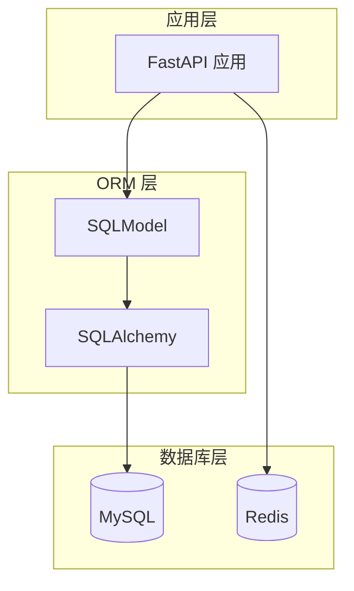
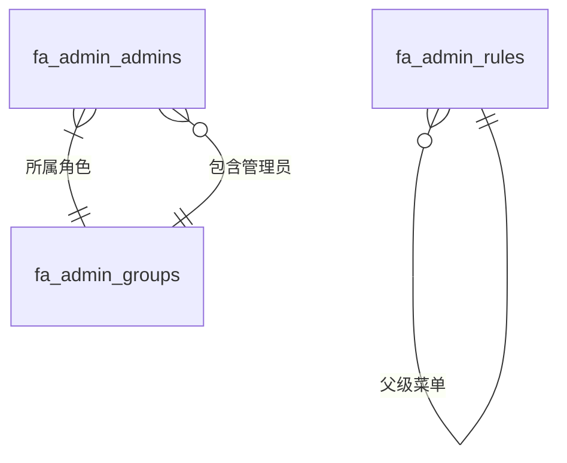
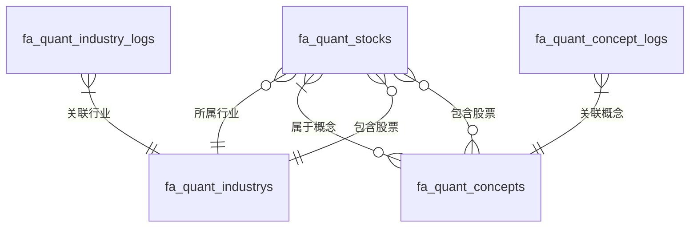

# 数据库概览

本文档介绍了 Py Small Admin 的数据库设计和表结构。

## 数据库架构

Py Small Admin 使用 MySQL 作为主要数据库，Redis 作为缓存和会话存储。



## 数据库技术栈

### MySQL

- **版本**：5.7+
- **字符集**：utf8mb4
- **排序规则**：utf8mb4_unicode_ci
- **存储引擎**：InnoDB

### Redis

- **版本**：5.0+
- **用途**：缓存、会话存储、Celery 消息队列
- **数据库**：
  - DB 0：业务数据
  - DB 1：缓存
  - DB 2：Celery 结果存储

## 数据库表结构

### Admin 模块表

Admin 模块包含 5 张数据表：

| 表名 | 说明 | 主要用途 |
|------|------|----------|
| `fa_admin_admins` | 管理员表 | 存储系统管理员信息 |
| `fa_admin_groups` | 角色组表 | 存储角色和权限配置 |
| `fa_admin_rules` | 菜单规则表 | 存储系统菜单和权限规则 |
| `fa_admin_sys_configs` | 系统配置表 | 存储系统配置参数 |
| `fa_admin_uploads` | 文件上传表 | 存储上传文件信息 |

### Quant 模块表

Quant 模块包含 14 张数据表：

| 表名 | 说明 | 主要用途 |
|------|------|----------|
| `fa_quant_stocks` | 股票表 | 存储股票基本信息 |
| `fa_quant_industrys` | 行业表 | 存储行业分类信息 |
| `fa_quant_concepts` | 概念表 | 存储概念分类信息 |
| `fa_quant_stock_concepts` | 股票-概念关联表 | 存储股票和概念的多对多关系 |
| `fa_quant_stock_kline1ds` | 日K线数据表 | 存储日K线数据 |
| `fa_quant_stock_kline1ws` | 周K线数据表 | 存储周K线数据 |
| `fa_quant_stock_kline1ms` | 月K线数据表 | 存储月K线数据 |
| `fa_quant_stock_kline1m_mins` | 1分钟K线数据表 | 存储1分钟K线数据 |
| `fa_quant_stock_kline5ms` | 5分钟K线数据表 | 存储5分钟K线数据 |
| `fa_quant_stock_kline15ms` | 15分钟K线数据表 | 存储15分钟K线数据 |
| `fa_quant_stock_kline30ms` | 30分钟K线数据表 | 存储30分钟K线数据 |
| `fa_quant_stock_kline60ms` | 60分钟K线数据表 | 存储60分钟K线数据 |
| `fa_quant_industry_logs` | 行业历史记录表 | 存储行业历史数据 |
| `fa_quant_concept_logs` | 概念历史记录表 | 存储概念历史数据 |

**总计**：19 张数据表

## 表关系

### Admin 模块表关系



### Quant 模块表关系



## 数据库命名规范

### 表名规范

- **格式**：`fa_模块名_表名`
- **前缀**：`fa_`（可配置）
- **分隔符**：下划线 `_`
- **示例**：`fa_admin_admins`、`fa_quant_stocks`

### 字段名规范

- **格式**：小写字母 + 下划线
- **示例**：`user_name`、`created_at`

### 索引名规范

- **格式**：`idx_表名_字段名`
- **示例**：`idx_admin_admins_username`

## 数据库设计特点

### 1. 软删除

所有表都包含软删除字段，支持逻辑删除：

```sql
deleted_at TIMESTAMP NULL
```

### 2. 时间戳

所有表都包含创建和更新时间戳：

```sql
created_at TIMESTAMP DEFAULT CURRENT_TIMESTAMP
updated_at TIMESTAMP DEFAULT CURRENT_TIMESTAMP ON UPDATE CURRENT_TIMESTAMP
```

### 3. 状态字段

相关表包含状态字段：

```sql
status TINYINT DEFAULT 1
-- 0: 禁用
-- 1: 启用
```

### 4. 分表策略

K线数据表按周期分表：

- 日K线：`fa_quant_stock_kline1ds`
- 周K线：`fa_quant_stock_kline1ws`
- 月K线：`fa_quant_stock_kline1ms`
- 1分钟K线：`fa_quant_stock_kline1m_mins`
- 5分钟K线：`fa_quant_stock_kline5ms`
- 15分钟K线：`fa_quant_stock_kline15ms`
- 30分钟K线：`fa_quant_stock_kline30ms`
- 60分钟K线：`fa_quant_stock_kline60ms`

## 数据库迁移

项目使用 Alembic 进行数据库迁移。

### 初始化迁移

```bash
# 初始化 Alembic（首次）
alembic init alembic

# 生成迁移脚本
alembic revision --autogenerate -m "Initial migration"

# 执行迁移
alembic upgrade head
```

### 创建新迁移

```bash
# 自动生成迁移脚本
alembic revision --autogenerate -m "Add new table"

# 手动创建迁移脚本
alembic revision -m "Custom migration"
```

### 回滚迁移

```bash
# 回滚到上一个版本
alembic downgrade -1

# 回滚到初始版本
alembic downgrade base
```

详细的迁移说明请参考 [数据库迁移](./migrations.md)。

## 数据库优化

### 索引优化

- 为常用查询字段添加索引
- 为外键字段添加索引
- 为组合查询添加联合索引

### 查询优化

- 使用分页查询避免大数据量
- 使用缓存减少数据库查询
- 优化 SQL 语句避免全表扫描

### 连接池

配置数据库连接池：

```python
engine = create_engine(
    DATABASE_URL,
    pool_size=10,
    max_overflow=20,
    pool_pre_ping=True
)
```

## 数据库备份

### 备份策略

建议定期备份数据库：

```bash
# 完整备份
mysqldump -u root -p py_small_admin > backup_$(date +%Y%m%d).sql

# 只备份结构
mysqldump -u root -p --no-data py_small_admin > structure_$(date +%Y%m%d).sql

# 只备份数据
mysqldump -u root -p --no-create-info py_small_admin > data_$(date +%Y%m%d).sql
```

### 恢复备份

```bash
mysql -u root -p py_small_admin < backup_20240101.sql
```

## 数据库监控

### 慢查询日志

启用慢查询日志：

```ini
[mysqld]
slow_query_log = 1
long_query_time = 2
slow_query_log_file = /var/log/mysql/slow.log
```

### 性能监控

使用工具监控数据库性能：

- MySQL Workbench
- Percona Toolkit
- PMM (Percona Monitoring and Management)