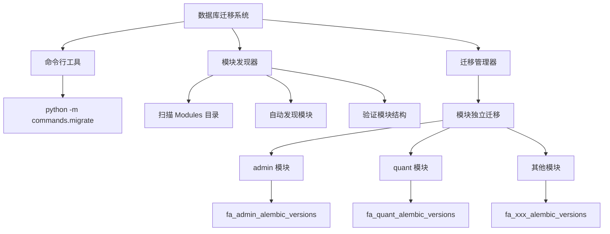

# 数据库迁移

本文档介绍 Py Small Admin 项目的**模块化多独立迁移系统**。

## 迁移架构概览



## 核心设计理念

### 1. 模块独立迁移

每个业务模块都有自己**独立的迁移系统**：

```
server/Modules/
├── admin/
│   └── migrations/
│       ├── alembic.ini          # 独立配置
│       ├── env.py                # 独立环境
│       ├── script.py.mako        # 迁移模板
│       └── versions/             # 版本文件
│           └── 20260113_1211_385f79955eaa_admin数据表.py
└── quant/
    └── migrations/
        ├── alembic.ini
        ├── env.py
        ├── script.py.mako
        └── versions/
            └── 20260120_1509_71effa3b7543_quant数据表.py
```

### 2. 版本表隔离

每个模块使用独立的版本表，互不干扰：

| 模块 | 版本表 | 说明 |
|------|--------|------|
| admin | `fa_admin_alembic_versions` | 管理 admin 模块的迁移版本 |
| quant | `fa_quant_alembic_versions` | 管理 quant 模块的迁移版本 |

### 3. 表前缀过滤

通过 `include_object` 过滤器，确保每个迁移只处理自己模块的表：

- admin 模块只处理 `fa_admin_*` 表
- quant 模块只处理 `fa_quant_*` 表

## 目录结构

```
server/
├── commands/
│   └── migrate.py              # 迁移命令行工具
├── Modules/
│   ├── admin/
│   │   ├── models/             # admin 模型的定义
│   │   │   ├── __init__.py
│   │   │   ├── admin_admin.py
│   │   │   ├── admin_group.py
│   │   │   └── admin_rule.py
│   │   └── migrations/         # admin 迁移目录
│   │       ├── alembic.ini
│   │       ├── env.py
│   │       ├── script.py.mako
│   │       └── versions/
│   └── quant/
│       ├── models/             # quant 模型的定义
│       │   ├── __init__.py
│       │   ├── quant_stock.py
│       │   └── quant_industry.py
│       └── migrations/         # quant 迁移目录
│           ├── alembic.ini
│           ├── env.py
│           ├── script.py.mako
│           └── versions/
```

## 命令行工具

### 基本用法

```bash
# 查看帮助
python -m commands.migrate --help

# 列出所有模块及其迁移状态
python -m commands.migrate list
```

### 初始化模块迁移

```bash
# 为新模块初始化迁移系统
python -m commands.migrate init --module example
```

执行后会在 `Modules/example/migrations/` 目录下创建：
- `alembic.ini` - Alembic 配置文件
- `env.py` - 环境配置（包含模型导入和表过滤逻辑）
- `script.py.mako` - 迁移文件模板
- `versions/` - 版本文件目录

### 创建迁移文件

```bash
# 自动生成迁移（检测模型变化）
python -m commands.migrate create --module admin --message "添加用户表"

# 简写形式
python -m commands.migrate create -m admin -msg "添加用户表"
```

生成的迁移文件名格式：`{year}{month}{day}_{hour}{minute}_{revision}_{message}.py`

例如：`20260113_1211_385f79955eaa_添加用户表.py`

### 执行迁移

```bash
# 升级指定模块到最新版本
python -m commands.migrate up --module admin

# 升级指定模块到指定版本
python -m commands.migrate up --module admin --revision 385f79955eaa

# 升级所有模块到最新版本
python -m commands.migrate up

# 降级指定模块一个版本
python -m commands.migrate down --module admin

# 降级指定模块到指定版本
python -m commands.migrate down --module admin --revision base
```

### 查看状态

```bash
# 查看所有模块状态
python -m commands.migrate list

# 查看指定模块的当前版本
python -m commands.migrate current --module admin

# 查看指定模块的迁移历史
python -m commands.migrate history --module admin

# 验证指定模块的迁移系统
python -m commands.migrate validate --module admin
```

## 完整命令参考

| 命令 | 参数 | 说明 |
|------|------|------|
| `list` | 无 | 列出所有模块及其迁移状态 |
| `init` | `--module/-m` | 初始化模块的迁移系统 |
| `create` | `--module/-m`, `--message/-msg` | 创建新的迁移文件 |
| `up` | `--module/-m` (可选), `--revision/-r` (可选) | 执行迁移升级 |
| `down` | `--module/-m`, `--revision/-r` (可选) | 执行迁移降级 |
| `current` | `--module/-m` | 查看模块当前版本 |
| `history` | `--module/-m` | 查看模块迁移历史 |
| `validate` | `--module/-m` | 验证模块迁移系统 |

## 迁移文件结构

### 迁移文件示例

```python
"""添加用户表

Revision ID: 385f79955eaa
Revises:
Create Date: 2026-01-13 12:11:00.000000

"""
from alembic import op
import sqlalchemy as sa
from sqlalchemy.dialects import mysql

# revision identifiers
revision = '385f79955eaa'
down_revision = None
branch_labels = None
depends_on = None


def upgrade() -> None:
    """升级操作"""
    # 创建管理员表
    op.create_table(
        'fa_admin_admins',
        sa.Column('id', mysql.INTEGER(unsigned=True), autoincrement=True, nullable=False),
        sa.Column('username', sa.String(50), nullable=False, comment='用户名'),
        sa.Column('password', sa.String(255), nullable=False, comment='密码'),
        sa.Column('real_name', sa.String(100), nullable=True, comment='真实姓名'),
        sa.Column('email', sa.String(100), nullable=True, comment='邮箱'),
        sa.Column('avatar', sa.String(255), nullable=True, comment='头像'),
        sa.Column('is_active', sa.Boolean(), default=True, comment='是否激活'),
        sa.Column('created_at', sa.DateTime(), nullable=True, comment='创建时间'),
        sa.Column('updated_at', sa.DateTime(), nullable=True, comment='更新时间'),
        sa.PrimaryKeyConstraint('id'),
        mysql_charset='utf8mb4',
        mysql_collate='utf8mb4_unicode_ci',
        comment='管理员表'
    )

    # 创建索引
    op.create_index('ix_fa_admin_admins_username', 'fa_admin_admins', ['username'], unique=True)


def downgrade() -> None:
    """回滚操作"""
    # 删除索引
    op.drop_index('ix_fa_admin_admins_username', table_name='fa_admin_admins')

    # 删除表
    op.drop_table('fa_admin_admins')
```

## 常见迁移操作

### 添加表

```python
def upgrade() -> None:
    op.create_table(
        'fa_admin_roles',
        sa.Column('id', sa.Integer(), nullable=False),
        sa.Column('name', sa.String(100), nullable=False),
        sa.PrimaryKeyConstraint('id'),
        mysql_charset='utf8mb4',
        comment='角色表'
    )

def downgrade() -> None:
    op.drop_table('fa_admin_roles')
```

### 添加列

```python
def upgrade() -> None:
    op.add_column(
        'fa_admin_admins',
        sa.Column('phone', sa.String(20), nullable=True, comment='手机号')
    )

def downgrade() -> None:
    op.drop_column('fa_admin_admins', 'phone')
```

### 修改列

```python
def upgrade() -> None:
    op.alter_column(
        'fa_admin_admins',
        'username',
        existing_type=sa.String(50),
        type_=sa.String(100),
        nullable=False
    )

def downgrade() -> None:
    op.alter_column(
        'fa_admin_admins',
        'username',
        existing_type=sa.String(100),
        type_=sa.String(50),
        nullable=False
    )
```

### 删除列

```python
def upgrade() -> None:
    op.drop_column('fa_admin_admins', 'phone')

def downgrade() -> None:
    op.add_column(
        'fa_admin_admins',
        sa.Column('phone', sa.String(20), nullable=True)
    )
```

### 添加索引

```python
def upgrade() -> None:
    # 普通索引
    op.create_index(
        'ix_fa_admin_admins_email',
        'fa_admin_admins',
        ['email']
    )

    # 唯一索引
    op.create_index(
        'ix_fa_admin_admins_username',
        'fa_admin_admins',
        ['username'],
        unique=True
    )

def downgrade() -> None:
    op.drop_index('ix_fa_admin_admins_email', table_name='fa_admin_admins')
    op.drop_index('ix_fa_admin_admins_username', table_name='fa_admin_admins')
```

### 添加外键

```python
def upgrade() -> None:
    op.create_foreign_key(
        'fk_fa_admin_admins_role_id',
        'fa_admin_admins',
        'fa_admin_roles',
        ['role_id'],
        ['id'],
        ondelete='CASCADE'
    )

def downgrade() -> None:
    op.drop_constraint('fk_fa_admin_admins_role_id', 'fa_admin_admins', type_='foreignkey')
```

### 数据迁移

```python
from sqlalchemy.sql import table, column

def upgrade() -> None:
    # 定义数据表对象
    admins_table = table(
        'fa_admin_admins',
        column('id', sa.Integer),
        column('username', sa.String),
        column('password', sa.String),
    )

    # 批量插入数据
    op.bulk_insert(admins_table, [
        {
            'id': 1,
            'username': 'admin',
            'password': 'hashed_password_here',
        },
        {
            'id': 2,
            'username': 'user',
            'password': 'hashed_password_here',
        },
    ])

def downgrade() -> None:
    op.execute("DELETE FROM fa_admin_admins WHERE id IN (1, 2)")
```

## 配置文件说明

### alembic.ini

每个模块的 `migrations/alembic.ini` 配置：

```ini
[alembic]
# 迁移脚本路径
script_location = Modules/admin/migrations

# 文件名模板
file_template = %%(year)d%%(month).2d%%(day).2d_%%(hour).2d%%(minute).2d_%%(rev)s_%%(slug)s

# 版本路径分隔符
version_path_separator = os

# 数据库连接 URL（由 env.py 动态设置）
sqlalchemy.url =
```

### env.py 核心功能

每个模块的 `env.py` 包含以下核心功能：

#### 1. 动态导入模型

```python
# 导入模块的所有模型
from Modules.admin.models import *
from Modules.common.models.base_model import BaseModel
from sqlmodel import SQLModel

# 获取 SQLModel 元数据
target_metadata = SQLModel.metadata
```

#### 2. 动态数据库 URL

```python
from Modules.common.libs.config import Config

default_connection = Config.get("database.default", "mysql")
connections = Config.get("database.connections", {})
db_config = connections.get(default_connection, {})

# 构建数据库 URL
database_url = f"mysql+mysqldb://{username}:{password}@{host}:{port}/{database}"
config.set_main_option("sqlalchemy.url", database_url)
```

#### 3. 表前缀过滤

```python
def include_object(object, name, type_, reflected, compare_to):
    """只处理当前模块的表"""
    if type_ == "table" and name:
        # 获取表前缀
        table_prefix = db_config.get("prefix", "fa_")
        expected_prefix = f"{table_prefix}admin_"

        # 只处理属于当前模块的表
        if name.startswith(expected_prefix):
            return True
        return False

    # 处理索引和约束
    if type_ in ("index", "constraint") and name:
        expected_table_name = f"{table_prefix}admin"
        if expected_table_name in name:
            return True
        return False

    return True
```

#### 4. 独立版本表

```python
# 每个模块使用独立的版本表
table_prefix = db_config.get("prefix", "fa_")
version_table = f"{table_prefix}admin_alembic_versions"

context.configure(
    connection=connection,
    target_metadata=target_metadata,
    version_table=version_table,  # 独立版本表
    include_object=include_object,  # 表过滤
)
```

## 工作流程

### 1. 创建新模块

```bash
# 1. 创建模块目录结构
mkdir -p Modules/example/models

# 2. 创建模型文件
touch Modules/example/models/__init__.py
touch Modules/example/models/example_model.py

# 3. 初始化迁移系统
python -m commands.migrate init --module example

# 4. 创建第一个迁移
python -m commands.migrate create --module example --message "初始迁移"
```

### 2. 修改模型后创建迁移

```bash
# 1. 修改模型文件
vim Modules/admin/models/admin_admin.py

# 2. 创建迁移
python -m commands.migrate create --module admin --message "添加手机号字段"

# 3. 检查生成的迁移文件
vim Modules/admin/migrations/versions/xxxxx_添加手机号字段.py

# 4. 执行迁移
python -m commands.migrate up --module admin
```

### 3. 部署到生产环境

```bash
# 1. 备份数据库
mysqldump -u root -p py_small_admin > backup_$(date +%Y%m%d).sql

# 2. 查看待执行的迁移
python -m commands.migrate list

# 3. 执行迁移（先在测试环境验证）
python -m commands.migrate up

# 4. 验证迁移结果
python -m commands.migrate list
```

## 最佳实践

### 1. 迁移命名规范

```bash
# 推荐：清晰的中文描述
python -m commands.migrate create --module admin --message "添加用户表"
python -m commands.migrate create --module admin --message "添加手机号唯一索引"
python -m commands.migrate create --module admin --message "修改密码字段长度为255"

# 避免：模糊的描述
python -m commands.migrate create --module admin --message "更新"
python -m commands.migrate create --module admin --message "fix"
```

### 2. 保持可逆性

始终实现 `downgrade()` 函数：

```python
def upgrade() -> None:
    # 添加可逆的操作
    op.add_column('fa_admin_admins', sa.Column('phone', sa.String(20)))

def downgrade() -> None:
    # 提供完整的回滚逻辑
    op.drop_column('fa_admin_admins', 'phone')
```

### 3. 小步提交

```bash
# 推荐：每次迁移只做一件事
python -m commands.migrate create --module admin --message "添加手机号字段"
python -m commands.migrate create --module admin --message "添加手机号索引"

# 避免：一次迁移做太多改动
python -m commands.migrate create --module admin --message "重构用户表"
```

### 4. 先测试后部署

```bash
# 1. 在开发环境测试
python -m commands.migrate up --module admin
python -m commands.migrate down --module admin

# 2. 在测试环境验证
python -m commands.migrate up --module admin

# 3. 确认无误后部署到生产环境
```

### 5. 备份数据库

```bash
# 生产环境迁移前务必备份
mysqldump -u root -p py_small_admin > backup_before_migration_$(date +%Y%m%d_%H%M%S).sql
```

## 常见问题

### 1. 自动生成没有检测到模型变化

**问题**：创建迁移后，生成的迁移文件是空的。

**解决方案**：

1. 确保模型已在 `Modules/{module}/models/__init__.py` 中导出
2. 检查模型是否继承自 `BaseModel`
3. 确认 `env.py` 中正确导入了模块模型

```python
# Modules/admin/models/__init__.py
from .admin_admin import AdminAdmin
from .admin_group import AdminGroup

__all__ = ['AdminAdmin', 'AdminGroup']
```

### 2. 迁移执行失败

**问题**：执行 `python -m commands.migrate up` 时报错。

**解决方案**：

1. 查看详细错误信息
2. 检查数据库连接是否正常
3. 检查表是否已存在
4. 手动修复后使用 `--revision` 跳过有问题的迁移

```bash
# 降级到上一个版本
python -m commands.migrate down --module admin

# 手动修复数据库后，标记当前版本
python -m commands.migrate up --module admin --revision <revision_id>
```

### 3. 回滚失败

**问题**：执行 `down` 命令时失败。

**解决方案**：

1. 检查 `downgrade()` 函数是否完整
2. 检查是否有外键约束阻止删除
3. 考虑手动修复数据库

### 4. 模块发现失败

**问题**：`python -m commands.migrate list` 没有显示新模块。

**解决方案**：

确保模块结构正确：

```
Modules/example/
├── models/
│   ├── __init__.py      # 必须存在
│   └── example_model.py # 至少有一个模型
```

### 5. 版本表冲突

**问题**：多个模块的迁移相互影响。

**解决方案**：

确保每个模块使用独立的版本表，检查 `env.py` 中的配置：

```python
version_table = f"{table_prefix}{module_name}_alembic_versions"
```

## 高级用法

### 1. 批量创建迁移

```bash
# 升级所有模块
python -m commands.migrate up

# 查看所有模块状态
python -m commands.migrate list
```

### 2. 条件迁移

```python
def upgrade() -> None:
    # 根据数据库类型执行不同操作
    from alembic import context
    if context.bind.dialect.name == 'mysql':
        op.execute("ALTER TABLE fa_admin_admins ENGINE=InnoDB")
```

### 3. 数据修复迁移

```python
def upgrade() -> None:
    # 修复历史数据
    op.execute("""
        UPDATE fa_admin_admins
        SET email = CONCAT(username, '@example.com')
        WHERE email IS NULL
    """)

def downgrade() -> None:
    # 记录修复操作，通常不需要回滚
    pass
```

### 4. 原子性迁移

```python
from alembic import op

def upgrade() -> None:
    # 使用批量操作确保原子性
    with op.batch_alter_table('fa_admin_admins') as batch_op:
        batch_op.add_column(sa.Column('phone', sa.String(20), nullable=True))
        batch_op.add_column(sa.Column('address', sa.String(255), nullable=True))
```

## 生产环境建议

### 1. 代码审查

迁移脚本必须经过代码审查：
- 检查 SQL 语句正确性
- 检查是否有性能问题（如大表添加索引）
- 确认回滚操作完整

### 2. 灰度发布

对于大型迁移，考虑分阶段部署：

```bash
# 1. 先在单台服务器执行
python -m commands.migrate up --module admin

# 2. 观察运行情况

# 3. 逐步扩展到所有服务器
```

### 3. 监控和日志

迁移执行时记录日志：

```python
from loguru import logger

def upgrade() -> None:
    logger.info("开始执行迁移：添加用户表")
    try:
        op.create_table('fa_admin_admins', ...)
        logger.info("迁移执行成功")
    except Exception as e:
        logger.error(f"迁移执行失败：{e}")
        raise
```

### 4. 回滚预案

始终准备好回滚方案：

```bash
# 1. 备份数据库
mysqldump -u root -p py_small_admin > backup.sql

# 2. 记录当前版本
python -m commands.migrate list > version_state.txt

# 3. 如果迁移失败，执行回滚
python -m commands.migrate down --module admin
```
