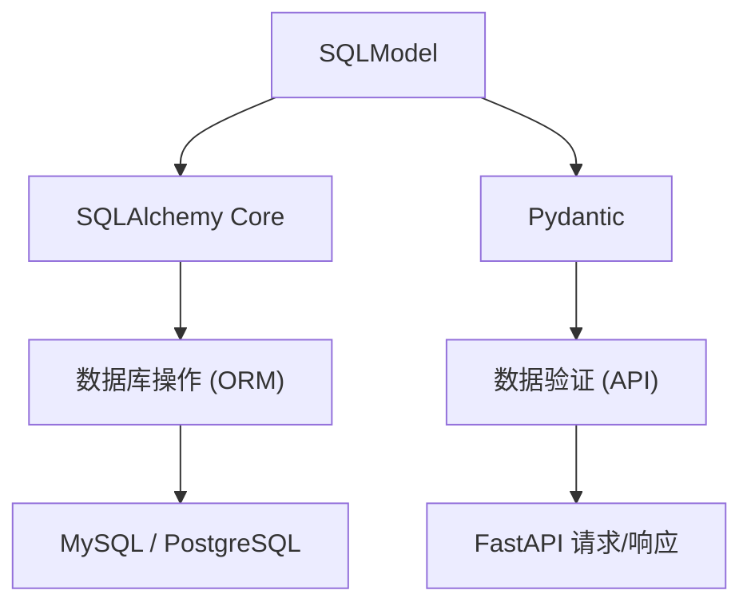

# 数据模型定义

本文档介绍 Py Small Admin 项目中如何使用 SQLModel 定义数据模型。

## SQLModel 简介

### 什么是 SQLModel

SQLModel 是由 FastAPI 作者 Tiangolo 开发的库，它结合了：

- **SQLAlchemy** 的 ORM 功能
- **Pydantic** 的数据验证功能



### 为什么使用 SQLModel

| 特性 | 说明 |
|------|------|
| 类型安全 | 基于 Python 类型注解，IDE 自动补全 |
| 双重用途 | 一个模型类同时用于数据库操作和 API 验证 |
| 简洁语法 | 比 SQLAlchemy 更简洁，比 Pydantic 更强大 |
| FastAPI 原生集成 | 无缝支持 FastAPI 的自动文档生成 |

### 安装

```bash
pip install sqlmodel
```

## 基类模型

项目提供了两个基类，位于 `Modules/common/models/base_model.py`：

### BaseModel（不建表的基类）

```python
class BaseModel(SQLModel):
    """
    所有模型的基类（⚠️ 不建表）

    作用：
    - 统一 Pydantic / SQLModel 配置
    - 支持 ORM → Pydantic 序列化
    """
```

### BaseTableModel（建表的基类）

```python
class BaseTableModel(BaseModel):
    """
    所有数据库表模型的基类（子类需显式 table=True）

    提供：
    - 自动表名生成（驼峰转下划线+复数）
    - 自动表名前缀（配置的前缀，如 fa_）
    - 自动表配置（charset, collate, engine）
    - 自动外键前缀处理
    - 自动索引前缀处理
    """
```

### 自动化功能

| 功能 | 说明 | 示例 |
|------|------|------|
| 表名生成 | `AdminAdmin` → `admin_admins` + 前缀 | `fa_admin_admins` |
| 表配置 | 自动应用 MySQL 配置 | `charset=utf8mb4, collate=utf8mb4_unicode_ci, engine=InnoDB` |
| 外键前缀 | `ForeignKey("admin_groups.id")` | 自动添加前缀为 `fa_admin_groups.id` |
| 索引前缀 | `Index("idx_username")` | 自动添加前缀为 `idx_fa_username` |

## 创建第一个模型

### 1. 创建模型文件

在 `Modules/example/models/` 目录下创建 `example_model.py`：

```python
"""
示例模型

对应数据库表：fa_example_examples
"""

from datetime import datetime
from typing import TYPE_CHECKING

from sqlalchemy import Column, DateTime, ForeignKey, String
from sqlalchemy.dialects.mysql import INTEGER
from sqlalchemy.orm import Mapped
from sqlmodel import Field, Relationship

from Modules.common.models.base_model import BaseTableModel

# 使用 TYPE_CHECKING 避免循环导入
if TYPE_CHECKING:
    from .other_model import OtherModel


class ExampleModel(BaseTableModel, table=True):
    """
    示例模型

    对应数据库表 fa_example_examples
    """

    # 表注释
    __table_comment__ = "示例表"

    # 主键
    id: int | None = Field(
        sa_column=Column(
            INTEGER(unsigned=True),
            primary_key=True,
            autoincrement=True,
            comment="主键 ID",
        ),
        default=None,
    )

    # 名称
    name: str = Field(
        sa_column=Column(
            String(100),
            nullable=False,
            comment="名称",
        ),
    )

    # 外键关联
    other_id: int | None = Field(
        sa_column=Column(
            INTEGER(unsigned=True),
            ForeignKey("other_models.id", ondelete="SET NULL"),
            nullable=True,
            comment="关联ID",
        ),
        default=None,
    )

    # 创建时间
    created_at: datetime | None = Field(
        sa_column=Column(DateTime(), nullable=False, comment="创建时间", index=True),
        default=None,
    )

    # 关系定义
    other: Mapped[Optional["OtherModel"]] = Relationship(back_populates="examples")

    class Config:
        """Pydantic 配置"""
        from_attributes = True
```

### 2. 导出模型

在 `Modules/example/models/__init__.py` 中导出：

```python
from .example_model import ExampleModel

__all__ = ['ExampleModel']
```

### 3. 表名生成规则

| 模型类名 | 转换过程 | 最终表名 |
|---------|---------|---------|
| `AdminAdmin` | → `admin_admin` + `s` + `fa_` | `fa_admin_admins` |
| `AdminGroup` | → `admin_group` + `s` + `fa_` | `fa_admin_groups` |
| `QuantStock` | → `quant_stock` + `s` + `fa_` | `fa_quant_stocks` |
| `ExampleModel` | → `example_model` + `s` + `fa_` | `fa_example_models` |

## 字段类型和定义

### 基本字段定义

```python
from sqlmodel import Field
from sqlalchemy import Column, String, Integer
from sqlalchemy.dialects.mysql import INTEGER

# 方式一：使用 Field（推荐）
username: str = Field(
    sa_column=Column(
        String(50),
        nullable=False,
        unique=True,
        index=True,
        comment="用户名",
    ),
    default="",
)

# 方式二：使用 Field 默认值
age: int = Field(default=18)

# 方式三：可空字段
nickname: str | None = Field(default=None)
```

### 字段类型速查表

| Python 类型 | SQL 类型 | Column 示例 | 说明 |
|------------|---------|-------------|------|
| `str` | VARCHAR | `String(100)` | 可变长度字符串 |
| `str` | TEXT | `TEXT` | 长文本 |
| `int` | INT | `INTEGER(unsigned=True)` | 整数 |
| `int` | SMALLINT | `SmallInteger` | 小整数（0-65535） |
| `int` | BIGINT | `BIGINT(unsigned=True)` | 大整数 |
| `float` | DECIMAL | `DECIMAL(10, 2)` | 精确小数 |
| `bool` | TINYINT | `SmallInteger` | 布尔值（0/1） |
| `datetime` | DATETIME | `DateTime()` | 日期时间 |
| `date` | DATE | `Date()` | 日期 |
| `json` | JSON | `JSON()` | JSON 数据 |

### 常用字段模式

#### 1. 主键字段

```python
id: int | None = Field(
    sa_column=Column(
        INTEGER(unsigned=True),
        primary_key=True,
        autoincrement=True,
        comment="主键 ID",
    ),
    default=None,
)
```

#### 2. 字符串字段

```python
# 普通字符串
name: str = Field(
    sa_column=Column(String(100), nullable=False, comment="名称"),
    default="",
)

# 唯一字符串（带索引）
username: str = Field(
    sa_column=Column(
        String(50),
        nullable=False,
        unique=True,
        index=True,
        comment="用户名",
    ),
    default="",
)

# 可选字符串
description: str | None = Field(
    sa_column=Column(String(500), nullable=True, comment="描述"),
    default=None,
)
```

#### 3. 整数字段

```python
# 状态字段（SmallInteger）
status: int | None = Field(
    sa_column=Column(
        SmallInteger,
        nullable=False,
        server_default="1",
        comment="状态:0=禁用,1=启用",
        index=True,
    ),
    default=1,
)

# 排序字段
sort: int | None = Field(
    sa_column=Column(
        INTEGER(unsigned=True),
        nullable=False,
        server_default="0",
        comment="排序",
    ),
    default=0,
)
```

#### 4. 小数字段

```python
# 金额字段
price: Decimal | None = Field(
    sa_column=Column(DECIMAL(10, 2), nullable=True, comment="价格"),
    default=None,
)

# 百分比字段
percentage: Decimal | None = Field(
    sa_column=Column(DECIMAL(5, 2), nullable=True, comment="百分比"),
    default=None,
)
```

#### 5. 时间字段

```python
from datetime import datetime

# 创建时间（必填）
created_at: datetime | None = Field(
    sa_column=Column(DateTime(), nullable=False, comment="创建时间", index=True),
    default=None,
)

# 更新时间（可选）
updated_at: datetime | None = Field(
    sa_column=Column(DateTime(), nullable=True, comment="更新时间", index=True),
    default=None,
)

# 日期字段
birth_date: date | None = Field(
    sa_column=Column(Date(), nullable=True, comment="出生日期"),
    default=None,
)
```

### Field 参数说明

```python
Field(
    default=None,           # 默认值
    default_factory=list,   # 默认值工厂（用于可变类型）
    primary_key=False,      # 是否为主键
    index=False,            # 是否创建索引
    unique=False,           # 是否唯一
    nullable=None,          # 是否可空（自动推断）
    sa_column=Column(...),  # SQLAlchemy 列定义
    sa_column_kwargs={},    # 额外的列参数
)
```

## 模型关联关系

### 一对多（One-to-Many）

一个角色组包含多个管理员：

```python
# 角色模型
class AdminGroup(BaseTableModel, table=True):
    id: int | None = Field(default=None, primary_key=True)
    name: str = Field(default="")

    # 一对多：一个组 → 多个管理员
    admins: list["AdminAdmin"] = Relationship(back_populates="group")


# 管理员模型
class AdminAdmin(BaseTableModel, table=True):
    id: int | None = Field(default=None, primary_key=True)
    name: str = Field(default="")

    # 外键
    group_id: int | None = Field(
        sa_column=Column(
            INTEGER(unsigned=True),
            ForeignKey("admin_groups.id", ondelete="SET NULL"),
            nullable=True,
        ),
        default=None,
    )

    # 多对一：多个管理员 → 一个组
    group: Mapped[Optional["AdminGroup"]] = Relationship(back_populates="admins")
```

**数据库表结构**：

```
fa_admin_groups        fa_admin_admins
├── id (PK)            ├── id (PK)
├── name               ├── name
└── ...                ├── group_id (FK)
                       └── ...
```

### 多对多（Many-to-Many）

股票和概念的多对多关系，通过中间表实现：

```python
# 股票模型
class QuantStock(BaseTableModel, table=True):
    id: int | None = Field(default=None, primary_key=True)
    stock_code: str = Field(default="")

    # 多对多：股票 ↔ 概念
    concepts: Mapped[list["QuantConcept"]] = Relationship(
        back_populates="stocks",
        link_model=QuantStockConcept  # 指定中间表
    )


# 概念模型
class QuantConcept(BaseTableModel, table=True):
    id: int | None = Field(default=None, primary_key=True)
    name: str = Field(default="")

    # 多对多：概念 ↔ 股票
    stocks: list["QuantStock"] = Relationship(
        back_populates="concepts",
        link_model=QuantStockConcept
    )


# 中间表模型
class QuantStockConcept(BaseTableModel, table=True):
    """股票-概念关联表"""
    id: int | None = Field(default=None, primary_key=True)

    # 股票ID（外键）
    stock_id: int | None = Field(
        sa_column=Column(
            INTEGER(unsigned=True),
            ForeignKey("quant_stocks.id", ondelete="CASCADE"),
            nullable=False,
            index=True,
        ),
        default=None,
    )

    # 概念ID（外键）
    concept_id: int | None = Field(
        sa_column=Column(
            INTEGER(unsigned=True),
            ForeignKey("quant_concepts.id", ondelete="CASCADE"),
            nullable=False,
            index=True,
        ),
        default=None,
    )
```

**数据库表结构**：

```
fa_quant_stocks          fa_quant_stock_concepts        fa_quant_concepts
├── id (PK)             ├── id (PK)                    ├── id (PK)
├── stock_code           ├── stock_id (FK)             ├── name
└── ...                  ├── concept_id (FK)            └── ...
                        └── ...
```

### 自关联（Self-Reference）

菜单的父子关系：

```python
class AdminRule(BaseTableModel, table=True):
    id: int | None = Field(default=None, primary_key=True)
    name: str = Field(default="")

    # 父级ID（外键指向自身）
    pid: int | None = Field(
        sa_column=Column(
            Integer,
            nullable=False,
            server_default="0",
            comment="父级ID",
            index=True,
        ),
        default=0,
    )

    # 自关联（可选）
    # parent: Mapped[Optional["AdminRule"]] = Relationship(
    #     back_populates="children",
    #     sa_relationship_kwargs={"foreign_keys": "[AdminRule.pid]"
    # )
    # children: list["AdminRule"] = Relationship(
    #     back_populates="parent",
    #     sa_relationship_kwargs={"foreign_keys": "[AdminRule.pid]"
    # )
```

**数据库表结构**：

```
fa_admin_rules
├── id (PK)
├── name
├── pid (FK → fa_admin_rules.id)
└── ...
```

### 关系定义速查表

| 关系类型 | Relationship 定义 | 外键位置 |
|---------|------------------|---------|
| 一对多 | `items: list["Item"] = Relationship(back_populates="parent")` | 多表 |
| 多对一 | `parent: Mapped[Optional["Parent"]] = Relationship(back_populates="items")` | 多表 |
| 多对多 | `items: list["Item"] = Relationship(back_populates="parents", link_model=LinkModel)` | 中间表 |
| 自关联 | `parent: Mapped[Optional["Self"]] = Relationship(...)` | 自身 |

## 外键和索引

### 外键定义

```python
from sqlalchemy import ForeignKey
from sqlalchemy.dialects.mysql import INTEGER

# 基本外键
user_id: int | None = Field(
    sa_column=Column(
        INTEGER(unsigned=True),
        ForeignKey("users.id"),  # 注意：自动添加表前缀
        nullable=True,
    ),
    default=None,
)

# 带级联删除的外键
user_id: int | None = Field(
    sa_column=Column(
        INTEGER(unsigned=True),
        ForeignKey("users.id", ondelete="CASCADE"),
        nullable=True,
    ),
    default=None,
)
```

### ondelete 选项

| 选项 | 说明 |
|------|------|
| `CASCADE` | 删除父表记录时，自动删除子表记录 |
| `SET NULL` | 删除父表记录时，子表外键设为 NULL |
| `RESTRICT` | 拒绝删除父表记录（如果有子记录） |
| `NO ACTION` | 不采取任何动作 |
| `SET DEFAULT` | 子表外键设为默认值 |

### 索引定义

#### 字段级索引

```python
# 单列索引
username: str = Field(
    sa_column=Column(String(50), index=True, comment="用户名")
)

# 唯一索引
email: str = Field(
    sa_column=Column(String(100), unique=True, comment="邮箱")
)
```

#### 表级索引（通过 __table_args__）

```python
from sqlalchemy import Index

class UserModel(BaseTableModel, table=True):
    username: str = Field(default="")
    email: str = Field(default="")

    __table_args__ = (
        Index("idx_username_email", "username", "email"),  # 联合索引
        # 注意：索引名会自动添加前缀
    )
```

### 常见索引模式

```python
# 模式1：唯一索引（用于登录字段）
username: str = Field(
    sa_column=Column(String(50), unique=True, index=True)
)

# 模式2：外键索引（自动添加或手动添加）
user_id: int = Field(
    sa_column=Column(INTEGER(unsigned=True), ForeignKey("users.id"), index=True)
)

# 模式3：查询字段索引
status: int = Field(
    sa_column=Column(SmallInteger, index=True)
)

# 模式4：时间字段索引
created_at: datetime = Field(
    sa_column=Column(DateTime(), index=True)
)
```

## 表配置

### 表注释

```python
class UserModel(BaseTableModel, table=True):
    __table_comment__ = "用户表，存储系统用户信息"
```

### 表参数（自动配置）

BaseTableModel 自动配置以下参数：

```python
{
    "mysql_engine": "InnoDB",           # 存储引擎
    "mysql_charset": "utf8mb4",          # 字符集
    "mysql_collate": "utf8mb4_unicode_ci",  # 排序规则
    "mysql_comment": "表注释",           # 表注释（如果有）
}
```

### 自定义表参数

```python
from sqlalchemy import Index, UniqueConstraint

class UserModel(BaseTableModel, table=True):
    username: str = Field(default="")
    email: str = Field(default="")

    __table_args__ = (
        UniqueConstraint("username", name="uq_username"),  # 唯一约束
        Index("idx_email_status", "email", "status"),      # 复合索引
        # 与自动配置合并
    )
```

## Pydantic 集成

### Config 配置

```python
class UserModel(BaseTableModel, table=True):
    username: str = Field(default="")

    class Config:
        from_attributes = True  # 支持 ORM → Pydantic 序列化
        # 其他 Pydantic 配置...
```

### 在 FastAPI 中使用

```python
from fastapi import FastAPI
from sqlmodel import Session, select

from Modules.example.models import UserModel

app = FastAPI()

# 作为请求体（自动验证）
@app.post("/users")
def create_user(user: UserModel):
    # user 是 Pydantic 模型，自动验证
    pass

# 作为响应体（自动序列化）
@app.get("/users/{user_id}")
def get_user(user_id: int, session: Session):
    user = session.get(UserModel, user_id)
    # user 是 ORM 模型，自动序列化为 JSON
    return user
```

### Schema 分离模式

如果需要区分创建/更新的字段：

```python
from sqlmodel import BaseModel

# 创建 Schema
class UserCreate(BaseModel):
    username: str
    password: str

# 更新 Schema
class UserUpdate(BaseModel):
    username: str | None = None
    password: str | None = None

# 响应 Schema
class UserResponse(BaseModel):
    id: int
    username: str
    created_at: datetime

    class Config:
        from_attributes = True
```

## 完整示例

### 用户角色系统

```python
"""
用户角色模型示例
"""

from datetime import datetime
from typing import TYPE_CHECKING, Optional

from sqlalchemy import Column, DateTime, ForeignKey, SmallInteger, String
from sqlalchemy.dialects.mysql import INTEGER
from sqlalchemy.orm import Mapped
from sqlmodel import Field, Relationship

from Modules.common.models.base_model import BaseTableModel

if TYPE_CHECKING:
    from .admin_admin import AdminAdmin


class AdminGroup(BaseTableModel, table=True):
    """
    角色模型

    对应数据库表：fa_admin_groups
    """

    __table_comment__ = "角色表，存储系统角色信息"

    # 主键
    id: int | None = Field(
        sa_column=Column(
            INTEGER(unsigned=True),
            primary_key=True,
            autoincrement=True,
            comment="主键 ID",
        ),
        default=None,
    )

    # 角色名称
    name: str = Field(
        sa_column=Column(
            String(100),
            nullable=False,
            unique=True,
            index=True,
            server_default="",
            comment="角色名称",
        ),
        default="",
    )

    # 角色描述
    content: str = Field(
        sa_column=Column(
            String(100),
            nullable=True,
            server_default="",
            comment="角色描述",
        ),
        default="",
    )

    # 状态: 0=禁用, 1=启用
    status: int = Field(
        sa_column=Column(
            SmallInteger,
            nullable=False,
            server_default="1",
            comment="状态:0=禁用,1=启用",
            index=True,
        ),
        default=1,
    )

    # 权限规则（多个用|隔开）
    rules: str = Field(
        sa_column=Column(
            String(1000),
            nullable=True,
            comment="权限规则，多个用|隔开",
        ),
        default="",
    )

    # 创建时间
    created_at: datetime | None = Field(
        sa_column=Column(DateTime(), nullable=False, comment="创建时间", index=True),
        default=None,
    )

    # 更新时间
    updated_at: datetime | None = Field(
        sa_column=Column(DateTime(), nullable=True, comment="更新时间", index=True),
        default=None,
    )

    # 一对多：一个角色 → 多个管理员
    admins: list["AdminAdmin"] = Relationship(back_populates="group")

    class Config:
        from_attributes = True
```

## 从模型到迁移的完整流程

### 1. 创建模块目录结构

```bash
# 创建模块目录
mkdir -p Modules/example/models

# 创建必要的文件
touch Modules/example/__init__.py
touch Modules/example/models/__init__.py
touch Modules/example/models/example_model.py
```

### 2. 编写模型代码

在 `Modules/example/models/example_model.py` 中编写模型：

```python
from sqlmodel import Field, SQLModel
from sqlalchemy import Column, String
from sqlalchemy.dialects.mysql import INTEGER

from Modules.common.models.base_model import BaseTableModel


class ExampleModel(BaseTableModel, table=True):
    """示例模型"""
    __table_comment__ = "示例表"

    id: int | None = Field(
        sa_column=Column(
            INTEGER(unsigned=True),
            primary_key=True,
            autoincrement=True,
            comment="主键ID",
        ),
        default=None,
    )

    name: str = Field(
        sa_column=Column(String(100), nullable=False, comment="名称"),
        default="",
    )
```

### 3. 导出模型

在 `Modules/example/models/__init__.py` 中导出：

```python
from .example_model import ExampleModel

__all__ = ['ExampleModel']
```

### 4. 初始化迁移系统

```bash
# 初始化模块的迁移系统
python -m commands.migrate init --module example
```

### 5. 创建迁移文件

```bash
# 生成迁移脚本
python -m commands.migrate create --module example --message "初始迁移"
```

### 6. 检查迁移文件

检查生成的迁移文件 `Modules/example/migrations/versions/xxxxx_初始迁移.py`：

```python
def upgrade() -> None:
    """升级操作"""
    op.create_table(
        'fa_example_models',  # 注意：自动添加了表前缀
        sa.Column('id', mysql.INTEGER(unsigned=True), nullable=False),
        sa.Column('name', sa.String(length=100), nullable=False),
        sa.PrimaryKeyConstraint('id'),
        mysql_charset='utf8mb4',
        mysql_collate='utf8mb4_unicode_ci',
        mysql_comment='示例表',
    )

def downgrade() -> None:
    """回滚操作"""
    op.drop_table('fa_example_models')
```

### 7. 执行迁移

```bash
# 执行迁移
python -m commands.migrate up --module example
```

### 8. 验证结果

```bash
# 查看模块状态
python -m commands.migrate list

# 查看数据库表
mysql -u root -p -e "USE py_small_admin; SHOW TABLES LIKE 'fa_example%';"
```

## 最佳实践

### 1. 模型命名规范

| 类型 | 规范 | 示例 |
|------|------|------|
| 模型类 | 驼峰命名，描述性名称 | `AdminUser`, `OrderDetail` |
| 表名 | 自动生成 | `fa_admin_users`, `fa_order_details` |
| 字段名 | 下划线命名 | `user_name`, `created_at` |

### 2. 字段定义规范

```python
# 推荐：明确指定所有参数
name: str = Field(
    sa_column=Column(
        String(100),
        nullable=False,
        comment="名称",
    ),
    default="",
)

# 避免：省略必要参数
name: str  # 缺少长度限制、默认值
```

### 3. 关系定义规范

```python
# 推荐：双向关系
class Parent(BaseTableModel, table=True):
    children: list["Child"] = Relationship(back_populates="parent")

class Child(BaseTableModel, table=True):
    parent_id: int | None = Field(default=None)
    parent: Mapped[Optional["Parent"]] = Relationship(back_populates="children")
```

### 4. 使用 TYPE_CHECKING 避免循环导入

```python
from typing import TYPE_CHECKING

if TYPE_CHECKING:
    from .other_model import OtherModel
```

### 5. 表注释和字段注释

```python
class ExampleModel(BaseTableModel, table=True):
    __table_comment__ = "示例表，用于演示"  # 表注释

    name: str = Field(
        sa_column=Column(String(100), comment="名称"),  # 字段注释
        default="",
    )
```

### 6. 索引策略

```python
# 为查询字段添加索引
username: str = Field(
    sa_column=Column(String(50), unique=True, index=True)  # 唯一键自动创建索引
)

# 为外键添加索引
user_id: int = Field(
    sa_column=Column(INTEGER(unsigned=True), ForeignKey("users.id"), index=True)
)

# 为状态字段添加索引
status: int = Field(
    sa_column=Column(SmallInteger, index=True)
)
```

### 7. 状态字段使用 SmallInteger

```python
# 推荐：使用 SmallInteger 存储状态
status: int = Field(
    sa_column=Column(
        SmallInteger,
        nullable=False,
        server_default="1",
        comment="状态:0=禁用,1=启用",
    ),
    default=1,
)

# 避免：使用 Boolean（MySQL 没有 BOOLEAN 类型）
status: bool = Field(default=True)  # 实际存储为 TINYINT(1)
```

## 常见问题

### 1. 模型导入错误

**问题**：循环导入导致错误

**解决方案**：使用 `TYPE_CHECKING`

```python
from typing import TYPE_CHECKING

if TYPE_CHECKING:
    from .other_model import OtherModel
```

### 2. 表名不符合预期

**问题**：表名没有自动生成前缀

**解决方案**：检查是否正确继承了 `BaseTableModel` 并设置了 `table=True`

```python
class MyModel(BaseTableModel, table=True):  # 必须有 table=True
    pass
```

### 3. 外键前缀没有添加

**问题**：外键约束中的表名没有前缀

**解决方案**：这是正常的，`BaseTableModel` 会自动处理

```python
# 写法：不需要手动添加前缀
ForeignKey("users.id")  # 自动变成 fa_users.id
```

### 4. 迁移文件为空

**问题**：创建迁移后生成的文件是空的

**解决方案**：
1. 确保模型已在 `__init__.py` 中导出
2. 确保模型继承了 `BaseTableModel` 并设置了 `table=True`
3. 检查 `env.py` 中正确导入了模块模型

### 5. Relationship 不生效

**问题**：关系查询返回 None 或空列表

**解决方案**：确保双向关系配置正确

```python
# 父模型
class Parent(BaseTableModel, table=True):
    children: list["Child"] = Relationship(back_populates="parent")

# 子模型
class Child(BaseTableModel, table=True):
    parent_id: int | None = Field(default=None)  # 外键字段
    parent: Mapped[Optional["Parent"]] = Relationship(back_populates="children")  # 关系
```
