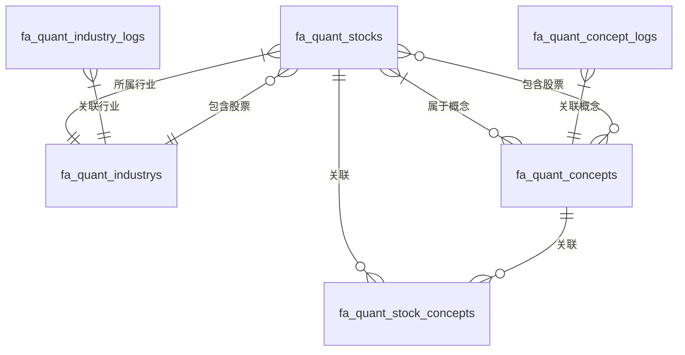

# Quant 模块表结构

本文档详细介绍了 Quant 模块的数据库表结构。

## 表概览

Quant 模块包含 14 张数据表：

| 表名 | 说明 | 主要用途 |
|------|------|----------|
| `fa_quant_stocks` | 股票表 | 存储股票基本信息 |
| `fa_quant_industrys` | 行业表 | 存储行业分类信息 |
| `fa_quant_concepts` | 概念表 | 存储概念分类信息 |
| `fa_quant_stock_concepts` | 股票-概念关联表 | 存储股票和概念的多对多关系 |
| `fa_quant_stock_kline1ds` | 日K线数据表 | 存储日K线数据 |
| `fa_quant_stock_kline1ws` | 周K线数据表 | 存储周K线数据 |
| `fa_quant_stock_kline1ms` | 月K线数据表 | 存储月K线数据 |
| `fa_quant_stock_kline1m_mins` | 1分钟K线数据表 | 存储1分钟K线数据 |
| `fa_quant_stock_kline5ms` | 5分钟K线数据表 | 存储5分钟K线数据 |
| `fa_quant_stock_kline15ms` | 15分钟K线数据表 | 存储15分钟K线数据 |
| `fa_quant_stock_kline30ms` | 30分钟K线数据表 | 存储30分钟K线数据 |
| `fa_quant_stock_kline60ms` | 60分钟K线数据表 | 存储60分钟K线数据 |
| `fa_quant_industry_logs` | 行业历史记录表 | 存储行业历史数据 |
| `fa_quant_concept_logs` | 概念历史记录表 | 存储概念历史数据 |

## fa_quant_stocks - 股票表

存储股票基本信息，支持A股、港股、美股等多市场股票。

### 主要字段

| 字段名 | 类型 | 说明 |
|--------|------|------|
| id | INT | 主键 ID |
| stock_code | VARCHAR(20) | 股票代码（如：600000.SH、000001.SZ） |
| stock_name | VARCHAR(100) | 股票名称 |
| market | TINYINT | 市场类型（1=上海，2=深圳，3=北京，4=港股，5=美股） |
| exchange | TINYINT | 交易所代码 |
| industry_id | INT | 所属行业 ID |
| list_status | TINYINT | 上市状态（0=未上市，1=已上市，2=退市，3=暂停上市） |
| trade_status | TINYINT | 交易状态（0=停牌，1=正常交易，2=特别处理） |
| is_st | TINYINT | 是否ST股（0=否，1=是） |
| stock_type | TINYINT | 股票类型（1=主板，2=创业板，3=科创板，4=北交所） |

### 财务与估值字段

| 字段名 | 类型 | 说明 |
|--------|------|------|
| total_market_cap | DECIMAL(20, 2) | 总市值（亿元） |
| circulating_market_cap | DECIMAL(20, 2) | 流通市值（亿元） |
| pe_ratio | DECIMAL(10, 2) | 市盈率（动态） |
| pb_ratio | DECIMAL(10, 2) | 市净率 |
| total_shares | DECIMAL(20, 2) | 总股本（万股） |
| circulating_shares | DECIMAL(20, 2) | 流通股本（万股） |

### 价格行情字段

| 字段名 | 类型 | 说明 |
|--------|------|------|
| latest_price | DECIMAL(10, 2) | 最新价 |
| open_price | DECIMAL(10, 2) | 今开 |
| close_price | DECIMAL(10, 2) | 昨收 |
| high_price | DECIMAL(10, 2) | 最高 |
| low_price | DECIMAL(10, 2) | 最低 |
| change_percent | DECIMAL(10, 2) | 涨跌幅（%） |
| change_amount | DECIMAL(10, 2) | 涨跌额 |
| change_speed | DECIMAL(10, 2) | 涨速 |

### 交易指标字段

| 字段名 | 类型 | 说明 |
|--------|------|------|
| volume | DECIMAL(20, 2) | 成交量 |
| amount | DECIMAL(20, 2) | 成交额 |
| volume_ratio | DECIMAL(10, 2) | 量比 |
| turnover_rate | DECIMAL(10, 2) | 换手率（%） |
| amplitude | DECIMAL(10, 2) | 振幅（%） |
| change_5min | DECIMAL(10, 2) | 5分钟涨跌（%） |
| change_60day | DECIMAL(10, 2) | 60日涨跌幅（%） |
| change_ytd | DECIMAL(10, 2) | 年初至今涨跌幅（%） |

### 上市信息字段

| 字段名 | 类型 | 说明 |
|--------|------|------|
| list_date | DATE | 上市日期 |
| delist_date | DATE | 退市日期 |
| ipo_price | DECIMAL(10, 2) | 发行价格 |
| ipo_shares | DECIMAL(20, 2) | 发行数量（万股） |
| description | TEXT | 股票描述/简介 |
| website | VARCHAR(255) | 官方网站 |
| logo_url | VARCHAR(255) | 公司Logo URL |

## fa_quant_industrys - 行业表

存储行业分类信息。

### 主要字段

| 字段名 | 类型 | 说明 |
|--------|------|------|
| id | INT | 主键 ID |
| name | VARCHAR(50) | 行业名称（如：电子化学品、银行、房地产） |
| code | VARCHAR(20) | 行业代码（如：BK0433、BK0001） |
| sort | INT | 排名 |

### 行情字段

| 字段名 | 类型 | 说明 |
|--------|------|------|
| latest_price | DECIMAL(10, 2) | 最新价 |
| change_amount | DECIMAL(10, 2) | 涨跌额 |
| change_percent | DECIMAL(10, 2) | 涨跌幅 |
| total_market_cap | DECIMAL(20, 2) | 总市值 |
| turnover_rate | DECIMAL(10, 2) | 换手率 |
| up_count | INT | 上涨家数 |
| down_count | INT | 下跌家数 |
| leading_stock | VARCHAR(20) | 领涨股票代码 |
| leading_stock_change | DECIMAL(10, 2) | 领涨股票涨跌幅 |

### 其他字段

| 字段名 | 类型 | 说明 |
|--------|------|------|
| description | TEXT | 行业描述 |
| status | TINYINT | 记录状态（0=禁用，1=启用） |

## fa_quant_concepts - 概念表

存储概念分类信息，结构基本与行业表相同。

### 主要字段

| 字段名 | 类型 | 说明 |
|--------|------|------|
| id | INT | 主键 ID |
| name | VARCHAR(50) | 概念名称（如：新能源汽车、人工智能） |
| code | VARCHAR(20) | 概念代码（如：BK0433、BK0001） |
| sort | INT | 排名 |

### 行情字段

与行业表相同。

## fa_quant_stock_concepts - 股票-概念关联表

存储股票和概念的多对多关系。

### 主要字段

| 字段名 | 类型 | 说明 |
|--------|------|------|
| id | INT | 主键 ID |
| stock_id | INT | 股票 ID |
| concept_id | INT | 概念 ID |
| created_at | TIMESTAMP | 创建时间 |

## K线数据表

### fa_quant_stock_kline1ds - 日K线数据表

存储日K线数据。

| 字段名 | 类型 | 说明 |
|--------|------|------|
| stock_id | INT | 股票 ID |
| trade_date | DATE | 交易日期（联合主键） |
| open_price | DECIMAL(10, 2) | 开盘价 |
| high_price | DECIMAL(10, 2) | 最高价 |
| low_price | DECIMAL(10, 2) | 最低价 |
| close_price | DECIMAL(10, 2) | 收盘价 |
| volume | DECIMAL(20, 2) | 成交量 |
| amount | DECIMAL(20, 2) | 成交额 |
| turnover_rate | DECIMAL(10, 2) | 换手率（%） |
| change_percent | DECIMAL(10, 2) | 涨跌幅（%） |
| amplitude | DECIMAL(10, 2) | 振幅（%） |
| change_amount | DECIMAL(10, 2) | 涨跌额 |

### 其他 K线表

- `fa_quant_stock_kline1ws` - 周K线数据表（结构与日K线相同）
- `fa_quant_stock_kline1ms` - 月K线数据表（结构与日K线相同）
- `fa_quant_stock_kline1m_mins` - 1分钟K线数据表（trade_date 为 DATETIME）
- `fa_quant_stock_kline5ms` - 5分钟K线数据表
- `fa_quant_stock_kline15ms` - 15分钟K线数据表
- `fa_quant_stock_kline30ms` - 30分钟K线数据表
- `fa_quant_stock_kline60ms` - 60分钟K线数据表

## 历史记录表

### fa_quant_industry_logs - 行业历史记录表

存储行业历史数据，结构与行业表基本相同，增加了以下字段：

| 字段名 | 类型 | 说明 |
|--------|------|------|
| id | INT | 主键 ID |
| industry_id | INT | 关联行业 ID |
| record_date | DATE | 记录日期 |

### fa_quant_concept_logs - 概念历史记录表

存储概念历史数据，结构与概念历史表基本相同。

## 表关系

### 主要关系



## 市场类型说明

### market 字段

| 值 | 说明 | 示例 |
|----|------|------|
| 1 | 上海(SH) | 600000.SH |
| 2 | 深圳(SZ) | 000001.SZ |
| 3 | 北京(BJ) | 832071.BJ |
| 4 | 港股(HK) | 00700.HK |
| 5 | 美股(US) | AAPL.US |

### exchange 字段

| 值 | 说明 |
|----|------|
| 1 | 上海证券交易所(SSE) |
| 2 | 深圳证券交易所(SZSE) |
| 3 | 北京证券交易所(BSE) |
| 4 | 香港交易所(HKEX) |
| 5 | 纳斯达克(NASDAQ) |
| 6 | 纽约证券交易所(NYSE) |
| 7 | 美国证券交易所(AMEX) |

## 上市状态说明

### list_status 字段

| 值 | 说明 |
|----|------|
| 0 | 未上市 |
| 1 | 已上市 |
| 2 | 退市 |
| 3 | 暂停上市 |

### trade_status 字段

| 值 | 说明 |
|----|------|
| 0 | 停牌 |
| 1 | 正常交易 |
| 2 | 特别处理 |

### stock_type 字段

| 值 | 说明 |
|----|------|
| 1 | 主板 |
| 2 | 创业板 |
| 3 | 科创板 |
| 4 | 北交所 |

## 数据来源

数据主要从 AkShare 获取：

```python
import akshare as ak

# 获取 A 股股票列表
stock_list = ak.stock_info_a_code_name()

# 获取港股股票列表
hk_stock_list = ak.stock_hk_spot_em()

# 获取美股股票列表
us_stock_list = ak.stock_us_spot_em()
```

## 分表策略

K线数据表按时间周期分表，支持海量数据存储和高效查询：

- 日K线：按天存储
- 周K线：按周存储
- 月K线：按月存储
- 分钟K线：按分钟存储

## 数据同步策略

### 定时同步

使用 Celery 定时任务自动同步数据：

```python
@celery.task(name="sync_stock_list")
def sync_stock_list_task():
    """定时同步股票列表"""
    # 同步逻辑
    pass
```

### 手动同步

通过 API 手动触发同步：

```http
POST /api/quant/stock/sync_stock_list
```