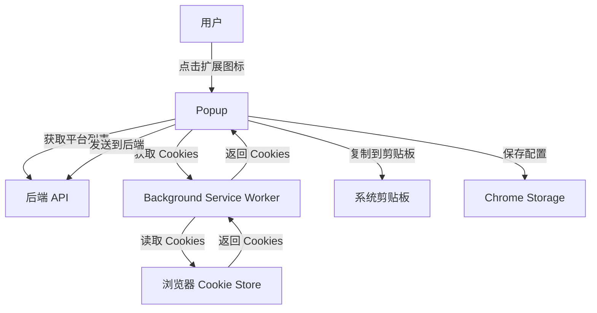

# 浏览器扩展开发指南

本文档介绍 Py Small Admin 浏览器扩展的开发、调试和发布流程。

## 目录

- [概述](#概述)
- [架构说明](#架构说明)
- [开发环境搭建](#开发环境搭建)
- [项目结构](#项目结构)
- [核心组件](#核心组件)
- [开发指南](#开发指南)
- [调试方法](#调试方法)
- [打包发布](#打包发布)
- [常见问题](#常见问题)

## 概述

Py Small Admin 浏览器扩展是一个 Manifest V3 规范的 Chrome/Firefox 扩展，用于一键获取各技术平台（知乎、掘金、CSDN 等）的登录 Cookie，并自动保存到后端系统。

### 主要功能

- **多平台 Cookie 获取**：支持知乎、掘金、CSDN、思否等平台
- **自动识别平台**：根据域名自动识别目标平台
- **Cookie 管理**：复制 Cookie 为 JSON 格式或发送到后端
- **配置管理**：支持自定义后端 API 地址
- **多容器支持**：支持 Chrome 多容器场景

### 技术栈

| 技术       | 版本 | 说明        |
| ---------- | ---- | ----------- |
| React      | 18   | UI 框架     |
| TypeScript | 5    | 类型安全    |
| Ant Design | 5    | UI 组件库   |
| Webpack    | 5    | 构建工具    |
| Manifest   | V3   | 扩展规范    |
| Axios      | 1.x  | HTTP 客户端 |

## 架构说明

### 扩展架构



### 核心组件

| 组件       | 路径                   | 说明                       |
| ---------- | ---------------------- | -------------------------- |
| Manifest   | `source/manifest.json` | 扩展清单文件               |
| Popup      | `source/Popup/`        | 弹出窗口 UI                |
| Background | `source/Background/`   | 后台脚本（Service Worker） |
| Styles     | `source/styles/`       | 全局样式                   |

### 数据流

```
用户操作 → Popup 组件 → Background Service Worker → 浏览器 Cookie API
     ↓
后端 API ← Popup 组件 ← Background Service Worker
```

## 开发环境搭建

### 前置要求

- Node.js 16+ 和 npm/yarn
- Chrome 浏览器（开发）
- Firefox 浏览器（测试）
- 后端服务运行中

### 安装依赖

```bash
# 进入扩展目录
cd browser-extension

# 安装依赖
npm install
# 或
yarn install
```

### 开发模式

```bash
# Chrome 开发模式
npm run dev:chrome

# Firefox 开发模式
npm run dev:firefox
```

### 加载扩展到浏览器

#### Chrome

1. 打开 `chrome://extensions/`
2. 开启"开发者模式"（右上角开关）
3. 点击"加载已解压的扩展程序"
4. 选择 `dist/chrome` 目录
5. 扩展加载成功，可以在工具栏看到扩展图标

#### Firefox

1. 打开 `about:debugging#/runtime/this-firefox`
2. 点击"临时加载附加组件"
3. 选择 `dist/firefox` 目录中的 `.xpi` 文件
4. 扩展加载成功

### 配置后端地址

1. 点击扩展图标
2. 点击右上角设置图标
3. 输入后端 API 地址（如：`http://localhost:8000`）
4. 配置自动保存到 Chrome Storage

## 项目结构

```
browser-extension/
├── package.json              # NPM 配置
├── tsconfig.json             # TypeScript 配置
├── .babelrc                  # Babel 配置
├── .eslintrc.json            # ESLint 配置
├── webpack.config.js         # Webpack 主配置
├── webpack.common.js         # Webpack 通用配置
├── webpack.dev.js            # Webpack 开发配置
├── webpack.prod.js           # Webpack 生产配置
│
├── source/                   # 源代码目录
│   ├── manifest.json         # 扩展清单文件
│   │
│   ├── Popup/                # 弹出窗口组件
│   │   ├── index.tsx         # Popup 入口
│   │   ├── Popup.tsx         # Popup 主组件
│   │   └── styles.less      # Popup 样式
│   │
│   ├── Background/           # 后台脚本
│   │   └── index.ts         # Service Worker 入口
│   │
│   ├── assets/              # 静态资源
│   │   └── icons/          # 扩展图标
│   │       ├── icon-16.png
│   │       ├── icon-32.png
│   │       ├── icon-48.png
│   │       └── icon-128.png
│   │
│   └── styles/              # 全局样式
│       ├── _fonts.less
│       ├── _reset.less
│       └── _variables.less
│
├── views/                   # HTML 模板
│   └── popup.html          # Popup HTML 模板
│
└── dist/                   # 构建输出目录
    ├── chrome/             # Chrome 构建输出
    └── firefox/            # Firefox 构建输出
```

## 核心组件

### Manifest 文件

`source/manifest.json` 是扩展的核心配置文件：

```json
{
  "manifest_version": 3,
  "name": "Py Small Admin Login Helper",
  "version": "1.0.0",
  "description": "Py Small Admin 登录助手，一键获取各技术平台的登录信息",
  "icons": {
    "16": "assets/icons/icon-16.png",
    "32": "assets/icons/icon-32.png",
    "48": "assets/icons/icon-48.png",
    "128": "assets/icons/icon-128.png"
  },
  "action": {
    "default_popup": "popup.html",
    "default_icon": {
      "16": "assets/icons/icon-16.png",
      "32": "assets/icons/icon-32.png",
      "48": "assets/icons/icon-48.png",
      "128": "assets/icons/icon-128.png"
    },
    "default_title": "Py Small Admin 登录助手"
  },
  "permissions": ["cookies", "storage"],
  "host_permissions": ["http://localhost/*", "https://*/*"],
  "background": {
    "service_worker": "js/background.js"
  }
}
```

**关键配置说明**：

| 配置项                      | 说明                            |
| --------------------------- | ------------------------------- |
| `manifest_version`          | 扩展规范版本（V3）              |
| `permissions`               | 扩展权限（cookies、storage）    |
| `host_permissions`          | 主机权限（访问所有 HTTPS 网站） |
| `background.service_worker` | 后台脚本（Service Worker）      |
| `action.default_popup`      | 默认弹出窗口                    |

### Popup 组件

`source/Popup/Popup.tsx` 是扩展的主界面组件：

```typescript
interface Platform {
  id: string;
  name: string;
  domains: string[];
  icon?: string;
}

interface FetchedPlatform {
  platform: Platform;
  cookies: chrome.cookies.Cookie[];
  domains: Set<string>;
  sent: boolean;
  sending: boolean;
}
```

**主要功能**：

1. **获取平台列表**：从后端 API 获取支持的平台列表
2. **获取 Cookies**：从浏览器 Cookie Store 读取各平台的 Cookies
3. **发送到后端**：将 Cookies 发送到后端 API
4. **复制到剪贴板**：将 Cookies 复制为 JSON 格式

**关键方法**：

```typescript
// 获取平台列表
const fetchPlatforms = useCallback(async () => {
  const response = await axios.get(`${state.apiBaseUrl}/api/content/extension/platform/index`);
  // ...
}, [state.apiBaseUrl]);

// 一键获取登录信息
const onGetLoginInfo = async () => {
  // 获取所有 Cookie Stores
  const cookieStores = await chrome.cookies.getAllCookieStores();

  // 遍历所有 Cookie Store 获取 Cookies
  for (const store of cookieStores) {
    const storeCookies = await chrome.cookies.getAll({ storeId: store.id });
    // ...
  }
};

// 发送 Cookies 到后端
const sendPlatformCookies = async (platformId: string, cookies: chrome.cookies.Cookie[]) => {
  await axios.post(`${state.apiBaseUrl}/api/content/extension/platform_account/import_cookies`, {
    cookies: cookies.map(cookie => ({ ... })),
    userAgent: navigator.userAgent,
  });
};
```

### Background Service Worker

`source/Background/index.ts` 是扩展的后台脚本：

```typescript
// 监听扩展安装事件
chrome.runtime.onInstalled.addListener((details) => {
  if (details.reason === "install") {
    console.log("Py Small Admin Login Helper 扩展已安装");
  }
});

// 监听来自 Popup 的消息
chrome.runtime.onMessage.addListener((request, sender, sendResponse) => {
  if (request.action === "getCookies") {
    handleGetCookies(request.domains).then(sendResponse);
    return true;
  }
});

// 获取指定域名的 Cookies
async function handleGetCookies(
  domains: string[],
): Promise<chrome.cookies.Cookie[]> {
  const allCookies: chrome.cookies.Cookie[] = [];

  for (const domain of domains) {
    const cookies = await chrome.cookies.getAll({ domain });
    allCookies.push(...cookies);
  }

  return allCookies;
}
```

**主要功能**：

1. **监听安装事件**：扩展安装/更新时的处理
2. **消息通信**：与 Popup 组件通信
3. **Cookie 操作**：读取浏览器 Cookies

## 开发指南

### 添加新平台

#### 1. 后端添加平台配置

在 `server/Modules/content/models/platform.py` 中添加平台：

```python
class Platform(SQLModel, table=True):
    id: str = Field(default_factory=lambda: str(uuid.uuid4()), primary_key=True)
    name: str = Field(index=True, description="平台名称")
    domains: str = Field(description="平台域名（JSON 数组）")
    # ...
```

#### 2. 扩展自动识别

扩展会自动从后端 API 获取平台列表，无需修改代码。

### 修改 UI

#### 修改 Popup 界面

编辑 `source/Popup/Popup.tsx`：

```typescript
// 添加新功能按钮
<Button type="primary" onClick={onNewFeature}>
  新功能
</Button>

// 添加新状态
const [newState, setNewState] = useState(false);
```

#### 修改样式

编辑 `source/Popup/styles.less`：

```less
.new-feature {
  margin-top: 16px;

  .button {
    width: 100%;
  }
}
```

### 添加新功能

#### 1. 在 Popup 中添加功能

```typescript
// 添加新功能方法
const onNewFeature = async () => {
  try {
    // 功能逻辑
    const result = await axios.post(`${state.apiBaseUrl}/api/new-feature`);
    message.success('操作成功');
  } catch (error) {
    message.error('操作失败');
  }
};

// 在 UI 中添加按钮
<Button onClick={onNewFeature}>新功能</Button>
```

#### 2. 在 Background 中添加功能

```typescript
// 添加新功能监听器
chrome.runtime.onMessage.addListener((request, sender, sendResponse) => {
  if (request.action === "newFeature") {
    handleNewFeature(request.data).then(sendResponse);
    return true;
  }
});

// 处理新功能
async function handleNewFeature(data: any): Promise<any> {
  // 功能逻辑
  return { success: true };
}
```

### 添加权限

编辑 `source/manifest.json`：

```json
{
  "permissions": ["cookies", "storage", "tabs", "activeTab"],
  "host_permissions": ["http://localhost/*", "https://*/*"]
}
```

**常用权限**：

| 权限            | 说明                    |
| --------------- | ----------------------- |
| `cookies`       | 读取和修改 Cookies      |
| `storage`       | 使用 Chrome Storage API |
| `tabs`          | 访问标签页              |
| `activeTab`     | 访问当前标签页          |
| `scripting`     | 注入脚本                |
| `webNavigation` | 监听导航事件            |

## 调试方法

### Chrome 调试

#### 调试 Popup

1. 右键扩展图标
2. 点击"检查弹出内容"
3. 打开开发者工具
4. 在 Console 中查看日志

#### 调试 Background

1. 打开 `chrome://extensions/`
2. 找到扩展，点击"Service Worker"
3. 打开开发者工具
4. 在 Console 中查看日志

#### 查看日志

```typescript
// 在代码中添加日志
console.log("Popup 组件加载");
console.error("错误信息", error);
console.warn("警告信息");
```

### Firefox 调试

#### 调试 Popup

1. 右键扩展图标
2. 点击"检查"
3. 打开开发者工具
4. 在 Console 中查看日志

#### 调试 Background

1. 打开 `about:debugging#/runtime/this-firefox`
2. 找到扩展，点击"检查"
3. 打开开发者工具
4. 在 Console 中查看日志

### 网络请求调试

#### 查看网络请求

1. 打开开发者工具
2. 切换到 Network 标签
3. 执行操作（如获取平台列表）
4. 查看请求和响应

#### 常见网络问题

**问题**：CORS 错误

**解决方案**：确保后端配置了 CORS

```python
# 后端 CORS 配置
from fastapi.middleware.cors import CORSMiddleware

app.add_middleware(
    CORSMiddleware,
    allow_origins=["chrome-extension://*", "moz-extension://*"],
    allow_credentials=True,
    allow_methods=["*"],
    allow_headers=["*"],
)
```

**问题**：网络请求失败

**解决方案**：检查后端地址配置和网络连接

```typescript
// 检查后端地址
console.log("后端地址:", state.apiBaseUrl);

// 检查网络连接
try {
  await axios.get(`${state.apiBaseUrl}/api/health`);
} catch (error) {
  console.error("后端连接失败:", error);
}
```

### Storage 调试

#### 查看 Chrome Storage

1. 打开开发者工具
2. 切换到 Application 标签
3. 展开 Storage → Local Storage
4. 查看 `chrome-extension://` 下的数据

#### 清除 Storage

```typescript
// 清除所有数据
chrome.storage.local.clear();

// 清除特定数据
chrome.storage.local.remove(["apiBaseUrl", "selectedPlatforms"]);
```

### Cookie 调试

#### 查看浏览器 Cookies

1. 打开开发者工具
2. 切换到 Application 标签
3. 展开 Cookies
4. 查看各网站的 Cookies

#### 测试 Cookie 获取

```typescript
// 获取所有 Cookies
const allCookies = await chrome.cookies.getAll({});
console.log("所有 Cookies:", allCookies);

// 获取特定域名的 Cookies
const cookies = await chrome.cookies.getAll({ domain: ".zhihu.com" });
console.log("知乎 Cookies:", cookies);
```

## 打包发布

### 构建生产版本

```bash
# 构建 Chrome 版本
npm run build:chrome

# 构建 Firefox 版本
npm run build:firefox

# 构建所有版本
npm run build
```

### Chrome 发布

#### 准备发布包

```bash
# 构建生产版本
npm run build:chrome

# 打包为 zip
cd dist/chrome
zip -r ../py-small-admin-extension-chrome.zip .
```

#### 发布到 Chrome Web Store

1. 访问 [Chrome Web Store Developer Dashboard](https://chrome.google.com/webstore/devconsole)
2. 登录开发者账号
3. 点击"新建项目"
4. 上传 `py-small-admin-extension-chrome.zip`
5. 填写扩展信息：
   - 名称：Py Small Admin Login Helper
   - 描述：一键获取各技术平台的登录信息
   - 分类：生产力工具
   - 语言：中文（简体）
6. 上传截图和宣传图
7. 填写隐私政策
8. 提交审核

### Firefox 发布

#### 准备发布包

```bash
# 构建生产版本
npm run build:firefox

# 打包为 xpi（Webpack 已自动生成）
# dist/firefox/py-small-admin-extension.xpi
```

#### 发布到 Firefox Add-ons

1. 访问 [Firefox Add-ons Developer Hub](https://addons.mozilla.org/developers/)
2. 登录开发者账号
3. 点击"提交新扩展"
4. 上传 `py-small-admin-extension.xpi`
5. 填写扩展信息：
   - 名称：Py Small Admin Login Helper
   - 描述：一键获取各技术平台的登录信息
   - 分类：生产力工具
   - 语言：中文（简体）
6. 上传截图和宣传图
7. 填写隐私政策
8. 提交审核

### 版本管理

#### 更新版本号

编辑 `source/manifest.json`：

```json
{
  "version": "1.1.0"
}
```

#### 版本号格式

遵循 [语义化版本](https://semver.org/)：

- `MAJOR.MINOR.PATCH`
- `MAJOR`：不兼容的 API 修改
- `MINOR`：向下兼容的功能新增
- `PATCH`：向下兼容的问题修复

#### 发布流程

1. 更新版本号
2. 测试新功能
3. 构建生产版本
4. 打包发布包
5. 提交到应用商店
6. 等待审核
7. 发布更新

## 常见问题

### 1. 扩展无法加载

**问题**：加载扩展时报错

**原因**：Manifest 文件格式错误或权限问题

**解决方案**：

```bash
# 检查 Manifest 文件格式
cat source/manifest.json | jq .

# 检查构建输出
ls -la dist/chrome/

# 重新构建
npm run build:chrome
```

### 2. Cookie 获取失败

**问题**：无法获取网站的 Cookies

**原因**：权限不足或域名配置错误

**解决方案**：

```json
// 检查 manifest.json 中的权限
{
  "permissions": ["cookies"],
  "host_permissions": ["https://*/*"]
}

// 检查域名配置
const domains = [".zhihu.com", "juejin.cn"];
```

### 3. 后端连接失败

**问题**：无法连接到后端 API

**原因**：后端地址配置错误或 CORS 问题

**解决方案**：

```typescript
// 检查后端地址配置
console.log("后端地址:", state.apiBaseUrl);

// 测试连接
try {
  await axios.get(`${state.apiBaseUrl}/api/health`);
} catch (error) {
  console.error("后端连接失败:", error);
}

// 检查 CORS 配置（后端）
app.add_middleware(
  CORSMiddleware,
  (allow_origins = ["chrome-extension://*"]),
  (allow_credentials = True),
  (allow_methods = ["*"]),
  (allow_headers = ["*"]),
);
```

### 4. 扩展图标不显示

**问题**：扩展图标显示为默认图标

**原因**：图标文件路径错误或文件不存在

**解决方案**：

```bash
# 检查图标文件
ls -la source/assets/icons/

# 检查 manifest.json 中的图标路径
{
  "icons": {
    "16": "assets/icons/icon-16.png",
    "32": "assets/icons/icon-32.png",
    "48": "assets/icons/icon-48.png",
    "128": "assets/icons/icon-128.png"
  }
}

# 重新构建
npm run build:chrome
```

### 5. 开发模式下热更新不生效

**问题**：修改代码后扩展没有更新

**原因**：Webpack 配置问题或需要手动重新加载扩展

**解决方案**：

```bash
# 停止开发服务器
Ctrl + C

# 清除构建缓存
rm -rf dist/

# 重新启动开发服务器
npm run dev:chrome

# 在浏览器中重新加载扩展
chrome://extensions/ → 点击刷新按钮
```

### 6. TypeScript 类型错误

**问题**：编译时报 TypeScript 类型错误

**原因**：类型定义缺失或类型不匹配

**解决方案**：

```typescript
// 安装类型定义
npm install --save-dev @types/chrome @types/node

// 添加类型断言
const cookies: chrome.cookies.Cookie[] = await chrome.cookies.getAll({});

// 扩展类型定义
interface Platform {
  id: string;
  name: string;
  domains: string[];
}
```

### 7. 构建失败

**问题**：执行 `npm run build` 时报错

**原因**：依赖问题或配置错误

**解决方案**：

```bash
# 清除 node_modules 和缓存
rm -rf node_modules package-lock.json
npm install

# 检查 Webpack 配置
cat webpack.config.js

# 查看详细错误信息
npm run build:chrome --verbose
```

### 8. 审核被拒绝

**问题**：扩展提交审核后被拒绝

**原因**：违反应用商店政策或缺少必要信息

**解决方案**：

**常见拒绝原因**：

1. **缺少隐私政策**
   - 添加隐私政策页面
   - 说明数据收集和使用方式

2. **权限过度**
   - 只请求必要的权限
   - 在描述中说明权限用途

3. **功能描述不清晰**
   - 详细说明扩展功能
   - 提供使用截图

4. **代码质量问题**
   - 检查代码安全性
   - 移除调试代码

**审核通过技巧**：

- 提供详细的使用说明
- 上传高质量截图
- 编写清晰的隐私政策
- 确保代码质量
- 测试所有功能

## 参考资源

- [Chrome Extension 开发文档](https://developer.chrome.com/docs/extensions/)
- [Firefox Extension 开发文档](https://developer.mozilla.org/en-US/docs/Mozilla/Add-ons/WebExtensions)
- [Manifest V3 迁移指南](https://developer.chrome.com/docs/extensions/mv3/intro/)
- [React 官方文档](https://react.dev/)
- [Ant Design 组件库](https://ant.design/)
- [Webpack 配置指南](https://webpack.js.org/configuration/)
