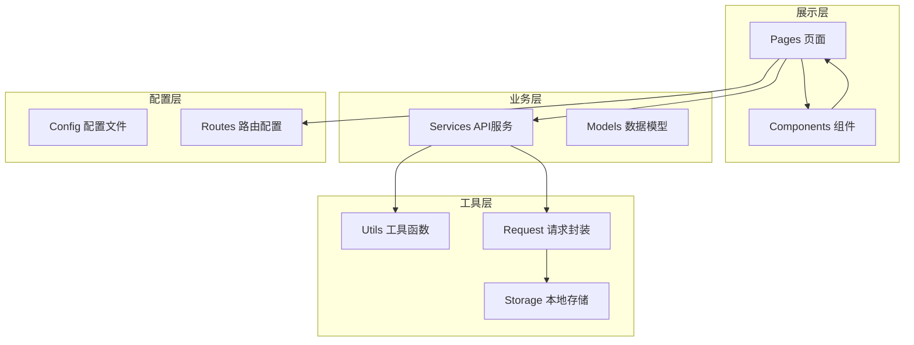
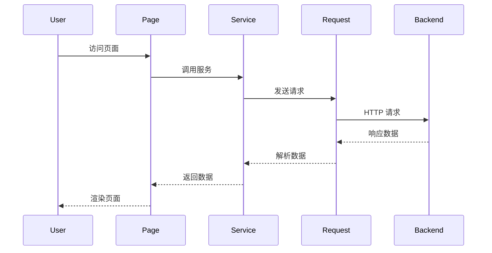
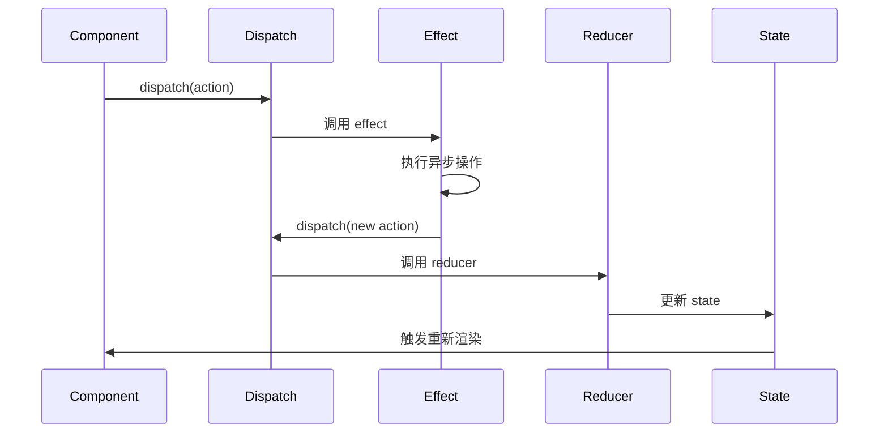

# 前端架构

本文档介绍了 Py Small Admin 前端的架构设计。

## 整体架构

### 技术栈

| 技术 | 版本 | 说明 |
|------|------|------|
| React | 19.1.0 | UI 框架 |
| Umi Max | 4.3.24 | 企业级前端框架 |
| TypeScript | 5.6.3 | 类型安全 |
| Ant Design | 5.25.4 | UI 组件库 |
| Pro Components | 2.7.19 | 高级业务组件 |

### 架构层次



## 目录结构

```
admin-web/
├── config/               # 配置文件
│   ├── config.ts        # 主配置
│   ├── routes/          # 路由配置
│   │   ├── index.ts
│   │   ├── admin.ts
│   │   └── quant.ts
│   ├── defaultSettings.ts # 默认设置
│   └── proxy.ts         # 代理配置
├── src/                  # 源代码
│   ├── pages/           # 页面组件
│   │   ├── admin/
│   │   │   ├── dashboard/
│   │   │   ├── auth/
│   │   │   └── sys/
│   │   ├── quant/
│   │   ├── login/
│   │   └── 404.tsx
│   ├── services/        # API 服务
│   │   ├── admin/
│   │   └── quant/
│   ├── components/      # 公共组件
│   │   ├── common/
│   │   ├── Upload/
│   │   ├── Footer/
│   │   └── RightContent/
│   ├── utils/           # 工具函数
│   │   ├── request.ts
│   │   ├── storage.ts
│   │   └── utils.ts
│   ├── app.tsx          # 应用入口
│   ├── global.tsx       # 全局样式
│   ├── global.less      # 全局样式
│   └── typings.d.ts      # 类型定义
├── public/             # 静态资源
└── .env                # 环境变量
```

## 核心概念

### 1. 页面（Pages）

页面是独立的路由组件，负责展示完整的页面内容。

**示例**：管理员列表页面

```typescript
import { PageContainer, ProTable } from '@ant-design/pro-components';
import { Button } from 'antd';
import { PlusOutlined } from '@ant-design/icons';

export default function AdminList() {
  return (
    <PageContainer>
      <ProTable
        columns={[
          {
            title: 'ID',
            dataIndex: 'id',
            width: 80,
          },
          {
            title: '姓名',
            dataIndex: 'name',
          },
          {
            title: '用户名',
            dataIndex: 'username',
          },
        ]}
        request={async (params) => {
          const response = await getAdminList(params);
          return {
            data: response.data.items,
            success: true,
            total: response.data.total,
          };
        }}
        toolBarRender={() => [
          <Button key="add" type="primary" icon={<PlusOutlined />}>
            添加
          </Button>,
        ]}
      />
    </PageContainer>
  );
}
```

### 2. 组件（Components）

组件是可复用的 UI 片段，分为页面组件和公共组件。

**公共组件示例**：删除确认组件

```typescript
import { Modal, message } from 'antd';
import { ExclamationCircleOutlined } from '@ant-design/icons';

interface CDelProps {
  title?: string;
  content?: string;
  onConfirm: () => Promise<void>;
}

export default function CDel({ 
  title = '确认删除？',
  content = '删除后无法恢复，是否继续？',
  onConfirm 
}: CDelProps) {
  const handleDelete = () => {
    Modal.confirm({
      title,
      icon: <ExclamationCircleOutlined />,
      content,
      okText: '确定',
      cancelText: '取消',
      onOk: async () => {
        try {
          await onConfirm();
          message.success('删除成功');
        } catch (error) {
          message.error('删除失败');
        }
      },
    });
  };

  return (
    <a onClick={handleDelete}>
      删除
    </a>
  );
}
```

### 3. 服务（Services）

服务层负责与后端 API 交互，统一管理 API 调用。

**示例**：管理员服务

```typescript
import { request } from '@/utils/request';
import { BaseResponse, PaginationResponse } from '@/typings';

export interface Admin {
  id: number;
  name: string;
  username: string;
  phone?: string;
  status: number;
  group_id?: number;
}

export interface AdminListParams extends PaginationParams {
  keyword?: string;
  status?: number;
}

export interface AdminCreateParams {
  name: string;
  username: string;
  password: string;
  phone?: string;
  group_id?: number;
}

export async function getAdminList(params: AdminListParams): Promise<BaseResponse<PaginationResponse<Admin>>> {
  return request('/admin/admin/index', {
    method: 'GET',
    params,
  });
}

export async function createAdmin(data: AdminCreateParams): Promise<BaseResponse<Admin>> {
  return request('/admin/admin/add', {
    method: 'POST',
    data,
  });
}

export async function updateAdmin(id: number, data: Partial<AdminCreateParams>): Promise<BaseResponse<Admin>> {
  return request(`/admin/admin/update/${id}`, {
    method: 'PUT',
    data,
  });
}

export async function deleteAdmin(id: number): Promise<BaseResponse<null>> {
  return request(`/admin/admin/destroy/${id}`, {
    method: 'DELETE',
  });
}
```

### 4. 工具函数（Utils）

工具函数提供通用功能，如请求封装、本地存储等。

**请求封装示例**：

```typescript
import { extend } from 'umi-request';
import { message, notification } from 'antd';

const request = extend({
  errorHandler: (error: any) => {
    const { response } = error;
    if (response) {
      switch (response.status) {
        case 401:
          notification.error({
            message: '未登录',
            description: '登录已过期，请重新登录',
          });
          // 跳转登录页
          window.location.href = '/login';
          break;
        case 403:
          message.error('没有权限访问');
          break;
        case 404:
          message.error('请求的资源不存在');
          break;
        case 500:
          message.error('服务器错误');
          break;
        default:
          message.error(`请求错误: ${response.status}`);
      }
    } else {
      message.error('网络错误，请检查网络连接');
    }
    throw error;
  },
});

// 请求拦截器：自动添加 Token
request.interceptors.request.use((url, options) => {
  const token = localStorage.getItem('access_token');
  if (token) {
    options.headers = {
      ...options.headers,
      Authorization: `Bearer ${token}`,
    };
  }
  return { url, options };
});

// 响应拦截器：自动刷新 Token
request.interceptors.response.use(async (response, options) => {
  const { status } = response;
  
  if (status === 401 && !options.skipAuth) {
    const refreshToken = localStorage.getItem('refresh_token');
    if (refreshToken) {
      try {
        const refreshResponse = await request('/admin/common/refresh_token', {
          method: 'POST',
          data: { refresh_token: refreshToken },
        });
        
        const newAccessToken = refreshResponse.data.access_token;
        localStorage.setItem('access_token', newAccessToken);
        
        // 重试原始请求
        return request(options.url, options);
      } catch (error) {
        // 刷新失败，清除令牌并跳转登录页
        localStorage.removeItem('access_token');
        localStorage.removeItem('refresh_token');
        window.location.href = '/login';
        throw error;
      }
    }
  }
  
  return response;
});

export default request;
```

### 5. 配置（Config）

配置文件管理应用的配置、路由、代理等。

**主配置示例**：

```typescript
import { defineConfig } from '@umijs/max';

export default defineConfig({
  antd: {},
  access: {},
  model: {},
  initialState: {},
  request: {},
  layout: {
    name: 'Py Small Admin',
    locale: false,
    siderWidth: 256,
  },
  routes: [
    {
      path: '/',
      redirect: '/admin/dashboard',
    },
    {
      path: '/admin',
      routes: [
        {
          path: '/dashboard',
          component: './admin/dashboard',
        },
      ],
    },
  ],
  proxy: {
    '/api': {
      target: 'http://localhost:8000',
      changeOrigin: true,
    },
  },
});
```

## 状态管理

### Umi Model

使用 Umi Model 进行全局状态管理。

**示例**：用户状态

```typescript
import { Model } from '@umijs/max';

export interface AdminModelState {
  currentUser?: API.CurrentUser;
  fetching?: boolean;
}

export type AdminModelType = {
  namespace: 'admin';
  state: AdminModelState;
  effects: {
    fetchCurrentUser: Effect;
  };
  reducers: {
    saveCurrentUser: Reducer<AdminModelState>;
    changeFetchStatus: Reducer<AdminModelState, boolean>;
  };
};

const AdminModel: ModelType<AdminModelType> = {
  namespace: 'admin',
  
  state: {
    currentUser: undefined,
    fetching: false,
  },
  
  effects: {
    *fetchCurrentUser(_, { call, put }) {
      yield put({
        type: 'changeFetchStatus',
        payload: true,
      });
      
      try {
        const response = yield call(getCurrentUserAPI);
        yield put({
          type: 'saveCurrentUser',
          payload: response.data,
        });
      } catch (error) {
        console.error(error);
      } finally {
        yield put({
          type: 'changeFetchStatus',
          payload: false,
        });
      }
    },
  },
  
  reducers: {
    saveCurrentUser(state, action) {
      return {
        ...state,
        currentUser: action.payload || {},
      };
    },
    changeFetchStatus(state, action) {
      return {
        ...state,
        fetching: action.payload,
      };
    },
  },
};

export default AdminModel;
```

## 路由配置

### 路由定义

使用 `config/routes/` 管理路由。

**Admin 模块路由**：

```typescript
export default [
  {
    path: '/admin',
    routes: [
      {
        path: '/dashboard',
        component: './admin/dashboard',
        name: '仪表盘',
        icon: 'DashboardOutlined',
      },
      {
        path: '/auth',
        name: '认证管理',
        icon: 'LockOutlined',
        routes: [
          {
            path: '/admin',
            component: './admin/auth/admin',
            name: '管理员管理',
          },
          {
            path: '/group',
            component: './admin/auth/group',
            name: '角色管理',
          },
          {
            path: '/rule',
            component: './admin/auth/rule',
            name: '菜单管理',
          },
        ],
      },
    ],
  },
];
```

### 路由权限

使用 `access` 进行路由权限控制。

```typescript
// src/access.ts
export default (initialState: { currentUser?: API.CurrentUser }) => {
  const { currentUser } = initialState || {};
  const rules = currentUser?.rules || [];
  
  return {
    canAdmin: rules.includes(1),
    canUser: rules.includes(2),
  };
};
```

```typescript
// 在路由中使用
{
  name: '管理员管理',
  path: '/admin',
  component: './admin/auth/admin',
  access: 'canAdmin',
}
```

## 数据流

### 数据获取流程



### 状态更新流程



## 性能优化

### 1. 按需加载

使用路由懒加载：

```typescript
export default [
  {
    path: '/admin',
    routes: [
      {
        path: '/dashboard',
        component: './admin/dashboard', // 自动按需加载
      },
    ],
  },
];
```

### 2. 代码分割

使用动态 import：

```typescript
const Dashboard = React.lazy(() => import('./admin/dashboard'));

function App() {
  return (
    <Suspense fallback={<Loading />}>
      <Dashboard />
    </Suspense>
  );
}
```

### 3. 组件缓存

使用 `React.memo` 缓存组件：

```typescript
export default React.memo(function MyComponent({ data }) {
  return <div>{data.name}</div>;
});
```

### 4. 虚拟滚动

对于大列表，使用虚拟滚动：

```typescript
import { List } from 'react-virtualized';

function MyList({ items }) {
  return (
    <List
      width={300}
      height={300}
      rowCount={items.length}
      rowHeight={20}
      rowRenderer={({ index, key, style }) => (
        <div key={key} style={style}>
          {items[index].name}
        </div>
      )}
    />
  );
}
```

## 类型安全

### TypeScript 类型定义

```typescript
// src/typings.d.ts
declare namespace API {
  interface CurrentUser {
    id: number;
    name: string;
    username: string;
    avatar?: string;
    group_id?: number;
    group_name?: string;
    rules?: number[];
  }

  interface Admin {
    id: number;
    name: string;
    username: string;
    phone?: string;
    status: number;
    group_id?: number;
    created_at: string;
    updated_at: string;
  }

  interface PaginationParams {
    page?: number;
    size?: number;
    sort_field?: string;
    sort_order?: 'asc' | 'desc';
  }

  interface PaginationResponse<T> {
    items: T[];
    total: number;
    page: number;
    size: number;
  }

  interface BaseResponse<T = any> {
    code: number;
    message: string;
    data: T;
  }
}
```

## 最佳实践

### 1. 组件复用

提取公共逻辑到自定义 Hook：

```typescript
function useAdminList(params: PaginationParams) {
  const [data, setData] = useState<API.PaginationResponse<API.Admin>>();
  const [loading, setLoading] = useState(false);

  const fetchData = async () => {
    setLoading(true);
    try {
      const response = await getAdminList(params);
      setData(response.data);
    } catch (error) {
      console.error(error);
    } finally {
      setLoading(false);
    }
  };

  useEffect(() => {
    fetchData();
  }, [params]);

  return { data, loading, fetchData };
}
```

### 2. 错误边界

使用错误边界捕获组件错误：

```typescript
class ErrorBoundary extends React.Component {
  state = { hasError: false };

  static getDerivedStateFromError(error: any) {
    return { hasError: true };
  }

  componentDidCatch(error: any, errorInfo: any) {
    console.error('Error caught by boundary:', error, errorInfo);
  }

  render() {
    if (this.state.hasError) {
      return <div>出错了，请刷新页面</div>;
    }
    return this.props.children;
  }
}
```

### 3. 表单验证

使用 Ant Design 表单验证：

```typescript
const [form] = Form.useForm();

const onFinish = async (values: any) => {
  try {
    await form.validateFields();
    await createAdmin(values);
    message.success('创建成功');
  } catch (error) {
    message.error('验证失败');
  }
};

<Form form={form} onFinish={onFinish}>
  <Form.Item
    name="name"
    label="姓名"
    rules={[{ required: true, message: '请输入姓名' }]}
  >
    <Input />
  </Form.Item>
  <Button type="primary" htmlType="submit">
    提交
  </Button>
</Form>
```