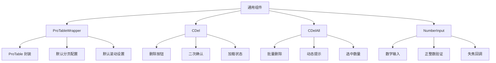

# 通用组件指南

本文档介绍 Py Small Admin 前端项目中的通用组件。

## 组件概览



## 目录结构

```
src/components/common/
├── ProTableWrapper/
│   └── index.tsx          # ProTable 包装组件
├── CDel/
│   └── index.tsx          # 删除按钮组件
├── CDelAll/
│   └── index.tsx          # 批量删除组件
└── NumberInput/
    └── index.tsx          # 数字输入组件
```

## ProTableWrapper 组件

ProTableWrapper 是对 Ant Design Pro Table 的封装，提供了全局默认配置。

### 组件特点

- 统一的分页配置
- 默认滚动设置
- 默认工具栏选项
- 统一的选中提示样式

### 默认配置

```typescript
const DEFAULT_PAGINATION = {
  showSizeChanger: true,           // 显示页码切换器
  pageSizeOptions: ['10', '20', '50', '100', '500'],
  showQuickJumper: true,           // 显示快速跳转
  showTotal: (total: number) => `共 ${total} 条数据`,
  size: 'middle',
  disabled: false,
};
```

### 基础用法

```typescript
import ProTableWrapper from '@/components/common/ProTableWrapper';

const UserList = () => {
  const columns = [
    { title: 'ID', dataIndex: 'id' },
    { title: '用户名', dataIndex: 'username' },
    { title: '邮箱', dataIndex: 'email' },
  ];

  return (
    <ProTableWrapper
      columns={columns}
      request={async (params) => {
        const response = await getUserList(params);
        return {
          data: response.data.list,
          success: true,
          total: response.data.total,
        };
      }}
      rowKey="id"
      search={{
        labelWidth: 'auto',
      }}
      options={{
        fullScreen: true,
        setting: {
          listsHeight: 400,
        },
      }}
    />
  );
};
```

### 自定义分页

```typescript
<ProTableWrapper
  columns={columns}
  request={request}
  pagination={{
    pageSize: 20,
    current: 1,
    showSizeChanger: true,
  }}
/>
```

### 禁用分页

```typescript
<ProTableWrapper
  columns={columns}
  dataSource={data}
  pagination={false}
/>
```

### 自定义滚动

```typescript
<ProTableWrapper
  columns={columns}
  request={request}
  scroll={{ x: 1500, y: 500 }}
/>
```

### 完整配置示例

```typescript
<ProTableWrapper
  // 列配置
  columns={columns}

  // 数据请求
  request={async (params, sort, filter) => {
    const response = await queryUserList({
      page: params.current,
      size: params.pageSize,
      ...params,
    });
    return {
      data: response.data.list,
      success: true,
      total: response.data.total,
    };
  }}

  // 行唯一标识
  rowKey="id"

  // 工具栏
  toolbar={{
    title: '用户列表',
    tooltip: '这是用户管理页面',
    search: {
      onSearch: (value: string) => {
        console.log(value);
      },
    },
    actions: [
      <Button key="add" type="primary">
        添加用户
      </Button>,
    ],
  }}

  // 表格设置
  options={{
    density: true,        // 密度
    fullScreen: true,     // 全屏
    reload: true,         // 刷新
    setting: true,        // 列设置
    setting: {
      listsHeight: 400,
    },
  }}

  // 搜索配置
  search={{
    labelWidth: 'auto',
    span: 6,
    defaultCollapsed: false,
  }}

  // 分页配置
  pagination={{
    defaultPageSize: 20,
    showSizeChanger: true,
    showQuickJumper: true,
  }}

  // 行选择
  rowSelection={{
    onChange: (selectedRowKeys, selectedRows) => {
      console.log(selectedRowKeys, selectedRows);
    },
  }}

  // 滚动配置
  scroll={{ x: 1300, y: 'calc(100vh - 400px)' }}
/>
```

### 数据类型

```typescript
interface ProTableWrapperProps<T, U> extends ProTableProps<T, U> {
  columns: ProColumns<T>[];
  request?: (params: any, sort: any, filter: any) => Promise<any>;
  dataSource?: T[];
  rowKey?: string | ((record: T) => string);
  pagination?: PaginationConfig | false;
  scroll?: { x?: number | string; y?: number | string };
  search?: SearchConfig;
  toolbar?: ToolbarConfig;
  options?: OptionsConfig;
  rowSelection?: RowSelectionConfig<T>;
}
```

## CDel 组件

CDel 是一个带二次确认的删除按钮组件。

### 组件特点

- 二次确认弹窗
- 加载状态
- 可自定义提示文案
- 可禁用状态

### 基础用法

```typescript
import CDel from '@/components/common/CDel';

const UserList = () => {
  const handleDelete = async () => {
    await deleteUser(id);
    message.success('删除成功');
    fetchUserList();
  };

  return <CDel onCancel={handleDelete} />;
};
```

### 带参数删除

```typescript
const handleDelete = async () => {
  await deleteUser(userId);
  message.success('删除成功');
  // 刷新列表
  actionRef.current?.reload();
};

<CDel onCancel={handleDelete} />
```

### 自定义提示文案

```typescript
<CDel
  onCancel={handleDelete}
  title="您确定要删除该用户吗？删除后无法恢复！"
/>
```

### 禁用状态

```typescript
<CDel
  onCancel={handleDelete}
  disabled={!canDelete}
/>
```

### 在表格中使用

```typescript
const columns = [
  { title: 'ID', dataIndex: 'id' },
  { title: '用户名', dataIndex: 'username' },
  {
    title: '操作',
    render: (_, record) => (
      <Space>
        <a onClick={() => handleEdit(record)}>编辑</a>
        <CDel
          onCancel={() => handleDelete(record.id)}
          title={`确定要删除用户"${record.username}"吗？`}
        />
      </Space>
    ),
  },
];
```

### 组件 Props

```typescript
interface CDelProps {
  onCancel?: () => Promise<void> | void;  // 确认删除回调
  title?: string;                          // 确认提示文案
  disabled?: boolean;                      // 是否禁用
}

// 默认值
CDel.defaultProps = {
  title: '您确定要删除该项数据吗？',
  disabled: false,
};
```

### 完整示例

```typescript
import CDel from '@/components/common/CDel';

const UserPage = () => {
  const [selectedRows, setSelectedRows] = useState<API.AdminUser[]>([]);

  const handleDelete = async (id: number) => {
    try {
      await deleteUser(id);
      message.success('删除成功');
      actionRef.current?.reload();
    } catch (error) {
      message.error('删除失败');
    }
  };

  const columns = [
    { title: 'ID', dataIndex: 'id', width: 80 },
    { title: '用户名', dataIndex: 'username', width: 120 },
    { title: '邮箱', dataIndex: 'email', width: 200 },
    {
      title: '状态',
      dataIndex: 'is_active',
      width: 80,
      render: (_, record) => (
        <Tag color={record.is_active ? 'success' : 'default'}>
          {record.is_active ? '启用' : '禁用'}
        </Tag>
      ),
    },
    {
      title: '操作',
      width: 150,
      fixed: 'right',
      render: (_, record) => (
        <Space>
          <Button type="link" size="small" onClick={() => handleEdit(record)}>
            编辑
          </Button>
          <CDel
            onCancel={() => handleDelete(record.id)}
            title={`确定删除用户"${record.username}"吗？`}
          />
        </Space>
      ),
    },
  ];

  return (
    <ProTableWrapper
      columns={columns}
      request={fetchUserList}
      rowKey="id"
    />
  );
};
```

## CDelAll 组件

CDelAll 是批量删除组件，根据选中数量动态显示提示文案。

### 组件特点

- 批量删除确认
- 动态显示选中数量
- 加载状态
- 可自定义提示文案

### 基础用法

```typescript
import CDelAll from '@/components/common/CDelAll';

const UserList = () => {
  const [selectedRowKeys, setSelectedRowKeys] = useState<number[]>([]);

  const handleBatchDelete = async () => {
    await batchDeleteUsers(selectedRowKeys);
    message.success('批量删除成功');
    setSelectedRowKeys([]);
    actionRef.current?.reload();
  };

  return (
    <CDelAll
      count={selectedRowKeys.length}
      onCancel={handleBatchDelete}
    />
  );
};
```

### 自定义提示文案

```typescript
<CDelAll
  count={selectedRows.length}
  onCancel={handleBatchDelete}
  title="确定要批量删除这些用户吗？此操作不可恢复！"
/>
```

### 禁用状态

```typescript
<CDelAll
  count={selectedRows.length}
  onCancel={handleBatchDelete}
  disabled={selectedRows.length === 0}
/>
```

### 在表格工具栏中使用

```typescript
const UserPage = () => {
  const [selectedRowKeys, setSelectedRowKeys] = useState<number[]>([]);

  const handleBatchDelete = async () => {
    try {
      await batchDeleteUsers(selectedRowKeys);
      message.success(`成功删除 ${selectedRowKeys.length} 条数据`);
      setSelectedRowKeys([]);
      actionRef.current?.reload();
    } catch (error) {
      message.error('批量删除失败');
    }
  };

  return (
    <ProTableWrapper
      columns={columns}
      request={fetchUserList}
      rowKey="id"
      rowSelection={{
        selectedRowKeys,
        onChange: setSelectedRowKeys,
      }}
      toolbar={{
        actions: [
          <CDelAll
            key="batchDelete"
            count={selectedRowKeys.length}
            onCancel={handleBatchDelete}
            disabled={selectedRowKeys.length === 0}
          />,
        ],
      }}
    />
  );
};
```

### 组件 Props

```typescript
interface CDelAllProps {
  onCancel?: () => Promise<void> | void;  // 确认删除回调
  title?: string;                          // 确认提示文案
  disabled?: boolean;                      // 是否禁用
  count: number;                           // 选中数量
}
```

### 完整示例

```typescript
import CDelAll from '@/components/common/CDelAll';
import CDel from '@/components/common/CDel';

const UserPage = () => {
  const [selectedRowKeys, setSelectedRowKeys] = useState<number[]>([]);
  const [selectedRows, setSelectedRows] = useState<API.AdminUser[]>([]);

  const handleBatchDelete = async () => {
    try {
      await batchDeleteUsers(selectedRowKeys);
      message.success(`成功删除 ${selectedRowKeys.length} 条数据`);
      setSelectedRowKeys([]);
      setSelectedRows([]);
      actionRef.current?.reload();
    } catch (error) {
      message.error('批量删除失败');
    }
  };

  const handleDelete = async (id: number) => {
    try {
      await deleteUser(id);
      message.success('删除成功');
      actionRef.current?.reload();
    } catch (error) {
      message.error('删除失败');
    }
  };

  const columns = [
    { title: 'ID', dataIndex: 'id', width: 80 },
    { title: '用户名', dataIndex: 'username', width: 120 },
    { title: '邮箱', dataIndex: 'email', width: 200 },
    {
      title: '操作',
      width: 120,
      fixed: 'right',
      render: (_, record) => (
        <CDel onCancel={() => handleDelete(record.id)} />
      ),
    },
  ];

  return (
    <ProTableWrapper
      columns={columns}
      request={fetchUserList}
      rowKey="id"
      rowSelection={{
        selectedRowKeys,
        onChange: (keys, rows) => {
          setSelectedRowKeys(keys);
          setSelectedRows(rows);
        },
      }}
      toolbar={{
        title: '用户列表',
        actions: [
          <Button
            key="add"
            type="primary"
            onClick={() => setModalVisible(true)}
          >
            新建用户
          </Button>,
          <CDelAll
            key="batchDelete"
            count={selectedRowKeys.length}
            onCancel={handleBatchDelete}
            disabled={selectedRowKeys.length === 0}
          />,
        ],
      }}
      tableAlertRender={({ selectedRowKeys, onCleanSelected }) => (
        <Space size={24}>
          <span>
            已选 <a>{selectedRowKeys.length}</a> 项
            <a style={{ marginLeft: 8 }} onClick={onCleanSelected}>
              取消选择
            </a>
          </span>
        </Space>
      )}
    />
  );
};
```

## NumberInput 组件

NumberInput 是一个数字输入组件，限制只能输入正整数。

### 组件特点

- 只允许输入正整数
- 输入时实时验证
- 失焦时返回数值
- 可配置最大长度

### 基础用法

```typescript
import NumberInput from '@/components/common/NumberInput';

const UserForm = () => {
  const handleSortBlur = (value: number) => {
    console.log('排序值:', value);
    // 保存排序值
    updateSort(value);
  };

  return (
    <Form.Item label="排序" name="sort">
      <NumberInput
        value={sortValue}
        onBlur={handleSortBlur}
      />
    </Form.Item>
  );
};
```

### 自定义占位符

```typescript
<NumberInput
  value={value}
  placeholder="请输入排序值"
  onBlur={handleSortBlur}
/>
```

### 限制最大长度

```typescript
<NumberInput
  value={value}
  maxLength={5}
  onBlur={handleSortBlur}
/>
```

### 在表格中使用

```typescript
const columns = [
  { title: 'ID', dataIndex: 'id' },
  { title: '名称', dataIndex: 'name' },
  {
    title: '排序',
    dataIndex: 'sort',
    render: (_, record) => (
      <NumberInput
        key={record.id}
        value={String(record.sort)}
        placeholder="请输入排序"
        onBlur={async (value) => {
          await updateSort(record.id, value);
          message.success('更新成功');
        }}
      />
    ),
  },
];
```

### 表单中使用

```typescript
const UserForm = ({ initialValues }) => {
  const [form] = Form.useForm();

  const handleSortChange = (value: number) => {
    form.setFieldValue('sort', value);
  };

  return (
    <Form
      form={form}
      initialValues={initialValues}
      onFinish={handleSubmit}
    >
      <Form.Item
        label="排序"
        name="sort"
        rules={[{ required: true, message: '请输入排序值' }]}
      >
        <NumberInput
          placeholder="请输入排序"
          onBlur={handleSortChange}
        />
      </Form.Item>

      <Form.Item>
        <Button type="primary" htmlType="submit">
          提交
        </Button>
      </Form.Item>
    </Form>
  );
};
```

### 组件 Props

```typescript
interface NumberInputProps {
  value: string;                           // 输入值
  placeholder?: string;                    // 占位符
  onBlur?: (value: number) => void;        // 失焦回调
  maxLength?: number;                      // 最大长度
  key?: number | string;                   // React key
}

// 默认值
NumberInput.defaultProps = {
  value: '',
  placeholder: '请输入排序',
  maxLength: 11,
};
```

### 验证规则

```typescript
// 只允许输入正整数
const reg = /^[1-9]\d*$/;

// 符合条件：1, 10, 100, 9999
// 不符合条件：0, -1, 1.5, abc, 01
```

### 完整示例

```typescript
import NumberInput from '@/components/common/NumberInput';

const CategoryPage = () => {
  const [categories, setCategories] = useState<API.Category[]>([]);

  const handleSortUpdate = async (id: number, sort: number) => {
    try {
      await updateCategorySort(id, sort);
      message.success('排序更新成功');
      fetchCategories();
    } catch (error) {
      message.error('排序更新失败');
    }
  };

  const columns = [
    {
      title: 'ID',
      dataIndex: 'id',
      width: 80,
    },
    {
      title: '分类名称',
      dataIndex: 'name',
      width: 200,
    },
    {
      title: '排序',
      dataIndex: 'sort',
      width: 150,
      render: (_, record) => (
        <NumberInput
          key={record.id}
          value={String(record.sort)}
          placeholder="请输入排序"
          maxLength={5}
          onBlur={(value) => handleSortUpdate(record.id, value)}
        />
      ),
    },
    {
      title: '创建时间',
      dataIndex: 'created_at',
      width: 180,
    },
  ];

  return (
    <ProTableWrapper
      columns={columns}
      request={fetchCategories}
      rowKey="id"
      pagination={false}
      search={false}
      toolBarRender={false}
    />
  );
};
```

## 组件组合使用

### 完整的 CRUD 页面

```typescript
import CDel from '@/components/common/CDel';
import CDelAll from '@/components/common/CDelAll';
import NumberInput from '@/components/common/NumberInput';

const UserManagement = () => {
  const [selectedRowKeys, setSelectedRowKeys] = useState<number[]>([]);
  const [modalVisible, setModalVisible] = useState(false);
  const [editingRecord, setEditingRecord] = useState<API.AdminUser>();
  const actionRef = useRef<ActionType>();

  // 获取用户列表
  const fetchUserList = async (params: any) => {
    const response = await getUserList({
      page: params.current,
      size: params.pageSize,
      ...params,
    });
    return {
      data: response.data.list,
      success: true,
      total: response.data.total,
    };
  };

  // 删除用户
  const handleDelete = async (id: number) => {
    await deleteUser(id);
    message.success('删除成功');
    actionRef.current?.reload();
  };

  // 批量删除
  const handleBatchDelete = async () => {
    await batchDeleteUsers(selectedRowKeys);
    message.success(`成功删除 ${selectedRowKeys.length} 条数据`);
    setSelectedRowKeys([]);
    actionRef.current?.reload();
  };

  // 排序更新
  const handleSortUpdate = async (id: number, sort: number) => {
    await updateUserSort(id, sort);
    message.success('排序更新成功');
    actionRef.current?.reload();
  };

  const columns = [
    { title: 'ID', dataIndex: 'id', width: 80, sorter: true },
    { title: '用户名', dataIndex: 'username', width: 120 },
    { title: '邮箱', dataIndex: 'email', width: 200 },
    {
      title: '状态',
      dataIndex: 'is_active',
      width: 100,
      valueEnum: {
        true: { text: '启用', status: 'Success' },
        false: { text: '禁用', status: 'Default' },
      },
    },
    {
      title: '排序',
      dataIndex: 'sort',
      width: 150,
      render: (_, record) => (
        <NumberInput
          key={record.id}
          value={String(record.sort)}
          placeholder="排序"
          maxLength={5}
          onBlur={(value) => handleSortUpdate(record.id, value)}
        />
      ),
    },
    {
      title: '操作',
      width: 150,
      fixed: 'right',
      render: (_, record) => (
        <Space>
          <Button
            type="link"
            size="small"
            onClick={() => {
              setEditingRecord(record);
              setModalVisible(true);
            }}
          >
            编辑
          </Button>
          <CDel
            onCancel={() => handleDelete(record.id)}
            title={`确定删除用户"${record.username}"吗？`}
          />
        </Space>
      ),
    },
  ];

  return (
    <PageContainer>
      <ProTableWrapper
        columns={columns}
        request={fetchUserList}
        rowKey="id"
        actionRef={actionRef}
        rowSelection={{
          selectedRowKeys,
          onChange: setSelectedRowKeys,
        }}
        toolbar={{
          title: '用户列表',
          actions: [
            <Button
              key="add"
              type="primary"
              onClick={() => {
                setEditingRecord(undefined);
                setModalVisible(true);
              }}
            >
              新建用户
            </Button>,
            <CDelAll
              key="batchDelete"
              count={selectedRowKeys.length}
              onCancel={handleBatchDelete}
              disabled={selectedRowKeys.length === 0}
            />,
          ],
        }}
      />

      {/* 新建/编辑弹窗 */}
      <UserModal
        visible={modalVisible}
        record={editingRecord}
        onCancel={() => {
          setModalVisible(false);
          setEditingRecord(undefined);
        }}
        onSuccess={() => {
          setModalVisible(false);
          setEditingRecord(undefined);
          actionRef.current?.reload();
        }}
      />
    </PageContainer>
  );
};
```

## 最佳实践

### 1. 组件使用规范

```typescript
// 推荐：为每个操作提供清晰的文案
<CDel
  onCancel={handleDelete}
  title={`确定删除用户"${username}"吗？删除后无法恢复！`}
/>

// 推荐：批量删除时显示数量
<CDelAll
  count={selectedRowKeys.length}
  onCancel={handleBatchDelete}
/>

// 推荐：数字输入提供清晰的占位符
<NumberInput
  placeholder="请输入排序（正整数）"
  onBlur={handleSortUpdate}
/>
```

### 2. 错误处理

```typescript
const handleDelete = async (id: number) => {
  try {
    await deleteUser(id);
    message.success('删除成功');
    actionRef.current?.reload();
  } catch (error) {
    message.error('删除失败，请重试');
    console.error('Delete error:', error);
  }
};
```

### 3. 加载状态

```typescript
const [loading, setLoading] = useState(false);

const handleBatchDelete = async () => {
  setLoading(true);
  try {
    await batchDeleteUsers(selectedRowKeys);
    message.success('批量删除成功');
    setSelectedRowKeys([]);
    actionRef.current?.reload();
  } finally {
    setLoading(false);
  }
};
```

### 4. 权限控制

```typescript
const access = useAccess();

// 单个删除
<CDel
  onCancel={handleDelete}
  disabled={!access.canUserDelete}
/>

// 批量删除
<CDelAll
  count={selectedRowKeys.length}
  onCancel={handleBatchDelete}
  disabled={!access.canUserDelete || selectedRowKeys.length === 0}
/>
```

### 5. 表格性能优化

```typescript
// 使用 rowKey 确保唯一性
<ProTableWrapper
  columns={columns}
  request={fetchUserList}
  rowKey="id"
  scroll={{ x: 1300, y: 'calc(100vh - 400px)' }}
  pagination={{
    defaultPageSize: 20,
    showSizeChanger: true,
  }}
/>

// 大数据量时使用虚拟滚动
<ProTableWrapper
  columns={columns}
  request={fetchLargeData}
  rowKey="id"
  scroll={{ x: 1300 }}
  pagination={{
    defaultPageSize: 100,
  }}
  components={{
    body: {
      row: ({ children, ...props }) => (
        <tr {...props}>{children}</tr>
      ),
    },
  }}
/>
```

## 类型定义

```typescript
// ProTableWrapper
import type { ProTableProps } from '@ant-design/pro-components';

interface ProTableWrapperProps<T, U> extends ProTableProps<T, U> {
  columns: ProColumns<T>[];
  request?: (params: any, sort: any, filter: any) => Promise<{
    data: T[];
    success: boolean;
    total: number;
  }>;
  rowKey?: string | ((record: T) => string);
  pagination?: PaginationConfig | false;
  scroll?: { x?: number | string; y?: number | string };
}

// CDel
interface CDelProps {
  onCancel?: () => Promise<void> | void;
  title?: string;
  disabled?: boolean;
}

// CDelAll
interface CDelAllProps {
  onCancel?: () => Promise<void> | void;
  title?: string;
  disabled?: boolean;
  count: number;
}

// NumberInput
interface NumberInputProps {
  value: string;
  placeholder?: string;
  onBlur?: (value: number) => void;
  maxLength?: number;
  key?: number | string;
}
```

## 常见问题

### 1. CDel 组件点击后无反应

检查 `onCancel` 回调是否正确传入：

```typescript
// 错误
<CDel onCancel={deleteUser(id)} />

// 正确
<CDel onCancel={() => deleteUser(id)} />
```

### 2. NumberInput 无法输入

确保输入的是正整数，组件会过滤以下输入：
- 0
- 负数
- 小数
- 非数字字符

### 3. 批量删除提示不准确

确保 `count` 属性正确传入选中数量：

```typescript
<CDelAll
  count={selectedRowKeys.length}  // 使用数组长度
  onCancel={handleBatchDelete}
/>
```

### 4. ProTableWrapper 分页不生效

检查 `request` 返回的数据格式：

```typescript
// 正确格式
return {
  data: response.data.list,
  success: true,
  total: response.data.total,
};
```
