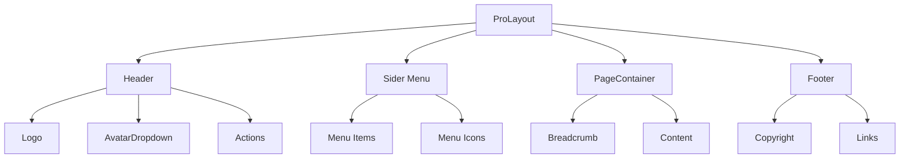

# 布局组件指南

本文档介绍 Py Small Admin 前端的布局组件和配置。

## 布局架构



## 目录结构

```
src/components/
├── Footer/              # 页脚组件
├── RightContent/        # 右侧头部内容
│   ├── AvatarDropdown.tsx
│   ├── AvatarName.tsx
│   └── ChangePasswordModal.tsx
├── HeaderDropdown/      # 头部下拉菜单
└── common/              # 通用组件
    ├── Upload/
    ├── ProTableWrapper/
    └── ProFormTinyMCE/
```

## 运行时布局配置

### 1. layout 配置

在 `src/app.tsx` 中配置全局布局：

```typescript
import type { RunTimeLayoutConfig } from '@umijs/max';

export const layout: RunTimeLayoutConfig = ({ initialState, setInitialState }) => {
  return {
    // 布局配置
    actionsRender: () => [<Question key="doc" />],
    avatarProps: {
      title: <AvatarName />,
      render: (_, avatarChildren) => {
        return <AvatarDropdown menu={true}>{avatarChildren}</AvatarDropdown>;
      },
    },
    contentStyle: {
      minHeight: 'calc(100vh - 160px)',
    },
    footerRender: () => <Footer copyright={initialState?.systemConfig?.copyright} />,
    onPageChange: () => {
      const { location } = history;
      if (!initialState?.currentUser && location.pathname !== '/login') {
        history.push('/login');
      }
    },
    menu: {
      locale: false,
      autoClose: false,
      request: async () => {
        const menuData = initialState?.menuData || [];
        return transformMenuData(menuData);
      },
    },
    childrenRender: (children) => {
      return (
        <PageContainer
          fixedHeader={true}
          title={false}
          breadcrumbRender={(props) => {
            // 自定义面包屑
            return <Breadcrumb items={props.breadcrumb?.items || []} />;
          }}
        >
          {children}
        </PageContainer>
      );
    },
    title: initialState?.systemConfig?.site_name || 'Py Small Admin',
    logo: initialState?.systemConfig?.site_logo_data?.[0]?.url || '/logo.png',
  };
};
```

### 2. 布局配置选项

| 属性 | 类型 | 说明 |
|------|------|------|
| `title` | `string` | 网站标题 |
| `logo` | `string \| ReactNode` | 网站 Logo |
| `layout` | `'side' \| 'top'` | 布局模式 |
| `contentWidth` | `'Fluid' \| 'Fixed'` | 内容宽度 |
| `theme` | `'light' \| 'dark'` | 主题色 |
| `splitMenus` | `boolean` | 是否分割菜单 |
| `fixedHeader` | `boolean` | 固定 Header |
| `fixSiderbar` | `boolean` | 固定侧边栏 |
| `menuHeaderRender` | `ReactNode` | 菜单头部渲染 |
| `headerRender` | `ReactNode` | 自定义 Header |
| `footerRender` | `ReactNode` | 自定义 Footer |
| `menuRender` | `ReactNode` | 自定义菜单 |
| `avatarProps` | `object` | 头像配置 |
| `actionsRender` | `ReactNode[]` | 右侧操作区 |
| `breadcrumbRender` | `function` | 面包屑渲染 |
| `menuItemRender` | `function` | 菜单项渲染 |
| `childrenRender` | `function` | 内容区域渲染 |
| `onPageChange` | `function` | 页面变化回调 |
| `waterMarkProps` | `object` | 水印配置 |

## Header 组件

### 1. Logo 和标题

```typescript
// 使用系统配置的 Logo 和标题
export const layout: RunTimeLayoutConfig = ({ initialState }) => {
  return {
    title: initialState?.systemConfig?.site_name || 'Py Small Admin',
    logo: initialState?.systemConfig?.site_logo_data?.[0]?.url || '/logo.png',
  };
};

// 自定义渲染
export const layout: RunTimeLayoutConfig = () => {
  return {
    menuHeaderRender: (logoDom, titleDom) => (
      <div style={{ display: 'flex', alignItems: 'center' }}>
        {logoDom}
        <span style={{ marginLeft: 10 }}>{titleDom}</span>
      </div>
    ),
  };
};
```

### 2. 右侧操作区

```typescript
// 自定义右侧操作区
export const layout: RunTimeLayoutConfig = () => {
  return {
    actionsRender: () => [
      <Question key="question" />,
      <Notice key="notice" />,
      <Button key="logout" onClick={handleLogout}>
        退出
      </Button>,
    ],
  };
};
```

### 3. 头像下拉菜单

```typescript
import { AvatarDropdown, AvatarName } from '@/components';

export const layout: RunTimeLayoutConfig = () => {
  return {
    avatarProps: {
      title: <AvatarName />,
      render: (_, avatarChildren) => {
        return <AvatarDropdown menu={true}>{avatarChildren}</AvatarDropdown>;
      },
    },
  };
};
```

#### AvatarDropdown 组件

```typescript
// src/components/RightContent/AvatarDropdown.tsx
import { Avatar } from 'antd';
import type { ItemType } from 'antd/es/menu/interface';
import { outLogin } from '@/services/admin/common/api';
import { history } from '@umijs/max';

const AvatarDropdown: React.FC = ({ children }) => {
  const { initialState, setInitialState } = useModel('@@initialState');
  const { currentUser } = initialState || {};

  const menuItems: ItemType[] = [
    {
      key: 'profile',
      icon: <UserOutlined />,
      label: '个人中心',
      onClick: () => history.push('/account/profile'),
    },
    {
      key: 'settings',
      icon: <SettingOutlined />,
      label: '个人设置',
      onClick: () => history.push('/account/settings'),
    },
    {
      type: 'divider',
    },
    {
      key: 'logout',
      icon: <LogoutOutlined />,
      label: '退出登录',
      onClick: async () => {
        await outLogin();
        setInitialState(undefined);
        history.push('/login');
      },
    },
  ];

  return (
    <Dropdown menu={{ items: menuItems }} placement="bottomRight">
      {children}
    </Dropdown>
  );
};
```

## Menu 组件

### 1. 动态菜单

```typescript
// 从后端获取菜单数据
const fetchMenuData = async (): Promise<API.AdminMenuItem[]> => {
  try {
    const menuResponse = await getMenuTree();
    return menuResponse?.data || [];
  } catch (_error) {
    return [];
  }
};

// 在 getInitialState 中获取菜单
export async function getInitialState() {
  const menuData = await fetchMenuData();
  return {
    menuData,
    // ...
  };
}
```

### 2. 菜单数据转换

```typescript
// 转换后端菜单格式为 ProLayout 格式
const transformMenuData = (menuData: API.AdminMenuItem[]): any[] => {
  return menuData
    .filter((item) => {
      return item.type === 1 || item.type === 2 || item.type === 3;
    })
    .map((item) => ({
      key: item.path,
      path: item.path,
      name: item.name,
      icon: getIconComponent(item.icon),
      component: item.component,
      redirect: item.redirect,
      target: item.target,
      routes:
        item.children && item.children.length > 0
          ? transformMenuData(item.children)
          : undefined,
    }));
};
```

### 3. 图标映射

```typescript
import * as allIcons from '@ant-design/icons';

const getIconComponent = (iconName?: string) => {
  if (!iconName) return undefined;

  const IconComponent = (allIcons as any)[iconName];
  if (!IconComponent) {
    console.warn(`Icon "${iconName}" not found in @ant-design/icons`);
    return undefined;
  }

  return React.createElement(IconComponent);
};
```

### 4. 自定义菜单项渲染

```typescript
export const layout: RunTimeLayoutConfig = () => {
  return {
    menuItemRender: (menuItemProps, defaultDom) => {
      if (menuItemProps.isUrl || !menuItemProps.path) {
        return defaultDom;
      }
      // 支持二级菜单显示 icon
      return (
        <Link to={menuItemProps.path} style={{ display: 'flex', gap: '10px' }}>
          {menuItemProps.pro_layout_parentKeys &&
            menuItemProps.pro_layout_parentKeys.length > 1 &&
            menuItemProps.icon}
          {defaultDom}
        </Link>
      );
    },
  };
};
```

## PageContainer 组件

### 1. 基础用法

```typescript
import { PageContainer } from '@ant-design/pro-components';

const MyPage = () => {
  return (
    <PageContainer title="页面标题">
      <div>页面内容</div>
    </PageContainer>
  );
};
```

### 2. 隐藏标题

```typescript
<PageContainer title={false}>
  <div>页面内容</div>
</PageContainer>
```

### 3. 自定义面包屑

```typescript
<PageContainer
  title="页面标题"
  breadcrumbRender={(props) => {
    const items = props.breadcrumb?.items || [];
    return <Breadcrumb items={items} />;
  }}
>
  <div>页面内容</div>
</PageContainer>
```

### 4. 额外内容区

```typescript
<PageContainer
  title="页面标题"
  content="页面描述"
  extra={[
    <Button key="add">新增</Button>,
    <Button key="export">导出</Button>,
  ]}
>
  <div>页面内容</div>
</PageContainer>
```

### 5. 标签页

```typescript
<PageContainer
  title="页面标题"
  tabList={[
    { tab: '基本信息', key: 'info' },
    { tab: '详细信息', key: 'detail' },
  ]}
  tabActiveKey={tabKey}
  onTabChange={(key) => setTabKey(key)}
>
  {tabKey === 'info' && <InfoContent />}
  {tabKey === 'detail' && <DetailContent />}
</PageContainer>
```

## Footer 组件

### 1. 基础 Footer

```typescript
// src/components/Footer/index.tsx
import { DefaultFooter } from '@ant-design/pro-components';
import React from 'react';

interface FooterProps {
  copyright?: string;
}

const Footer: React.FC<FooterProps> = ({ copyright }) => {
  const defaultMessage = '天奇扬网络技术有限公司出品';
  const currentYear = new Date().getFullYear();

  return (
    <DefaultFooter
      style={{ backgroundColor: 'none' }}
      copyright={`${copyright || currentYear + defaultMessage}`}
    />
  );
};

export default Footer;
```

### 2. 自定义 Footer

```typescript
const CustomFooter: React.FC = () => {
  return (
    <div style={{ textAlign: 'center', padding: '20px 0' }}>
      <p>© {new Date().getFullYear()} Py Small Admin</p>
      <p>
        <a href="https://example.com" target="_blank">关于我们</a>
        {' | '}
        <a href="https://example.com" target="_blank">联系方式</a>
      </p>
    </div>
  );
};
```

## 完整布局示例

### 1. 基础布局配置

```typescript
// src/app.tsx
import { AvatarDropdown, AvatarName, Footer } from '@/components';
import { useModel } from '@umijs/max';
import { PageContainer } from '@ant-design/pro-components';
import { Breadcrumb } from 'antd';

export const layout: RunTimeLayoutConfig = ({ initialState, setInitialState }) => {
  return {
    // 基础配置
    title: initialState?.systemConfig?.site_name || 'Py Small Admin',
    logo: initialState?.systemConfig?.site_logo_data?.[0]?.url || '/logo.png',

    // 布局配置
    layout: 'side',
    contentWidth: 'Fluid',
    splitMenus: false,
    fixedHeader: true,
    fixSiderbar: true,

    // 主题
    theme: 'light',

    // 右侧操作区
    actionsRender: () => [
      <Question key="question" />,
    ],

    // 头像配置
    avatarProps: {
      title: <AvatarName />,
      render: (_, avatarChildren) => {
        return <AvatarDropdown>{avatarChildren}</AvatarDropdown>;
      },
    },

    // 页脚
    footerRender: () => <Footer copyright={initialState?.systemConfig?.copyright} />,

    // 菜单配置
    menu: {
      locale: false,
      autoClose: false,
      request: async () => {
        const menuData = initialState?.menuData || [];
        return transformMenuData(menuData);
      },
    },

    // 页面变化监听
    onPageChange: () => {
      const { location } = history;
      if (!initialState?.currentUser && location.pathname !== '/login') {
        history.push('/login');
      }
    },

    // 内容区渲染
    childrenRender: (children: React.ReactNode) => {
      return (
        <PageContainer
          fixedHeader={true}
          title={false}
          breadcrumbRender={(props: any) => {
            const items = props.breadcrumb?.items || [];
            const breadcrumbItems = items.map((route: any) => ({
              key: route.path,
              title: route.breadcrumbName || route.title,
            }));
            return <Breadcrumb items={breadcrumbItems} />;
          }}
        >
          {children}
        </PageContainer>
      );
    },
  };
};
```

### 2. 管理后台布局

```typescript
// 管理后台完整布局
export const layout: RunTimeLayoutConfig = ({ initialState }) => {
  const { initialState: { currentUser, systemConfig } } = useModel('@@initialState');

  return {
    // 从系统配置获取标题和 Logo
    title: systemConfig?.site_name || '管理后台',
    logo: systemConfig?.site_logo_data?.[0]?.url || '/logo.svg',

    // 侧边栏宽度
    siderWidth: 256,

    // 固定头部和侧边栏
    fixedHeader: true,
    fixSiderbar: true,

    // 内容区域样式
    contentStyle: {
      minHeight: 'calc(100vh - 160px)',
    },

    // 头像下拉
    avatarProps: {
      src: currentUser?.avatar,
      title: currentUser?.real_name,
      render: (_, avatarChildren) => (
        <AvatarDropdown menu>
          {avatarChildren}
        </AvatarDropdown>
      ),
    },

    // 右侧操作区
    actionsRender: () => [
      <Tooltip key="help" title="帮助文档">
        <QuestionCircleOutlined style={{ fontSize: 20 }} />
      </Tooltip>,
      <Tooltip key="notice" title="通知">
        <Badge count={5}>
          <BellOutlined style={{ fontSize: 20 }} />
        </Badge>
      </Tooltip>,
    ],

    // 页脚
    footerRender: () => (
      <Footer copyright={systemConfig?.copyright} />
    ),

    // 菜单配置
    menu: {
      locale: false,
      request: async () => {
        const menuData = initialState?.menuData || [];
        return transformMenuData(menuData);
      },
    },

    // 自定义菜单项
    menuItemRender: (menuItemProps, defaultDom) => {
      const { icon, path } = menuItemProps;
      return (
        <Link to={path} style={{ display: 'flex', alignItems: 'center' }}>
          {icon && <span style={{ marginRight: 8 }}>{icon}</span>}
          <span>{menuItemProps.name}</span>
        </Link>
      );
    },

    // 内容区域
    childrenRender: (children) => (
      <PageContainer
        fixedHeader
        title={false}
        breadcrumb={{ separator: '/' }}
      >
        {children}
      </PageContainer>
    ),
  };
};
```

## 自定义布局

### 1. 顶部导航布局

```typescript
export const layout: RunTimeLayoutConfig = () => {
  return {
    layout: 'top',
    contentWidth: 'Fixed',
    headerTheme: 'dark',
    navTheme: 'light',
  };
};
```

### 2. 混合布局（顶部导航 + 侧边菜单）

```typescript
export const layout: RunTimeLayoutConfig = () => {
  return {
    layout: 'mix',
    splitMenus: true,
    headerRender: () => (
      <div style={{ display: 'flex', alignItems: 'center' }}>
        <Logo />
        <TopMenu />
      </div>
    ),
  };
};
```

### 3. 响应式布局

```typescript
export const layout: RunTimeLayoutConfig = () => {
  return {
    breakPoint: false,
    // 响应式断点配置
    media: {
      xxl: 1600,
      xl: 1200,
      lg: 992,
      md: 768,
      sm: 576,
      xs: 480,
    },
  };
};
```

## 页面级布局

### 1. 使用 PageContainer

```typescript
const Dashboard = () => {
  return (
    <PageContainer
      title="仪表盘"
      subtitle="欢迎回来"
      content="这里是仪表盘页面"
      extra={[
        <Button key="refresh">刷新</Button>,
        <Button key="settings">设置</Button>,
      ]}
    >
      <Row gutter={16}>
        <Col span={6}>
          <Card title="总用户数" bordered={false}>
            1,234
          </Card>
        </Col>
        <Col span={6}>
          <Card title="今日新增" bordered={false}>
            +56
          </Card>
        </Col>
        <Col span={6}>
          <Card title="在线用户" bordered={false}>
            89
          </Card>
        </Col>
        <Col span={6}>
          <Card title="系统状态" bordered={false}>
            正常
          </Card>
        </Col>
      </Row>
    </PageContainer>
  );
};
```

### 2. 多标签页

```typescript
const UserManagement = () => {
  const [tabKey, setTabKey] = useState('list');

  return (
    <PageContainer
      title="用户管理"
      tabList={[
        { tab: '用户列表', key: 'list' },
        { tab: '角色管理', key: 'role' },
        { tab: '权限设置', key: 'permission' },
      ]}
      tabActiveKey={tabKey}
      onTabChange={setTabKey}
      extra={[
        <Button key="add" type="primary">
          添加用户
        </Button>,
      ]}
    >
      {tabKey === 'list' && <UserList />}
      {tabKey === 'role' && <RoleManagement />}
      {tabKey === 'permission' && <PermissionSettings />}
    </PageContainer>
  );
};
```

## 最佳实践

### 1. 布局配置分离

```typescript
// config/layoutSettings.ts
export default {
  title: 'Py Small Admin',
  logo: '/logo.png',
  layout: 'side',
  contentWidth: 'Fluid',
  fixedHeader: true,
  fixSiderbar: true,
  splitMenus: false,
  theme: 'light',
  // ... 其他配置
};

// src/app.tsx
import layoutSettings from '../config/layoutSettings';

export const layout: RunTimeLayoutConfig = ({ initialState }) => {
  return {
    ...layoutSettings,
    title: initialState?.systemConfig?.site_name || layoutSettings.title,
    // ...
  };
};
```

### 2. 动态主题

```typescript
const [theme, setTheme] = useState<'light' | 'dark'>('light');

export const layout: RunTimeLayoutConfig = () => {
  return {
    theme,
    // ...
  };
};

// 在组件中切换主题
const ThemeSwitch = () => {
  const { setInitialState } = useModel('@@initialState');

  const toggleTheme = () => {
    const newTheme = theme === 'light' ? 'dark' : 'light';
    setTheme(newTheme);
    setInitialState((s) => ({
      ...s,
      settings: {
        ...s?.settings,
        theme: newTheme,
      },
    }));
  };

  return <Button onClick={toggleTheme}>切换主题</Button>;
};
```

### 3. 水印配置

```typescript
export const layout: RunTimeLayoutConfig = ({ initialState }) => {
  return {
    waterMarkProps: {
      content: initialState?.currentUser?.real_name,
      fontColor: 'rgba(0, 0, 0, 0.1)',
    },
  };
};
```
