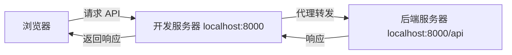

# 代理配置指南

本文档介绍 Py Small Admin 前端项目的开发代理配置方法。

## 什么是代理

在开发环境中，前端应用运行在 `localhost:8000`，而后端 API 可能运行在另一个端口或服务器上。由于浏览器的同源策略限制，直接请求会产生跨域问题。

代理通过在开发服务器中转发请求，使前端可以访问后端 API，解决跨域问题。



## 代理配置文件

代理配置位于 `config/proxy.ts`：

```typescript
/**
 * @name 代理的配置
 * @see 在生产环境代理是无法生效的，所以这里没有生产环境的配置
 */
export default {
  // 开发环境
  dev: {
    '/api/': {
      target: process.env.UMI_APP_API_BASE_URL || 'http://localhost:8000/api',
      changeOrigin: true,
    },
  },
  // 测试环境
  test: {
    '/api/': {
      target: 'https://test-api.example.com',
      changeOrigin: true,
      pathRewrite: { '^': '' },
    },
  },
  // 预发布环境
  pre: {
    '/api/': {
      target: process.env.UMI_APP_API_BASE_URL || 'https://pre-api.example.com',
      changeOrigin: true,
      pathRewrite: { '^': '' },
    },
  },
  // 默认配置
  default: {
    '/api/': {
      target: process.env.UMI_APP_API_BASE_URL || 'http://localhost:8000/api',
      changeOrigin: true,
    },
  },
};
```

## 基础配置

### 1. 简单代理

```typescript
export default {
  dev: {
    '/api/': {
      // 目标服务器地址
      target: 'http://localhost:8000',
      // 改变请求头的 origin
      changeOrigin: true,
    },
  },
};
```

**说明**：
- `/api/`：匹配所有以 `/api/` 开头的请求
- `target`：后端服务器地址
- `changeOrigin`：修改请求头的 origin 为目标地址

### 2. 路径重写

```typescript
export default {
  dev: {
    '/api/': {
      target: 'http://localhost:8000',
      changeOrigin: true,
      // 路径重写
      pathRewrite: {
        '^/api': '', // /api/xxx -> /xxx
      },
    },
  },
};
```

**示例**：
- 请求：`/api/user/list`
- 转发：`http://localhost:8000/user/list`

### 3. 多路径代理

```typescript
export default {
  dev: {
    // API 代理
    '/api/': {
      target: 'http://localhost:8000',
      changeOrigin: true,
    },
    // 文件服务代理
    '/uploads/': {
      target: 'http://localhost:8000',
      changeOrigin: true,
    },
    // WebSocket 代理
    '/ws': {
      target: 'ws://localhost:8000',
      ws: true,
    },
  },
};
```

## 高级配置

### 1. 完整配置选项

```typescript
export default {
  dev: {
    '/api/': {
      // 目标服务器地址
      target: 'http://localhost:8000',

      // 是否改变 origin
      changeOrigin: true,

      // 路径重写
      pathRewrite: { '^/api': '' },

      // WebSocket 支持
      ws: true,

      // 超时时间（毫秒）
      timeout: 30000,

      // 是否验证 SSL 证书
      secure: false,

      // 保持连接
      keepAlive: true,

      // 跟随重定向
      followRedirects: true,

      // 请求头修改
      onProxyReq: (proxyReq, req, res) => {
        // 添加自定义请求头
        proxyReq.setHeader('X-Custom-Header', 'value');
      },

      // 响应头修改
      onProxyRes: (proxyRes, req, res) => {
        // 添加自定义响应头
        proxyRes.headers['X-Custom-Response'] = 'value';
      },

      // 错误处理
      onError: (err, req, res) => {
        console.error('Proxy error:', err);
      },
    },
  },
};
```

### 2. 条件代理

根据条件决定是否代理：

```typescript
export default {
  dev: {
    '/api/': {
      target: 'http://localhost:8000',
      changeOrigin: true,
      // 只代理特定请求
      filter: (pathname, req) => {
        // 只代理 GET 和 POST 请求
        return ['GET', 'POST'].includes(req.method!);
      },
    },
  },
};
```

### 3. 负载均衡

```typescript
export default {
  dev: {
    '/api/': {
      // 多个目标服务器
      target: 'http://localhost:8000',
      // 或者使用 router 函数
      router: (req) => {
        // 根据请求内容选择目标服务器
        if (req.headers?.['user-type'] === 'vip') {
          return 'http://vip-server:8000';
        }
        return 'http://default-server:8000';
      },
      changeOrigin: true,
    },
  },
};
```

### 4. 请求/响应拦截

```typescript
export default {
  dev: {
    '/api/': {
      target: 'http://localhost:8000',
      changeOrigin: true,

      // 请求拦截
      onProxyReq: (proxyReq, req, res) => {
        // 添加认证 Token
        const token = req.headers?.['authorization'];
        if (token) {
          proxyReq.setHeader('Authorization', token);
        }

        // 记录请求日志
        console.log(`[Proxy] ${req.method} ${req.url} -> ${proxyReq.path}`);
      },

      // 响应拦截
      onProxyRes: (proxyRes, req, res) => {
        // 添加 CORS 响应头
        proxyRes.headers['Access-Control-Allow-Origin'] = '*';

        // 记录响应状态
        console.log(`[Proxy] Response: ${proxyRes.statusCode}`);
      },

      // 错误处理
      onError: (err, req, res) => {
        console.error('[Proxy Error]', err);

        // 返回错误响应
        res.status(500).json({
          success: false,
          message: 'Proxy error',
          error: err.message,
        });
      },
    },
  },
};
```

## 环境变量配置

### 使用环境变量

```typescript
// config/proxy.ts
export default {
  dev: {
    '/api/': {
      // 从环境变量读取目标地址
      target: process.env.UMI_APP_API_BASE_URL || 'http://localhost:8000',
      changeOrigin: true,
    },
  },
};
```

### 环境变量文件

```bash
# .env.development
UMI_APP_API_BASE_URL=http://localhost:8000/api

# .env.test
UMI_APP_API_BASE_URL=http://test-api.example.com

# .env.production
UMI_APP_API_BASE_URL=http://api.example.com
```

## 特殊场景配置

### 1. HTTPS 代理

```typescript
export default {
  dev: {
    '/api/': {
      target: 'https://api.example.com',
      changeOrigin: true,
      // 跳过 SSL 证书验证（仅开发环境）
      secure: false,
    },
  },
};
```

### 2. WebSocket 代理

```typescript
export default {
  dev: {
    '/ws': {
      target: 'ws://localhost:8000',
      ws: true, // 启用 WebSocket 代理
    },
  },
};
```

### 3. 代理到多个服务

```typescript
export default {
  dev: {
    // 主 API
    '/api/': {
      target: 'http://localhost:8000',
      changeOrigin: true,
    },
    // 认证服务
    '/auth/': {
      target: 'http://localhost:9000',
      changeOrigin: true,
      pathRewrite: { '^/auth': '' },
    },
    // 文件服务
    '/files/': {
      target: 'http://localhost:10000',
      changeOrigin: true,
    },
  },
};
```

### 4. Mock 数据代理

```typescript
export default {
  dev: {
    '/api/': {
      target: 'http://localhost:8000',
      changeOrigin: true,
      // Mock 某些接口
      bypass: (req, res, options) => {
        if (req.path === '/api/mock/data') {
          return res.json({
            success: true,
            data: { mock: true },
          });
        }
      },
    },
  },
};
```

## 生产环境配置

**注意**：代理只在开发环境有效，生产环境需要使用 Nginx 或其他反向代理。

### Nginx 配置

```nginx
server {
    listen 80;
    server_name your-domain.com;

    # 前端静态文件
    location / {
        root /var/www/dist;
        index index.html;
        try_files $uri $uri/ /index.html;
    }

    # API 代理
    location /api {
        proxy_pass http://localhost:8000;
        proxy_set_header Host $host;
        proxy_set_header X-Real-IP $remote_addr;
        proxy_set_header X-Forwarded-For $proxy_add_x_forwarded_for;
        proxy_set_header X-Forwarded-Proto $scheme;

        # WebSocket 支持
        proxy_http_version 1.1;
        proxy_set_header Upgrade $http_upgrade;
        proxy_set_header Connection "upgrade";
    }

    # 文件服务代理
    location /uploads {
        proxy_pass http://localhost:8000;
        expires 30d;
        add_header Cache-Control "public, immutable";
    }
}
```

## 调试代理

### 1. 查看代理日志

```typescript
export default {
  dev: {
    '/api/': {
      target: 'http://localhost:8000',
      changeOrigin: true,
      onProxyReq: (proxyReq, req, res) => {
        console.log('【请求】', req.method, req.url, '->', proxyReq.path);
        console.log('【Headers】', req.headers);
      },
      onProxyRes: (proxyRes, req, res) => {
        console.log('【响应】', proxyRes.statusCode, req.url);
      },
      onError: (err, req, res) => {
        console.error('【错误】', err);
      },
    },
  },
};
```

### 2. 测试代理

```bash
# 启动开发服务器
npm start

# 测试 API 请求
curl http://localhost:8000/api/user/list

# 查看网络请求
# 浏览器开发者工具 -> Network
```

### 3. 常见问题排查

**问题 1：代理不生效**

检查：
1. 确认使用的是 `npm start`（开发模式）
2. 检查环境变量是否正确
3. 查看浏览器控制台是否有错误

**问题 2：404 错误**

检查：
1. 目标地址是否正确
2. `pathRewrite` 配置是否正确
3. 后端服务是否正常运行

**问题 3：CORS 错误**

检查：
1. `changeOrigin` 是否设置为 `true`
2. 后端是否允许跨域请求

**问题 4：WebSocket 连接失败**

检查：
1. `ws: true` 是否设置
2. 后端是否支持 WebSocket

## 最佳实践

1. **使用环境变量**：避免硬编码目标地址
2. **分离环境配置**：不同环境使用不同的代理配置
3. **添加日志**：开发时添加代理日志便于调试
4. **错误处理**：配置 `onError` 处理代理错误
5. **生产使用 Nginx**：生产环境使用 Nginx 反向代理

## 完整示例

```typescript
// config/proxy.ts
export default {
  dev: {
    // API 代理
    '/api/': {
      target: process.env.UMI_APP_API_BASE_URL || 'http://localhost:8000',
      changeOrigin: true,
      pathRewrite: { '^/api': '' },
      ws: true,
      timeout: 30000,
      onProxyReq: (proxyReq, req, res) => {
        console.log(`[API] ${req.method} ${req.url}`);
      },
      onError: (err, req, res) => {
        console.error('[API Error]', err);
      },
    },
    // 文件代理
    '/uploads/': {
      target: process.env.UMI_APP_API_BASE_URL || 'http://localhost:8000',
      changeOrigin: true,
    },
  },

  test: {
    '/api/': {
      target: 'http://test-api.example.com',
      changeOrigin: true,
      pathRewrite: { '^/api': '' },
    },
  },

  pre: {
    '/api/': {
      target: 'http://pre-api.example.com',
      changeOrigin: true,
      pathRewrite: { '^/api': '' },
    },
  },

  default: {
    '/api/': {
      target: 'http://localhost:8000',
      changeOrigin: true,
    },
  },
};
```
