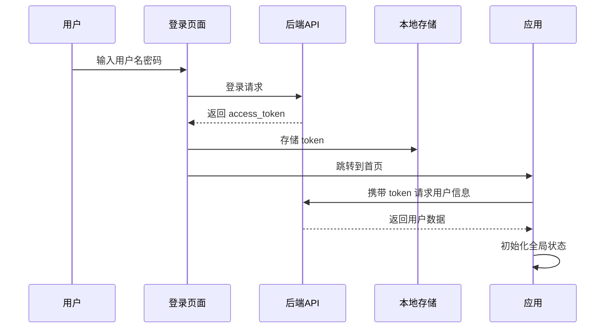

# 权限认证指南

本文档介绍 Py Small Admin 前端的权限认证机制。

## 认证流程



## Token 管理

### 1. Token 存储工具

项目使用 `src/utils/storage.ts` 管理 Token：

```typescript
// src/utils/storage.ts
import { TOKEN_KEYS } from '@/config/config';

class Storage {
  // 存储 token
  setToken(token: string) {
    this.set(TOKEN_KEYS.ACCESS_TOKEN, token);
  }

  // 获取 token
  getToken(): string | undefined {
    return this.get(TOKEN_KEYS.ACCESS_TOKEN);
  }

  // 清除 token
  clearToken() {
    this.remove(TOKEN_KEYS.ACCESS_TOKEN);
  }

  // 通用存储方法
  set(key: string, value: any) {
    localStorage.setItem(key, JSON.stringify(value));
  }

  get(key: string): any {
    const value = localStorage.getItem(key);
    return value ? JSON.parse(value) : undefined;
  }

  remove(key: string) {
    localStorage.removeItem(key);
  }
}

export default new Storage();
```

### 2. Token 配置

```typescript
// src/config/config.ts
export const TOKEN_KEYS = {
  ACCESS_TOKEN: 'x-admin-access-token',
  REFRESH_TOKEN: 'x-admin-refresh-token',
};
```

### 3. 使用 Token

```typescript
import storage from '@/utils/storage';
import { TOKEN_KEYS } from '@/config/config';

// 存储 Token
const login = async (username: string, password: string) => {
  const response = await request('/api/admin/auth/login', {
    method: 'POST',
    data: { username, password },
  });

  if (response.success) {
    storage.set(TOKEN_KEYS.ACCESS_TOKEN, response.data.access_token);
    storage.set(TOKEN_KEYS.REFRESH_TOKEN, response.data.refresh_token);
  }

  return response;
};

// 获取 Token
const getToken = () => {
  return storage.get(TOKEN_KEYS.ACCESS_TOKEN);
};

// 清除 Token
const logout = () => {
  storage.remove(TOKEN_KEYS.ACCESS_TOKEN);
  storage.remove(TOKEN_KEYS.REFRESH_TOKEN);
  history.push('/login');
};
```

## 请求拦截器

### 1. 请求拦截器配置

```typescript
// src/app.tsx 或 src/request.ts
import { REQUEST_TOKEN_KEY } from '@/config/config';

export const requestConfig = {
  // 请求拦截器
  requestInterceptors: [
    (config: RequestOptions) => {
      // 添加 token 到请求头
      const token = storage.get(TOKEN_KEYS.ACCESS_TOKEN);
      if (token) {
        config.headers = {
          ...config.headers,
          [REQUEST_TOKEN_KEY]: `Bearer ${token}`,
        };
      }
      return config;
    },
  ],

  // 响应拦截器
  responseInterceptors: [
    (response: Response) => {
      // 处理 401 未授权
      if (response.status === 401) {
        storage.clearTokens();
        history.push('/login');
      }
      return response;
    },
  ],
};
```

### 2. 完整请求配置

```typescript
// config/config.ts
export const REQUEST_TOKEN_KEY = 'x-admin-api-key';

export default defineConfig({
  request: {
    // 请求拦截器
    requestInterceptors: [
      (url, options) => {
        // 添加 token
        const token = storage.get(TOKEN_KEYS.ACCESS_TOKEN);
        const headers = {
          ...options.headers,
        };

        // 从环境变量获取 API Key
        const apiKey = process.env.UMI_APP_API_KEY;
        if (apiKey) {
          headers[REQUEST_TOKEN_KEY] = apiKey;
        }

        // 如果有用户 token，添加 Bearer 认证
        if (token) {
          headers['Authorization'] = `Bearer ${token}`;
        }

        return {
          url,
          options: {
            ...options,
            headers,
          },
        };
      },
    ],

    // 响应拦截器
    responseInterceptors: [
      async (response) => {
        const res = await response.clone().json();

        // 处理 401 未授权
        if (res.code === 401 || res.code === 403) {
          storage.clearTokens();
          history.push('/login');
        }

        return response;
      },
    ],
  },
});
```

## 登录功能

### 1. 登录页面

```typescript
// src/pages/login/index.tsx
import { useModel } from '@umijs/max';
import { Button, Form, Input, message } from 'antd';

const LoginPage = () => {
  const { initialState, setInitialState } = useModel('@@initialState');
  const [loading, setLoading] = useState(false);

  const handleSubmit = async (values: API.LoginParams) => {
    setLoading(true);
    try {
      // 调用登录 API
      const response = await login(values);

      if (response.success) {
        message.success('登录成功');

        // 更新全局状态
        const currentUser = await fetchUserInfo();
        setInitialState({
          ...initialState,
          currentUser,
        });

        // 跳转到首页
        history.push('/');
      } else {
        message.error(response.message || '登录失败');
      }
    } catch (error) {
      message.error('登录请求失败');
    } finally {
      setLoading(false);
    }
  };

  return (
    <Form onFinish={handleSubmit}>
      <Form.Item name="username" rules={[{ required: true }]}>
        <Input placeholder="用户名" />
      </Form.Item>
      <Form.Item name="password" rules={[{ required: true }]}>
        <Input.Password placeholder="密码" />
      </Form.Item>
      <Button type="primary" htmlType="submit" loading={loading}>
        登录
      </Button>
    </Form>
  );
};
```

### 2. 登录 API

```typescript
// src/services/admin/common/api.ts
import { request } from '@umijs/max';

export async function login(data: API.LoginParams): Promise<API.LoginResult> {
  return request('/api/admin/auth/login', {
    method: 'POST',
    headers: {
      'Content-Type': 'application/json',
    },
    data,
  });
}
```

## 登出功能

### 1. 登出实现

```typescript
// src/components/AvatarDropdown/index.tsx
import { clearTokens } from '@/services/admin/common/api';
import { history, useModel } from '@umijs/max';

const AvatarDropdown = ({ children }) => {
  const { initialState, setInitialState } = useModel('@@initialState');

  const handleLogout = async () => {
    try {
      // 调用登出 API
      await logout();

      // 清除本地 token
      clearTokens();

      // 清除全局状态
      setInitialState({
        ...initialState,
        currentUser: undefined,
      });

      // 跳转到登录页
      history.push('/login');
    } catch (error) {
      message.error('登出失败');
    }
  };

  return (
    <Dropdown
      menu={{
        items: [
          {
            key: 'logout',
            icon: <LogoutOutlined />,
            onClick: handleLogout,
            label: '退出登录',
          },
        ],
      }}
    >
      {children}
    </Dropdown>
  );
};
```

### 2. 登出 API

```typescript
// src/services/admin/common/api.ts
export async function logout(): Promise<API.Result> {
  return request('/api/admin/auth/logout', {
    method: 'POST',
  });
}

// 清除本地 Token
export function clearTokens() {
  storage.remove(TOKEN_KEYS.ACCESS_TOKEN);
  storage.remove(TOKEN_KEYS.REFRESH_TOKEN);
}
```

## 初始化状态 (getInitialState)

### 1. 获取用户信息

```typescript
// src/app.tsx
export async function getInitialState() {
  // 获取用户信息的函数
  const fetchUserInfo = async () => {
    try {
      // 检查是否有 access_token
      const accessToken = storage.get(TOKEN_KEYS.ACCESS_TOKEN);

      if (!accessToken) {
        history.push(loginPath);
        return undefined;
      }

      // 有 token，请求用户信息
      const userResponse = await queryCurrentUser();
      return userResponse?.data;
    } catch (error) {
      // 请求失败，清除 token 并跳转登录页
      clearTokens();
      history.push(loginPath);
    }
    return undefined;
  };

  // 如果不是登录页面，执行
  const { location } = history;
  if (location.pathname !== loginPath) {
    const currentUser = await fetchUserInfo();
    if (currentUser) {
      return {
        currentUser,
        fetchUserInfo,
        settings: defaultSettings,
      };
    }
  }

  return {
    fetchUserInfo,
    settings: defaultSettings,
  };
}
```

### 2. 用户信息 API

```typescript
// src/services/admin/common/api.ts
export async function queryCurrentUser(): Promise<API.CurrentUserResult> {
  return request('/api/admin/user/current', {
    method: 'GET',
  });
}
```

## 路由守卫

### 1. 在 app.tsx 中配置

```typescript
// src/app.tsx
export const layout: RunTimeLayoutConfig = ({ initialState }) => {
  return {
    onPageChange: () => {
      const { location } = history;
      // 如果没有登录，重定向到 login
      if (!initialState?.currentUser && location.pathname !== loginPath) {
        history.push(loginPath);
      }
    },
  };
};
```

### 2. 使用路由 wrapper

```typescript
// config/routes.ts
export default [
  {
    path: '/login',
    component: './login',
    layout: false, // 登录页不需要布局
  },
  {
    path: '/',
    wrappers: ['@/wrappers/auth'], // 使用认证 wrapper
    routes: [
      {
        path: '/admin',
        component: './admin',
      },
    ],
  },
];
```

### 3. 认证 Wrapper

```typescript
// src/wrappers/auth/index.tsx
import { Redirect } from '@umijs/max';
import { useModel } from '@umijs/max';

const AuthWrapper = (props: any) => {
  const { initialState } = useModel('@@initialState');
  const isLogin = !!initialState?.currentUser;
  const { pathname } = props.location;

  // 未登录且不是登录页，重定向
  if (!isLogin && pathname !== '/login') {
    return <Redirect to="/login" />;
  }

  return <div>{props.children}</div>;
};

export default AuthWrapper;
```

## Token 刷新

### 1. 自动刷新 Token

```typescript
// src/utils/request.ts
import { refreshToken } from '@/services/admin/common/api';

let isRefreshing = false;
let subscribers: ((token: string) => void)[] = [];

// 添加订阅者
function subscribeTokenRefresh(cb: (token: string) => void) {
  subscribers.push(cb);
}

// 刷新 Token 并通知订阅者
async function onTokenRefreshed(newToken: string) {
  subscribers.forEach((cb) => cb(newToken));
  subscribers = [];
}

// 响应拦截器中处理 401
export const requestConfig = {
  responseInterceptors: [
    async (response) => {
      const res = await response.clone().json();

      // Token 过期
      if (res.code === 401) {
        if (!isRefreshing) {
          isRefreshing = true;

          try {
            // 刷新 Token
            const refreshResponse = await refreshToken();
            const newToken = refreshResponse.data.access_token;

            // 存储新 Token
            storage.set(TOKEN_KEYS.ACCESS_TOKEN, newToken);

            // 通知所有订阅者
            onTokenRefreshed(newToken);
          } catch (error) {
            // 刷新失败，清除 Token 跳转登录
            clearTokens();
            history.push('/login');
            return Promise.reject(error);
          } finally {
            isRefreshing = false;
          }
        }

        // 等待新 Token
        return new Promise((resolve) => {
          subscribeTokenRefresh((newToken: string) => {
            // 使用新 Token 重试请求
            response.config.headers.Authorization = `Bearer ${newToken}`;
            resolve(request(response.config.url, response.config));
          });
        });
      }

      return response;
    },
  ],
};
```

### 2. 刷新 Token API

```typescript
// src/services/admin/common/api.ts
export async function refreshToken(): Promise<API.RefreshTokenResult> {
  const refreshToken = storage.get(TOKEN_KEYS.REFRESH_TOKEN);
  return request('/api/admin/auth/refresh', {
    method: 'POST',
    data: { refresh_token: refreshToken },
  });
}
```

## 错误处理

### 1. 统一错误处理

```typescript
// src/request.ts
export const requestConfig = {
  responseInterceptors: [
    (response) => {
      return response;
    },
    (error) => {
      // 网络错误
      if (error.name === 'NetworkError') {
        message.error('网络连接失败，请检查网络');
        return Promise.reject(error);
      }

      // HTTP 状态码错误
      if (error.response) {
        const { status } = error.response;

        switch (status) {
          case 401:
            message.error('未授权，请重新登录');
            clearTokens();
            history.push('/login');
            break;
          case 403:
            message.error('没有权限访问');
            break;
          case 404:
            message.error('请求的资源不存在');
            break;
          case 500:
            message.error('服务器错误，请稍后重试');
            break;
          default:
            message.error(`请求错误 ${status}`);
        }
      }

      return Promise.reject(error);
    },
  ],
};
```

### 2. 业务错误处理

```typescript
// 处理后端返回的业务错误
const handleBusinessError = (response: any) => {
  if (response.code !== 200) {
    switch (response.code) {
      case 1001:
        message.error('用户名或密码错误');
        break;
      case 1002:
        message.error('账户已被禁用');
        break;
      case 1003:
        message.error('Token 已过期');
        clearTokens();
        history.push('/login');
        break;
      default:
        message.error(response.message || '请求失败');
    }
    return true; // 已处理
  }
  return false; // 未处理
};

// 在响应拦截器中使用
responseInterceptors: [
  async (response) => {
    const res = await response.clone().json();
    if (handleBusinessError(res)) {
      return Promise.reject(res);
    }
    return response;
  },
],
```

## 安全最佳实践

### 1. HTTPS

生产环境必须使用 HTTPS 传输 Token：

```typescript
// 生产环境检查
if (process.env.NODE_ENV === 'production' && !window.location.protocol.startsWith('https')) {
  window.location.href = window.location.href.replace('http:', 'https:');
}
```

### 2. Token 过期时间

设置合理的 Token 过期时间：

```typescript
// 登录成功后设置过期提醒
const setTokenExpiryReminder = (expiresIn: number) => {
  const reminderTime = expiresIn - 300; // 提前 5 分钟提醒

  setTimeout(() => {
    message.warning('登录即将过期，请保存工作内容');
  }, reminderTime * 1000);
};
```

### 3. XSS 防护

避免在 localStorage 中存储敏感信息：

```typescript
// 使用 httpOnly cookie（推荐）
// 在后端设置 Cookie
response.set_cookie(
    'access_token',
    token,
    httponly=True,
    secure=True,
    samesite='Lax'
)
```

### 4. CSRF 防护

```typescript
// 请求时添加 CSRF Token
const getCsrfToken = () => {
  return document.querySelector('meta[name="csrf-token"]')?.getAttribute('content');
};

// 在请求拦截器中添加
requestInterceptors: [
  (config) => {
    const csrfToken = getCsrfToken();
    if (csrfToken) {
      config.headers['X-CSRF-TOKEN'] = csrfToken;
    }
    return config;
  },
],
```

## 完整示例

### 登录页面完整代码

```typescript
// src/pages/login/index.tsx
import { Button, Form, Input, message, Card } from 'antd';
import { UserOutlined, LockOutlined } from '@ant-design/icons';
import { history, useModel } from '@umijs/max';
import { login } from '@/services/admin/common/api';
import styles from './index.less';

const LoginPage: React.FC = () => {
  const { initialState, setInitialState } = useModel('@@initialState');
  const [loading, setLoading] = useState(false);

  const handleSubmit = async (values: API.LoginParams) => {
    setLoading(true);
    try {
      const response = await login(values);

      if (response.success) {
        message.success('登录成功');

        // 更新全局状态
        const currentUser = await fetchUserInfo();
        setInitialState({
          ...initialState,
          currentUser,
        });

        // 跳转到之前的页面或首页
        const redirect = new URLSearchParams(window.location.search).get('redirect');
        history.push(redirect || '/');
      } else {
        message.error(response.message || '登录失败');
      }
    } catch (error) {
      message.error('登录请求失败');
    } finally {
      setLoading(false);
    }
  };

  return (
    <div className={styles.container}>
      <Card className={styles.loginCard} title="Py Small Admin">
        <Form onFinish={handleSubmit}>
          <Form.Item name="username" rules={[{ required: true, message: '请输入用户名' }]}>
            <Input prefix={<UserOutlined />} placeholder="用户名" size="large" />
          </Form.Item>
          <Form.Item name="password" rules={[{ required: true, message: '请输入密码' }]}>
            <Input.Password prefix={<LockOutlined />} placeholder="密码" size="large" />
          </Form.Item>
          <Button type="primary" htmlType="submit" loading={loading} block size="large">
            登录
          </Button>
        </Form>
      </Card>
    </div>
  );
};

export default LoginPage;
```
