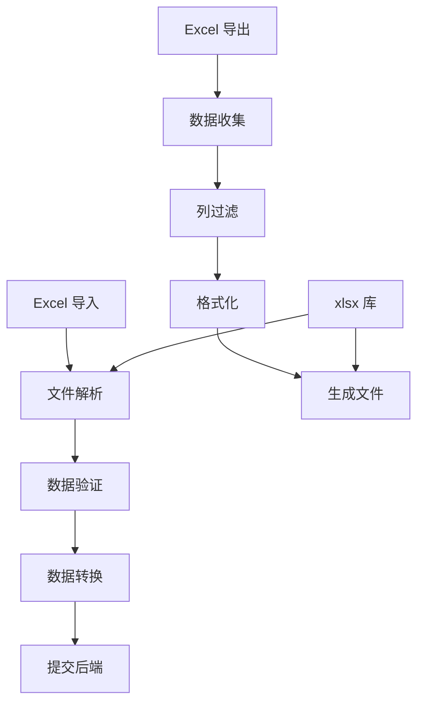

# Excel 导入导出指南

本文档介绍 Py Small Admin 前端的 Excel 导入导出功能。

## 功能架构



## 依赖安装

```bash
# 安装 xlsx 库
npm install xlsx
npm install @types/xlsx --save-dev

# 或使用 sheetjs（xlsx 的别名）
npm install sheetjs
```

## Excel 导出

### 1. 基础导出函数

项目中的导出工具 `src/utils/exportExcel.ts`：

```typescript
import type { ProColumns } from '@ant-design/pro-components';
import * as XLSX from 'xlsx';

interface ExportExcelParams {
  breadcrumbData: any[];      // 面包屑数据（用于文件名）
  columns: ProColumns<any>[]; // 表格列配置
  columnsState: Record<string, any>; // 列状态
  selectedRows: any[];        // 选中的行数据
}

export function exportExcel({
  breadcrumbData,
  columns,
  columnsState,
  selectedRows,
}: ExportExcelParams) {
  if (!selectedRows || selectedRows.length === 0) {
    return;
  }

  // 1. 过滤 & 排序列
  const exportColumns = columns
    .filter((col) => {
      if (!col.dataIndex) return false;
      if (col.hideInTable) return false;

      const state = columnsState?.[col.dataIndex as string];
      return state?.show !== false;
    })
    .sort((a, b) => {
      const orderA = columnsState?.[a.dataIndex as string]?.order ?? 0;
      const orderB = columnsState?.[b.dataIndex as string]?.order ?? 0;
      return orderA - orderB;
    });

  // 2. 构建导出数据
  const exportData = selectedRows.map((row) => {
    const obj: Record<string, any> = {};

    exportColumns.forEach((col) => {
      obj[String(col.title)] = row[col.dataIndex as string];
    });
    return obj;
  });

  // 3. 生成 Excel
  const worksheet = XLSX.utils.json_to_sheet(exportData);
  const workbook = XLSX.utils.book_new();

  XLSX.utils.book_append_sheet(workbook, worksheet, '数据');

  // 使用面包屑最后一个作为文件名
  let fileName = '数据';
  if (breadcrumbData.length > 0) {
    fileName = breadcrumbData[breadcrumbData.length - 1].title;
  }
  XLSX.writeFile(workbook, `${fileName}.xlsx`);
}
```

### 2. 在表格组件中使用

```typescript
import { exportExcel } from '@/utils/exportExcel';
import { Button } from 'antd';
import { ExportOutlined } from '@ant-design/icons';
import { useModel } from '@umijs/max';
import type { ProColumns } from '@ant-design/pro-components';
import { ProTable } from '@ant-design/pro-components';

const UserList = () => {
  const { initialState } = useModel('@@initialState');
  const [selectedRows, setSelectedRows] = useState<any[]>([]);
  const [columnsState, setColumnsState] = useState({});

  const columns: ProColumns<API.AdminUser>[] = [
    {
      title: 'ID',
      dataIndex: 'id',
      width: 80,
    },
    {
      title: '用户名',
      dataIndex: 'username',
      width: 120,
    },
    {
      title: '邮箱',
      dataIndex: 'email',
      width: 200,
    },
    {
      title: '真实姓名',
      dataIndex: 'real_name',
      width: 120,
    },
    {
      title: '状态',
      dataIndex: 'is_active',
      valueEnum: {
        true: { text: '启用', status: 'Success' },
        false: { text: '禁用', status: 'Error' },
      },
    },
    {
      title: '操作',
      valueType: 'option',
      width: 180,
      render: (_, record) => [
        <a key="edit">编辑</a>,
        <a key="delete">删除</a>,
      ],
    },
  ];

  const handleExport = () => {
    exportExcel({
      breadcrumbData: initialState?.breadcrumbData || [],
      columns,
      columnsState,
      selectedRows,
    });
  };

  return (
    <ProTable<API.AdminUser>
      columns={columns}
      columnsState={{ value: columnsState, onChange: setColumnsState }}
      rowSelection={{
        selectedRowKeys: selectedRows.map((row) => row.id),
        onChange: (_, rows) => setSelectedRows(rows),
      }}
      toolBarRender={() => [
        <Button
          key="export"
          icon={<ExportOutlined />}
          onClick={handleExport}
          disabled={selectedRows.length === 0}
        >
          导出选中 ({selectedRows.length})
        </Button>,
      ]}
      request={async (params) => {
        const response = await getUserList(params);
        return {
          data: response.data.list,
          success: true,
          total: response.data.total,
        };
      }}
    />
  );
};
```

### 3. 自定义导出函数

```typescript
import * as XLSX from 'xlsx';

interface ExportOptions {
  data: any[];
  filename: string;
  sheetName?: string;
  headerMap?: Record<string, string>; // 字段映射
}

/**
 * 导出 Excel
 */
export const exportToExcel = ({
  data,
  filename,
  sheetName = 'Sheet1',
  headerMap,
}: ExportOptions) => {
  if (!data || data.length === 0) {
    message.warning('没有数据可导出');
    return;
  }

  // 转换数据格式
  const exportData = data.map((item) => {
    const row: Record<string, any> = {};

    Object.keys(item).forEach((key) => {
      const header = headerMap?.[key] || key;
      row[header] = item[key];
    });

    return row;
  });

  // 创建工作表
  const worksheet = XLSX.utils.json_to_sheet(exportData);

  // 设置列宽
  const colWidths = Object.keys(exportData[0] || {}).map(() => ({
    wch: 20, // 默认宽度
  }));
  worksheet['!cols'] = colWidths;

  // 创建工作簿
  const workbook = XLSX.utils.book_new();
  XLSX.utils.book_append_sheet(workbook, worksheet, sheetName);

  // 导出文件
  XLSX.writeFile(workbook, `${filename}.xlsx`);
};

// 使用示例
exportToExcel({
  data: users,
  filename: '用户列表',
  sheetName: '用户数据',
  headerMap: {
    id: 'ID',
    username: '用户名',
    email: '邮箱',
    real_name: '真实姓名',
  },
});
```

### 4. 高级导出配置

```typescript
import * as XLSX from 'xlsx';

/**
 * 导出多 Sheet Excel
 */
export const exportMultiSheetExcel = () => {
  const wb = XLSX.utils.book_new();

  // Sheet 1: 用户数据
  const userData = [
    { name: '张三', age: 25, city: '北京' },
    { name: '李四', age: 30, city: '上海' },
  ];
  const ws1 = XLSX.utils.json_to_sheet(userData);
  XLSX.utils.book_append_sheet(wb, ws1, '用户');

  // Sheet 2: 订单数据
  const orderData = [
    { orderNo: '001', amount: 1000, status: '已完成' },
    { orderNo: '002', amount: 2000, status: '待支付' },
  ];
  const ws2 = XLSX.utils.json_to_sheet(orderData);
  XLSX.utils.book_append_sheet(wb, ws2, '订单');

  // 导出
  XLSX.writeFile(wb, '数据报表.xlsx');
};

/**
 * 自定义样式导出
 */
export const exportStyledExcel = () => {
  const data = [
    ['姓名', '年龄', '城市'],
    ['张三', 25, '北京'],
    ['李四', 30, '上海'],
  ];

  const wb = XLSX.utils.book_new();
  const ws = XLSX.utils.aoa_to_sheet(data);

  // 设置列宽
  ws['!cols'] = [
    { wch: 15 }, // 姓名
    { wch: 10 }, // 年龄
    { wch: 20 }, // 城市
  ];

  // 合并单元格
  ws['!merges'] = [
    { s: { r: 0, c: 0 }, e: { r: 0, c: 2 } }, // 合并第一行
  ];

  XLSX.utils.book_append_sheet(wb, ws, '数据');
  XLSX.writeFile(wb, '样式表格.xlsx');
};
```

## Excel 导入

### 1. 基础导入组件

```typescript
import { Upload } from 'antd';
import { UploadOutlined } from '@ant-design/icons';
import * as XLSX from 'xlsx';

const ExcelImport = ({ onSuccess }: { onSuccess: (data: any[]) => void }) => {
  const handleImport = (file: File) => {
    const reader = new FileReader();

    reader.onload = (e) => {
      try {
        const data = e.target?.result;
        const workbook = XLSX.read(data, { type: 'binary' });

        // 读取第一个工作表
        const firstSheetName = workbook.SheetNames[0];
        const worksheet = workbook.Sheets[firstSheetName];

        // 转换为 JSON
        const jsonData = XLSX.utils.sheet_to_json(worksheet);

        onSuccess(jsonData);
      } catch (error) {
        message.error('文件解析失败');
      }
    };

    reader.readAsBinaryString(file);
    return false; // 阻止自动上传
  };

  return (
    <Upload
      accept=".xlsx,.xls"
      beforeUpload={handleImport}
      showUploadList={false}
    >
      <Button icon={<UploadOutlined />}>导入 Excel</Button>
    </Upload>
  );
};
```

### 2. 高级导入组件

```typescript
import { useState } from 'react';
import { Upload, Button, Modal, Table, message } from 'antd';
import { UploadOutlined } from '@ant-design/icons';
import * as XLSX from 'xlsx';

interface ExcelImportProps {
  onConfirm: (data: any[]) => Promise<void>;
  template?: {
    filename: string;
    data: any[];
  };
  columns?: any[];
}

const ExcelImportModal = ({
  onConfirm,
  template,
  columns,
}: ExcelImportProps) => {
  const [visible, setVisible] = useState(false);
  const [data, setData] = useState<any[]>([]);
  const [loading, setLoading] = useState(false);

  // 下载模板
  const handleDownloadTemplate = () => {
    if (!template) return;

    const ws = XLSX.utils.json_to_sheet(template.data);
    const wb = XLSX.utils.book_new();
    XLSX.utils.book_append_sheet(wb, ws, '模板');
    XLSX.writeFile(wb, `${template.filename}.xlsx`);
  };

  // 处理文件上传
  const handleUpload = (file: File) => {
    const reader = new FileReader();

    reader.onload = (e) => {
      try {
        const data = e.target?.result;
        const workbook = XLSX.read(data, { type: 'binary' });
        const worksheet = workbook.Sheets[workbook.SheetNames[0]];
        const jsonData = XLSX.utils.sheet_to_json(worksheet);

        setData(jsonData);
        message.success(`成功解析 ${jsonData.length} 条数据`);
      } catch (error) {
        message.error('文件解析失败，请检查文件格式');
      }
    };

    reader.readAsBinaryString(file);
    return false;
  };

  // 确认导入
  const handleConfirm = async () => {
    setLoading(true);
    try {
      await onConfirm(data);
      message.success('导入成功');
      setVisible(false);
      setData([]);
    } catch (error) {
      message.error('导入失败');
    } finally {
      setLoading(false);
    }
  };

  return (
    <>
      <Button onClick={() => setVisible(true)} icon={<UploadOutlined />}>
        导入
      </Button>

      <Modal
        title="导入 Excel"
        open={visible}
        onCancel={() => {
          setVisible(false);
          setData([]);
        }}
        width={800}
        footer={[
          <Button key="template" onClick={handleDownloadTemplate}>
            下载模板
          </Button>,
          <Button key="cancel" onClick={() => setVisible(false)}>
            取消
          </Button>,
          <Button
            key="confirm"
            type="primary"
            loading={loading}
            disabled={data.length === 0}
            onClick={handleConfirm}
          >
            确认导入 ({data.length})
          </Button>,
        ]}
      >
        <Upload
          accept=".xlsx,.xls"
          beforeUpload={handleUpload}
          showUploadList={false}
        >
          <Button icon={<UploadOutlined />}>选择文件</Button>
        </Upload>

        {data.length > 0 && (
          <Table
            columns={columns}
            dataSource={data}
            rowKey={(record, index) => index}
            scroll={{ x: 'max-content', y: 400 }}
            pagination={false}
            style={{ marginTop: 16 }}
          />
        )}
      </Modal>
    </>
  );
};

// 使用示例
const UserList = () => {
  const columns = [
    { title: '用户名', dataIndex: 'username' },
    { title: '邮箱', dataIndex: 'email' },
    { title: '真实姓名', dataIndex: 'real_name' },
  ];

  const handleImport = async (data: any[]) => {
    // 验证数据
    const validData = data.filter((item) => {
      return item.username && item.email;
    });

    if (validData.length !== data.length) {
      message.warning(`${data.length - validData.length} 条数据格式不正确`);
    }

    // 提交后端
    await importUsers(validData);
  };

  return (
    <div>
      <ExcelImportModal
        onConfirm={handleImport}
        template={{
          filename: '用户导入模板',
          data: [{ username: 'zhangsan', email: 'zhangsan@example.com', real_name: '张三' }],
        }}
        columns={columns}
      />
    </div>
  );
};
```

### 3. 数据验证导入

```typescript
/**
 * 带验证的 Excel 导入
 */
const ValidatedExcelImport = () => {
  const [errors, setErrors] = useState<any[]>([]);

  const validateData = (data: any[]) => {
    const errors: any[] = [];
    const validData: any[] = [];

    data.forEach((row, index) => {
      const rowErrors: string[] = [];

      // 必填字段验证
      if (!row.username) {
        rowErrors.push('用户名不能为空');
      }

      // 格式验证
      if (row.email && !/^[^\s@]+@[^\s@]+\.[^\s@]+$/.test(row.email)) {
        rowErrors.push('邮箱格式不正确');
      }

      // 唯一性验证（需要后端支持）
      // ...

      if (rowErrors.length > 0) {
        errors.push({
          row: index + 1,
          data: row,
          errors: rowErrors,
        });
      } else {
        validData.push(row);
      }
    });

    setErrors(errors);
    return validData;
  };

  const handleImport = async (data: any[]) => {
    const validData = validateData(data);

    if (errors.length > 0) {
      message.warning(`${errors.length} 条数据验证失败`);
      return;
    }

    await importUsers(validData);
  };

  return (
    <>
      {/* 导入组件 */}
      {errors.length > 0 && (
        <Alert
          type="error"
          message={`${errors.length} 条数据验证失败`}
          description={
            <ul>
              {errors.map((error) => (
                <li key={error.row}>
                  第 {error.row} 行: {error.errors.join(', ')}
                </li>
              ))}
            </ul>
          }
        />
      )}
    </>
  );
};
```

## 完整示例

### 用户管理页面 - 导入导出

```typescript
import { useState, useRef } from 'react';
import { ProTable } from '@ant-design/pro-components';
import { Button, message } from 'antd';
import { ExportOutlined, ImportOutlined, DownloadOutlined } from '@ant-design/icons';
import { exportExcel } from '@/utils/exportExcel';
import * as XLSX from 'xlsx';

const UserManagement = () => {
  const [selectedRows, setSelectedRows] = useState<any[]>([]);
  const actionRef = useRef();

  const columns = [
    {
      title: 'ID',
      dataIndex: 'id',
      width: 80,
      hideInSearch: true,
    },
    {
      title: '用户名',
      dataIndex: 'username',
      width: 120,
    },
    {
      title: '邮箱',
      dataIndex: 'email',
      width: 200,
    },
    {
      title: '真实姓名',
      dataIndex: 'real_name',
      width: 120,
      hideInSearch: true,
    },
    {
      title: '角色',
      dataIndex: 'role_name',
      width: 120,
      hideInSearch: true,
    },
    {
      title: '状态',
      dataIndex: 'is_active',
      valueEnum: {
        true: { text: '启用', status: 'Success' },
        false: { text: '禁用', status: 'Error' },
      },
      width: 80,
    },
    {
      title: '创建时间',
      dataIndex: 'created_at',
      valueType: 'dateTime',
      hideInSearch: true,
      width: 180,
    },
  ];

  // 导出选中
  const handleExportSelected = () => {
    if (selectedRows.length === 0) {
      message.warning('请先选择要导出的数据');
      return;
    }

    exportExcel({
      breadcrumbData: [{ title: '用户列表' }],
      columns,
      columnsState: {},
      selectedRows,
    });
  };

  // 导出全部
  const handleExportAll = async () => {
    const response = await getUserList({ page: 1, size: 99999 });
    exportExcel({
      breadcrumbData: [{ title: '用户列表' }],
      columns,
      columnsState: {},
      selectedRows: response.data.list,
    });
  };

  // 下载模板
  const handleDownloadTemplate = () => {
    const template = [
      {
        username: 'zhangsan',
        email: 'zhangsan@example.com',
        real_name: '张三',
        password: '123456',
        role_id: 1,
      },
    ];
    const ws = XLSX.utils.json_to_sheet(template);
    const wb = XLSX.utils.book_new();
    XLSX.utils.book_append_sheet(wb, ws, '模板');
    XLSX.writeFile(wb, '用户导入模板.xlsx');
  };

  return (
    <ProTable
      actionRef={actionRef}
      columns={columns}
      rowKey="id"
      rowSelection={{
        selectedRowKeys: selectedRows.map((row) => row.id),
        onChange: (_, rows) => setSelectedRows(rows),
      }}
      toolBarRender={() => [
        <Button
          key="import"
          icon={<ImportOutlined />}
          onClick={() => {/* 打开导入对话框 */}}
        >
          导入
        </Button>,
        <Button
          key="exportSelected"
          icon={<ExportOutlined />}
          disabled={selectedRows.length === 0}
          onClick={handleExportSelected}
        >
          导出选中 ({selectedRows.length})
        </Button>,
        <Button
          key="exportAll"
          icon={<DownloadOutlined />}
          onClick={handleExportAll}
        >
          导出全部
        </Button>,
      ]}
      request={async (params) => {
        const response = await getUserList(params);
        return {
          data: response.data.list,
          success: true,
          total: response.data.total,
        };
      }}
    />
  );
};
```

## 最佳实践

### 1. 导出优化

```typescript
// 大数据分批导出
const exportLargeData = async () => {
  const batchSize = 10000;
  let offset = 0;
  const allData: any[] = [];

  while (true) {
    const response = await getDataList({
      offset,
      limit: batchSize,
    });

    allData.push(...response.data.list);

    if (response.data.list.length < batchSize) break;
    offset += batchSize;
  }

  exportExcel({
    breadcrumbData: [{ title: '全部数据' }],
    columns,
    columnsState: {},
    selectedRows: allData,
  });
};
```

### 2. 导入进度

```typescript
// 显示导入进度
const ImportWithProgress = () => {
  const [progress, setProgress] = useState(0);

  const handleImport = async (data: any[]) => {
    const batchSize = 100;
    const batches = Math.ceil(data.length / batchSize);

    for (let i = 0; i < batches; i++) {
      const batch = data.slice(i * batchSize, (i + 1) * batchSize);
      await importUsers(batch);
      setProgress(Math.round(((i + 1) / batches) * 100));
    }
  };

  return (
    <Progress percent={progress} status="active" />
  );
};
```

### 3. 错误处理

```typescript
// 导出错误处理
const safeExport = () => {
  try {
    exportExcel({
      breadcrumbData: [{ title: '数据' }],
      columns,
      columnsState: {},
      selectedRows: data,
    });
  } catch (error) {
    message.error('导出失败：' + error.message);
    console.error('Export error:', error);
  }
};
```

## 常见问题

### Q: 如何处理特殊字符？

```typescript
// 清理特殊字符
const sanitizeData = (data: any[]) => {
  return data.map((row) => {
    const cleaned: any = {};
    Object.keys(row).forEach((key) => {
      cleaned[key] = String(row[key]).replace(/[\x00-\x1F\x7F]/g, '');
    });
    return cleaned;
  });
};
```

### Q: 如何设置单元格格式？

```typescript
// 设置数字格式
const worksheet = XLSX.utils.json_to_sheet(data);
worksheet['A1'].z = '0.00'; // 保留两位小数
worksheet['B1'].z = '0%';   // 百分比
```

### Q: 如何合并单元格？

```typescript
// 合并单元格
const ws = XLSX.utils.aoa_to_sheet(data);
ws['!merges'] = [
  { s: { r: 0, c: 0 }, e: { r: 0, c: 2 } }, // 合并 A1:C1
  { s: { r: 1, c: 0 }, e: { r: 2, c: 0 } }, // 合并 A2:A3
];
```
