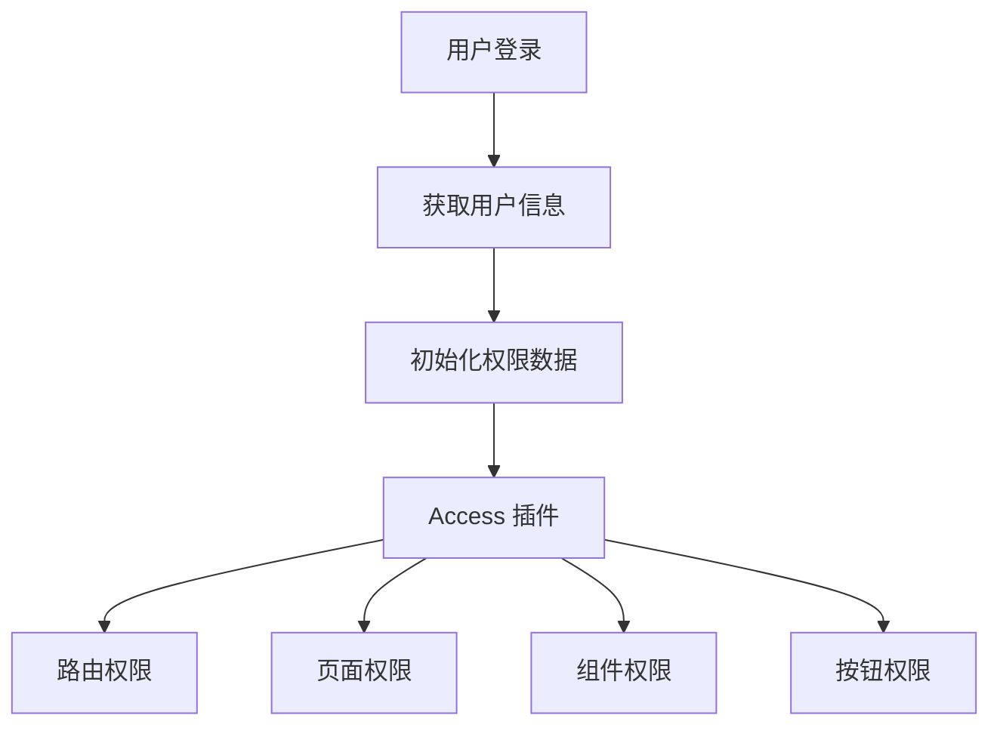

# 权限控制指南

本文档介绍 Py Small Admin 前端的权限控制机制。

## 权限架构



## Access 插件

### 1. 配置 Access

在 `config/config.ts` 中启用：

```typescript
export default defineConfig({
  // 权限插件
  access: {},
});
```

### 2. 定义权限

在 `src/access.ts` 中定义权限：

```typescript
/**
 * @see https://umijs.org/docs/max/access#access
 */
export default function access(
  initialState: { currentUser?: API.AdminCurrentUser } | undefined
) {
  const { currentUser } = initialState ?? {};

  return {
    // 管理员权限
    canAdmin: currentUser && currentUser.username === 'admin',

    // 用户管理权限
    canUserManage: currentUser?.permissions?.includes('user:manage'),

    // 角色管理权限
    canRoleManage: currentUser?.permissions?.includes('role:manage'),

    // 菜单管理权限
    canMenuManage: currentUser?.permissions?.includes('menu:manage'),

    // 数据查看权限
    canDataView: currentUser?.permissions?.includes('data:view'),

    // 数据编辑权限
    canDataEdit: currentUser?.permissions?.includes('data:edit'),

    // 数据删除权限
    canDataDelete: currentUser?.permissions?.includes('data:delete'),
  };
}
```

### 3. 用户数据结构

```typescript
// API 类型定义
declare namespace API {
  // 当前用户
  interface AdminCurrentUser {
    id: number;
    username: string;
    real_name: string;
    email: string;
    avatar?: string;
    is_active: boolean;
    role_id: number;
    role_name: string;
    permissions?: string[];  // 权限列表
    menus?: string[];         // 可访问的菜单
    created_at: string;
    updated_at: string;
  }
}
```

## 路由权限

### 1. 配置路由权限

```typescript
// config/routes.ts
export default [
  {
    path: '/login',
    component: './login',
    layout: false,
  },
  {
    path: '/admin',
    name: 'admin',
    // 权限配置
    access: 'canAdmin',
    routes: [
      {
        path: '/admin/user',
        name: 'user',
        access: 'canUserManage',
        component: './admin/user',
      },
      {
        path: '/admin/role',
        name: 'role',
        access: 'canRoleManage',
        component: './admin/role',
      },
    ],
  },
];
```

### 2. 动态权限检查

```typescript
// src/pages/admin/user/index.tsx
import { useAccess } from '@umijs/max';

const UserList = () => {
  const access = useAccess();

  return (
    <div>
      {access.canUserManage && (
        <Button type="primary">添加用户</Button>
      )}

      <Table dataSource={users}>
        <Column
          title="操作"
          render={(text, record) => (
            <>
              {access.canUserManage && (
                <Button onClick={() => editUser(record)}>编辑</Button>
              )}
              {access.canDataDelete && (
                <Button onClick={() => deleteUser(record)}>删除</Button>
              )}
            </>
          )}
        />
      </Table>
    </div>
  );
};
```

## 页面权限

### 1. 使用 Access 组件

```typescript
import { Access, useAccess } from '@umijs/max';

const PageComponent = () => {
  const access = useAccess();

  return (
    <Access accessible={access.canUserManage} fallback={<div>无权限访问</div>}>
      <div>受保护的内容</div>
    </Access>
  );
};
```

### 2. 页面级权限检查

```typescript
// 在页面组件中检查权限
import { useModel } from '@umijs/max';
import { useEffect } from 'react';
import { history } from '@umijs/max';

const AdminPage = () => {
  const { initialState } = useModel('@@initialState');
  const { currentUser } = initialState || {};

  useEffect(() => {
    // 检查是否有访问权限
    if (!currentUser?.permissions?.includes('admin:access')) {
      message.error('您没有权限访问此页面');
      history.push('/');
    }
  }, [currentUser]);

  if (!currentUser?.permissions?.includes('admin:access')) {
    return null;
  }

  return <div>管理页面内容</div>;
};
```

## 按钮权限

### 1. 单个按钮权限

```typescript
import { Access } from '@umijs/max';

const TableActions = ({ record }) => {
  return (
    <Space>
      <Access accessible="canUserManage">
        <Button type="link" onClick={() => editUser(record)}>
          编辑
        </Button>
      </Access>

      <Access accessible="canDataDelete">
        <Button type="link" danger onClick={() => deleteUser(record)}>
          删除
        </Button>
      </Access>
    </Space>
  );
};
```

### 2. 权限映射

```typescript
// 定义权限映射
const permissionMap = {
  'user:add': 'canUserManage',
  'user:edit': 'canUserManage',
  'user:delete': 'canDataDelete',
  'role:add': 'canRoleManage',
  'role:edit': 'canRoleManage',
  'role:delete': 'canRoleManage',
};

// 使用
const ActionButtons = ({ permission, record }) => {
  const accessKey = permissionMap[permission];

  return (
    <Access accessible={accessKey}>
      <Button onClick={() => handleAction(permission, record)}>
        {getActionName(permission)}
      </Button>
    </Access>
  );
};
```

## 功能权限

### 1. 功能模块权限

```typescript
// src/components/FeatureGuard/index.tsx
import { useAccess } from '@umijs/max';

interface FeatureGuardProps {
  permission: string;
  children: React.ReactNode;
  fallback?: React.ReactNode;
}

const FeatureGuard: React.FC<FeatureGuardProps> = ({
  permission,
  children,
  fallback = null,
}) => {
  const access = useAccess();
  const hasPermission = access[permission] || access.canAdmin;

  if (!hasPermission) {
    return <>{fallback}</>;
  }

  return <>{children}</>;
};

export default FeatureGuard;

// 使用
<FeatureGuard permission="canUserManage">
  <Button>添加用户</Button>
</FeatureGuard>
```

### 2. 多权限组合

```typescript
// 需要满足所有权限
const hasAllPermissions = (permissions: string[]) => {
  const access = useAccess();
  return permissions.every(p => access[p] || access.canAdmin);
};

// 需要满足任一权限
const hasAnyPermission = (permissions: string[]) => {
  const access = useAccess();
  return permissions.some(p => access[p] || access.canAdmin);
};

// 使用
const MultiPermissionExample = () => {
  return (
    <>
      {hasAllPermissions(['canUserManage', 'canRoleManage']) && (
        <Button>批量操作</Button>
      )}

      {hasAnyPermission(['canUserManage', 'canDataView']) && (
        <Button>查看数据</Button>
      )}
    </>
  );
};
```

## 数据权限

### 1. 行级权限

```typescript
// 根据数据权限过滤行
const filterDataByPermission = (data: any[], access: any) => {
  return data.filter((item) => {
    // 只能查看自己创建的数据
    if (access.canOnlySelf && item.created_by !== access.currentUser.id) {
      return false;
    }
    return true;
  });
};

const DataTable = () => {
  const { initialState } = useModel('@@initialState');
  const access = useAccess();

  const fetchData = async () => {
    const response = await getDataList();
    const filteredData = filterDataByPermission(response.data, access);
    setData(filteredData);
  };

  return <Table dataSource={data} />;
};
```

### 2. 列级权限

```typescript
// 根据权限显示列
const getColumnsByPermission = (access: any) => {
  const baseColumns = [
    { title: 'ID', dataIndex: 'id' },
    { title: '用户名', dataIndex: 'username' },
    { title: '邮箱', dataIndex: 'email' },
  ];

  const sensitiveColumns = [
    { title: '手机号', dataIndex: 'phone' },
    { title: '地址', dataIndex: 'address' },
  ];

  // 只有管理员可以看到敏感列
  if (access.canAdmin) {
    return [...baseColumns, ...sensitiveColumns];
  }

  return baseColumns;
};

const DataTable = () => {
  const access = useAccess();
  const [columns, setColumns] = useState([]);

  useEffect(() => {
    setColumns(getColumnsByPermission(access));
  }, [access]);

  return <Table columns={columns} dataSource={data} />;
};
```

## 菜单权限

### 1. 菜单数据过滤

```typescript
// src/app.tsx
export const layout: RunTimeLayoutConfig = ({ initialState }) => {
  return {
    menu: {
      request: async () => {
        // 从后端获取菜单
        const menuResponse = await getMenuTree();

        // 根据用户权限过滤菜单
        const menuData = initialState?.menuData || [];
        const filteredMenu = filterMenuByPermission(menuData, initialState?.currentUser);

        return transformMenuData(filteredMenu);
      },
    },
  };
};

// 过滤菜单
const filterMenuByPermission = (menuData: any[], currentUser?: any) => {
  return menuData
    .filter((item) => {
      // 检查是否有访问该菜单的权限
      if (!item.permission) return true;
      return currentUser?.permissions?.includes(item.permission);
    })
    .map((item) => ({
      ...item,
      children: item.children
        ? filterMenuByPermission(item.children, currentUser)
        : [],
    }));
};
```

### 2. 菜单权限配置

```typescript
// 后端菜单数据结构
interface MenuItem {
  id: number;
  name: string;
  path: string;
  icon?: string;
  permission?: string;  // 访问该菜单需要的权限
  component?: string;
  redirect?: string;
  children?: MenuItem[];
}

// 示例
const menuData: MenuItem[] = [
  {
    id: 1,
    name: '用户管理',
    path: '/admin/user',
    icon: 'UserOutlined',
    permission: 'user:view',
    children: [
      {
        id: 11,
        name: '用户列表',
        path: '/admin/user/list',
        permission: 'user:view',
      },
      {
        id: 12,
        name: '添加用户',
        path: '/admin/user/add',
        permission: 'user:add',
      },
    ],
  },
];
```

## 自定义 Hook

### 1. usePermission Hook

```typescript
// src/hooks/usePermission.ts
import { useAccess } from '@umijs/max';

const usePermission = () => {
  const access = useAccess();

  // 检查单个权限
  const hasPermission = (permission: string): boolean => {
    return access[permission] || access.canAdmin || false;
  };

  // 检查多个权限（AND）
  const hasAllPermissions = (permissions: string[]): boolean => {
    return permissions.every(p => hasPermission(p));
  };

  // 检查多个权限（OR）
  const hasAnyPermission = (permissions: string[]): boolean => {
    return permissions.some(p => hasPermission(p));
  };

  // 过滤有权限的项目
  const filterByPermission = <T,>(
    items: T[],
    getPermission: (item: T) => string
  ): T[] => {
    return items.filter((item) => {
      const permission = getPermission(item);
      if (!permission) return true;
      return hasPermission(permission);
    });
  };

  return {
    ...access,
    hasPermission,
    hasAllPermissions,
    hasAnyPermission,
    filterByPermission,
  };
};

export default usePermission;
```

### 2. 使用 Hook

```typescript
import usePermission from '@/hooks/usePermission';

const MyComponent = () => {
  const {
    hasPermission,
    hasAllPermissions,
    hasAnyPermission,
    filterByPermission,
  } = usePermission();

  const actions = [
    { key: 'add', label: '添加', permission: 'user:add' },
    { key: 'edit', label: '编辑', permission: 'user:edit' },
    { key: 'delete', label: '删除', permission: 'user:delete' },
  ];

  const allowedActions = filterByPermission(actions, (a) => a.permission);

  return (
    <Space>
      {allowedActions.map((action) => (
        <Button key={action.key}>{action.label}</Button>
      ))}
    </Space>
  );
};
```

## 最佳实践

### 1. 权限设计原则

```typescript
// 好的权限命名
const permissions = {
  // 资源:操作 格式
  'user:view': '查看用户',
  'user:add': '添加用户',
  'user:edit': '编辑用户',
  'user:delete': '删除用户',

  // 或使用模块化
  'user.manage': '用户管理',
  'role.manage': '角色管理',
  'menu.manage': '菜单管理',
};
```

### 2. 权限继承

```typescript
// 管理员拥有所有权限
const isAdmin = (currentUser?: API.AdminCurrentUser): boolean => {
  return currentUser?.username === 'admin' || currentUser?.is_superuser;
};

// 权限检查函数
const checkPermission = (
  currentUser: API.AdminCurrentUser | undefined,
  permission: string
): boolean => {
  // 管理员拥有所有权限
  if (isAdmin(currentUser)) return true;

  // 检查用户是否拥有该权限
  return currentUser?.permissions?.includes(permission) || false;
};
```

### 3. 权限缓存

```typescript
// 缓存权限检查结果
const permissionCache = new Map<string, boolean>();

const getCachedPermission = (
  key: string,
  checker: () => boolean
): boolean => {
  if (permissionCache.has(key)) {
    return permissionCache.get(key)!;
  }

  const result = checker();
  permissionCache.set(key, result);
  return result;
};

// 使用
const hasPermission = (permission: string) => {
  return getCachedPermission(permission, () => {
    return access[permission] || access.canAdmin;
  });
};
```

### 4. 统一权限提示

```typescript
// 统一的权限提示组件
import { Result, Button } from 'antd';

const PermissionDenied = ({ onBack }) => {
  return (
    <Result
      status="403"
      title="403"
      subTitle="抱歉，您没有权限访问此页面"
      extra={
        <Button type="primary" onClick={onBack}>
          返回首页
        </Button>
      }
    />
  );
};

export default PermissionDenied;
```

## 完整示例

### 权限控制页面

```typescript
// src/pages/admin/role/permission/index.tsx
import { useAccess } from '@umijs/max';
import { Button, Table, Modal, Form, Select, Transfer } from 'antd';
import usePermission from '@/hooks/usePermission';

const RolePermission = () => {
  const access = useAccess();
  const { hasPermission, filterByPermission } = usePermission();
  const [selectedRole, setSelectedRole] = useState(null);

  // 所有可用权限
  const allPermissions = [
    { key: 'user:view', label: '查看用户' },
    { key: 'user:add', label: '添加用户' },
    { key: 'user:edit', label: '编辑用户' },
    { key: 'user:delete', label: '删除用户' },
    { key: 'role:view', label: '查看角色' },
    { key: 'role:add', label: '添加角色' },
    { key: 'role:edit', label: '编辑角色' },
    { key: 'role:delete', label: '删除角色' },
  ];

  const columns = [
    { title: '权限名称', dataIndex: 'label' },
    { title: '权限代码', dataIndex: 'key' },
  ];

  return (
    <PageContainer>
      {hasPermission('role:edit') && (
        <Button type="primary">配置角色权限</Button>
      )}

      <Table
        columns={columns}
        dataSource={filterByPermission(allPermissions, (p) => p.key)}
        rowKey="key"
      />
    </PageContainer>
  );
};
```
