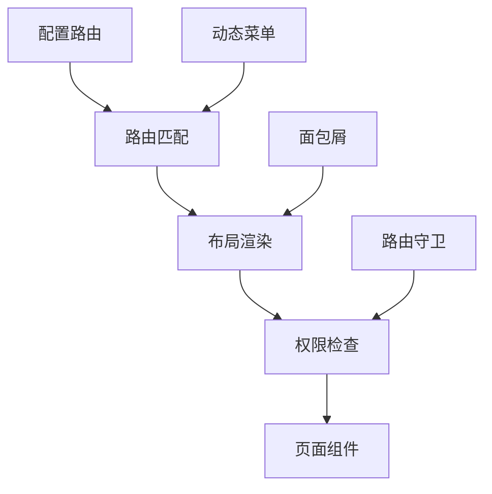

# 路由配置指南

本文档介绍 Py Small Admin 前端的路由配置和管理。

## 路由架构



## 路由配置基础

### 1. 路由配置结构

路由配置位于 `config/routes/` 目录：

```
config/routes/
├── index.ts      # 主路由入口
├── admin.ts      # 管理模块路由
└── quant.ts      # 量化模块路由
```

### 2. 主路由配置

`config/routes/index.ts`：

```typescript
/**
 * @name umi 的路由配置
 * @description 只支持 path,component,routes,redirect,wrappers,name,icon 的配置
 */
import Admin from './admin';
import Quant from './quant';

export default [
  // 登录页面（无布局）
  {
    path: '/login',
    layout: false,
    routes: [
      {
        name: 'login',
        path: '/login',
        component: './login',
      },
    ],
  },
  // 管理模块路由
  ...Admin,
  // 量化模块路由
  ...Quant,
  // 404 页面
  {
    path: '*',
    layout: false,
    component: './404',
  },
];
```

### 3. 模块路由配置

`config/routes/admin.ts`：

```typescript
export default [
  // 默认重定向
  {
    path: '/',
    redirect: '/admin/dashboard',
  },
  {
    path: '/admin',
    redirect: '/admin/dashboard',
  },
  // 仪表盘
  {
    path: '/admin/dashboard',
    component: './admin/dashboard/index',
  },
  // 权限管理
  {
    path: '/admin/auth/admin',
    component: './admin/auth/admin/index',
  },
  {
    path: '/admin/auth/group',
    component: './admin/auth/group/index',
  },
  {
    path: '/admin/auth/rule',
    component: './admin/auth/rule/index',
  },
  // 系统管理
  {
    path: '/admin/sys/sys_config',
    component: './admin/sys/sys_config/index',
  },
  {
    path: '/admin/sys/upload',
    component: './admin/sys/upload/index',
  },
];
```

## 路由属性说明

### 基本属性

| 属性 | 类型 | 说明 |
|------|------|------|
| `path` | `string` | 路由路径，支持 `:id` 动态参数和 `*` 通配符 |
| `component` | `string` | 组件路径，相对于 `src/pages` |
| `routes` | `Route[]` | 子路由配置 |
| `redirect` | `string` | 重定向路径 |
| `name` | `string` | 路由名称，用于国际化 |
| `icon` | `string` | 路由图标名称 |

### 布局属性

| 属性 | 类型 | 说明 |
|------|------|------|
| `layout` | `boolean` | 是否使用布局，`false` 表示无布局 |
| `wrappers` | `string[]` | 路由包装组件，用于权限校验等 |

### 权限属性

| 属性 | 类型 | 说明 |
|------|------|------|
| `access` | `string` | 权限标识，对应 `access.ts` 中的权限名 |
| `hideInMenu` | `boolean` | 在菜单中隐藏 |
| `hideChildrenInMenu` | `boolean` | 隐藏子菜单 |

## 路由类型

### 1. 静态路由

```typescript
{
  path: '/admin/dashboard',
  component: './admin/dashboard/index',
  name: 'dashboard',
  icon: 'DashboardOutlined',
}
```

### 2. 动态路由

```typescript
{
  // 动态参数
  path: '/admin/user/:id',
  component: './admin/user/detail',
  name: 'userDetail',
}

// 使用参数
const params = useParams<{ id: string }>();
const userId = params.id;
```

### 3. 嵌套路由

```typescript
{
  path: '/admin',
  routes: [
    {
      path: '/admin/user',
      component: './admin/user/index',
      routes: [
        {
          path: '/admin/user/:id',
          component: './admin/user/detail',
        },
      ],
    },
  ],
}
```

### 4. 重定向路由

```typescript
{
  path: '/',
  redirect: '/admin/dashboard',
}

// 或使用函数
{
  path: '/old-path',
  redirect: (params) => {
    return `/new-path/${params.id}`;
  },
}
```

## 路由跳转

### 1. 使用 Link 组件

```typescript
import { Link } from '@umijs/max';

// 基础跳转
<Link to="/admin/user">用户管理</Link>

// 带参数跳转
<Link to={`/admin/user/${userId}`}>用户详情</Link>

// 带查询参数
<Link to="/admin/user?page=1&size=10">用户列表</Link>

// 新窗口打开
<Link to="/admin/user" target="_blank">用户管理</Link>

// 替换历史记录
<Link to="/admin/user" replace>用户管理</Link>
```

### 2. 使用 history API

```typescript
import { history } from '@umijs/max';

// push - 添加新记录
history.push('/admin/user');
history.push('/admin/user', { from: 'dashboard' });

// replace - 替换当前记录
history.replace('/admin/login');

// go - 前进/后退
history.go(1);   // 前进一页
history.go(-1);  // 后退一页
history.back();  // 后退
history.forward(); // 前进

// 带查询参数
history.push({
  pathname: '/admin/user',
  search: '?page=1&size=10',
  state: { from: 'dashboard' },
});
```

### 3. 使用 useNavigate Hook

```typescript
import { useNavigate } from '@umijs/max';

const UserPage = () => {
  const navigate = useNavigate();

  const handleClick = () => {
    // 基础跳转
    navigate('/admin/user');

    // 带参数跳转
    navigate(`/admin/user/${userId}`);

    // 带查询参数
    navigate({
      pathname: '/admin/user',
      search: '?page=1',
    });

    // 替换当前页面
    navigate('/admin/user', { replace: true });

    // 后退
    navigate(-1);
  };

  return <Button onClick={handleClick}>跳转</Button>;
};
```

## 路由参数

### 1. 路径参数

```typescript
// 配置路由
{
  path: '/admin/user/:id',
  component: './admin/user/detail',
}

// 组件中获取参数
import { useParams } from '@umijs/max';

const UserDetail = () => {
  const { id } = useParams<{ id: string }>();
  console.log('用户ID:', id);

  return <div>用户详情: {id}</div>;
};
```

### 2. 查询参数

```typescript
import { useSearchParams } from '@umijs/max';
import { useLocation } from '@umijs/max';

// 方式 1: useSearchParams
const UserList = () => {
  const [searchParams, setSearchParams] = useSearchParams();

  const page = searchParams.get('page') || '1';
  const size = searchParams.get('size') || '10';

  const handlePageChange = (newPage: number) => {
    setSearchParams({ page: String(newPage), size });
  };

  return <div>当前页: {page}</div>;
};

// 方式 2: useLocation
const UserList = () => {
  const location = useLocation();
  const params = new URLSearchParams(location.search);

  const page = params.get('page') || '1';

  return <div>当前页: {page}</div>;
};
```

### 3. 路由状态

```typescript
import { useLocation } from '@umijs/max';

// 传递状态
history.push('/admin/user', { fromDashboard: true });

// 获取状态
const UserPage = () => {
  const location = useLocation();
  const state = location.state as { fromDashboard?: boolean };

  if (state?.fromDashboard) {
    console.log('从仪表盘跳转而来');
  }

  return <div>用户页面</div>;
};
```

## 路由守卫

### 1. 使用 wrappers 包装

```typescript
// config/routes/admin.ts
export default [
  {
    path: '/admin',
    wrappers: ['@/wrappers/auth'],
    routes: [
      {
        path: '/admin/user',
        component: './admin/user/index',
      },
    ],
  },
];
```

### 2. 创建 Wrapper 组件

```typescript
// src/wrappers/auth/index.tsx
import { useAccess, useModel } from '@umijs/max';
import { useEffect } from 'react';
import { history } from '@umijs/max';
import { Spin } from 'antd';

export default (props: any) => {
  const { initialState } = useModel('@@initialState');
  const { currentUser } = initialState || {};
  const access = useAccess();

  useEffect(() => {
    // 检查登录状态
    if (!currentUser) {
      history.push('/login');
    }

    // 检查权限
    if (!access.canAdmin) {
      history.push('/403');
    }
  }, [currentUser, access]);

  if (!currentUser) {
    return (
      <div style={{ textAlign: 'center', padding: '100px 0' }}>
        <Spin size="large" />
      </div>
    );
  }

  return <div>{props.children}</div>;
};
```

### 3. 布局级路由守卫

```typescript
// src/app.tsx
export const layout: RunTimeLayoutConfig = ({ initialState }) => {
  return {
    onPageChange: () => {
      const { location } = history;
      // 如果没有登录，重定向到 login
      if (!initialState?.currentUser && location.pathname !== '/login') {
        history.push('/login');
      }
    },
  };
};
```

## 动态路由

### 1. 从后端获取路由

```typescript
// src/app.tsx
export async function getInitialState() {
  const fetchMenuData = async () => {
    try {
      const menuResponse = await getMenuTree();
      return menuResponse?.data || [];
    } catch (_error) {
      return [];
    }
  };

  const menuData = await fetchMenuData();

  return {
    menuData,
    // ...
  };
}
```

### 2. 转换菜单数据

```typescript
// 转换后端菜单格式为 ProLayout 格式
const transformMenuData = (menuData: API.AdminMenuItem[]): any[] => {
  return menuData
    .filter((item) => {
      return item.type === 1 || item.type === 2 || item.type === 3;
    })
    .map((item) => ({
      key: item.path,
      path: item.path,
      name: item.name,
      icon: getIconComponent(item.icon),
      component: item.component,
      redirect: item.redirect,
      routes:
        item.children && item.children.length > 0
          ? transformMenuData(item.children)
          : undefined,
    }));
};
```

### 3. 使用动态菜单

```typescript
export const layout: RunTimeLayoutConfig = ({ initialState }) => {
  return {
    menu: {
      locale: false,
      request: async () => {
        const menuData = initialState?.menuData || [];
        return transformMenuData(menuData);
      },
    },
  };
};
```

## 面包屑导航

### 1. 自动面包屑

```typescript
export const layout: RunTimeLayoutConfig = ({ initialState, setInitialState }) => {
  return {
    childrenRender: (children) => {
      return (
        <PageContainer
          fixedHeader={true}
          title={false}
          breadcrumbRender={(props) => {
            const items = props.breadcrumb?.items || [];

            // 更新全局状态
            setInitialState((s) => ({
              ...s,
              breadcrumbData: items,
            }));

            return <Breadcrumb items={items} />;
          }}
        >
          {children}
        </PageContainer>
      );
    },
  };
};
```

### 2. 自定义面包屑

```typescript
import { Breadcrumb } from 'antd';

const CustomBreadcrumb = () => {
  const { initialState } = useModel('@@initialState');
  const breadcrumbData = initialState?.breadcrumbData || [];

  const items = breadcrumbData.map((route: any) => ({
    key: route.path,
    title: route.breadcrumbName || route.title,
  }));

  return <Breadcrumb items={items} />;
};
```

## 权限路由

### 1. 路由级权限

```typescript
// config/routes/admin.ts
export default [
  {
    path: '/admin',
    routes: [
      {
        path: '/admin/user',
        component: './admin/user/index',
        access: 'canUserManage', // 需要用户管理权限
      },
      {
        path: '/admin/role',
        component: './admin/role/index',
        access: 'canRoleManage', // 需要角色管理权限
      },
    ],
  },
];
```

### 2. 组件内权限检查

```typescript
import { useAccess } from '@umijs/max';
import { Access } from '@umijs/max';

const UserPage = () => {
  const access = useAccess();

  return (
    <div>
      <Access accessible={access.canUserManage} fallback={<div>无权限</div>}>
        <Button>添加用户</Button>
      </Access>
    </div>
  );
};
```

## 路由最佳实践

### 1. 路由组织

```typescript
// 按模块组织路由
export default [
  // 重定向
  {
    path: '/',
    redirect: '/admin/dashboard',
  },
  // 仪表盘（放在前面）
  {
    path: '/admin/dashboard',
    name: 'dashboard',
    icon: 'DashboardOutlined',
    component: './admin/dashboard/index',
  },
  // 业务模块
  {
    path: '/admin',
    name: 'admin',
    icon: 'SettingOutlined',
    routes: [
      {
        path: '/admin/user',
        name: 'user',
        component: './admin/user/index',
      },
      {
        path: '/admin/role',
        name: 'role',
        component: './admin/role/index',
      },
    ],
  },
  // 404 放在最后
  {
    path: '*',
    component: './404',
  },
];
```

### 2. 路由命名规范

```typescript
// 好的命名
{
  path: '/admin/user',
  name: 'user',          // 简洁的名称
  component: './admin/user/index',  // 清晰的路径
}

// 避免
{
  path: '/admin/user',
  name: 'userManagementPage',
  component: './user',
}
```

### 3. 懒加载

Umi Max 默认支持路由懒加载，无需额外配置：

```typescript
{
  path: '/admin/user',
  component: './admin/user/index',  // 自动按需加载
}
```

### 4. 路由复用

```typescript
// 公共组件抽取
const CommonLayout = ({ children }: { children: React.ReactNode }) => {
  return (
    <div className="common-layout">
      <Sidebar />
      <main>{children}</main>
    </div>
  );
};

// 使用 wrappers 应用
{
  path: '/admin',
  wrappers: ['@/wrappers/commonLayout'],
  routes: [...],
}
```

## 常见场景

### 1. 标签页导航

```typescript
import { useState } from 'react';
import { Tabs } from 'antd';

const TabNavigation = () => {
  const [activeKey, setActiveKey] = useState('user');

  const items = [
    {
      key: 'user',
      label: '用户',
      path: '/admin/user',
    },
    {
      key: 'role',
      label: '角色',
      path: '/admin/role',
    },
  ];

  const handleTabChange = (key: string) => {
    setActiveKey(key);
    const item = items.find((i) => i.key === key);
    if (item) {
      history.push(item.path);
    }
  };

  return (
    <Tabs activeKey={activeKey} items={items} onChange={handleTabChange} />
  );
};
```

### 2. 页面返回

```typescript
import { useNavigate } from '@umijs/max';

const DetailPage = () => {
  const navigate = useNavigate();

  const handleBack = () => {
    // 返回上一页
    navigate(-1);

    // 或返回指定页面
    navigate('/admin/user');
  };

  return (
    <div>
      <Button onClick={handleBack}>返回</Button>
    </div>
  );
};
```

### 3. 路由过渡动画

```typescript
import { CSSTransition } from 'react-transition-group';
import { useLocation } from '@umijs/max';

const PageTransition = ({ children }: { children: React.ReactNode }) => {
  const location = useLocation();

  return (
    <CSSTransition
      key={location.pathname}
      classNames="page"
      timeout={300}
      unmountOnExit
    >
      {children}
    </CSSTransition>
  );
};

// 在 layout 中使用
export const layout: RunTimeLayoutConfig = () => {
  return {
    childrenRender: (children) => {
      return (
        <PageTransition>
          {children}
        </PageTransition>
      );
    },
  };
};
```

## 完整示例

### 管理模块路由

```typescript
// config/routes/admin.ts
export default [
  // 重定向
  {
    path: '/',
    redirect: '/admin/dashboard',
  },
  {
    path: '/admin',
    redirect: '/admin/dashboard',
  },

  // 仪表盘
  {
    path: '/admin/dashboard',
    name: 'dashboard',
    icon: 'DashboardOutlined',
    component: './admin/dashboard/index',
  },

  // 权限管理模块
  {
    path: '/admin/auth',
    name: 'auth',
    icon: 'SafetyOutlined',
    routes: [
      {
        path: '/admin/auth/admin',
        name: 'admin',
        component: './admin/auth/admin/index',
        access: 'canUserManage',
      },
      {
        path: '/admin/auth/group',
        name: 'group',
        component: './admin/auth/group/index',
        access: 'canRoleManage',
      },
      {
        path: '/admin/auth/rule',
        name: 'rule',
        component: './admin/auth/rule/index',
        access: 'canMenuManage',
      },
    ],
  },

  // 系统管理模块
  {
    path: '/admin/sys',
    name: 'system',
    icon: 'SettingOutlined',
    routes: [
      {
        path: '/admin/sys/sys_config',
        name: 'sysConfig',
        component: './admin/sys/sys_config/index',
        access: 'canAdmin',
      },
      {
        path: '/admin/sys/upload',
        name: 'upload',
        component: './admin/sys/upload/index',
      },
    ],
  },

  // 用户详情（动态路由）
  {
    path: '/admin/user/:id',
    component: './admin/user/detail',
    hideInMenu: true,
  },
];
```

### 页面组件示例

```typescript
// src/pages/admin/user/index.tsx
import { useNavigate, useParams, useSearchParams } from '@umijs/max';
import { useAccess } from '@umijs/max';
import { Button, Table } from 'antd';

const UserList = () => {
  const navigate = useNavigate();
  const access = useAccess();
  const [searchParams, setSearchParams] = useSearchParams();

  const page = Number(searchParams.get('page')) || 1;
  const size = Number(searchParams.get('size')) || 10;

  // 查看详情
  const handleViewDetail = (id: number) => {
    navigate(`/admin/user/${id}`);
  };

  // 新增用户
  const handleAdd = () => {
    navigate('/admin/user/add');
  };

  // 分页变化
  const handleTableChange = (pagination: any) => {
    setSearchParams({
      page: String(pagination.current),
      size: String(pagination.pageSize),
    });
  };

  return (
    <div>
      {access.canUserManage && (
        <Button type="primary" onClick={handleAdd}>
          添加用户
        </Button>
      )}

      <Table
        dataSource={[]}
        pagination={{ current: page, pageSize: size }}
        onChange={handleTableChange}
        onRow={(record) => ({
          onDoubleClick: () => handleViewDetail(record.id),
        })}
      />
    </div>
  );
};

export default UserList;
```

### 详情页组件

```typescript
// src/pages/admin/user/detail/index.tsx
import { useParams, useNavigate } from '@umijs/max';
import { Button, Descriptions } from 'antd';
import { ArrowLeftOutlined } from '@ant-design/icons';

const UserDetail = () => {
  const { id } = useParams<{ id: string }>();
  const navigate = useNavigate();

  const handleBack = () => {
    navigate('/admin/user');
  };

  return (
    <div>
      <Button icon={<ArrowLeftOutlined />} onClick={handleBack}>
        返回列表
      </Button>

      <Descriptions title="用户详情" bordered>
        <Descriptions.Item label="ID">{id}</Descriptions.Item>
        {/* 其他详情 */}
      </Descriptions>
    </div>
  );
};

export default UserDetail;
```
