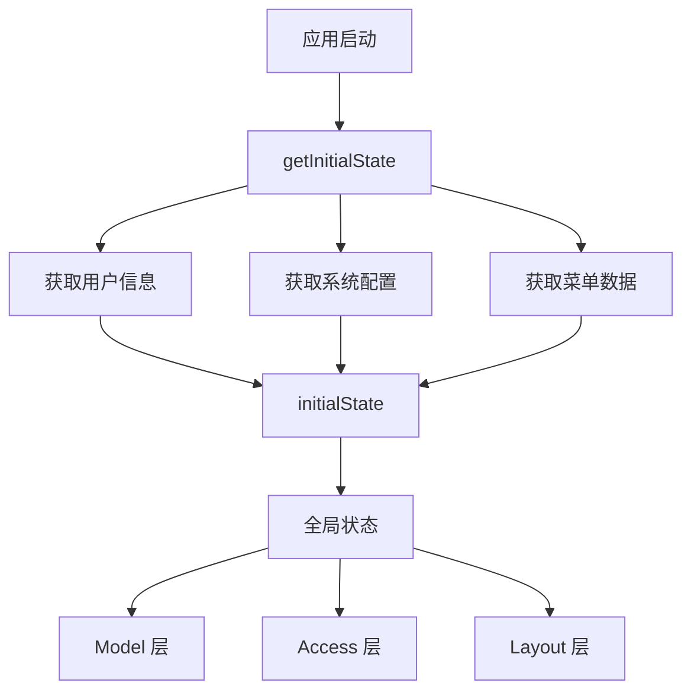

# 状态管理指南

本文档介绍 Py Small Admin 前端的状态管理方案。

## 状态管理架构



## 初始状态 (initialState)

### 1. getInitialState 函数

在 `src/app.tsx` 中定义全局初始状态：

```typescript
export async function getInitialState(): Promise<{
  settings?: Partial<LayoutSettings>;
  currentUser?: API.AdminCurrentUser;
  fetchUserInfo?: () => Promise<API.AdminCurrentUser | undefined>;
  menuData?: API.AdminMenuItem[];
  breadcrumbData?: any[];
  systemConfig?: API.AdminSystemConfig;
}> {
  // 获取用户信息的函数
  const fetchUserInfo = async (): Promise<API.AdminCurrentUser | undefined> => {
    try {
      const accessToken = storage.get(TOKEN_KEYS.ACCESS_TOKEN);
      if (!accessToken) {
        history.push(loginPath);
        return undefined;
      }
      const userResponse = await queryCurrentUser();
      return userResponse?.data;
    } catch (_error) {
      clearTokens();
      history.push(loginPath);
    }
    return undefined;
  };

  // 获取菜单数据
  const fetchMenuData = async (): Promise<API.AdminMenuItem[]> => {
    try {
      const menuResponse = await getMenuTree();
      return menuResponse?.data || [];
    } catch (_error) {
      return [];
    }
  };

  // 获取系统配置
  const fetchSystemConfig = async (): Promise<API.AdminSystemConfig | undefined> => {
    try {
      const configResponse = await getSystemConfig();
      return configResponse?.data;
    } catch (_error) {
      return undefined;
    }
  };

  // 初始化
  const { location } = history;
  const systemConfig = await fetchSystemConfig();

  if (location.pathname !== loginPath) {
    const currentUser = await fetchUserInfo();
    if (currentUser) {
      const menuData = await fetchMenuData();

      return {
        fetchUserInfo,
        currentUser,
        menuData,
        systemConfig,
        settings: defaultSettings as Partial<LayoutSettings>,
        breadcrumbData: [],
      };
    }
  }

  return {
    fetchUserInfo,
    settings: defaultSettings as Partial<LayoutSettings>,
    systemConfig,
    breadcrumbData: [],
  };
}
```

### 2. 状态类型定义

```typescript
// 全局初始状态类型
type InitialStateType = {
  settings?: Partial<LayoutSettings>;
  currentUser?: API.AdminCurrentUser;
  loading?: boolean;
  fetchUserInfo?: () => Promise<API.AdminCurrentUser | undefined>;
  menuData?: API.AdminMenuItem[];
  breadcrumbData?: any[];
  systemConfig?: API.AdminSystemConfig;
};

// 用户类型
declare namespace API {
  interface AdminCurrentUser {
    id: number;
    username: string;
    real_name: string;
    email: string;
    avatar?: string;
    is_active: boolean;
    role_id: number;
    role_name: string;
    permissions?: string[];
    menus?: string[];
    created_at: string;
    updated_at: string;
  }

  interface AdminMenuItem {
    id: number;
    parent_id: number;
    name: string;
    path: string;
    icon?: string;
    type: number; // 1:模块 2:目录 3:菜单
    component?: string;
    redirect?: string;
    permission?: string;
    sort: number;
    status: number;
    children?: AdminMenuItem[];
  }

  interface AdminSystemConfig {
    site_name: string;
    site_logo_data: { url: string }[];
    site_favicon_data: { url: string }[];
    site_description?: string;
    site_keywords?: string;
    copyright?: string;
    icp?: string;
  }
}
```

## 使用 Model

### 1. 定义 Model

```typescript
// src/models/user.ts
import { useState } from '@umijs/max';

export default function UserModel() {
  const [userList, setUserList] = useState<API.AdminUser[]>([]);
  const [loading, setLoading] = useState(false);

  // 获取用户列表
  const fetchUserList = async (params: any) => {
    setLoading(true);
    try {
      const response = await getUserList(params);
      setUserList(response.data);
      return response;
    } finally {
      setLoading(false);
    }
  };

  return {
    userList,
    loading,
    fetchUserList,
    setUserList,
  };
}
```

### 2. 使用 Model

```typescript
import { useModel } from '@umijs/max';

const UserPage = () => {
  const userList = useModel('user');

  const handleFetch = async () => {
    await userList.fetchUserList({ page: 1, size: 10 });
  };

  return (
    <div>
      <Button onClick={handleFetch}>刷新</Button>
      <Table dataSource={userList.userList} loading={userList.loading} />
    </div>
  );
};
```

## Model 状态管理

### 1. Model 配置

在 `config/config.ts` 中启用：

```typescript
export default defineConfig({
  model: {},
});
```

### 2. 全局 Model

```typescript
// src/models/global.ts
import { useState } from '@umijs/max';

export default function GlobalModel() {
  const [collapsed, setCollapsed] = useState(false);
  const [isMobile, setIsMobile] = useState(false);

  const toggleCollapsed = () => {
    setCollapsed(!collapsed);
  };

  return {
    collapsed,
    setCollapsed,
    isMobile,
    setIsMobile,
    toggleCollapsed,
  };
}
```

### 3. Model 命名空间

```typescript
// models/user.ts
export default UserModel;

// models/global.ts
export default GlobalModel;

// 使用命名空间
const userModel = useModel('user');
const globalModel = useModel('global');
```

## 使用 useModel Hook

### 1. 基础用法

```typescript
import { useModel } from '@umijs/max';

const MyComponent = () => {
  const userState = useModel('user');
  const globalState = useModel('global');

  const handleRefresh = async () => {
    await userState.fetchUserList();
    message.success('刷新成功');
  };

  return (
    <div>
      <Button onClick={handleRefresh} loading={userState.loading}>
        刷新
      </Button>
      <span>共 {userState.userList.length} 条数据</span>
    </div>
  );
};
```

### 2. Model 之间通信

```typescript
// Model A
const modelA = useModel('modelA', (modelB) => {
  return {
    updateModelB: (data) => {
      modelB.updateData(data);
    },
  };
});

// Model B
const modelB = useModel('modelB');
```

## 常用状态管理模式

### 1. 表格数据状态

```typescript
// src/models/table.ts
import { useState } from '@umijs/max';

interface TableState<T> {
  dataSource: T[];
  loading: boolean;
  pagination: {
    current: number;
    pageSize: number;
    total: number;
  };
}

export default function createTableModel<T>() {
  const [state, setState] = useState<TableState<T>>({
    dataSource: [],
    loading: false,
    pagination: {
      current: 1,
      pageSize: 10,
      total: 0,
    },
  });

  const fetchData = async (params: any) => {
    setState({ ...state, loading: true });
    try {
      const response = await request('/api/list', {
        params: {
          page: params.current,
          size: params.pageSize,
        },
      });

      setState({
        dataSource: response.data.list,
        pagination: {
          ...state.pagination,
          total: response.data.total,
        },
        loading: false,
      });
    } catch (error) {
      setState({ ...state, loading: false });
    }
  };

  return {
    ...state,
    fetchData,
    setState,
  };
}
```

### 2. 表单编辑状态

```typescript
// src/models/form.ts
import { useState } from '@umijs/max';

export default function createFormModel() {
  const [formData, setFormData] = useState<any>({});
  const [mode, setMode] = useState<'add' | 'edit'>('add');

  const resetForm = () => {
    setFormData({});
    setMode('add');
  };

  const editRecord = (record: any) => {
    setFormData(record);
    setMode('edit');
  };

  return {
    formData,
    mode,
    setFormData,
    setMode,
    resetForm,
    editRecord,
  };
}
```

### 3. 选项数据状态

```typescript
// src/models/options.ts
import { useState, useEffect } from '@umijs/max';

export default function createOptionsModel(apiPath: string) {
  const [options, setOptions] = useState<any[]>([]);
  const [loading, setLoading] = useState(false);

  useEffect(() => {
    fetchOptions();
  }, []);

  const fetchOptions = async () => {
    setLoading(true);
    try {
      const response = await request(apiPath);
      setOptions(response.data);
    } finally {
      setLoading(false);
    }
  };

  return {
    options,
    loading,
    fetchOptions,
  };
}

// 使用
const roleOptionsModel = createOptionsModel('/api/admin/role/options');

const UserForm = () => {
  const { options: roleOptions, loading } = roleOptionsModel;

  return (
    <Form>
      <Form.Item name="role_id" label="角色">
        <Select
          loading={loading}
          options={roleOptions}
        />
      </Form.Item>
    </Form>
  );
};
```

## 复杂状态管理

### 1. 多状态联动

```typescript
// src/pages/admin/dashboard/index.tsx
import { useModel } from '@umijs/max';
import { useEffect } from 'react';

const Dashboard = () => {
  const globalState = useModel('global');
  const userState = useModel('user');

  useEffect(() => {
    // 联动加载多个数据
    const initDashboard = async () => {
      const [stats, charts] = await Promise.all([
        fetchStats(),
        fetchCharts(),
      ]);

      globalState.setDashboardData({ stats, charts });
    };

    initDashboard();
  }, []);

  return <div>Dashboard Content</div>;
};
```

### 2. 异步状态管理

```typescript
// 使用 useRequest 管理异步请求
import { useRequest } from '@umijs/max';

const AsyncComponent = () => {
  const { data, loading, error, run } = useRequest(getUserInfo, {
    manual: true, // 手动触发
    onSuccess: (data) => {
      message.success('获取数据成功');
    },
    onError: (error) => {
      message.error('获取数据失败');
    },
  });

  return (
    <div>
      <Button onClick={run} loading={loading}>获取用户信息</Button>
      {data && <div>{data.name}</div>}
    </div>
  );
};
```

## 最佳实践

### 1. 状态分层

```
initialState (全局共享)
├── 用户信息
├── 系统配置
├── 菜单数据
└── 权限数据

model (业务状态)
├── user - 用户管理状态
├── role - 角色管理状态
└── settings - 设置状态
```

### 2. 避免过度状态

```typescript
// 不推荐：将所有状态放在一起
const [data1, setData1] = useState();
const [data2, setData2] = useState();
const [data3, setData3] = useState();

// 推荐：按功能模块分离
const dataModel = useModel('data');

// 使用 useEffect 协调状态
useEffect(() => {
  if (condition) {
    setData2(value);
  }
}, [condition]);
```

### 3. 状态持久化

```typescript
// 持久化用户设置
const saveUserSettings = (settings: any) => {
  localStorage.setItem('userSettings', JSON.stringify(settings));
  globalState.setUserSettings(settings);
};

// 恢复用户设置
const loadUserSettings = () => {
  const settings = localStorage.getItem('userSettings');
  if (settings) {
    globalState.setUserSettings(JSON.parse(settings));
  }
};
```

### 4. 防止循环依赖

```typescript
// 避免 Model 之间的循环依赖
const modelA = useModel('modelA');

// 使用回调函数传递数据，而不是直接引用
const updateModelB = () => {
  const modelB = useModel('modelB');
  modelB.update(data);
};
```

## 性能优化

### 1. 使用 useMemo 缓存

```typescript
const MyComponent = () => {
  const userState = useModel('user');
  const globalState = useModel('global');

  // 缓存计算结果
  const filteredUsers = useMemo(() => {
    return userState.userList.filter(user =>
      user.status === globalState.statusFilter
    );
  }, [userState.userList, globalState.statusFilter]);

  return <Table dataSource={filteredUsers} />;
};
```

### 2. 使用 useCallback 缓存函数

```typescript
const MyComponent = () => {
  const userState = useModel('user');

  const handleDelete = useCallback(async (id: number) => {
    await deleteUser(id);
    await userState.fetchUserList();
  }, [userState.fetchUserList]);

  return <Button onClick={() => handleDelete(1)}>删除</Button>;
};
```

### 3. 按需加载状态

```typescript
// 延迟加载大状态
const loadHeavyState = async () => {
  const module = await import('./heavyState');
  module.initialize();
};

// 在需要时才加载
useEffect(() => {
  if (needHeavyState) {
    loadHeavyState();
  }
}, [needHeavyState]);
```

## 完整示例

### 用户管理页面状态

```typescript
// src/models/user.ts
import { useState } from '@umijs/max';

interface UserModelState {
  userList: API.AdminUser[];
  loading: boolean;
  pagination: {
    current: number;
    pageSize: number;
    total: number;
  };
  filters: {
    username?: string;
    email?: string;
    is_active?: boolean;
  };
}

export default function UserModel() {
  const [state, setState] = useState<UserModelState>({
    userList: [],
    loading: false,
    pagination: {
      current: 1,
      pageSize: 10,
      total: 0,
    },
    filters: {},
  });

  // 获取用户列表
  const fetchUserList = async (params?: any) => {
    setState({ ...state, loading: true });
    try {
      const response = await getUserList({
        page: state.pagination.current,
        size: state.pagination.pageSize,
        ...state.filters,
        ...params,
      });

      setState({
        userList: response.data.list,
        pagination: {
          ...state.pagination,
          total: response.data.total,
        },
        loading: false,
      });
    } catch (error) {
      setState({ ...state, loading: false });
      throw error;
    }
  };

  // 设置筛选条件
  const setFilters = (filters: Partial<UserModelState['filters']>) => {
    setState({
      ...state,
      filters: { ...state.filters, ...filters },
      pagination: { ...state.pagination, current: 1 },
    });
  };

  // 重置筛选
  const resetFilters = () => {
    setState({
      ...state,
      filters: {},
      pagination: { ...state.pagination, current: 1 },
    });
  };

  return {
    ...state,
    fetchUserList,
    setFilters,
    resetFilters,
  };
}
```

### 页面中使用

```typescript
// src/pages/admin/user/index.tsx
import { useModel, useAccess } from '@umijs/max';

const UserPage = () => {
  const userState = useModel('user');
  const access = useAccess();

  // 表格列定义
  const columns = [
    { title: 'ID', dataIndex: 'id' },
    { title: '用户名', dataIndex: 'username' },
    { title: '邮箱', dataIndex: 'email' },
    {
      title: '操作',
      render: (_, record) => (
        <Space>
          {access.canUserManage && (
            <Button onClick={() => handleEdit(record)}>编辑</Button>
          )}
          {access.canDataDelete && (
            <Button onClick={() => handleDelete(record)}>删除</Button>
          )}
        </Space>
      ),
    },
  ];

  const handleEdit = (record: API.AdminUser) => {
    userState.setFormData(record);
    setEditModalVisible(true);
  };

  const handleDelete = async (record: API.AdminUser) => {
    await deleteUser(record.id);
    userState.fetchUserList();
  };

  const handleTableChange = (pagination: any) => {
    userState.fetchUserList({
      page: pagination.current,
      size: pagination.pageSize,
    });
  };

  return (
    <PageContainer>
      {access.canUserManage && (
        <Button type="primary" onClick={() => userState.setAddModalVisible(true)}>
          添加用户
        </Button>
      )}

      <Table
        columns={columns}
        dataSource={userState.userList}
        loading={userState.loading}
        pagination={userState.pagination}
        onChange={handleTableChange}
      />
    </PageContainer>
  );
};
```
