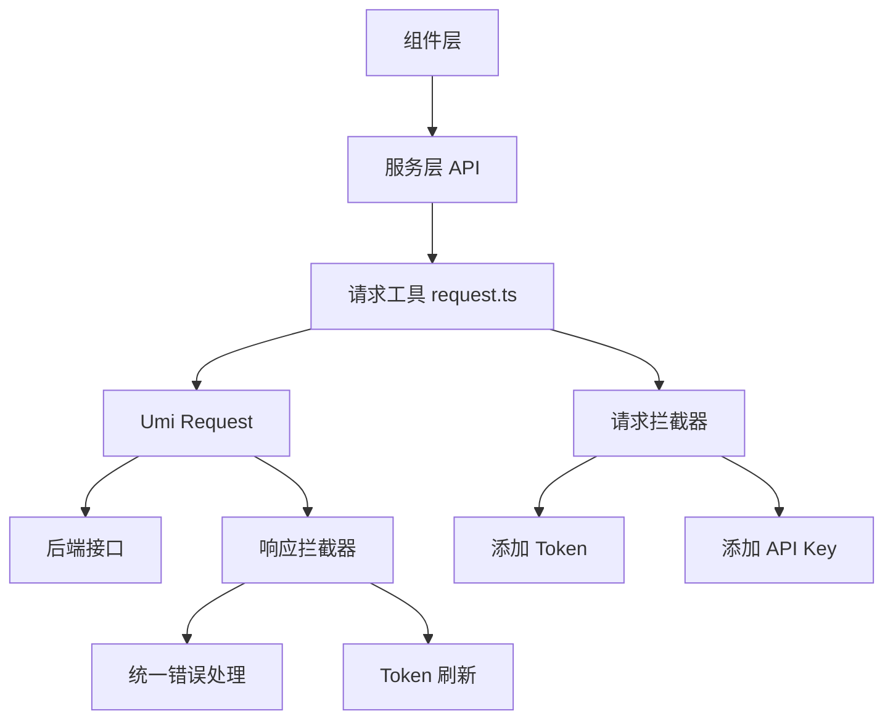

# API 服务指南

本文档介绍 Py Small Admin 前端的 API 服务架构和使用方法。

## 架构概览



## 目录结构

```
src/services/
├── admin/
│   ├── common/
│   │   ├── api.ts          # 公共接口（登录、用户信息等）
│   │   └── typings.d.ts    # 类型定义
│   ├── auth/
│   │   ├── admin/
│   │   │   ├── api.ts      # 管理员接口
│   │   │   └── typings.d.ts
│   │   ├── group/
│   │   │   ├── api.ts      # 角色组接口
│   │   │   └── typings.d.ts
│   │   └── rule/
│   │       ├── api.ts      # 权限规则接口
│   │       └── typings.d.ts
│   └── sys/
│       ├── sys_config/
│       │   ├── api.ts      # 系统配置接口
│       │   └── typings.d.ts
│       └── upload/
│           ├── api.ts      # 上传接口
│           └── typings.d.ts
└── quant/
    └── data/
        ├── stock/
        ├── concept/
        └── industry/
```

## 请求工具

### 1. 统一请求方法

`src/utils/request.ts` 提供了统一的请求方法：

```typescript
import { request } from '@/utils/request';

// 基础用法
const response = await request<API.AdminUserList>({
  method: 'GET',
  url: '/admin/admin/index',
  params: { page: 1, size: 10 },
});
```

### 2. 请求参数

```typescript
interface RequestParams {
  method?: 'GET' | 'POST' | 'PUT' | 'DELETE' | 'PATCH' | 'DOWNLOAD';
  url: string;                    // 请求地址
  data?: any;                     // 请求体数据
  params?: any;                   // 查询参数
  config?: RequestConfig;         // 额外配置
}

interface RequestConfig {
  skipAuth?: boolean;             // 跳过认证
  skipApiKey?: boolean;           // 跳过 API Key
  customHeaders?: Record<string, string>;  // 自定义请求头
}
```

### 3. 响应数据格式

```typescript
interface ResponseData<T = any> {
  code: number;                   // 状态码
  message: string;                // 消息
  data: T;                        // 数据
}
```

## 公共 API

### 1. 登录相关

```typescript
import {
  login,
  generateCaptcha,
  currentUser,
  outLogin,
  changePassword,
  refreshAccessToken,
} from '@/services/admin/common/api';

// 登录
const loginResult = await login({
  username: 'admin',
  password: '123456',
  captcha: '1234',
  captcha_key: 'key',
});

// 获取验证码
const captcha = await generateCaptcha();

// 获取当前用户信息
const user = await currentUser();

// 退出登录
await outLogin();

// 修改密码
await changePassword({
  old_password: '123456',
  new_password: '654321',
  confirm_password: '654321',
});

// 刷新 Token
const newTokens = await refreshAccessToken(refreshToken);
```

### 2. 菜单和配置

```typescript
import { getMenuTree, getSystemConfig } from '@/services/admin/common/api';

// 获取菜单树
const menuTree = await getMenuTree();

// 获取系统配置
const systemConfig = await getSystemConfig();
```

### 3. Token 管理

```typescript
import {
  saveTokens,
  clearTokens,
  saveCurrentUser,
  getCurrentUser,
  getTokenType,
} from '@/services/admin/common/api';

// 保存 Token
saveTokens({
  access_token: 'xxx',
  refresh_token: 'yyy',
  token_type: 'Bearer',
  expires_in: 3600,
  refresh_expires_in: 7200,
  access_expires_at: '2024-01-01T00:00:00Z',
  refresh_expires_at: '2024-01-01T01:00:00Z',
});

// 清除 Token
clearTokens();

// 保存/获取用户信息
saveCurrentUser(user);
const cachedUser = getCurrentUser();

// 获取 Token 类型
const tokenType = getTokenType(); // 'Bearer'
```

## 模块 API

### 1. 管理员模块

```typescript
import {
  getList,
  add,
  edit,
  update,
  setStatus,
  destroy,
  destroyAll,
  resetPwd,
} from '@/services/admin/auth/admin/api';

// 获取列表
const list = await getList({
  page: 1,
  size: 10,
  username: 'admin',
});

// 添加
await add({
  username: 'newuser',
  password: '123456',
  email: 'user@example.com',
  role_id: 1,
});

// 获取编辑数据
const formData = await edit(1);

// 更新
await update(1, {
  username: 'updated',
  email: 'updated@example.com',
});

// 设置状态
await setStatus(1, { status: 0 });

// 删除单个
await destroy(1);

// 批量删除
await destroyAll({ ids: [1, 2, 3] });

// 重置密码
await resetPwd(1);
```

### 2. 角色组模块

```typescript
import {
  getList,
  add,
  edit,
  update,
  destroy,
  destroyAll,
} from '@/services/admin/auth/group/api';

// 获取角色组列表
const groups = await getList({ page: 1, size: 10 });

// 添加角色组
await add({
  name: '编辑组',
  code: 'editor',
  describe: '内容编辑',
});

// 其他接口同管理员模块
```

### 3. 权限规则模块

```typescript
import {
  getList,
  add,
  edit,
  update,
  destroy,
  destroyAll,
} from '@/services/admin/auth/rule/api';

// 获取权限规则列表
const rules = await getList({ page: 1, size: 10 });

// 添加权限规则
await add({
  name: '用户查看',
  code: 'user:view',
  type: 1,
});
```

### 4. 系统配置模块

```typescript
import {
  getSiteConfig,
  updateSiteConfig,
} from '@/services/admin/sys/sys_config/api';

// 获取站点配置
const config = await getSiteConfig();

// 更新站点配置
await updateSiteConfig({
  site_name: '我的网站',
  site_logo: 'logo.png',
  site_favicon: 'favicon.ico',
});
```

### 5. 上传模块

```typescript
import {
  uploadFile,
  getMediaList,
  deleteMedia,
} from '@/services/admin/sys/upload/api';

// 上传文件
const result = await uploadFile(formData);

// 获取媒体库列表
const mediaList = await getMediaList({
  page: 1,
  size: 10,
  type: 'image',
});

// 删除媒体
await deleteMedia([1, 2, 3]);
```

## 创建新的 API 服务

### 1. 创建 API 文件

```typescript
// src/services/admin/custom/api.ts
import { request } from '@/utils/request';

// 类型定义
declare namespace API {
  // 列表查询参数
  interface CustomListRequest {
    page: number;
    size: number;
    keyword?: string;
  }

  // 列表响应
  interface CustomListResponse {
    list: CustomItem[];
    total: number;
  }

  // 数据项
  interface CustomItem {
    id: number;
    name: string;
    status: number;
  }

  // 表单数据
  interface CustomForm {
    name: string;
    status: number;
  }
}

// 获取列表
export async function getList(params: API.CustomListRequest) {
  return request<API.CustomListResponse>({
    method: 'GET',
    url: '/admin/custom/index',
    params,
  });
}

// 添加
export async function add(data: API.CustomForm) {
  return request({
    method: 'POST',
    url: '/admin/custom/add',
    data,
  });
}

// 编辑
export async function edit(id: number) {
  return request<API.CustomForm>({
    method: 'GET',
    url: `/admin/custom/edit/${id}`,
  });
}

// 更新
export async function update(id: number, data: API.CustomForm) {
  return request({
    method: 'PUT',
    url: `/admin/custom/update/${id}`,
    data,
  });
}

// 删除
export async function destroy(id: number) {
  return request({
    method: 'DELETE',
    url: `/admin/custom/destroy/${id}`,
  });
}

// 批量删除
export async function destroyAll(data: { ids: number[] }) {
  return request({
    method: 'DELETE',
    url: '/admin/custom/destroy_all',
    data,
    config: {
      customHeaders: { 'Content-Type': 'application/json' },
    },
  });
}

// 设置状态
export async function setStatus(id: number, data: { status: number }) {
  return request({
    method: 'PUT',
    url: `/admin/custom/set_status/${id}`,
    data,
  });
}
```

### 2. 创建类型定义文件

```typescript
// src/services/admin/custom/typings.d.ts
declare namespace API {
  interface CustomListRequest {
    page: number;
    size: number;
    keyword?: string;
  }

  interface CustomListResponse {
    list: CustomItem[];
    total: number;
  }

  interface CustomItem {
    id: number;
    name: string;
    status: number;
    created_at: string;
    updated_at: string;
  }

  interface CustomForm {
    name: string;
    status: number;
  }
}
```

## 在组件中使用

### 1. 基础用法

```typescript
import { getList, add, update, destroy } from '@/services/admin/custom/api';
import { message } from 'antd';

const CustomPage = () => {
  const [loading, setLoading] = useState(false);
  const [dataSource, setDataSource] = useState([]);

  // 获取列表
  const fetchList = async () => {
    setLoading(true);
    try {
      const response = await getList({
        page: 1,
        size: 10,
      });
      setDataSource(response.data.list);
    } catch (error) {
      message.error('获取数据失败');
    } finally {
      setLoading(false);
    }
  };

  // 添加
  const handleAdd = async (values: any) => {
    try {
      await add(values);
      message.success('添加成功');
      fetchList();
    } catch (error) {
      message.error('添加失败');
    }
  };

  // 更新
  const handleUpdate = async (id: number, values: any) => {
    try {
      await update(id, values);
      message.success('更新成功');
      fetchList();
    } catch (error) {
      message.error('更新失败');
    }
  };

  // 删除
  const handleDelete = async (id: number) => {
    try {
      await destroy(id);
      message.success('删除成功');
      fetchList();
    } catch (error) {
      message.error('删除失败');
    }
  };

  return (
    <div>
      {/* 组件内容 */}
    </div>
  );
};
```

### 2. 配合 ProTable 使用

```typescript
import { ProTable } from '@ant-design/pro-components';
import { getList, destroy, destroyAll } from '@/services/admin/custom/api';

const CustomTable = () => {
  const actionRef = useRef();
  const [selectedRows, setSelectedRows] = useState<any[]>([]);

  const columns = [
    { title: 'ID', dataIndex: 'id', width: 80 },
    { title: '名称', dataIndex: 'name' },
    {
      title: '状态',
      dataIndex: 'status',
      valueEnum: {
        1: { text: '启用', status: 'Success' },
        0: { text: '禁用', status: 'Error' },
      },
    },
    {
      title: '操作',
      valueType: 'option',
      render: (_, record) => [
        <a key="edit">编辑</a>,
        <a key="delete" onClick={() => handleDelete(record.id)}>删除</a>,
      ],
    },
  ];

  return (
    <ProTable
      actionRef={actionRef}
      columns={columns}
      rowKey="id"
      rowSelection={{
        selectedRowKeys: selectedRows.map(row => row.id),
        onChange: (_, rows) => setSelectedRows(rows),
      }}
      request={async (params) => {
        const response = await getList({
          page: params.current,
          size: params.pageSize,
          ...params,
        });
        return {
          data: response.data.list,
          success: response.code === 200,
          total: response.data.total,
        };
      }}
      toolBarRender={() => [
        <Button
          key="batchDelete"
          disabled={selectedRows.length === 0}
          onClick={async () => {
            await destroyAll({
              ids: selectedRows.map(row => row.id)
            });
            actionRef.current?.reload();
          }}
        >
          批量删除
        </Button>,
      ]}
    />
  );
};
```

### 3. 配合 Modal 使用

```typescript
import { Modal, Form } from 'antd';
import { add, edit, update } from '@/services/admin/custom/api';

const CustomModal = ({ visible, record, onCancel, onSuccess }) => {
  const [form] = Form.useForm();
  const [loading, setLoading] = useState(false);

  useEffect(() => {
    if (visible) {
      if (record) {
        // 编辑模式：获取数据
        edit(record.id).then(res => {
          form.setFieldsValue(res.data);
        });
      } else {
        // 新增模式：重置表单
        form.resetFields();
      }
    }
  }, [visible, record]);

  const handleSubmit = async () => {
    try {
      const values = await form.validateFields();
      setLoading(true);

      if (record) {
        await update(record.id, values);
      } else {
        await add(values);
      }

      message.success(record ? '更新成功' : '添加成功');
      onSuccess();
    } catch (error) {
      message.error('操作失败');
    } finally {
      setLoading(false);
    }
  };

  return (
    <Modal
      title={record ? '编辑' : '添加'}
      open={visible}
      onOk={handleSubmit}
      onCancel={onCancel}
      confirmLoading={loading}
    >
      <Form form={form} layout="vertical">
        <Form.Item
          name="name"
          label="名称"
          rules={[{ required: true, message: '请输入名称' }]}
        >
          <Input placeholder="请输入名称" />
        </Form.Item>
      </Form>
    </Modal>
  );
};
```

## 请求拦截器

### 1. 自动添加 Token

```typescript
// 请求拦截器自动在请求头添加 Authorization
const headers: Record<string, string> = {
  'Content-Type': 'multipart/form-data',
};

if (!skipAuth) {
  const accessToken = storage.get(TOKEN_KEYS.ACCESS_TOKEN);
  if (accessToken) {
    headers.Authorization = `Bearer ${accessToken}`;
  }
}
```

### 2. 自动添加 API Key

```typescript
if (!skipApiKey && API_CONFIG.API_KEY) {
  headers['X-API-Key'] = API_CONFIG.API_KEY;
}
```

### 3. 跳过认证

```typescript
// 登录接口不需要认证
await login({
  username: 'admin',
  password: '123456',
}, {
  skipAuth: true,
});

// 或在请求配置中
request({
  url: '/admin/common/login',
  method: 'POST',
  data: { username, password },
  config: { skipAuth: true },
});
```

## 响应拦截器

### 1. Token 刷新机制

```typescript
// 自动刷新 Token
if (errorCode === 477) { // Token 过期
  const refreshTokenValue = storage.get(TOKEN_KEYS.REFRESH_TOKEN);

  // 尝试刷新
  const refreshResult = await refreshAccessToken(refreshTokenValue);
  if (refreshResult.code === 200) {
    // 保存新 Token
    saveTokens(refreshResult.data);
    // 重试原始请求
    return customRequest(config, method);
  } else {
    // 刷新失败，跳转登录
    clearTokens();
    window.location.href = '/login';
  }
}
```

### 2. 统一错误处理

```typescript
// 非认证错误自动显示错误消息
message.error(error.response?.data?.message || '请求失败');
```

## 文件下载

```typescript
import { request } from '@/utils/request';

// 下载文件
const downloadFile = async () => {
  await request({
    method: 'DOWNLOAD',
    url: '/admin/export/data',
    data: 'export.xlsx', // 文件名
    params: { id: 1 },
  });
};
```

## 类型定义规范

### 1. 请求参数类型

```typescript
declare namespace API {
  // 列表查询参数
  interface ListRequest {
    page: number;
    size: number;
    keyword?: string;
    status?: number;
    start_time?: string;
    end_time?: string;
  }

  // 状态请求
  interface StatusRequest {
    status: number;
  }

  // ID 数组请求
  interface IdArrayRequest {
    ids: number[];
  }
}
```

### 2. 响应数据类型

```typescript
declare namespace API {
  // 列表响应
  interface ListResponse<T> {
    list: T[];
    total: number;
  }

  // 表单数据响应
  interface FormResponse<T> {
    id?: number;
    [key: string]: any;
  }

  // 操作结果
  interface ResultResponse {
    success: boolean;
    message: string;
  }
}
```

### 3. 实体类型

```typescript
declare namespace API {
  // 管理员用户
  interface AdminUser {
    id: number;
    username: string;
    email: string;
    real_name: string;
    avatar?: string;
    is_active: boolean;
    role_id: number;
    role_name: string;
    created_at: string;
    updated_at: string;
  }

  // 菜单项
  interface MenuItem {
    id: number;
    parent_id: number;
    name: string;
    path: string;
    icon?: string;
    type: number;
    component?: string;
    redirect?: string;
    permission?: string;
    sort: number;
    status: number;
    children?: MenuItem[];
  }
}
```

## 最佳实践

### 1. 统一错误处理

```typescript
const apiCall = async () => {
  try {
    const response = await getList({ page: 1, size: 10 });
    if (response.code === 200) {
      return response.data;
    } else {
      message.error(response.message);
    }
  } catch (error) {
    message.error('请求失败');
    console.error(error);
  }
};
```

### 2. 请求去重

```typescript
import { useRequest } from '@umijs/max';

const { data, loading, run } = useRequest(getList, {
  manual: true,
  debounceWait: 500,
});
```

### 3. 请求缓存

```typescript
import { useRequest } from '@umijs/max';

const { data } = useRequest(getSystemConfig, {
  cacheKey: 'system-config',
  staleTime: 60000, // 1 分钟缓存
});
```

### 4. 并行请求

```typescript
const fetchData = async () => {
  const [users, roles, permissions] = await Promise.all([
    getList({ page: 1, size: 10 }),
    getRoleList(),
    getPermissionList(),
  ]);
};
```

## 完整示例

### CRUD 页面

```typescript
import { useState, useRef } from 'react';
import { ProTable, Modal, Form, Input, Select } from '@ant-design/pro-components';
import { Button, message, Space } from 'antd';
import { getList, add, edit, update, destroy, destroyAll } from '@/services/admin/custom/api';

const CustomCRUD = () => {
  const [modalVisible, setModalVisible] = useState(false);
  const [currentRecord, setCurrentRecord] = useState<any>(null);
  const [selectedRows, setSelectedRows] = useState<any[]>([]);
  const [form] = Form.useForm();
  const actionRef = useRef();
  const [loading, setLoading] = useState(false);

  const columns = [
    { title: 'ID', dataIndex: 'id', width: 80, hideInSearch: true },
    {
      title: '名称',
      dataIndex: 'name',
      formItemProps: { rules: [{ required: true }] },
    },
    {
      title: '状态',
      dataIndex: 'status',
      width: 100,
      valueEnum: {
        1: { text: '启用', status: 'Success' },
        0: { text: '禁用', status: 'Error' },
      },
    },
    {
      title: '操作',
      valueType: 'option',
      width: 150,
      render: (_, record) => [
        <a key="edit" onClick={() => handleEdit(record)}>编辑</a>,
        <a key="delete" onClick={() => handleDelete(record.id)}>删除</a>,
      ],
    },
  ];

  const handleEdit = (record: any) => {
    setCurrentRecord(record);
    setModalVisible(true);
    edit(record.id).then(res => {
      form.setFieldsValue(res.data);
    });
  };

  const handleDelete = async (id: number) => {
    Modal.confirm({
      title: '确认删除',
      content: '确定要删除这条数据吗？',
      onOk: async () => {
        await destroy(id);
        message.success('删除成功');
        actionRef.current?.reload();
      },
    });
  };

  const handleBatchDelete = async () => {
    Modal.confirm({
      title: '确认批量删除',
      content: `确定要删除选中的 ${selectedRows.length} 条数据吗？`,
      onOk: async () => {
        await destroyAll({ ids: selectedRows.map(row => row.id) });
        message.success('删除成功');
        setSelectedRows([]);
        actionRef.current?.reload();
      },
    });
  };

  const handleSubmit = async () => {
    try {
      const values = await form.validateFields();
      setLoading(true);

      if (currentRecord) {
        await update(currentRecord.id, values);
      } else {
        await add(values);
      }

      message.success(currentRecord ? '更新成功' : '添加成功');
      setModalVisible(false);
      actionRef.current?.reload();
    } catch (error) {
      message.error('操作失败');
    } finally {
      setLoading(false);
    }
  };

  return (
    <div>
      <ProTable
        actionRef={actionRef}
        columns={columns}
        rowKey="id"
        rowSelection={{
          selectedRowKeys: selectedRows.map(row => row.id),
          onChange: (_, rows) => setSelectedRows(rows),
        }}
        request={async (params) => {
          const response = await getList({
            page: params.current,
            size: params.pageSize,
            keyword: params.name,
            status: params.status,
          });
          return {
            data: response.data.list,
            success: response.code === 200,
            total: response.data.total,
          };
        }}
        toolBarRender={() => [
          <Button
            key="add"
            type="primary"
            onClick={() => {
              setCurrentRecord(null);
              form.resetFields();
              setModalVisible(true);
            }}
          >
            新增
          </Button>,
          <Button
            key="batchDelete"
            disabled={selectedRows.length === 0}
            onClick={handleBatchDelete}
          >
            批量删除
          </Button>,
        ]}
      />

      <Modal
        title={currentRecord ? '编辑' : '新增'}
        open={modalVisible}
        onCancel={() => setModalVisible(false)}
        onOk={handleSubmit}
        confirmLoading={loading}
      >
        <Form form={form} layout="vertical">
          <Form.Item
            name="name"
            label="名称"
            rules={[{ required: true, message: '请输入名称' }]}
          >
            <Input placeholder="请输入名称" />
          </Form.Item>
          <Form.Item
            name="status"
            label="状态"
            initialValue={1}
          >
            <Select>
              <Select.Option value={1}>启用</Select.Option>
              <Select.Option value={0}>禁用</Select.Option>
            </Select>
          </Form.Item>
        </Form>
      </Modal>
    </div>
  );
};

export default CustomCRUD;
```
