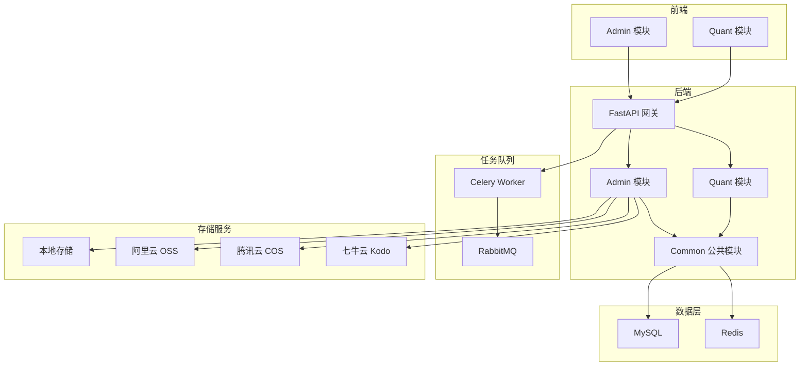

# 项目介绍

## 项目概述

**Py Small Admin** 是一个功能完善、架构清晰的企业级中后台管理系统，集成了量化交易数据管理功能。

### 项目定位

- **企业级中后台系统**：提供完整的用户管理、权限控制、系统配置等功能
- **量化数据管理平台**：集成股票、行业、概念、K线等金融数据管理
- **快速开发模板**：提供开箱即用的脚手架，加速项目开发

### 核心特性

- 🚀 **快速上手**：基于主流 Python 框架开发，提供完整的项目脚手架
- 📦 **开箱即用**：内置用户管理、权限控制、日志记录等常用功能
- 🎨 **现代化界面**：采用现代化 UI 设计，响应式布局，完美适配各种设备
- 🔧 **高度可配置**：灵活的配置系统，支持自定义主题、插件扩展
- 🛡️ **安全可靠**：内置安全防护机制，支持数据加密、SQL 注入防护等

## 技术架构

### 技术栈

#### 后端技术栈

| 技术 | 版本 | 说明 |
|------|------|------|
| FastAPI | 0.124.2 | 现代化的 Web 框架 |
| Uvicorn | 0.38.0 | ASGI 服务器 |
| SQLModel | 0.0.27 | 基于 Pydantic 和 SQLAlchemy 的 ORM |
| MySQL | 5.7+ | 关系型数据库 |
| Redis | 7.1.0 | 缓存和消息队列 |
| Celery | 5.6.2 | 分布式任务队列 |
| Alembic | 1.17.2 | 数据库迁移工具 |
| PyJWT | 2.10.1 | JWT 认证 |
| AkShare | 1.18.8 | 金融数据接口库 |

#### 前端技术栈

| 技术 | 版本 | 说明 |
|------|------|------|
| Umi Max | 4.3.24 | 企业级前端框架 |
| React | 19.1.0 | UI 框架 |
| Ant Design | 5.25.4 | UI 组件库 |
| Pro Components | 2.7.19 | 高级业务组件 |
| TypeScript | 5.6.3 | 类型安全 |
| @ant-design/charts | 2.6.7 | 图表库 |

### 系统架构



### 目录结构

```
py-small-admin/
├── admin-web/           # 前端管理界面
│   ├── config/         # 配置文件
│   ├── src/            # 源代码
│   │   ├── pages/     # 页面组件
│   │   ├── services/  # API 服务
│   │   ├── components/# 公共组件
│   │   └── utils/     # 工具函数
│   └── public/        # 静态资源
├── server/            # 后端服务
│   ├── config/        # 配置文件
│   ├── Modules/       # 业务模块
│   │   ├── admin/    # Admin 管理模块
│   │   ├── quant/    # Quant 量化模块
│   │   └── common/   # 公共模块
│   └── commands/      # 命令行工具
└── docs/              # 项目文档
```

## 功能模块

### Admin 管理模块

- **用户管理**：管理员增删改查、密码重置
- **角色管理**：角色配置、权限分配
- **菜单管理**：菜单树管理、权限控制
- **系统配置**：系统参数配置、邮件测试
- **文件管理**：文件上传、媒体库管理

### Quant 量化模块

- **股票管理**：股票列表、信息维护、数据同步
- **行业管理**：行业分类、行业数据同步
- **概念管理**：概念分类、概念数据同步
- **历史记录**：行业/概念历史数据查询
- **K线数据**：多周期 K 线数据管理

## 技术亮点

### 后端特色

- **异步编程**：全异步支持，性能优异
- **模块化设计**：清晰的模块划分，易于扩展
- **类型安全**：SQLModel 提供强类型和 Pydantic 验证
- **分布式任务**：Celery + RabbitMQ 支持高并发任务处理
- **多存储支持**：本地存储 + 三大云存储（阿里云、腾讯云、七牛云）
- **灵活配置**：Pydantic Settings 支持多种配置源
- **分表策略**：K 线数据按时间分表，支持海量数据

### 前端特色

- **企业级架构**：基于 Umi Max，开箱即用
- **类型安全**：TypeScript + 类型定义
- **组件丰富**：Ant Design + Pro Components
- **权限控制**：基于角色的权限系统
- **请求封装**：统一请求处理，自动令牌刷新
- **代码规范**：Biome 代码检查 + Husky Git 钩子

## 适用场景

- 企业级中后台系统
- 量化交易数据管理平台
- 股票数据分析系统
- 金融信息管理系统
- 内容管理系统（CMS）

## 开源协议

本项目基于 [MIT 许可证](https://opensource.org/licenses/MIT) 开源。

## 联系方式

- GitHub: https://github.com/songbo236589/py-small-admin
- Issues: https://github.com/songbo236589/py-small-admin/issues
